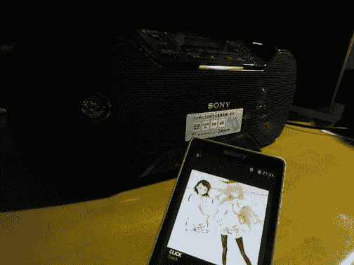

# “我用音箱欣赏音乐”NFC 和蓝牙搭載 CDラジオ索尼 ZS-RS70BT レビュー

> 原文：<https://dev.to/takimura/i-enjoy-the-music-with-boombox-nfcbluetoothcd-sony-zs-rs70bt--3eck>

[T2】](http://livedoor.blogimg.jp/cv_k/imgs/7/0/702558b7.jpg)

I Enjoy the Music with Boombox

(我用 CD 收录机/CD 收音机欣赏音乐)

很多人认为，现在硬要买这样的商品，说实话怎么样？CD 收录机/CD 收音机。 在日本国外，产品阵容有缩小的倾向，其中索尼几乎每年都向这个领域投放新商品。

近年来，通过搭载 USB 端子和 SD 卡插槽，盒式磁带等旧世代媒体的数字化变得容易等，不断发展，终于在今年，索尼出现了搭载 NFC 和蓝牙的机型，可以说是目前安装在产品上的最优先技术 从发表的时候开始就相当在意，经过各种各样的烦恼之后试着购买了。 这次详细介绍这个 ZS-RS70BT。

接下来请继续。 [继续阅读](http://connect.coron.tech/archives/51832463.html)