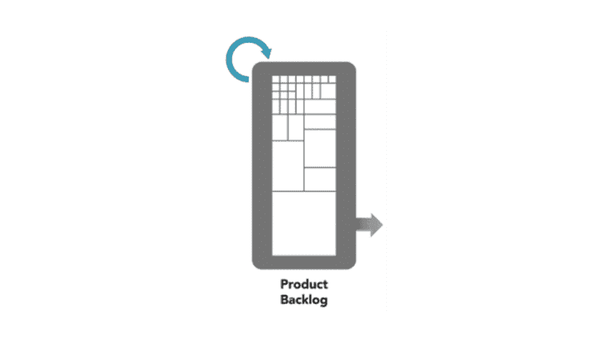

# 如果你的待办事项没有细化，那么你就做错了

> 原文：<https://dev.to/nkdagility/if-your-backlog-is-not-refined-then-you-are-doing-it-wrong-3cic>

我遇到的大多数 Scrum 团队都没有对他们的产品 Backlog 进行细化，而是试图去做他们没有正确理解的事情。然而，如果你到了冲刺计划阶段，而你的待办事项还没有准备好，那么你就做错了。如果你建造的东西质量不好，那么你应该[阅读 Done](https://dev.to/nkdagility/getting-started-with-a-definition-of-done-dod-4b71) 的辩护。

## TL；速度三角形定位法(dead reckoning)

如果您到了 Sprint 计划活动，而您的下一个 Sprint 的产品 Backlog 项目还没有达到适合 Sprint 的规模，并且开发团队也没有完全理解，那么您就做错了。你从一开始就朝着岩石前进，而且你没有浅滩的地图来阻止它。

尽管 Scrum 指南没有将精化定义为一个事件，但是你应该去做。您可以提出您的优化事件，或者临时优化。无论你选择什么，都是衡量成功的简单标准。如果你的开发团队在接下来的两次冲刺中发现了待办事项清单上的某些东西，但他们不理解，那么你就有工作要做了。

[T2】](https://res.cloudinary.com/practicaldev/image/fetch/s--vZAX9EOw--/c_limit%2Cf_auto%2Cfl_progressive%2Cq_auto%2Cw_880/https://nkdagility.com/wp-content/uploads/2018/01/nkdagility-scrum-refinement-only.png)

如果您发现您不能很好地让事情适应，并且[不得不交错迭代](https://dev.to/nkdagility/a-better-way-than-staggered-iterations-for-delivery-2maf)，或者您根本不能交付，那么缺乏细化通常是错误的。

## ready 对于一个产品 Backlog 是什么意思？

如果开发团队不理解他们被要求做的事情，他们怎么可能同意这些项目可以适合 Sprint 呢？你会经常发现不做细化的团队困惑于为什么他们不能在 Sprint 中完成所有的事情。虽然我们承认在像 Scrum 这样的经验过程中，我们事先知道的比我们进行中发现的要少，但是仅仅猜测和希望最好的结果显然是不专业的。

> “从 Sprint 的产品 Backlog 中选择的项目数量完全取决于开发团队。只有开发团队才能评估在即将到来的冲刺阶段能完成什么。”
> 
> -ScrumGuides.org

虽然我们不需要 ready 的定义，但是我们需要产品所有者和开发团队之间的工作协议。如果你遵循 Scrum，那么开发团队就是选择冲刺的人，他们是唯一能够决定他们能做什么的人。开发团队应该有权拒绝从 backlog 中提取他们不理解或者太大而无法在一次 sprint 中完成的项目。总的来说，我希望一个团队在他们的 Sprint 中至少包含十个项目，所以他们需要适当地调整规模。

Ready Backlog 仅仅意味着开发团队可以放心地选择它。

## 你如何细化自己的待办事项？

细化在 Scrum 指南中并不是一个明确的事件，因为它可能会因产品、领域或技术的不同而不同。如果你要问你应该做多少精炼，那么答案是“你需要多少就做多少，不能再多了”。过多的精致是浪费，因为它太少。

> 产品待办事项优化是向产品待办事项中添加细节、评估和订单的行为。这是一个持续的过程，在这个过程中，产品所有者和开发团队在产品待定项的细节上进行协作。在产品待办事项细化过程中，项目被评审和修订。Scrum 团队决定精化如何以及何时完成。细化通常消耗不超过开发团队能力的 10%。但是，产品待定项可以由产品所有者随时更新，或者由产品所有者自行决定。
> 
> -Scrum 指南

在 Scrum 指南中有一个指南，它通常不超过开发团队时间的 10%,对于两周的冲刺，这反映了每个开发团队成员一整天的时间。10%可能看起来很多，但这不仅是必要的，而且是一个最大值而不是最小值。我发现许多过去没有进行精化的团队可能需要相当多的时间来使他们的积压工作看起来有序。一旦一切就绪，你只需要维持一个滚动的两个 Sprint 项目来预测你可能实现的目标。

我通常至少运行第一次细化作为指导研讨会。在 Sprint 规划之前运行一次，大多数团队会在下一次 Sprint 结束时看到价值。对于研讨会，我把 Scrum 团队(产品负责人、开发团队和 Scrum Master)召集到一个房间，里面有任何必要的主题专家，我们只是打开现有的待办事项。从最上面开始，问产品负责人这是不是下一个最重要的事情？如果没有，那就找一些有价值的东西。然后让产品负责人阅读并解释。

任何时候 PO 偏离了待处理项目中的文本，或者添加了更多信息，停止并让某人将该信息添加到待处理项目中。让开发团队评估这个项目(适合或不适合也可以，比如#noestimates)，“这个项目看起来可以和其他九个朋友一起进行一次冲刺吗？”。如果答案是否定的，那么你就开始分解它，重新排序产品清单，并重新开始提炼。您继续这个过程，直到开发团队同意为接下来的 2 个 Sprints 细化了足够的 backlog。

这使得您的[产品负责人能够计划未来的版本](https://dev.to/nkdagility/release-planning-and-predictable-delivery-2di4)，并且您的开发团队能够为当前版本创建一个执行计划。

## 如何监控自己的细化效果？

在 Sprint 规划活动期间，您的开发团队应该能够快速选择至少 10 个产品待定项，这些项朝着选定的 Sprint 目标前进，并同意它们是合适的。如果你能做到这一点，并且大多数时候你能交付大部分(不是全部)项目，那么你可能已经做了足够的细化。如果你不能，那么你需要更多的关注于细化和准备好你的产品清单。

如果在你的 Sprint 评审中,[产品负责人总是想要拒绝待办事项已经完成,](https://dev.to/nkdagility/the-fallacy-of-the-rejected-backlog-item-2jnc),那么开发团队就不可能有足够的细化来理解他们应该做什么。

帖子[如果你的待办事项没有细化，那么你做错了](https://nkdagility.com/backlog-not-refined-wrong/)首先出现在[马丁·辛舍尔伍德-裸体敏捷有限公司](https://nkdagility.com)上。