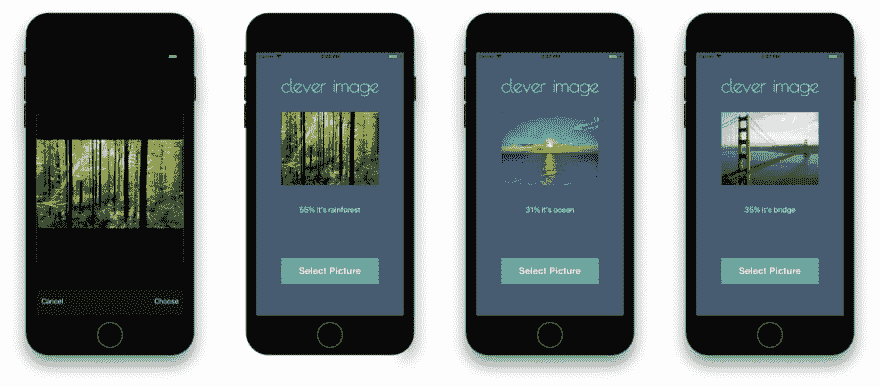
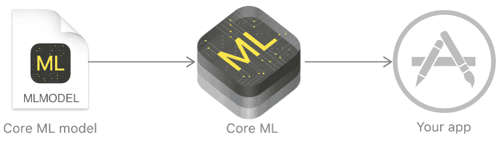
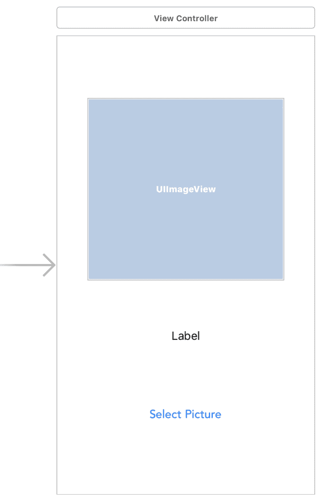
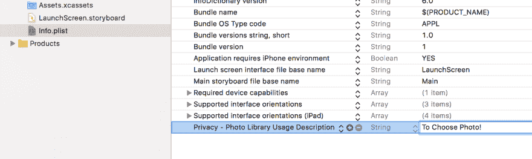
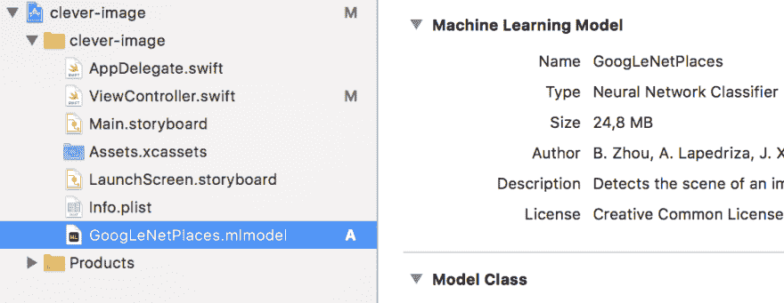
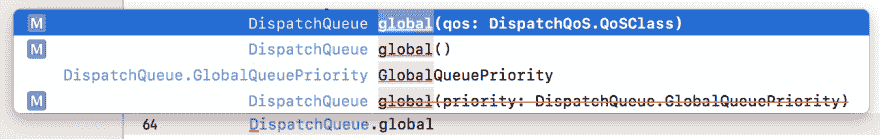

# 用 CoreML 进行图像识别

> 原文：<https://dev.to/mehmetkoca/image-recognition-with-coreml>

## 入门级机器学习信息

在本文档中，使用 CoreML 解释了有关图像识别的基本信息。为了清楚起见，将对主题进行示例编码。

[T2】](https://res.cloudinary.com/practicaldev/image/fetch/s--iEuaokVM--/c_limit%2Cf_auto%2Cfl_progressive%2Cq_auto%2Cw_880/https://thepracticaldev.s3.amazonaws.com/i/rbw88tathjp9b2x008lp.png)

## CoreML 是什么？

苹果的机器学习框架。

> 使用 Core ML，您可以将经过训练的机器学习模型集成到您的应用程序中。
> [](https://res.cloudinary.com/practicaldev/image/fetch/s--mhUuxxlO--/c_limit%2Cf_auto%2Cfl_progressive%2Cq_auto%2Cw_880/https://mehmetkoca.gitbooks.io/coreml/content/assets/Screen%2520Shot%25202017-08-22%2520at%252011.00.54.png) 
> 一个训练好的模型是将机器学习算法应用于一组训练数据的结果。该模型根据新的输入数据进行预测。例如，根据一个地区的历史房价训练的模型可能能够在给定卧室和浴室数量的情况下预测房子的价格。
> [-苹果文档](https://developer.apple.com/documentation/coreml)

**注意**:要使用 CoreML 框架，必须有 Xcode 9 或更高版本的最低版本。

[Github 回购](https://github.com/mehmetkoca/clever-image)

## 什么是机器学习？

机器学习(ML)是**人工智能**的一个分支。其目的是获取任何输入数据(图像、文本、语音、统计数据),然后预测数据中发现的行为特征。

举例；

*   人脸检测
*   面部特征检测
*   图像识别
*   年龄预测

输入->训练模型->输出

**机器学习为什么重要？**

人工智能可以完成我们认为只有人类才能完成的任务。它给你的应用增加了人情味。它让应用程序感觉“智能”。
结论

*   ML 不是新的(只有原生 ios 是新的)
*   ML 领域呈指数增长
*   ML 可以让你的应用做更多的事情

## 创建用户界面

对于一个基本的应用程序，一个 imageview、一个标签和一个按钮就足够了。
**注:**设计版本的应用可在 [Github repo](https://github.com/mehmetkoca/clever-image) 上获得。

[T2】](https://res.cloudinary.com/practicaldev/image/fetch/s--ETIFU0ki--/c_limit%2Cf_auto%2Cfl_progressive%2Cq_auto%2Cw_880/https://mehmetkoca.gitbooks.io/coreml/content/assets/Screen%2520Shot%25202017-08-24%2520at%252015.13.23.png)

## 用 UIImagePickerController 选择照片

首先，在文件`ViewController.swift`中，定义了图像视图、标签和按钮点击功能。

```
@IBOutlet weak var imageView: UIImageView!
@IBOutlet weak var resultLabel: UILabel!

override func viewDidLoad() {
        super.viewDidLoad()
        // ...
}

@IBAction func selectBtnTapped(_ sender: Any) {
        // ...
} 
```

在实现`selectBtnTapped`方法之前，您需要声明`UIViewController`旁边的`UIImagePickerControllerDelegate`和`UINavigationControllerDelegate`来使用 Picker 视图。

```
class ViewController: UIViewController, UIImagePickerControllerDelegate, UINavigationControllerDelegate {
... 
```

现在可以实现 picker 视图了。

```
@IBAction func selectBtnTapped(_ sender: Any) {
        let picker = UIImagePickerController()
        picker.delegate = self
        picker.allowsEditing = true
        picker.sourceType = .photoLibrary
        self.present(picker, animated: true, completion: nil)
} 
```

然后，执行`didFinishPickingMediaWithInfo`功能，完成照片选择。

```
func imagePickerController(_ picker: UIImagePickerController, didFinishPickingMediaWithInfo info: [String : Any]) {
        imageView.image = info[UIImagePickerControllerEditedImage] as? UIImage
        self.dismiss(animated: true, completion: nil)
} 
```

最后，在`Info.plist`文件中，我们创建一个名为“Privacy-Photo Library Usage Description”的行。在“价值”部分，你可以写下你想要的信息。

[T2】](https://res.cloudinary.com/practicaldev/image/fetch/s--GT2NhG6y--/c_limit%2Cf_auto%2Cfl_progressive%2Cq_auto%2Cw_880/https://mehmetkoca.gitbooks.io/coreml/content/assets/Screen%2520Shot%25202017-08-23%2520at%252001.03.04.png)

## 下载模型和创建函数

从[苹果/机器学习](https://developer.apple.com/machine-learning/)页面下载 **Places205-GoogleNet** 模型。让我们`GoogLeNetPLaces.mlmodel`嵌入到我们的项目中。

[T2】](https://res.cloudinary.com/practicaldev/image/fetch/s--PRC5ZTs3--/c_limit%2Cf_auto%2Cfl_progressive%2Cq_auto%2Cw_880/https://mehmetkoca.gitbooks.io/coreml/content/assets/Screen%2520Shot%25202017-08-24%2520at%252014.29.16.png)

然后，将 CoreML 和 Vision 导入`ViewController.swift`。

```
import UIKit
import CoreML
import Vision 
```

实现`didFinishPickingMediaWithInfo`下面的`recognizeImage`功能。该函数取 1 个参数作为名为**图像**的`CIImage`。

```
func recognizeImage(image: CIImage) {
        // ...
} 
```

定义`CIImage`类型的 **selectedImage** 变量。

```
@IBOutlet weak var imageView: UIImageView!
    @IBOutlet weak var resultLabel: UILabel!

    var selectedImage = CIImage() 
```

将拍摄的图像`UIImage`转换为`CIImage`，运行`didFinishPickingMediaWithInfo`中定义的 recognizeImage()。

```
func imagePickerController(_ picker: UIImagePickerController, didFinishPickingMediaWithInfo info: [String : Any]) {
        imageView.image = info[UIImagePickerControllerEditedImage] as? UIImage
        self.dismiss(animated: true, completion: nil)

        if let ciImage = CIImage(image: imageView.image!) {
            self.selectedImage = ciImage
        }

        recognizeImage(image: selectedImage)
} 
```

## 使用 VNCoreMLRequest 创建请求

首先，指定“我正在调查……”到 **resultLabel.text** 。

```
func recognizeImage(image: CIImage) {

        resultLabel.text = "I'm investigating..."
} 
```

将`VNCoreMLModel`函数的返回值赋给变量**模型**。

```
func recognizeImage(image: CIImage) {

        resultLabel.text = "I'm investigating..."

        if let model = try? VNCoreMLModel(for: GoogLeNetPlaces().model) {

        }
} 
```

用`VNCoreMLRequest`函数创建**请求**，并将我们上面创建的变量**模型**作为类型为`model`的参数发送。

```
func recognizeImage(image: CIImage) {

        resultLabel.text = "I'm investigating..."

        if let model = try? VNCoreMLModel(for: GoogLeNetPlaces().model) {
                let request = VNCoreMLRequest(model: model, completionHandler: { (vnrequest, error) in

                })
        }
} 
```

将类型`VNClassificationObservation`的结果分配给**结果**。

```
func recognizeImage(image: CIImage) {

        resultLabel.text = "I'm investigating..."

        if let model = try? VNCoreMLModel(for: GoogLeNetPlaces().model) {
                let request = VNCoreMLRequest(model: model, completionHandler: { (vnrequest, error) in
                        if let results = vnrequest.results as? [VNClassificationObservation] {

                        }
                })
        }
} 
```

将第一个结果分配给 **topResult** 。

```
func recognizeImage(image: CIImage) {

        resultLabel.text = "I'm investigating..."

        if let model = try? VNCoreMLModel(for: GoogLeNetPlaces().model) {
                let request = VNCoreMLRequest(model: model, completionHandler: { (vnrequest, error) in
                        if let results = vnrequest.results as? [VNClassificationObservation] {
                                let topResult = results.first
                        }
                })
        }
} 
```

实现`DispatchQueue.main.async`方法，该方法将在后台创建一个假设。

```
func recognizeImage(image: CIImage) {

        resultLabel.text = "I'm investigating..."

        if let model = try? VNCoreMLModel(for: GoogLeNetPlaces().model) {
                let request = VNCoreMLRequest(model: model, completionHandler: { (vnrequest, error) in
                        if let results = vnrequest.results as? [VNClassificationObservation] {
                                let topResult = results.first
                                DispatchQueue.main.async {

                                }
                        }
                })
        }
} 
```

计算存储在 **topResult** 中的值的置信度，并将其分配给 **confidenceRate** 。然后，为了显示的目的，使用了 **resultLabel.text** 。

```
func recognizeImage(image: CIImage) {

        resultLabel.text = "I'm investigating..."

        if let model = try? VNCoreMLModel(for: GoogLeNetPlaces().model) {
                let request = VNCoreMLRequest(model: model, completionHandler: { (vnrequest, error) in
                        if let results = vnrequest.results as? [VNClassificationObservation] {
                                let topResult = results.first
                                DispatchQueue.main.async {
                                        let confidenceRate = (topResult?.confidence)! * 100
                                        self.resultLabel.text = "\(confidenceRate)% it's \(String(describing: topResult?.identifier))"
                                }
                        }
                })
        }
} 
```

## 带有 VNImageRequestHandler 的处理程序

首先在**模型**方法下，用`VNImageRequestHandler`创建**处理程序**常量(带 ciImage 的选项)。

```
let handler = VNImageRequestHandler(ciImage: image) 
```

然后，实现`DispatchQueue.global(qos: .userInteractive).async`方法，该方法将像我们之前在计算置信度时所做的那样在后台工作。

[T2】](https://res.cloudinary.com/practicaldev/image/fetch/s--ZJwY062S--/c_limit%2Cf_auto%2Cfl_progressive%2Cq_auto%2Cw_880/https://mehmetkoca.gitbooks.io/coreml/content/assets/Screen%2520Shot%25202017-08-25%2520at%252011.16.54.png)

```
let handler = VNImageRequestHandler(ciImage: image)
DispatchQueue.global(qos: .userInteractive).async {

} 
```

创建 do-catch 块并用**处理程序. perform()** 处理**请求**。

```
let handler = VNImageRequestHandler(ciImage: image)
DispatchQueue.global(qos: .userInteractive).async {
    do {
            try handler.perform([request])
    } catch {
            print("Err :(")
    }
} 
```

结束了。recognizeImage 函数的最终状态:

```
func recognizeImage(image: CIImage) {

        resultLabel.text = "I'm investigating..."

        if let model = try? VNCoreMLModel(for: GoogLeNetPlaces().model) {
            let request = VNCoreMLRequest(model: model, completionHandler: { (vnrequest, error) in
                if let results = vnrequest.results as? [VNClassificationObservation] {
                    let topResult = results.first
                    DispatchQueue.main.async {
                        let confidenceRate = (topResult?.confidence)! * 100
                        let rounded = Int (confidenceRate * 100) / 100
                        self.resultLabel.text = "\(rounded)% it's \(topResult?.identifier ?? "Anonymous")"
                    }
                }
            })
            let handler = VNImageRequestHandler(ciImage: image)
            DispatchQueue.global(qos: .userInteractive).async {
                do {
                    try handler.perform([request])
                } catch {
                    print("Err :(")
                }
            }
        }
    } 
```

## 最后的状态和努力

使用 Places205-GoogLeNet 完成简单的 CoreML 应用程序。

[T2】](https://res.cloudinary.com/practicaldev/image/fetch/s--JN5ont4b--/c_limit%2Cf_auto%2Cfl_progressive%2Cq_auto%2Cw_880/https://mehmetkoca.gitbooks.io/coreml/content/assets/gitbookCleverImage.png)

[Github 回购](https://github.com/mehmetkoca/clever-image)
[在 Gitbook 上阅读](https://www.gitbook.com/book/mehmetkoca/coreml/details)