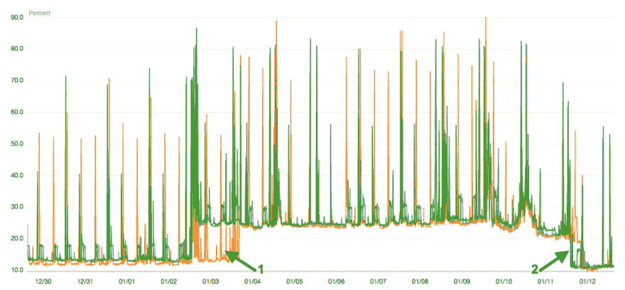
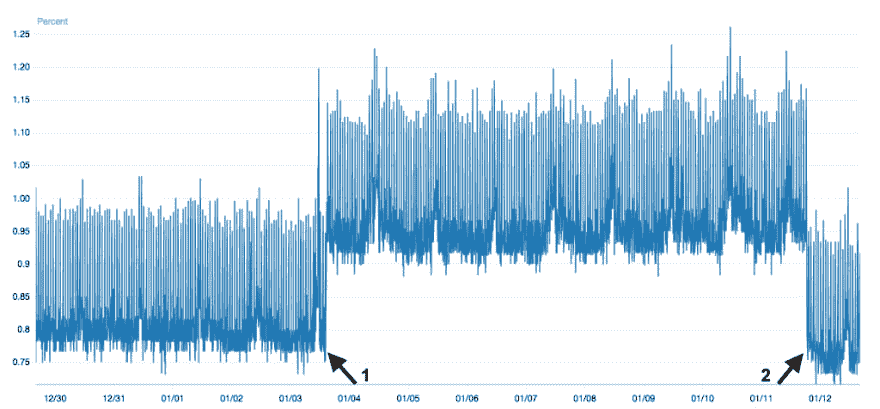

# 熔毁修复对 AWS 的影响

> 原文：<https://dev.to/p_chhetri/impact-of-meltdown-fix-on-aws-ki8>

1 月 3 日，Google Project Zero 团队[披露了关于两个硬件漏洞的](https://googleprojectzero.blogspot.com/2018/01/reading-privileged-memory-with-side.html):T2【Meltdown】T3 和 T4【Spectre】T5。尽管 Meltdown 只针对英特尔处理器，但 Spectre 几乎影响了所有现代处理器。

一经披露，所有的云提供商都开始着手用补丁修补虚拟机管理程序。在本帖中，我们将讨论 AWS 如何处理同样的问题。

AWS 实例大致分为两类: [PVM](https://en.wikipedia.org/wiki/Paravirtualization) 和 [HVM](https://en.wikipedia.org/wiki/Hardware-assisted_virtualization) 。虽然在线修补 HVM 虚拟机管理程序不会影响任何正在运行的实例，但 AWS 通知客户在 1 月 6 日之前重新启动其 PVM 实例。

我们注意到几乎所有实例组的 CPU 利用率都有显著提高。

 

<figcaption>在 r4 上运行的 3 节点 Cassandra 集群上增加了 CPU 利用率。大型实例</figcaption>

**{1}** 到 1 月 4 日， [AWS](https://aws.amazon.com/security/security-bulletins/AWS-2018-013/) 用[内核页表隔离(KPTI)](https://lwn.net/Articles/741878/) 给虚拟机管理程序打了补丁，导致>CPU 利用率增加了 100%。一些 cassandra 顾问和托管公司已经注意到[与](https://twitter.com/BenBromhead/status/950245250504601600)T8 相同。KPTI 缓解对性能的影响完全取决于应用程序发出的系统调用。因此，性能影响可能会有所不同。

**{ 2 }**1 月 12 日，AWS 推出了一些措施，将性能影响降低到崩溃前的水平。虽然，AWS 还没有披露任何关于同样的事情。

我们在 RDS 实例中也注意到了类似的情况。

<figcaption>RDS 实例上的 CPU 利用率增加</figcaption>

AWS 补丁可以避免任何实例到实例的问题(一个实例可以读取另一个实例的内存)和实例到虚拟机管理程序的问题(实例可以读取虚拟机管理程序的内存)。AWS 仍然建议所有客户升级他们的实例内核，以减轻任何进程间的问题。