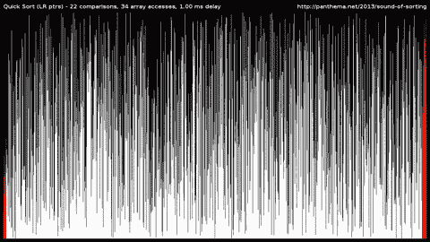

# 以防你错过:过去一周(2017 年 5 月 8 日至 5 月 14 日)最受欢迎的开发人员帖子

> 原文：<https://dev.to/thepracticaldev/in-case-you-missed-it-the-most-popular-dev-posts-from-the-past-week-may-8---may-14-2017>

每周一我们都会收集一些上周的热门帖子、评论和推文。如果您有任何反馈，请留下评论。安

# 团队合作让梦想成真

[T2】](https://i.giphy.com/media/yEYiScV53Yeo8/giphy.gif)

作为亚马逊的一名资深员工，詹姆斯·胡德(James Hood)曾在一些高压力、高影响力的团队工作过，这些团队要求每个人都保持一致。为此，他报告说，“两个领导原则开始发挥作用:想得大，偏向于行动。”

 [## 如何为你的团队设定技术方向

### 詹姆斯·胡德 5 月 13 日 176 分钟阅读

#design #leadership](/jlhcoder/how-to-set-the-technical-direction-for-your-team)

* * *

# 整理东西

[T2】](https://i.giphy.com/media/NLwYHvHIF5pqE/giphy.gif)

在 Vaidehi Joshi 对计算机科学核心原理的每周检查中，她谈到了排序的价值以及如何比较不同的排序算法:

 [## 整理排序算法背后的基础知识

### vaidehi Joshi 9 月 23 日 17 时 12 分阅读

#code #computerscience #softwaredevelopment #algorithms](/vaidehijoshi/sorting-out-the-basics-behind-sorting-algorithms)

许多程序员从未正式上过 CS 课程，所以 Vaidehi 的帖子提供了一个有价值的资源:

 [ Peter Kim Frank ](/peter) • [<time datetime="2017-05-08T16:44:21Z"> May 8 '17 </time>](https://dev.to/peter/comment/72j) 

我非常喜欢这些文章，尤其是作为一名视觉学习者。令人难以置信的有价值和有帮助的材料，因为我从来没有上过任何计算机科学的课程，所以更是如此，谢谢！

* * *

# 单页标本

[T2】](https://i.giphy.com/media/rHBPhbA7HnIbe/giphy.gif)

在他的文章“一个开源 Elm SPA 之旅”中，Richard Feldman 在 Elm 中构建了一个单页应用程序，并向我们介绍了他的一些选择，他警告说这“不是对 Elm 的一个温和的介绍”:

 [## 开放源代码榆树温泉之旅

### 理查德费尔德曼 5 月 8 日 176 分钟阅读

#elm #spa #webapp #scaling](/rtfeldman/tour-of-an-open-source-elm-spa)

* * *

# 尽情欢乐

[T2】](https://i.giphy.com/media/3orif8Uufh4J2lRKaQ/giphy.gif)

在一篇情感诚实的文章中，Carl Hembrough 回忆说，一旦他开始将自己与他人比较，他就不再喜欢编程，导致了一个严重的[冒名顶替综合征](https://en.wikipedia.org/wiki/Impostor_syndrome)。

 [## 当编程不再有趣时

### 卡尔·汉布鲁 1917 年 5 月 12 日 14 分钟阅读

#impostorsyndrome](/carlhembrough/programming-used-to-be-fun)

毫不奇怪，Carl 从 dev .那里得到了很多积极的反馈，用户对他的信息产生了共鸣:

 [ Nick Wu ](/nickwu007) • [<time datetime="2017-05-12T22:19:47Z"> May 12 '17 </time>](https://dev.to/nickwu007/comment/7ak) 

这是一个很棒的帖子，卡尔，这是我过去六个月一直在努力的事情。尽管我已经做了相当多的编码工作，但在过去的六个月里，我一直觉得自己还没有达到我想要的水平，而且我还不够努力。我觉得在这种天生孤独的工作中，身处一个相互支持的社区是至关重要的。非常感谢你提醒我。:)

* * *

# 双重麻烦

[T2】](https://i.giphy.com/media/LPXRLrwldC6L6/giphy.gif)

不同类型的双测试之间的差异是许多程序员所忽略的。

> The Practical Dev[@ The Practical Dev](https://dev.to/thepracticaldev)几个概念在我的软件生涯早期都被当做“点头并假装我知道自己在说什么”的概念来揶揄和嘲讽。2017 年 05 月 09 日上午 01:17

这就是为什么总结他们的特点是一个有用的职位。迈克尔·利普斯基提供了一个例子:

 [## 测试双打-假货，仿制品和存根。

### 米哈尔利普斯基 5 月 8 日 1715 分钟阅读

#testing #tdd](/milipski/test-doubles---fakes-mocks-and-stubs)

* * *

# 保持事物井然有序

[T2】](https://i.giphy.com/media/SCYEgsujYeRfq/giphy.gif)

我们中的大多数人可能每天都要使用谷歌的搜索引擎很多次，经常没有停下来问一下搜索结果到底是如何为我们排序的。事实上，谷歌的 PageRank 算法长期以来一直有一种巫术和神秘的气息——直到 Sishaar Rao 为我们打破了这一切:

 [## 解密 PageRank 算法

### sishaar Rao May 13 ' 177min read

#pagerank #google #linearalgebra #eigenspace](/sishaarrao/demystifying-the-pagerank-algorithm)

* * *

# 随波逐流

[T2】](https://i.giphy.com/media/3oGRFrspEp7mZVQ5vq/giphy.gif)

在开始一个新项目之前，选择适合您团队偏好的特定风格的 git 工作流是很重要的。AbdulBasit Kabir 介绍了几种不同的风格，从“中央工作流程”到“补丁工作流程”，并重点介绍了每种风格的示例

 [## 哪个是我下一个项目的正确 git 工作流程？

### AbdulBasit KABIR 5 月 11 日 175 分钟阅读

#git #workflow #collaboration #softwaredevelopment](/abulkay/whichs-the-right-git-workflow-for-my-next-project)

一些评论者报告说，他们喜欢将多个工作流程的各个方面结合起来，AbdulBasit 指出这是完全正确的:

未找到注释

* * *

我们的每周总结到此结束！请关注 Dev.to 本周的每日内容和讨论...如果您遗漏了任何内容，我们将在下周一进行回顾！