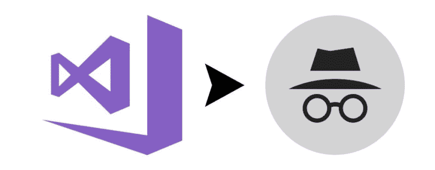
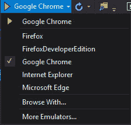
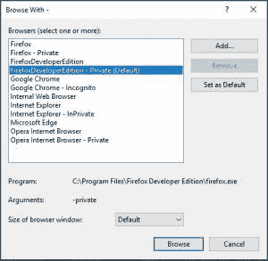

# 在 Visual Studio 中使用任何浏览器进行匿名调试

> 原文：<https://dev.to/collinbarrett/incognito-debugging-with-any-browser-in-visual-studio-3gj3>

[T2】](https://collinmbarrett.com/incognito-debug-visual-studio/)

## 清除积垢

当我在 [Visual Studio](https://collinmbarrett.com/tag/visual-studio/) 中开发 web 应用程序时，我经常需要解决依赖于[缓存](https://collinmbarrett.com/tag/cache/)或 cookies 状态的问题。默认情况下，在 Visual Studio 的浏览器中进行调试会打开一个新的浏览器窗口，但不会清除任何预先存在的缓存或 cookies。

## 私密/匿名浏览:永远新鲜

我喜欢将 Visual Studio 配置为在匿名/私人浏览模式下启动浏览器调试会话。每个调试会话都是全新的，就好像用户第一次访问我的应用程序一样。

<figure>[T3】

<figcaption id="caption-attachment-5611">Visual Studio 调试目标菜单</figcaption>](https://collinmbarrett.com/media/vsDebugTargetMenu_collinmbarrett.jpg) </figure>

要将浏览器配置为在此模式下调试:

1.  单击调试目标控件右侧的 v 形图标，查看已安装浏览器的列表。
2.  单击“浏览方式…”。
3.  点击“添加…”。
4.  使用 private/匿名命令行参数配置新的目标浏览器。参见下面的例子。

## 示例浏览器配置

### [铬](https://collinmbarrett.com/tag/chrome/)

Program:

`"C:\Program Files (x86)\Google\Chrome\Application\chrome.exe"`

Arguments:

`--incognito`

Friendly Name:

`Google Chrome - Incognito`

### [网络浏览器](https://support.microsoft.com/en-us/help/17621/internet-explorer-downloads)

Program:

`"C:\Program Files (x86)\Internet Explorer\iexplore.exe"`

Arguments:

`-private`

Friendly Name:

`Internet Explorer - InPrivate`

### [火狐](https://collinmbarrett.com/tag/firefox/)

Program:

`"C:\Program Files\Mozilla Firefox\firefox.exe"`

Arguments:

`-private`

Friendly Name:

`Firefox - Private`

### [火狐开发者版](https://www.mozilla.org/en-US/firefox/developer/)

Program:

`"C:\Program Files\Firefox Developer Edition\firefox.exe"`

Arguments:

`-private`

Friendly Name:

`FirefoxDeveloperEdition - Private`

### [边缘](https://www.microsoft.com/en-us/edge)

尚不支持。

### [戏曲](https://www.opera.com/)

Program:

`"C:\Program Files\Opera\launcher.exe"`

Arguments:

`--private`

Friendly Name:

`Opera Internet Browser - Private`

<figure>

<figcaption id="caption-attachment-5620">Visual Studio 私有/微服调试目标</figcaption>

</figure>

*via [斯科特·汉塞尔曼](https://www.hanselman.com/blog/VisualStudioWebDevelopmentTipAddChromeIncognitoModeAsABrowser.aspx)T3】*