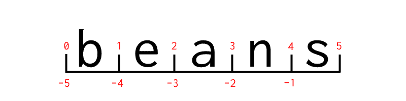

# 索引-教得更好

> 原文：<https://dev.to/rpalo/indexing---teaching-things-better>

我想谈谈指数化。更重要的是，我想谈谈我们是如何向新程序员解释索引的。但首先，我需要打下一些背景。

## 背景 1

现在我是一名工程师，但本质上我是一名教师。我喜欢带着某人经历学习的过程，找到类比或看待一个概念的方式，真正让他们喜欢。尤其是在数学、力学和编程领域，在这些领域，事情是非常可预测的，每个概念背后总是有具体的推理。我坚信学生永远不应该只凭信念接受老师说的话，而且绝对不应该有魔法。

## 背景二

我正在学习另一门 JavaScript 课程，试图填补我的空白，看看这位新老师是否以一种新的或不同的方式解释了我更喜欢的东西。在我们进入索引列表部分之前，一切都很顺利。老师一开始说:“为了把第一项从列表中取出来，你这样引用:`items[0]`。你只需要记住，电脑总是从零开始计数。”对此我回答道:

[T2】](https://res.cloudinary.com/practicaldev/image/fetch/s--rEWfeOU4--/c_limit%2Cf_auto%2Cfl_progressive%2Cq_66%2Cw_880/http://assertnotmagic.com/img/nope.gif)

一定有更好的方法。你不需要记住任何事情。因此，没有进一步的背景部分，我向你们展示:

## 更好的方法

我也打算用 Python 来做我的解释，因为我更喜欢它，我做我想做的事情。让我们考虑一下字符串`beans`。不是四季豆，但是-你懂的。

[T2】](https://res.cloudinary.com/practicaldev/image/fetch/s--VQ2D1iUS--/c_limit%2Cf_auto%2Cfl_progressive%2Cq_auto%2Cw_880/http://assertnotmagic.com/img/indexing.png)

要理解的主要事情是，索引实际上并不落在列表中的某个特定项目或字符串中的某个字符上(因为它们是以相同的方式访问的)。它们包围着字母。*他们把字母围起来。* **他们围住了字母。**再给后面的人一次机会。

# 索引包围字母。

因此，当你尝试这样做时:

```
>>> fruit = "beans"
>>> fruit[1:3]
"ea" 
```

Enter fullscreen mode Exit fullscreen mode

您得到“ea ”,因为这是您指定的两个索引之间的字母*。当您仅指定一个索引时，程序默认将第二个限制作为下一个索引。* 

```
>>> fruit[4] # Is the same as fruit[4:4+1] "s" 
```

Enter fullscreen mode Exit fullscreen mode

以这种方式理解事情的好处是，负指数变得不那么令人困惑。

```
>>> fruit[-3:-1]
"an" 
```

Enter fullscreen mode Exit fullscreen mode

在 Python 中，为了说“一直到最后”，你只需关闭索引。这主要是为了方便，因为-0 作为索引没有任何意义(因为-0 在技术上等于 0)。

```
>>> fruit[1:5]
"eans"
>>> fruit[1:]
"eans"
>>> fruit[:-1]
"bean" 
```

Enter fullscreen mode Exit fullscreen mode

酷吧？

## 结论

阅读这篇文章的两个人中有相当多的人已经(以某种方式)学习了关于索引字符串和列表的知识。但是你现在看到了从零开始并在`len(string) - 1`结束 for 循环的充分理由了吗？这不是魔法。这不是因为计算机很奇怪，从零开始计数，因为他们的文化就是这样做的。在你的电脑里没有小精灵颁布新的计算方法。现在开始传播逻辑循序渐进的教学方法吧！

*这是来自[我的博客](http://assertnotmagic.com)的转贴。请发送反馈！它让我成为一个更好的人:)*