# 在数字海洋上安装 Symfony 3.x

> 原文：<https://dev.to/cloudways/installing-symfony-3x-on-digitalocean>

*本文原载于 Cloudways: [如何在云服务器](https://www.cloudways.com/blog/install-symfony-3-on-cloud/)T3 上安装 Symfony 3】*

Symfony 是领先的现代 PHP 框架，借助其不同的组件，用于创建安全的网站和 web 应用程序。这是一个流行的 MVC 框架，可以节省处理典型开发任务的时间，比如内容呈现、引导流量、创建持久模型等。

要安装和运行 Symfony 3，您的系统需要满足以下一系列要求:

*   最低版本为 5.5.9 的 PHP
*   设计者
*   JSON 已启用
*   ctype 已启用
*   应设置 date.timezone(默认时区无效)

注意:如果你想使用任何可选组件，请参见运行 Symfony 的这些[要求。](http://symfony.com/doc/current/reference/requirements.html)

如果你想知道如何在 Cloudways 上安装 Symfony，你可以简单地遵循这个简单的分步指南。准备好了吗？我们开始吧！

## 步骤 1:准备您的服务器和应用程序

[注册或登录您的 Cloudways 帐户](https://platform.cloudways.com/signup)，从**“选择您的应用”**下拉列表中选择 PHP Stack，创建一个新的服务器。此外，相应地命名您的应用程序，服务器&项目。

[T2】](https://res.cloudinary.com/practicaldev/image/fetch/s--Z8NAJU8U--/c_limit%2Cf_auto%2Cfl_progressive%2Cq_auto%2Cw_880/https://www.cloudways.com/blog/wp-content/uploads/select-application.png)

## 第二步:选择云提供商

现在选择你最喜欢的云提供商。

[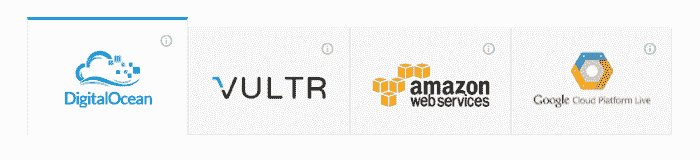T2】](https://res.cloudinary.com/practicaldev/image/fetch/s--D47c9_zE--/c_limit%2Cf_auto%2Cfl_progressive%2Cq_auto%2Cw_880/https://www.cloudways.com/blog/wp-content/uploads/select-cloud-provider-1.png)

## 第三步:服务器大小和位置

在“服务器大小”字段中，扩展到 1GB。

[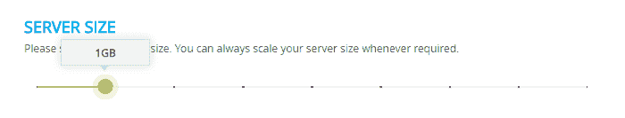T2】](https://res.cloudinary.com/practicaldev/image/fetch/s--ivBrFqY_--/c_limit%2Cf_auto%2Cfl_progressive%2Cq_auto%2Cw_880/https://www.cloudways.com/blog/wp-content/uploads/server-size.png)

记住延迟差异，现在在“位置”字段中选择您的服务器位置。

[T2】](https://res.cloudinary.com/practicaldev/image/fetch/s--Tzgm2Ivf--/c_limit%2Cf_auto%2Cfl_progressive%2Cq_auto%2Cw_880/https://www.cloudways.com/blog/wp-content/uploads/server-location.png)

要启动您的服务器，请单击页面右下角的“启动”按钮，并等待一段时间。一个工作示例:

[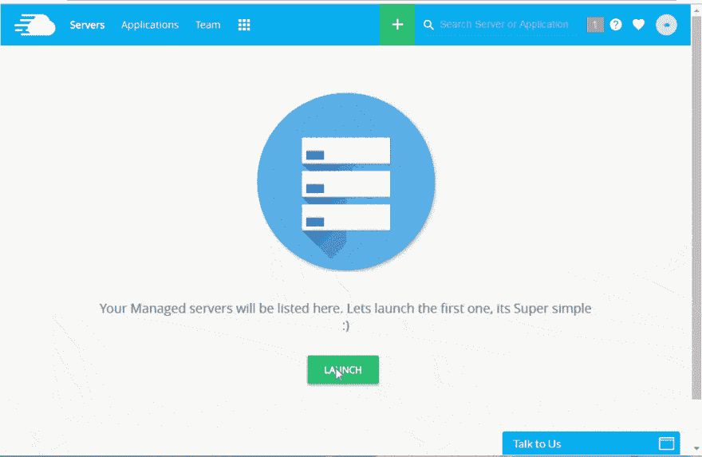T2】](https://res.cloudinary.com/practicaldev/image/fetch/s--6qGU78Cl--/c_limit%2Cf_auto%2Cfl_progressive%2Cq_66%2Cw_880/http://www.cloudways.com/blog/wp-content/uploads/php-server-stack.gif)

## 第四步:服务器时区

一旦启动，改变你的服务器时区，因为这是安装 Symfony 的要求(Symfony 不支持时区的默认值)。在**“服务器管理”**下，进入*“设置&包”* *

[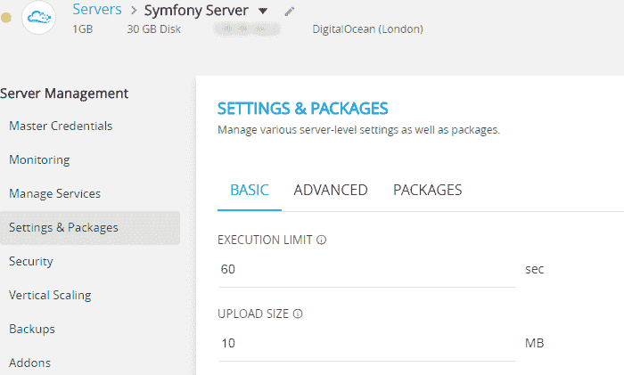T2】](https://res.cloudinary.com/practicaldev/image/fetch/s--V7Ps5OcO--/c_limit%2Cf_auto%2Cfl_progressive%2Cq_auto%2Cw_880/https://www.cloudways.com/blog/wp-content/uploads/server-management.png)

在**“基本”**标签中你可以看到**“PHP 时区”**将服务器时区更改为您所在的位置。

[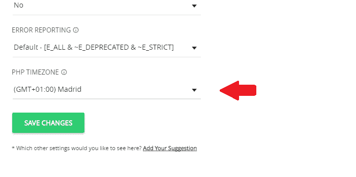T2】](https://res.cloudinary.com/practicaldev/image/fetch/s--kVHMwvtd--/c_limit%2Cf_auto%2Cfl_progressive%2Cq_auto%2Cw_880/https://www.cloudways.com/blog/wp-content/uploads/server-timezone-1.png)

## 第五步:SSH 终端

更改服务器时区后，在“服务器管理”中点击“主凭证”下的“启动 SSH 终端”,在这里您可以找到您的 SSH 终端登录凭证。

[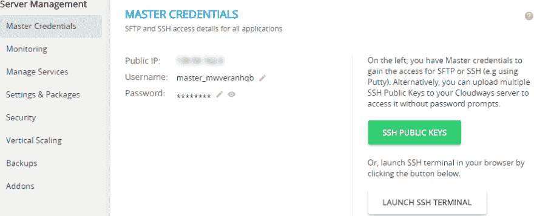T2】](https://res.cloudinary.com/practicaldev/image/fetch/s--2Yk9fkSM--/c_limit%2Cf_auto%2Cfl_progressive%2Cq_auto%2Cw_880/https://www.cloudways.com/blog/wp-content/uploads/master-credentials.png)

使用您的主凭据登录 SSH。

[T2】](https://res.cloudinary.com/practicaldev/image/fetch/s--TPy98bJj--/c_limit%2Cf_auto%2Cfl_progressive%2Cq_auto%2Cw_880/https://www.cloudways.com/blog/wp-content/uploads/symfony-7.png)

## 第六步:清空 public_html 目录

现在删除 public_html 目录中的所有文件。导航到您的 public_html 文件夹，使用`rm -Rf *`命令删除所有文件。

[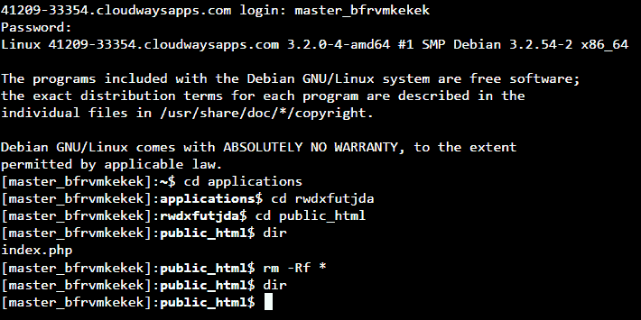T2】](https://res.cloudinary.com/practicaldev/image/fetch/s--B984hgnd--/c_limit%2Cf_auto%2Cfl_progressive%2Cq_auto%2Cw_880/https://www.cloudways.com/blog/wp-content/uploads/symfony-8.png)

## 第七步:Symfony 3 安装

现在，在您的“public_html”目录中，运行以下命令在您的服务器上安装 Symfony 3:

```
composer create-project symfony/framework-standard-edition your_project_name "3.0.*" 
```

[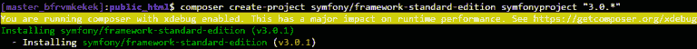T2】](https://res.cloudinary.com/practicaldev/image/fetch/s--6vOSdYtq--/c_limit%2Cf_auto%2Cfl_progressive%2Cq_auto%2Cw_880/https://www.cloudways.com/blog/wp-content/uploads/symfony-9-768x54.png)

对于 3.1:

```
composer create-project symfony/framework-standard-edition your_project_name "3.1" 
```

## 第八步:DB 信息和整理项目安装

现在 Symfony 将开始下载到您的服务器。在下载过程中，它会要求您的数据库信息。

[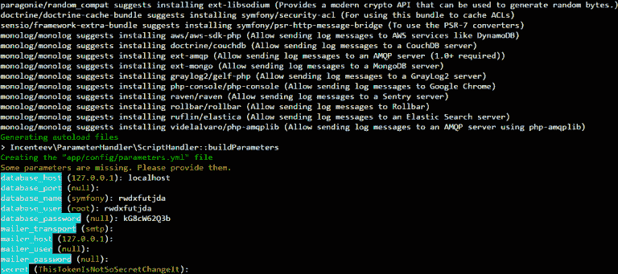T2】](https://res.cloudinary.com/practicaldev/image/fetch/s--IqQIVtDN--/c_limit%2Cf_auto%2Cfl_progressive%2Cq_auto%2Cw_880/https://www.cloudways.com/blog/wp-content/uploads/symfony-10-768x341.png)

您可以在*“应用管理”*下找到您的 DB 信息，进入**“访问详情”**，查看 **MySQL 访问**。

[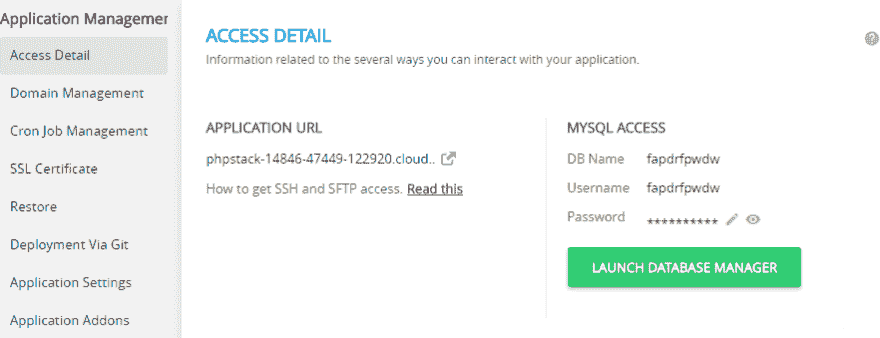T2】](https://res.cloudinary.com/practicaldev/image/fetch/s--VVfiTyQF--/c_limit%2Cf_auto%2Cfl_progressive%2Cq_auto%2Cw_880/https://www.cloudways.com/blog/wp-content/uploads/MySQL-access.png)

提供数据库信息后，几秒钟后你会看到下面的屏幕，这意味着 Symfony 已经安装成功。

[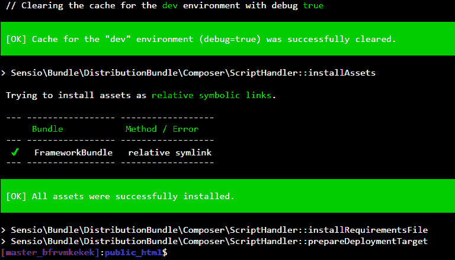T2】](https://res.cloudinary.com/practicaldev/image/fetch/s--vGiGgkOJ--/c_limit%2Cf_auto%2Cfl_progressive%2Cq_auto%2Cw_880/https://www.cloudways.com/blog/wp-content/uploads/symfony-11.png)

## 第九步:编写器库

现在，我们将使用`composer install`命令检查是否需要安装或更新应用程序所需的 composer 依赖项。导航到您的项目目录并运行命令。

[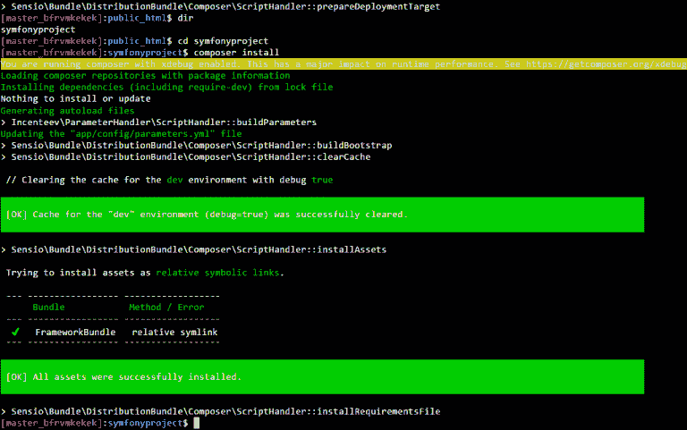T2】](https://res.cloudinary.com/practicaldev/image/fetch/s--qiT2EMqO--/c_limit%2Cf_auto%2Cfl_progressive%2Cq_auto%2Cw_880/https://www.cloudways.com/blog/wp-content/uploads/symfony-12-768x481.png)

## 第十步:安装完成

成功安装后，在“应用程序管理”中进入“访问详细信息”并复制您的应用程序 URL。

[T2】](https://res.cloudinary.com/practicaldev/image/fetch/s--VVfiTyQF--/c_limit%2Cf_auto%2Cfl_progressive%2Cq_auto%2Cw_880/https://www.cloudways.com/blog/wp-content/uploads/MySQL-access.png)

打开您最喜欢的网络浏览器，通过以下 URL 访问 Symfony 的欢迎页面:

[http://your _ application _ URL/your _ project _ directory/web](http://your_application_url/your_project_directory/web)

Symfony 欢迎页面应该是这样的:

[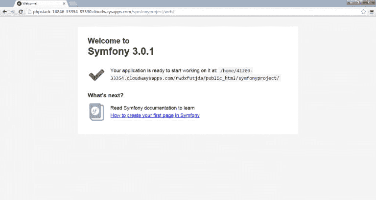T2】](https://res.cloudinary.com/practicaldev/image/fetch/s--ZqomLejj--/c_limit%2Cf_auto%2Cfl_progressive%2Cq_auto%2Cw_880/https://www.cloudways.com/blog/wp-content/uploads/symfony-14-768x409.png)

你有它！您的 Symfony 项目已经可以开发了。如果你在安装 Symfony 3 时有任何问题，欢迎在下面评论。如果您仍然不是 Cloudways 大家庭的一员，那么您可以从这里开始免费试用，体验最轻松的体验。