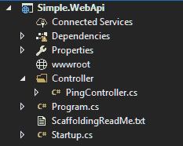
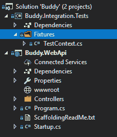
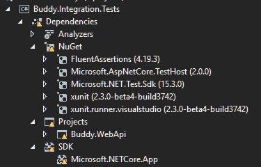

# 集成测试。网络核心 2.0

> 原文：<https://dev.to/donbavand/integration-testing-in-net-core-20>

这篇文章最初发表在我的博客网站上

我们都知道在开发软件时编写测试是多么重要，它确保你的代码按预期工作，并允许你更容易地重构现有的代码。测试还可以帮助初次接触您的应用程序的人了解它是如何工作的以及它提供了什么功能。

无论是单元测试还是集成测试，每个测试级别都有其目的。当你开发软件时，拥有好的集成测试是很重要的。它确保您的应用端到端流程正常工作。

在确保您的项目具有设计良好的集成测试的同时，测试易于运行且快速也同样重要。这是很重要的一点，如果测试运行需要很大的投资，或者测试需要很长时间，人们就不会使用它们。

这篇博文向您展示了如何为. NET core 2.0 Web 服务创建一个快速而简单的内存集成测试框架。

## 内存测试

使用内存中的 web 主机使我们能够快速、轻松地设置和运行我们的测试。Kestrel 是由使用的跨平台开发 web 服务器。NET 核心应用程序。

> Kestrel 是基于 libuv 的 ASP.NET 核心跨平台 web 服务器，libuv 是一个跨平台异步 I/O 库。Kestrel 是默认包含在 ASP.NET 核心项目模板中的 web 服务器。
> Kestrel 支持以下功能:
> 
> *   HTTPS
> *   用于启用 WebSockets 的不透明升级
> *   Nginx 背后的高性能 Unix 套接字
> 
> 所有平台和版本都支持 Kestrel。NET 核心支持。

## 创造简单。NET core 2.0 WebApi

下面我在中设置了一个简单的 WebApi。带有单个 ping 控制器的 NET Core 2.0。这将在调用时返回一个 OK 响应。我将在这个解决方案中创建我的集成测试项目，然后针对 ping 控制器编写并运行我的测试。

[](https://res.cloudinary.com/practicaldev/image/fetch/s--ZheICa2U--/c_limit%2Cf_auto%2Cfl_progressive%2Cq_auto%2Cw_880/https://thepracticaldev.s3.amazonaws.com/i/d4f9b3fy7gcn3rcgah8m.png)T3】

```
 public class HealthcheckController : Controller
    {
        [HttpGet]
        [Route("ping")]
        public IActionResult Ping()
        {
            return Ok();
        }
    } 
```

Enter fullscreen mode Exit fullscreen mode

## 设置集成测试框架

首先，让我们在我们的解决方案中创建一个集成测试项目。我喜欢遵循以下命名格式`ProjectName.Integration.Tests`

现在我们有了集成测试项目设置，我们可以开始创建测试上下文，集成测试类共享设置和清理代码是很常见的，我们通常称之为“测试上下文”。我们将使用测试上下文来设置一个托管框架，准备在其上运行我们的集成测试。这个示例的测试上下文将用于设置测试服务器和客户端。

[T2】](https://res.cloudinary.com/practicaldev/image/fetch/s--q8oaiQBO--/c_limit%2Cf_auto%2Cfl_progressive%2Cq_auto%2Cw_880/https://thepracticaldev.s3.amazonaws.com/i/15lsxwe68om1strnmmq8.png)

我们现在需要安装下面的 nuget 包`Microsoft.AspNetCore.TestHost`

> ASP.NET 核心包括一个测试主机，可以添加到集成测试项目中，用于托管 ASP.NET 核心应用程序，满足测试请求，而不需要真正的 web 主机。
> 
> 曾经的微软。AspNetCore.TestHost 包包含在项目中，您将能够在您的测试中创建和配置一个 TestServer。

一旦我们安装了 TestHost nuget 包，我们需要设置测试服务器和客户端。

```
 public class TestContext
    {
        private TestServer _server;
        public HttpClient Client { get; private set; }

        public TestContext()
        {
            SetUpClient();
        }

        private void SetUpClient()
        {
            _server = new TestServer(new WebHostBuilder()
                .UseStartup<Startup>());

            Client = _server.CreateClient();
        }
    } 
```

Enter fullscreen mode Exit fullscreen mode

在开始编写实际的测试之前，我们需要安装几个 nuget 包。`xunit`和`xunit.runner.visualstudio`我也喜欢使用 FluentAssertions，如果你跟着做，那么也安装`fluentassertions`包。

> 流畅的断言是一组。NET 扩展方法，允许您更自然地指定 TDD 或 BDD 风格的测试的预期结果。

你需要安装的另一个重要的包是`Microsoft.NET.Test.Sdk`,否则当你试图运行测试时，你的测试会在“测试会话运行器”中显示“测试不确定”。

这里是我已经安装的 nuget 包和版本的列表。我把这个截图放在这里，因为版本经常会改变，这会引起问题，错误信息有时也不是很有用。

[T2】](https://res.cloudinary.com/practicaldev/image/fetch/s--iiI5cG7C--/c_limit%2Cf_auto%2Cfl_progressive%2Cq_auto%2Cw_880/https://thepracticaldev.s3.amazonaws.com/i/bxuq8xnggycug7p85kjg.png)

我们要编写的第一个测试是测试 ping 控制器。当我们调用 ping 控制器时，我们应该看到一个 OK 响应。非常简单，但却是确保您的测试框架和 WebApi 正常工作的良好起点。

```
 public class PingTests
    {
        private readonly TestContext _sut;

        public PingTests()
        {
            _sut = new TestContext(); 
        }

        [Fact]
        public async Task PingReturnsOkResponse()
        {
            var response = await _sut.Client.GetAsync("/ping");

            response.EnsureSuccessStatusCode();

            response.StatusCode.Should().Be(HttpStatusCode.OK);
        }
    } 
```

Enter fullscreen mode Exit fullscreen mode

就这样，您现在有了一个集成测试框架，可以在构建 WebApi 时添加更多的测试。

## 创建单个测试上下文

使用上面的结构创建测试，为每个测试场景创建一个新的测试上下文。这并不总是可取的，有时您想要设置您的测试上下文，然后运行您的解决方案中的所有测试或一组测试。

设置一次您的测试环境会有很大的好处，例如，如果您需要部署和发布一个数据库作为您的集成测试设置的一部分，那么这样做将需要一些时间来完成。为每个测试场景设置数据库可能没有意义。更好的计划是，设置一次，然后运行所有与数据库交互的测试。

Xunit 允许我们设置和创建集合。

首先，我们需要创建一个集合类。这个类可以被命名为任何你认为有意义的名字。

```
[CollectionDefinition("SystemCollection")]
    public class Collection : ICollectionFixture<TestContext>
    {

    } 
```

Enter fullscreen mode Exit fullscreen mode

集合类中永远不会有任何代码。这个类的目的是应用[CollectionDefinition]装饰器和所有的 ICollectionFixture <>接口。

我只应用了一个 ICollectionFixture，但是您可以应用任意多个。

接下来，将 IDisposable 接口添加到 TestContext 类中，以确保进行上下文清理。

```
 public class TestContext : IDisposable
    {
        private TestServer _server;
        public HttpClient Client { get; private set; }

        public TestContext()
        {
            SetUpClient();
        }

        private void SetUpClient()
        {
            _server = new TestServer(new WebHostBuilder()
                .UseStartup<Startup>());

            Client = _server.CreateClient();
        }

        public void Dispose()
        {
            _server?.Dispose();
            Client?.Dispose();
        }
    } 
```

Enter fullscreen mode Exit fullscreen mode

现在，我们将 CollectionDefinition 名称添加到我们希望在单个集合
中运行的测试中

```
 [Collection("SystemCollection")]
    public class PingTests
    { 
```

Enter fullscreen mode Exit fullscreen mode

如果测试类需要访问 fixture 实例，将它作为构造函数参数添加，它会自动提供。

```
 [Collection("SystemCollection")]
    public class PingTests
    {
        public readonly TestContext Context;

        public PingTests(TestContext context)
        {
            Context = context;
        }

        [Fact]
        public async Task PingReturnsOkResponse()
        {
            var response = await Context.Client.GetAsync("/ping");

            response.EnsureSuccessStatusCode();

            response.StatusCode.Should().Be(HttpStatusCode.OK);
        }
    } 
```

Enter fullscreen mode Exit fullscreen mode

一个重要的注意事项是，当在一个集合中运行测试时，它们不会并行运行。如果您希望您的测试并行运行，那么您需要或者分离集合或者根本不使用集合。

你可以在我的 [GitHub 库](https://github.com/donbavand/dotnetcore-integration-tests-example)中找到上面的代码

最后，如果你想讨论我写在这里或者其他博客上的任何东西，你可以在推特上找到我