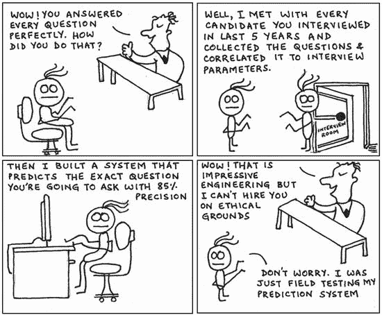

# 面试问题

> 原文：<https://dev.to/funkysi1701/interview-questions-2a83>

我已经做了一些双方的采访，我都不太擅长，但我想我会回答我最喜欢的问题。

[T2】](https://res.cloudinary.com/practicaldev/image/fetch/s--hXNkJdXs--/c_limit%2Cf_auto%2Cfl_progressive%2Cq_auto%2Cw_880/https://storageaccountblog9f5d.blob.core.windows.net/blazor/wp-content/uploads/2014/10/how-not-to-ace-the-technical-interview.jpg%3Fw%3D550%26ssl%3D1)

请描述一次 IT 灾难，以及您是如何扭转这一局面的？

问题在于扭转局面。我收到了很多强调问题的答案，而不是候选人做了什么来扭转局面。

我的回答是:在一个周六，我正在重新布置服务器室，当我打开我们的主文件服务器和 pdc 时，它无法启动。我周末的计划泡汤了，一切都是为了恢复服务器。我试着像往常一样拔掉所有的插头，但还是没有重新连接。我打电话给一个朋友，征求另一种意见，我们两人一起制定了一个行动计划。然后，我打电话给我的主管，告诉她我遇到了问题，我打算尝试什么。(让人们了解信息是一项基本技能)

因此，有问题的服务器正在通电，但在启动期间没有任何反应。主板已经死了。我需要做的是将 raid 卡连接到另一台服务器，这样我就可以将数据从它复制到我们的 Nas 驱动器(幸运的是，我有一个升级计划，而这次失败只是加速了它)

几个小时后，数据被复制，我可以再次呼吸。我告诉我的主管，我已经解决了一些问题，但是周一会有一些小问题。

描述一下你的优势和劣势？

没有优点和缺点的问题就不是面试了。作为一名面试官，我希望至少有一个缺点，而且我希望它真的是一个缺点。

我的强项是我的解决问题的技巧，我可以看到问题，调查发生了什么，并找到解决办法。如果这是一项我以前没有使用过的技术，我可以阅读它，了解它的工作原理，然后用它来解决问题。

我的弱点是我的人际交往能力，我更擅长分析计算机问题，而不是找出为什么我的一名员工表现不佳。在过去的几年里，这是一个正在改进的领域。我对员工承担了更多的责任，我也学到了更多如何让他们发挥最大作用的知识。

**技术问题**

直到最近，我才在面试中提出技术问题，我认为这是衡量能力的好方法。我经常在面试后不确定那个人在我的工作压力下会有多好。如果我有写在纸上的东西，这是一个好的开始。

但是面试中表现出来的个性也必须被考虑在内，因为大多数知识都是可以教授的。

我过去用过的一个好的技术问题是写一段解释 DHCP 的文字。这个问题说明了他们对某项基本技术的了解程度，但也表明了他们的写作风格。他们写的文章可以交给导演或客户吗？

优秀的 IT 人员既需要技术知识，也需要在各个层面进行沟通的能力，我仍然很难知道某人是否优秀，有时甚至不知道我是否优秀。