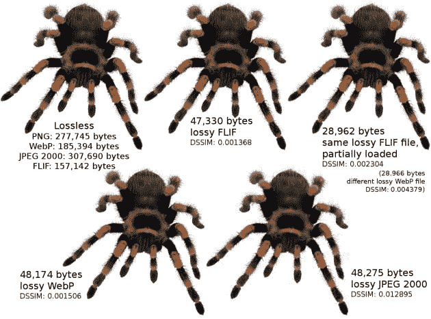
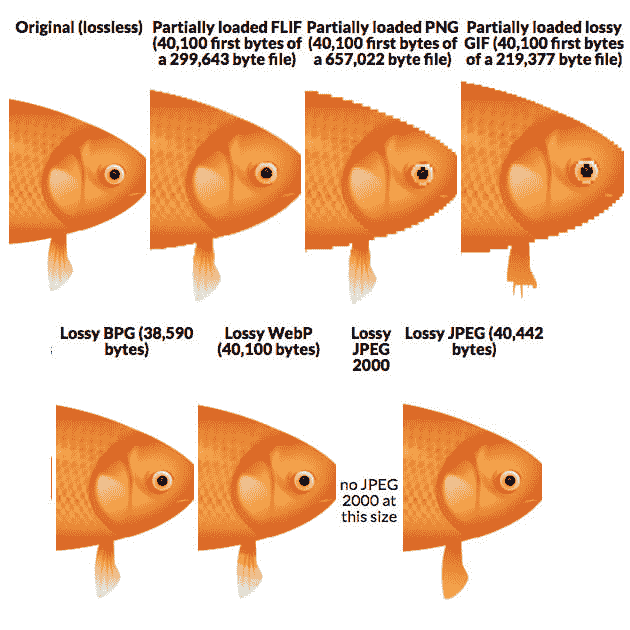
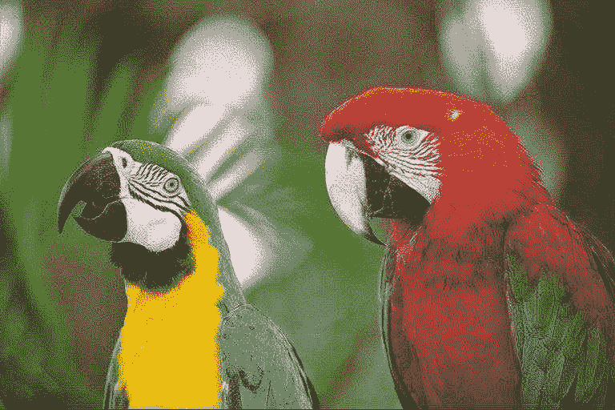
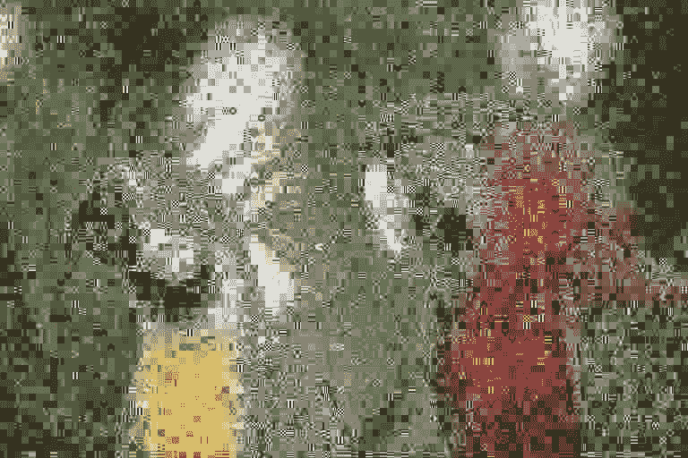
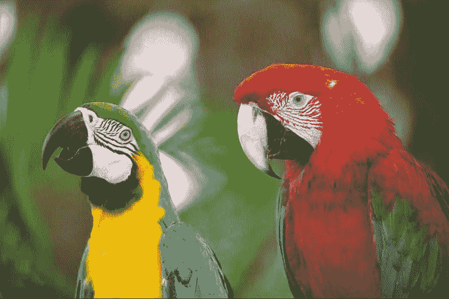

# 采访 FLIF 创作者乔恩·斯耐尔斯

> 原文：<https://dev.to/ben/interview-with-flif-creator-jon-sneyers>

FLIF——免费无损图像格式——是图像压缩领域一项有前途的创新，有望在现有标准的基础上提高效率和灵活性。至少，这是《FLIF》的联合创作者[乔恩·斯奈尔斯](https://twitter.com/jonsneyers)所希望的。尽管根据[的实验](https://docs.google.com/spreadsheets/d/1LxY78fbm47VmrYGTXkBXXitGjhGl32NsuHPH2QXufgA/edit#gid=751305882)，FLIF 以 14%到 74%的优势击败了现有的压缩标准，但在采用和支持方面仍有许多障碍。这位实用的开发人员联系了 Jon，了解他对图像压缩格式的更多希望，以及在采用这种格式时存在的障碍和机会。

[T2】](http://flif.info/lossy.html)

## 乔恩，你为什么要创造 FLIF？

我创建 FLIF 主要是因为我不喜欢目前的情况:虽然有许多不同的图像格式，其中一些很好，但没有一种“通用”的图像格式可以让你“安全”使用，它永远“只是工作”。JPEG(及其更现代的变种 JPEG 2000，JPEG XR)对于照片来说是不错的，但是在艺术线条上使用它，你会得到糟糕的伪像和糟糕的压缩效果。虽然 JPEG 得到了普遍支持，但缺乏对透明性的支持以及不可避免的代损耗是有问题的。PNG 是一种不错的格式，但不太适合照片。WebP 基本上是两种带有一个扩展名的格式；你可以认为有损 WebP 是对 JPEG 的改进，无损 WebP 是对 PNG 的改进，但它仍然不是真正的通用图像格式，它有自己的一些限制:只有 8 位色深，没有渐进解码。然后是 BPG，它在各方面都比 JPEG 好，但受专利保护，不太擅长无损编码和非摄影图像。

因此，我想要的是一种“好用”的图像格式，也就是说，你可以给它任何类型的图像，它可以像任何其他格式一样压缩，甚至更好。我觉得不应该留给图像制作者(平面设计师，图像编辑器的临时用户，站长，摄影师，...)了解所有图像格式的技术细节及其编码选项和优化工具，并为每种图像选择最佳格式。这不仅为用户错误留下了太多的余地，在某些情况下，你希望自动做出决定，例如，因为你有一个像 facebook 或 twitter 这样的网站，用户上传图像，网站必须自动重新缩放和转码图像。但是自动做出这样的决定并不容易。

我认为 FLIF 有潜力成为这样一种“通用图像格式”，因此未来的图像编辑器将不再需要复杂的“另存为”或“导出”对话框:只需另存为 FLIF，这一切都很好。至少这是我的梦想😀

[T2】](http://flif.info/example.html)

## 此时对于开发者来说，FLIF 最实用的应用有哪些？

这种格式目前仍处于试验阶段，这意味着打破比特流的变化仍可能发生，因此用今天版本的 FLIF 编码的 FLIF 文件可能无法在下个月版本的 FLIF 中正确解码。因此，使用 FLIF 作为分发图像的格式还为时过早，除非你还包括 FLIF 解码器的合适版本。游戏是一个很容易做到这一点的领域。FLIF 似乎非常擅长压缩游戏图形，例如带有透明度的动画精灵。此外，一些游戏包含两种或更多种不同分辨率的图形(例如，标准和高清)，使用 FLIF，他们可以只存储最高分辨率，加载部分文件以获得较低分辨率的版本。FLIF 解码器是 Apache 2.0 许可的，所以它可以很容易地集成到游戏项目中。

我目前正在为 FLIF 开发一个有损编码器:这种格式本身是无损的，但你仍然可以修改原始图像，使其压缩得更好，就像 PNG 格式的 pngquant 或 TruePNG，或者最近的 WebP 版本中的 near_lossless 选项。这种方法的好处是，您获得了有损压缩的优点(小得多的文件在视觉上仍然可以),但缺点更少:特别是，没有生成损失的问题。固有损耗的格式，如 JPEG，就像一台复印机:如果你复制一个副本的副本，它将积累伪像。像 FLIF 这样的无损格式没有这个问题(即使你以有损的方式使用它们)。与有损 PNG 或近无损 WebP 相比，有损 FLIF 的有趣之处在于，对于给定的视觉质量，甚至对于摄影材料，它实际上可以在压缩比方面与 JPEG 竞争。对于非摄影材料，即使无损 FLIF 在压缩比方面也常常胜过高质量 JPEG。

### 照片以 JPEG 格式保存 10 次

## 

### 照片以 JPEG 格式保存了 1 万次

[T2】](https://res.cloudinary.com/practicaldev/image/fetch/s--YzorInUH--/c_limit%2Cf_auto%2Cfl_progressive%2Cq_auto%2Cw_880/http://res.cloudinary.com/jon/GL10000_JPEG.jpg)

### 照片编码为有损 FLIF 的 10，000 倍

[T2】](https://res.cloudinary.com/practicaldev/image/fetch/s--OotvRMU---/c_limit%2Cf_auto%2Cfl_progressive%2Cq_auto%2Cw_880/http://res.cloudinary.com/jon/GL10000_FLIF.png)

## FLIF 的用户应该担心格式的不稳定性吗？他们能做些什么来确保早期采用不会伤害他们？

是的，用户应该意识到 FLIF 仍然是实验性的，所以如果你用它来存档，你最好也保留 FLIF 的精确版本来解码图像。由于这是一种无损格式，将 PNG 图像转换为 FLIF 并没有太大的风险:您总是可以将它们解码回 PNG(至少如果您不在乎 PNG 文件中可能包含的任何元数据)。给早期采用者的两个建议是:1)不要把 JPEG 这样的有损格式转换成 FLIF 格式，因为你会在无损存储有损压缩的工件上浪费很多字节；2)如果您使用 FLIF 的有损编码功能，也要保留原始无损图像，因为有损编码器很可能在未来仍会改进。

## 有了潜在的存储和带宽节省的好处，浏览器渲染速度和浏览器支持的实际意义真的那么重要吗？

解码速度很重要，尤其是对于本地可用的文件(例如，已经下载并在浏览器缓存中的图像)，这是渲染速度的主要瓶颈。有两个因素使得 FLIF 相对较慢:该算法本身的计算复杂度比 PNG 等更简单的格式更差，其当前的实现不如 JPEG 和 PNG 的流行实现优化。因此，在试验格式规范时，这肯定是我们要记住的事情。FLIF 肯定会成为一种用于归档和任何带宽(或存储)是主要瓶颈或成本的使用情形的格式。什么是 outlook 对浏览器的支持？采用新的图像格式总是有点先有鸡还是先有蛋的问题:只有当一种格式被浏览器和其他应用程序广泛支持时，人们才能真正使用它(所以作为最终用户，您可能希望等到这种情况发生)，但是应用程序往往只支持已经广泛使用的格式(所以作为应用程序开发人员，您可能希望等到这种情况发生)。这就是为什么当提出新的格式时，通常会有一些惯性需要克服。

幸运的是，现在的情况比过去好。多亏了 Javascript，它有着近乎普遍的支持，并且性能越来越好，原生浏览器支持并不是严格需要的(尽管仍然是首选)。得益于 Accept headers，原本支持 FLIF 的浏览器可以表明这一点，而像 Cloudinary 的自动格式协商(“f_auto”)这样的服务器可以向支持它们的浏览器提供 FLIF 图像，同时仍然向不支持它们的浏览器提供 PNG 或 WebP。

所以我希望，尽管不可避免的格式惯性，FLIF 将看到一些在相对不远的将来采用。