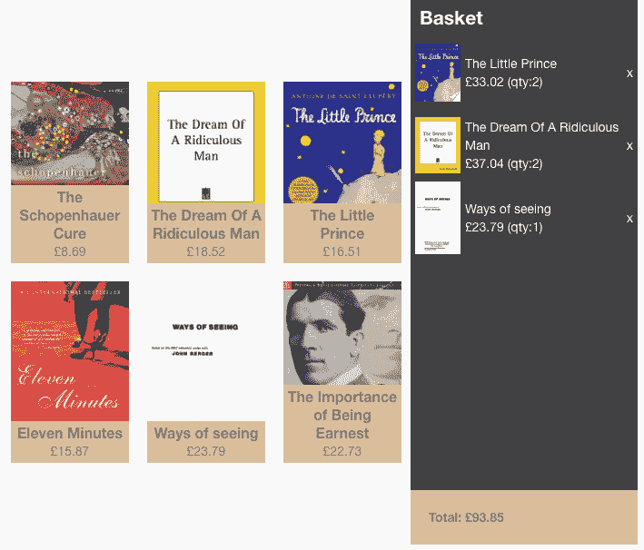
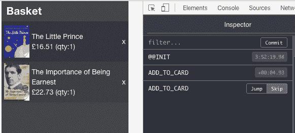

# Redux 简介

> 原文：<https://dev.to/aurelkurtula/introduction-to-redux-1g3>

撰写本教程最困难的部分恰恰是如何用简单的语言解释 redux 是什么。文档将其描述为

> Redux 是 JavaScript 应用程序的可预测状态容器。

因此，它是一个管理我们整个应用程序的状态(或数据)的工具。它非常适合复杂的单页应用程序。

在不使用 ajax 的传统网站中，数据将从服务器进入页面。当用户试图将一个项目添加到购物篮中时，会向服务器发出一个新的请求，浏览器会重新加载，用户会看到他们操作的结果。Redux 管理所有的数据，所有的动作都与它而不是服务器交互。因此，单页应用程序不会重新加载。

当创建一个 SPA 时，尤其是需要 redux 的时候，使用 React、Angular 等 JavaScript 框架是合乎逻辑的。但是，为了理解 redux 的工作原理，我决定使用纯 JavaScript。创建一个功能性的演示是混乱的，但是让你的头脑围绕 redux，我希望它会非常清晰。

最后，我们将完成管理基本购物卡演示所需的冗余代码。一个现场演示在[这里](https://locksmith-menu-65550.netlify.com/)并且完整的代码在 [github](https://github.com/aurelkurtula/exploring-redux/) 中。然而，本教程的目的是探索我们如何使用 Redux 来管理这个应用程序的状态:

[T2】](https://res.cloudinary.com/practicaldev/image/fetch/s--M-BW0I5c--/c_limit%2Cf_auto%2Cfl_progressive%2Cq_auto%2Cw_880/https://thepracticaldev.s3.amazonaws.com/i/oierevk2x9khc1moauwf.png)

左边是来自数据库的所有书籍，右边是用户想买的所有东西。

基本上，关于商店和篮子组件的书籍来自 Redux 商店。Redux store 是一个 JSON 对象，它在我们的应用程序中是可用的。我们对象的架构应该是这样的:

```
{
  baseket: [],
  shop: [{
    id: 1,
    title: 'Ways of seeing',
    img: 'cover.png',
    price: '23.73'
  }]
} 
```

请注意，篮子将是空的，商店将是满的。如果这是一个数据库，上面将代表两个表，篮子和商店。

让我们创建商店的框架

```
import { createStore, combineReducers } from 'redux';
const storeReducer = (state=[{title:'...'},{}], action) => {
  if(state === undefined){
    return state;
  }
  return state;
}
const basketReducer = (state=[], action) => {
  if(state === undefined){
    return state;
  }
  return state;
}
const allReducers = combineReducers({
  basket: basketReducer,
  shop: storeReducer
})
const store = createStore(allReducers) 
```

商店是通过 reducer 创建的，如果我们只有一组数据，比如只有商店，我们就不需要使用`combineReducers`，一个 reducer 将被传递:`createStore(storeReducer)`。所以，`combineReducers`只是给了我们逻辑分离数据的能力。至于我们为什么需要减速器，很快就会明白了。

## 1。与 Redux store API 交互

如果我们现在控制台商店，我们将看到它提供给我们的方法，以便我们可以与它互动。

*   `store.dispatch(action)`
*   `store.subscribe(listener)`
*   `store.getState()`

从这一点出发，我们将通过这三种方法与商店进行交互。

我们想要显示这些书，所以我们将使用`store.getState().shop`。我们希望当用户点击这本书时，商店会受到影响，我们将使用`store.dispatch()`。我们将希望篮子显示新添加的项目，将使用`store.subscribe()`监听变化。

### 1.2 获取页面上的项目

第一次实例化存储时，它将返回当前状态。我们知道`shop`对象包含书籍。为了在页面上显示它们，我们使用了`store.getState()`方法。

```
store.getState().shop.map(({ id, title, price, img }) => {
  insertShopDOM(shopElem, id, title, price, img)
  return null;
}) 
```

`store.getState()`明确退货整店。然后我们选择商店对象数组并遍历它。

为了不分散我们学习 redux 的注意力，我不想在 DOM 操作上浪费时间，像`insertShopDOM`这样的函数只是简单地操作 DOM，与 redux 无关。这就是从商店挑选商品的方式，如何处理这些信息由你决定。这只是众多选择之一:

```
function insertShopDOM(shopElem, id, title, price, img) {
  shopElem.innerHTML += `
  <div data-id=${id} class="box item">
   
      <div class="meta">
         <h2>${title}</h2> 
        <p>£<span>${price}</span></p>
      </div>
  </div>`
} 
```

这样，我们就在页面上展示了我们所有的书籍。

[T2】](https://res.cloudinary.com/practicaldev/image/fetch/s--DK5lTsS2--/c_limit%2Cf_auto%2Cfl_progressive%2Cq_auto%2Cw_880/https://thepracticaldev.s3.amazonaws.com/i/6prwbf47mns31ajp5udk.png)

### 2。减速器和动作

当我们想与商店互动时，Reducers 闪耀着光芒，这种架构的有用性变得很明显。实际上**我们并没有与商店**互动。存储是只读的，上面我们只是读了一下。动作由 reducers 检索，并由它们进行回复。

首先，让我们创建一个操作。基本上，点击一下，`store.dispatch(someAction)`就会发出一个动作

```
[...shopItems].map(item => {
      item.addEventListener('click', e =>{
        ...
        store.dispatch({ 
            type: 'ADD_TO_CARD', 
            payload: { id, title, price, img, qty: '1' } 
        })
      })
}) 
```

调度结构很重要。我们传递一个具有两个属性的对象。`type`必须被命名为`type`，按照惯例，该名称应该全部大写。`payload`可以起任何名字，但习惯上是`payload`。上面我们调度了一个名为`ADD_TO_CARD`的动作，哪个 reducer 处理了它，它就会得到`payload`对象。

#### 2.1。减速器的动力

当我们分派动作时，所有的 reducers 都可以读取它的对象。`storeReducer`和`basketReducer`都可以执行被调度的动作。既然这个动作是向商店添加数据，`basketReducer`应该做出响应。让我们为这个响应编写代码。

```
const basketReducer = (state=cartInitState, action) => {
  ...
  if(action.type === 'ADD_TO_CARD'){
    const data = action.payload;
    const newState = [ ...state, data ];
    return newState;
  }
  return state;
} 
```

同样，在我们可以分派的所有动作中，`basketReducer`将只响应`ADD_TO_CARD`类型。然后，它创建一个新版本的存储状态，并将其传递回去。

#### 2.2。从不改变状态

对于 reducers 响应的每个动作，它们必须返回状态的副本，而不是原始状态的更新版本。Redux 要求 reducers 是不可变的。

以上就是我们做的。ES6 spread 操作符返回一个新的状态数组对象，我们将新数据添加到这个新状态中。如果我们使用 ES5，代码将会是`const newState = state.concat(data)`。

虽然这超出了本教程的范围，但是当使用 Redux 进行开发时，Redux 浏览器扩展将帮助您看到不可变状态的好处，它允许您通过操作进行“时间旅行”

[T2】](https://res.cloudinary.com/practicaldev/image/fetch/s--bNtS3MMj--/c_limit%2Cf_auto%2Cfl_progressive%2Cq_auto%2Cw_880/https://thepracticaldev.s3.amazonaws.com/i/pbiori7dbypu5bow0i3c.png)

如果你安装了 chrome 或 firefox 的 Redux 扩展，然后在打开该扩展的情况下观看演示，你会看到每次调度一个动作时都会出现动作名称，如果你点击“跳过”(如上图右侧所示)，你会看到你的动作被撤消，这都是因为状态会不断更新。

### 3。订阅商店

我们分派了一个动作，`basketReducer` reducer 通过返回一个新状态来动作，现在我们需要获取这个新状态并将其添加到我们的应用程序中。

使用 redux 的好处是，我们不在乎为篮子点击了什么按钮来呈现一些 html。我们只需要根据 Redux 状态的变化采取行动。

```
store.subscribe(() => {
  cartElem.innerHTML = '';
  store.getState().basket.map(({ id, title, price, img, qty }) => {
    insertCartDOM(id, title, price, img, qty)
  });
}) 
```

允许我们在状态改变时做一些事情。基本上，使 Redux 状态发生变化的任何事情也会导致上面的运行。当状态改变时，我们循环遍历篮子并显示它的内容。

到目前为止，这个应用程序看起来像这样

[T2】](https://res.cloudinary.com/practicaldev/image/fetch/s--M-BW0I5c--/c_limit%2Cf_auto%2Cfl_progressive%2Cq_auto%2Cw_880/https://thepracticaldev.s3.amazonaws.com/i/oierevk2x9khc1moauwf.png)

### 4。把一切都带回家的最后一次行动

用户在购物篮中添加了几本书，现在他们决定删除一些。过程和以前一样，当用户点击`x`按钮时调度一个动作。

```
 item.addEventListener('click', e=>{
    let id =  item.dataset.id;
    store.dispatch({ type: 'REMOVE_FROM_CARD', payload: { id } })
  }) 
```

单击时，我们将分派一个动作`REMOVE_FROM_CARD`并传递`id`。

在`basketReducer`减压器上，我们将听到新的动作。

```
const basketReducer = (state=cartInitState, action) => {
  if(state === undefined){
    return state;
  }
  if(action.type ==="REMOVE_FROM_CARD"){
    return  [...state].filter(book => book.id !== action.payload.id )
  }
  return state;
} 
```

spread 创建了状态的副本，通过使用`filter`，我们确保返回的状态包含除了来自动作的具有相同`id`的书之外的所有书。

## 结论

这就是 Redux 的全部内容。正如我们所说，我们必须使用的 API 有三个方法，正如你所看到的，这将是开发单页面应用程序最简单的部分。

需要重申的是，Redux 应该与框架一起使用，随着应用程序的增长，它的好处会变得很明显。

为了避免你不得不向上滚动，[这里是演示](https://locksmith-menu-65550.netlify.com/)和[这里是代码](https://github.com/aurelkurtula/exploring-redux/)。