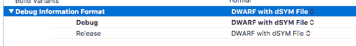
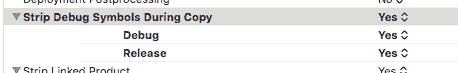
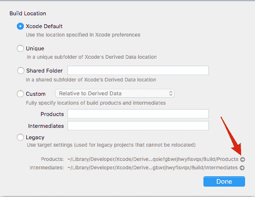

# iOS 碰撞象征的假人第 2 部分

> 原文：<https://dev.to/finik/ios-crash-symbolication-for-dummies-part-2>

在[之前的文章](/fishmanalex/ios-crash-symbolication-for-dummies-part-1/)中，我们已经了解了什么是象征过程以及为什么需要它。在这篇文章中，我们将深入了解如何确保生成 dSYM 文件，并看看我们如何手动使用它来标记崩溃报告。

# 如何确定 dSYM 确实在生成？

XCode 有几个设置可能会影响 dSYM 的生成，我们一个一个来回顾一下。

首先，让我们确保正在生成调试信息:

[T2】](https://res.cloudinary.com/practicaldev/image/fetch/s--4UUR2M3V--/c_limit%2Cf_auto%2Cfl_progressive%2Cq_auto%2Cw_880/https://www.bugsee.com/wp-content/uploads/2016/12/bbe377f305a505581b3841ce30818959.png)

让我们指示 XCode 将调试符号放在一个单独的 dSYM 文件中:

[T2】](https://res.cloudinary.com/practicaldev/image/fetch/s--zMQDpDzQ--/c_limit%2Cf_auto%2Cfl_progressive%2Cq_auto%2Cw_880/https://www.bugsee.com/wp-content/uploads/2016/12/05facd8cdd9873d11d6e5fdde1ceadb2.png)

默认情况下，该选项仅适用于发布版本，不适用于调试版本。在大多数情况下，这就足够了，因为大多数常见的调试版本只供开发人员在附加到 XCode 的情况下调试他们自己的应用程序时使用。然而，当尝试符号化时，或者当调试版本有可能在将要测试它的同事的设备上结束时，我们仍然可以选择使用 dSYM 文件来分析崩溃。

最后，但不是最不重要的:
[](https://res.cloudinary.com/practicaldev/image/fetch/s--A0-3Oixi--/c_limit%2Cf_auto%2Cfl_progressive%2Cq_auto%2Cw_880/https://www.bugsee.com/wp-content/uploads/2016/12/Screenshot-2016-12-20-10.44.31.png)

这个选项对于符号化过程本身并不重要，但是检查它是很重要的，因为它指示 XCode 从二进制文件本身中去除调试符号，这个文件是我们将要分发到 App Store 的文件。这不仅会影响分布式应用程序的大小，更重要的是，将调试信息留在应用程序中会让我们的竞争对手轻松很多。

选中所有这些选项后，我们的下一个构建应该产生一个 dSYM 文件(或者说是一系列 dSYM 文件，一个用于我们的主应用程序，一个用于我们作为应用程序的一部分构建的每个框架)。这些文件位于产品文件夹中。苹果让找到它变得相当棘手，一种常见的方法是查看构建日志并从那里复制路径。通过 XCode 还有另一种方法:

*   转到文件->项目设置
*   点击高级
*   点击那个小箭头会显示 Finder 中的产品文件夹

[T2】](https://res.cloudinary.com/practicaldev/image/fetch/s--fSf42QZC--/c_limit%2Cf_auto%2Cfl_progressive%2Cq_auto%2Cw_880/https://www.bugsee.com/wp-content/uploads/2016/12/a87a7b30bca30596594b41162433a5a2.png)

> 注意:撰写本文时使用的是 XCode 8.2，其他 XCode 版本中的选项可能会有所不同。

# 崩溃报告和 dSYM 文件能做什么？

假设我们有原始的崩溃报告，其中包含地址和一个 dSYM 文件，我们知道这个文件是匹配的。我们能用它做什么？地址和 dSYM 文件应该足以提取关于该地址的调试信息，但是仍然缺少一个元素。我们需要知道那次事故中图像加载的确切地址。这样做的原因是操作系统在每次运行程序时随机加载程序的偏移量。这种技术通常被称为 ASLR ( [地址空间布局随机化](https://en.wikipedia.org/wiki/Address_space_layout_randomization))，主要是出于安全原因，因为它可以防止依赖于运行时程序特定布局的漏洞。

这就是所有已加载图像列表发挥作用的地方。如果您正在处理 XCode 生成的原始崩溃报告，可以在文本文件的“二进制图像”部分找到它。

```
Binary Images:
       0x10007C000 -        0x1002C3FFF +MyApplication arm64   /var/containers/Bundle/Application/MyApplication.app/MyApplication
       0x184158000 -        0x184159FFF  libSystem.B.dylib arm64   /usr/lib/libSystem.B.dylib
       0x18415A000 -        0x1841AFFFF  libc++.1.dylib arm64   /usr/lib/libc++.1.dylib
       0x1841B0000 -        0x1841D0FFF  libc++abi.dylib arm64   /usr/lib/libc++abi.dylib
       0x1841D4000 -        0x1845ADFFF  libobjc.A.dylib arm64   /usr/lib/libobjc.A.dylib
       0x184871000 -        0x184871FFF  libvminterpose.dylib arm64   /usr/lib/system/libvminterpose.dylib
       0x184872000 -        0x184898FFF  libxpc.dylib arm64   /usr/lib/system/libxpc.dylib
       0x184899000 -        0x184AB3FFF  libicucore.A.dylib arm64   /usr/lib/libicucore.A.dylib
       0x184AB4000 -        0x184AC4FFF  libz.1.dylib arm64   /usr/lib/libz.1.dylib
       0x185675000 -        0x1859F9FFF  CoreFoundation arm64   /System/Library/Frameworks/CoreFoundation.framework/CoreFoundation
       ..... 
```

现在我们知道在那个特定的运行中，我们的应用程序已经加载到 0x10007C000，我们可以使用 XCode 附带的 **atos** 工具来尝试提取更多信息:

```
atos -o MyApplication.app.dSYM -l 0x10007C000 0x100117f48
getElementFromArray (in MyApplication.app.dSYM) (AppDelegate.m:22) 
```

这似乎很有效。但是如果我们手动操作的话，这将是一项非常繁琐的工作。如果我们想获得调用栈的可读快照，那么对于每个地址，我们必须:

*   在应用程序的特定运行中找到地址对应的图像(还记得 ASLR 吗？).
*   获取该图像的起始地址
*   找到该特定图像的 dSYM 文件。(我们从哪里获得所有系统映像的 dSYM 文件？*)
*   使用 atos 工具将地址转换为人类可读的位置。

当您处理 XCode 原始崩溃报告时，有一个框架附带了一个 perl 脚本，可以部分自动化这个流程。
在 XCode 8.2 中，可以在以下位置找到它:

 `但它可能因版本而异。

```
find /Applications/Xcode.app -name symbolicatecrash -type f 
```

现在我们可以尝试一下子将整个报告符号化:

```
path/to/symbolicatecrash /path/to/MyApplication_2016-12-19_Device.crash /path/to/MyApplication.app.dSYM 
```

> 事实上，为系统框架定位 dSYM 文件是大多数开发人员的主要难题。这些 dSYM 文件通常位于~/Library/Developer/Xcode/iOS \ device support/文件夹中。然而，该文件夹由 XCode 填充，并且仅包含附加到该特定 XCode 的 iOS 版本和架构的符号。(也就是说，如果你从未在你的 Mac 上调试过运行 iOS 8.2 的 armv7 设备，你就不会在这台机器上有 iOS 8.2 armv7 符号。)好消息是从 iOS 10 开始，苹果放弃了对所有旧 armv7 设备的支持，无论设备本身的 arch 如何，arm64 和 armv7s 支持文件都是 iOS 自带的。因此，现在将任何装有 iOS 10.2 的设备连接到 XCode 就足够了，可以同时支持 armv7s 和 arm64 版本。然而，实际上仍然不可能“收集全部”，尤其是当苹果有时每天发布 iOS 测试版时。

有了这个脚本，我们知道如何完全象征一个单一的崩溃。这是假设我们得到了崩溃报告本身，所有的 dSYM 文件，所有的工具和极大的耐心。然而在现实世界中，这种方法很快变得不切实际，因为我们的应用程序被部署在数千个(希望是数百万个！)的设备，都有不同的 iOS 版本和架构。为了获得完整的解决方案，我们必须:

*   为所有可用的 iOS 版本和架构准备系统框架 dSYM 文件
*   能够匹配和组合类似的崩溃，即使它们有稍微不同的堆栈跟踪，但是共享相同的根本原因
*   为我们生产的每个应用程序和框架构建自动编目 dSYM 文件
*   检测、登记和处理来自每个用户和设备的每一次崩溃
*   分析每个设备、iOS 版本、应用版本等的应用崩溃统计数据和趋势。

这正是第三方崩溃报告服务的用武之地。崩溃报告可以做到这一点以及更多，让我们有时间专注于构建应用本身，而不是花费宝贵的时间来构建基础设施和工具链以进行调试和分析。崩溃报告服务在堆栈跟踪报告的质量以及它们提供的关于崩溃的附加上下文信息方面有所不同。 [Bugsee](https://www.bugsee.com) 崩溃报告最近在所有 iOS 崩溃报告服务中[被评为准确性和报告细节数量最高的](http://www.crashprobe.com/ios/)。然而，Bugsee 并没有就此停止，它还提供了崩溃前的用户操作、控制台日志和网络流量的视频。

在本系列的下一篇文章中，我们将更深入地探讨符号化的高级主题，比如位代码。`