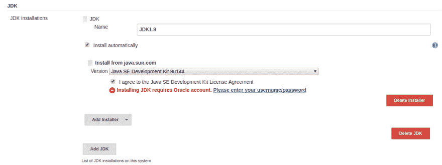
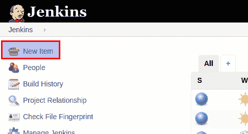
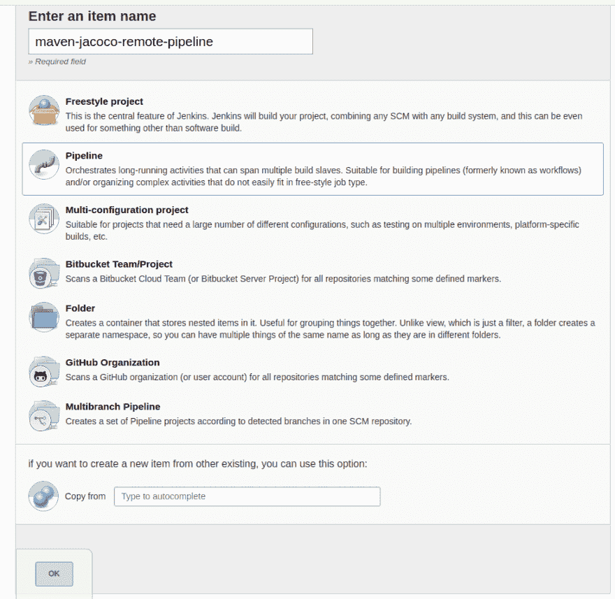
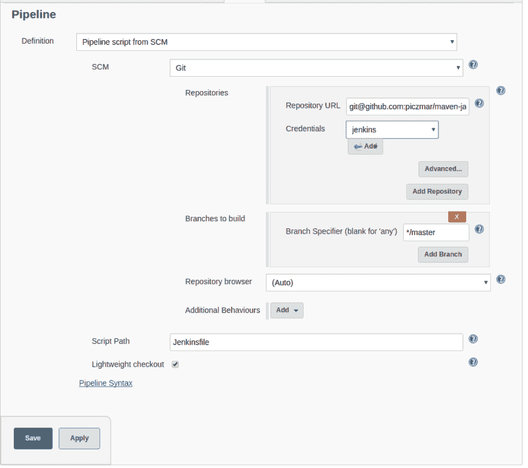
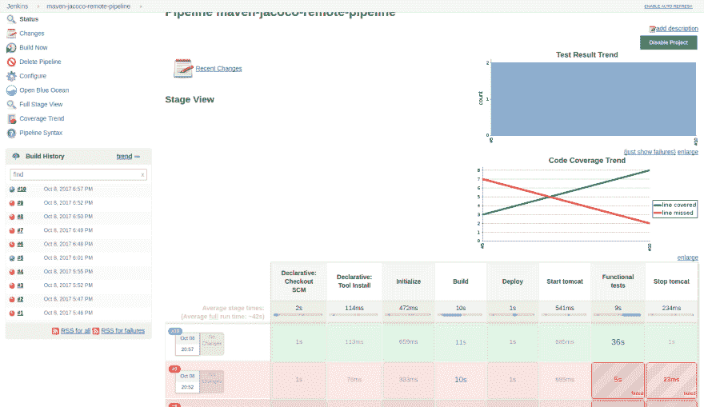
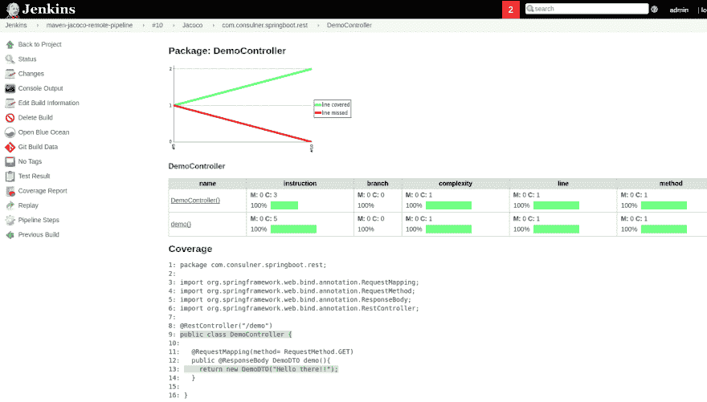

# 用于远程 Jacoco 测试覆盖的 Jenkins 管道

> 原文：<https://dev.to/piczmar_0/jenkins-pipeline-for-remote-jacoco-test-coverage-9k5>

每个产品开发的一部分就是对应用程序进行适当的测试。有许多方法可以测试它并解释所有的方法，这绝对是几篇博文的主题。

在这篇文章中，我将专注于一个特定的场景。我们想使用 Maven build 对部署在远程 Tomcat 上的应用程序运行集成测试。当然，我们可以使用嵌入式 Tomcat，但是假设我们想要验证它在目标环境中是否正常运行，例如，在不同的其他组件可能需要正确配置的地方，如数据库、其他服务等。

在这篇文章中，我将解释如何使用描述性管道来配置 Jenkins build。构建将在某个时候使用 Jacoco 插件从远程 Tomcat 服务器下载测试覆盖数据。

我将使用一个具有 REST 端点的示例 Spring Boot 应用程序。我们将从我们的功能测试中查询这个端点。[这里的](https://github.com/piczmar/maven-jacoco-remote)是项目。

这种配置包括几个部分:

1.  编写 Jenkins 管道定义(Jenkinsfile)
2.  配置 Jenkins 服务器以使用 SSH 访问远程 Tomcat 服务器，例如，我们希望将最新的包复制到 Tomcat，在功能测试运行之前启动 Tomcat，然后在最后停止它。
3.  在 Tomcat 上配置 Jacoco 代理
4.  配置 Jenkins build，这将从 Github 资源库中提取项目并开始构建。然后，我们希望在构建仪表板中可以看到 Jacoco 报告。

让我们从管道定义开始。Jenkins Pipeline 是一个非常好的特性，它允许从文本文件配置构建。我喜欢这个想法，主要是因为它允许将构建配置和源代码一起存储在同一个存储库中，并控制版本控制。你可以在这里看到完整的詹金斯档案[。我只是想让你知道你能用它做什么。首先，您可以管理构建所需的工具。](https://github.com/piczmar/RestDemoTests/blob/master/Jenkinsfile) 

```
 tools {
        maven 'mvn_3.5'
        jdk 'JDK1.8'
    } 
```

Enter fullscreen mode Exit fullscreen mode

这些是您在 Jenkins 全局工具配置中使用的名称。例如，JDK 的情况如下:

[T2】](https://res.cloudinary.com/practicaldev/image/fetch/s--ZGjfTUk3--/c_limit%2Cf_auto%2Cfl_progressive%2Cq_auto%2Cw_880/https://thepracticaldev.s3.amazonaws.com/i/upaqs2eyv0pdnx4ndtbo.png)

然后，您可以定义一个阶段列表，每个阶段执行几个步骤。

下面的阶段是运行 maven 命令，该命令生成要在 Tomcat 上部署的 WAR 文件。

```
 stages{
         ...

        stage ('Build') {
            steps {
                sh 'mvn clean package'
            }
        }
         ...
     } 
```

Enter fullscreen mode Exit fullscreen mode

接下来，我们可以执行 shell 命令。

```
 stage ('Deploy') {
            steps {
                sh 'ssh tomcatuser@tomcathost rm -fR ${TOMCAT_HOME}/webapps/RestDemo-0.0.1*'
                sh 'ssh tomcatuser@tomcathost ls ${TOMCAT_HOME}/webapps/'
                sh 'scp target/RestDemo-0.0.1-SNAPSHOT.war tomcatuser@tomcathost:${TOMCAT_HOME}/webapps/'
            }
        } 
```

Enter fullscreen mode Exit fullscreen mode

上面的命令使用 SSH 来调用远程命令:

*   删除部署在 Tomcat 上的旧工件
*   出于调试目的，列出 Tomcat webapps 文件夹的内容
*   将新工件复制到 Tomcat。它们将在 Tomcat 启动时部署。

如您所见，Jenkinsfile 非常简单，允许快速配置整个管道。肯定比点击詹金斯用户界面更友好。

我们的构建通过 SSH 运行远程命令。为了允许它，我们必须给 Jenkins 主机通过 SSH 连接到 Tomcat 主机的权限。这很容易。我将跳过如何在两台主机上安装 SSH。在网上很容易找到。
然后，我们需要在 Jenkins 主机上生成 SSH 密钥(如果不存在)，但使用空白密码(否则，当管道运行时，我们无法在非交互模式下输入密码，这将失败)

```
cd ~/.ssh
ssh-keygen -t rsa 
```

Enter fullscreen mode Exit fullscreen mode

并确认默认答案。
这将创建两个文件:`~/.ssh/id_rsa`和`~/.ssh/id_rsa.pub`。
最后一个是公钥。我们需要将这个文件的内容复制到 Tomcat 服务器上的 file ~/中。ssh/授权密钥

现在我们可以测试连接并从 Jenkins 主机运行

```
ssh tomcatuser@tomcathost 
```

Enter fullscreen mode Exit fullscreen mode

其中`tomcatuser`是 Tomcat 主机上的一个现有用户，他拥有启动/停止 Tomcat 的权限，而`tomcathost`是(您可能已经猜到了；))Tomcat 主机主机名或 IP 地址。

在 Tomcat 上，我们需要更新配置以允许运行 Jacoco 代理。这是一个小的 Java 程序，它将在 Java 虚拟机启动时启动，检测部署的类并收集运行时计算覆盖率数据所需的信息，当我们查询 REST 端点时。
当我们运行 Jenkins build 时，它将通过 TCP/IP 下载这个覆盖数据，因为 Tomcat 上的代理正在监听一个端口。

这是一行需要添加到 Tomcat 主机上的$TOMCAT_HOME/bin/catalina.sh 中的文件
的最开始的行

```
JAVA_OPTS="-javaagent:/opt/jacoco/jacocoagent.jar=output=tcpserver,address=*,port=10001" 
```

Enter fullscreen mode Exit fullscreen mode

它需要有到 jacocoagent.jar 的路径，您可以从 Jacoco 站点下载[。你可以在`lib`文件夹的下载 ZIP 中找到它。
它还需要端口号。你可以使用任何空闲端口。Maven Jacoco 插件将通过这个端口下载覆盖率数据。](http://www.eclemma.org/jacoco/)

最后，但并非最不重要的一部分，是建立在詹金斯设置。我们走吧..
首先创建一个新的构建。

[T2】](https://res.cloudinary.com/practicaldev/image/fetch/s--D2kLzLcY--/c_limit%2Cf_auto%2Cfl_progressive%2Cq_auto%2Cw_880/https://thepracticaldev.s3.amazonaws.com/i/unz0epygbrb929q7b1li.png)

然后输入构建名称并选择管道。

[T2】](https://res.cloudinary.com/practicaldev/image/fetch/s--_Z9UbQuG--/c_limit%2Cf_auto%2Cfl_progressive%2Cq_auto%2Cw_880/https://thepracticaldev.s3.amazonaws.com/i/orew1lth0elofffqg97h.png)

最后，如下图所示配置管道。
[T3】](https://res.cloudinary.com/practicaldev/image/fetch/s--592WKtak--/c_limit%2Cf_auto%2Cfl_progressive%2Cq_auto%2Cw_880/https://thepracticaldev.s3.amazonaws.com/i/w4lwrags33c31aebnwhi.png)

你需要做的就是指定 Github repo 和相对于项目根的 Jenkinsfile 的路径。将该文件放在项目的顶部(pom.xml 旁边)是一个很好的做法，因为它简化了 stages 定义——命令中的所有路径都可以相对于根目录给出，例如`mvn ..`命令。否则就需要更多的斜纹棉布。

最后一部分是测试构建。让我们手动运行它。然后，我们可以设置任何我们想要的触发器，就像任何其他詹金斯建设。

当构建完成时，你会看到一个很好的阶段分解，并且可以看到覆盖率图表

[T2】](https://res.cloudinary.com/practicaldev/image/fetch/s--juhVywts--/c_limit%2Cf_auto%2Cfl_progressive%2Cq_auto%2Cw_880/https://thepracticaldev.s3.amazonaws.com/i/3juefq8kb6w722unazlp.png)

当您选择左边的单一构建时，您可以看到覆盖率报告

[T2】](https://res.cloudinary.com/practicaldev/image/fetch/s--tZ6ESdD5--/c_limit%2Cf_auto%2Cfl_progressive%2Cq_auto%2Cw_880/https://thepracticaldev.s3.amazonaws.com/i/dp8y753a5amsrp0oo2gz.png)

就是这样。希望你喜欢这篇文章。