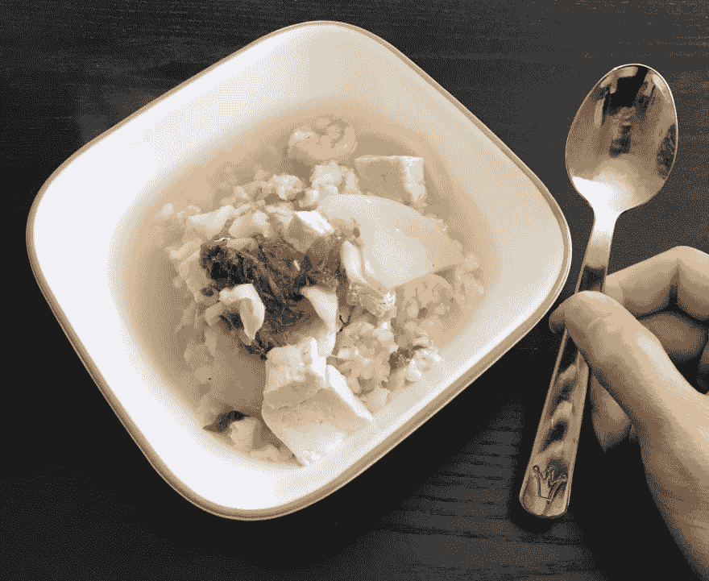

# 就用你所拥有的

> 原文：<https://dev.to/michael/just-use-what-youve-got>

[T2】](https://res.cloudinary.com/practicaldev/image/fetch/s---SlFDQE_--/c_limit%2Cf_auto%2Cfl_progressive%2Cq_auto%2Cw_880/https://thepracticaldev.s3.amazonaws.com/i/g0g2tm4k2qvoz029fc7q.jpg)

今天下午，当我为自己准备了一碗我妻子做的美味海鲜汤时，我打开了我们的银器抽屉，没有看到任何勺子。

我不假思索地抓起我孩子的勺子，坐下来吃东西，拍下了上面的照片。为什么？因为它提醒了我，很多时候，人们并不关心你是怎么做出来的东西，他们只关心你做出来的东西。就像我的胃不关心汤是怎么进去的，它只关心食物是怎么进去的。

🙋我过去多次这样做肯定是有罪的。我有了一个很酷的想法，决定把它做出来，然后开始考虑我应该用什么工具来实现它。这通常会导致在研究上花费太多时间，进而导致失去动力。相反，我应该花点时间评估一下我已经得到了什么，然后开始行动。毕竟，与研究和获得“正确的工具”相比，实际制作并向世界展示最终结果的过程更有回报。

我的大脑认为我用孩子的勺子是一个愚蠢的想法，但我的胃不在乎。它很充实，也很快乐。

* * *

最初发布于[李名炀](https://michaelsoolee.com/what-you-got/)