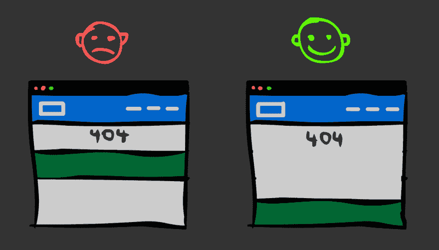

# 使用 CSS-Grid 将页脚保持在底部

> 原文：<https://dev.to/niorad/keeping-the-footer-at-the-bottom-with-css-grid-15mf>

[T2】](https://res.cloudinary.com/practicaldev/image/fetch/s--oC0KSh9A--/c_limit%2Cf_auto%2Cfl_progressive%2Cq_auto%2Cw_880/https://thepracticaldev.s3.amazonaws.com/i/bjqfoz0sunpyyu34th8p.jpg)

在项目中的某个时候，有人会对悬停在页眉正下方的页脚感到恼火，因为还没有内容来填充空间。也可能有一些非常短的页面(如 404)，可能不够长，无法填满整个浏览器。

CSS-Grid 让页脚保持在浏览器底部变得更加容易。有可能使用一些 CSS 技巧，Flexbox 或者 JS，但是在我看来网格解决方案是最优雅和简单的。

请注意，在撰写本文时，这仅在现代浏览器中受支持。好的一面是，这种方法不会破坏旧浏览器的任何东西。

HTML 结构将如下:

```
<html>
    <body>
        <article>
            <header>
            </header>
            <main>
            </main>
            <footer>
            </footer>
        </article>
    </body>
</html> 
```

Enter fullscreen mode Exit fullscreen mode

与一些真实世界的项目相比，这可能有点简化。将主要内容区域(main)和页脚(footer)放在同一个父元素中很重要。

```
html, body {
    width: 100%;
    height: 100%;
}

article {
    min-height: 100%;
    display: grid;
    grid-template-rows: auto 1fr auto;
    grid-template-columns: 100%;
} 
```

Enter fullscreen mode Exit fullscreen mode

重要的是“网格-模板-行”属性。在这里，我们告诉浏览器，我们希望“article”的第一个子元素与其自然高度一样高(“auto”)。第二个应该是一个 [fr](https://www.w3.org/TR/css3-grid-layout/#fr-unit) high，这意味着它将尽可能地变高，因为那里没有其他 fr-item。第三个孩子会有正常的身高。又来了。

不要忘记将 html 和 body 元素设置为 100%高度，否则你的网格容器不会填满整个浏览器。

这是 CodePen 上的工作示例。

[https://codepen.io/niorad/embed/RQPgqV?height=600&default-tab=result&embed-version=2](https://codepen.io/niorad/embed/RQPgqV?height=600&default-tab=result&embed-version=2)

如果你不知道的话:CSS-Grid 现在在所有现代浏览器上都得到支持。这是定义页面布局等等的一种便捷方式。去看看 Wes Bos 关于这个话题的免费课程。

编辑:
你可以用 Flexbox 实现同样的事情。如果您现在(2018 年 1 月)就需要该功能，这将是一种更广泛支持的方式。查看张秀坤·韦伯的文章[“用 CSS Flexbox 将页脚保持在底部”](https://dev.to/domysee/keeping-the-footer-at-the-bottom-with-css-flexbox-5h5f)

**更新:**
Firefox 52 支持网格，但它有很多漏洞，尤其是在这种情况下。这些元素没有保持它们的自然高度。因此，如果您需要支持 FF52，请使用 Flexbox 解决方案。