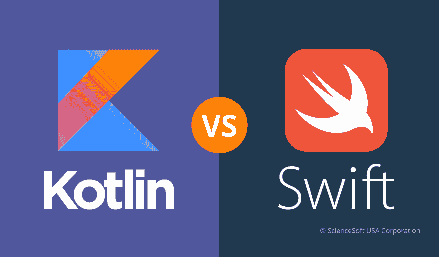

# kot Lin vs . Swift:Android 和 iOS 正在朝着创建一种通用语言的方向发展吗？

> 原文：<https://dev.to/sciencesoft/kotlin-vs-swift-are-android-and-ios-moving-towards-creating-a-universal-language>

[T2】](https://res.cloudinary.com/practicaldev/image/fetch/s--Arz4PKgH--/c_limit%2Cf_auto%2Cfl_progressive%2Cq_auto%2Cw_880/https://thepracticaldev.s3.amazonaws.com/i/1ckvhgs9qeq92xdaqjas.png)

一旦科特林得到了谷歌的支持，科特林粉丝的纯粹兴奋并不是唯一的反应。那些不熟悉 Kotlin 的人非常关心它与 Java 的兼容性/互操作性水平，掌握它所需的平均时间，以及一般情况下使用 Kotlin 的[优势。](https://www.scnsoft.com/blog/kotlin-development-what-you-need-to-know-about-androids-new-official-language)

许多 Kotlin 开发人员试图以最短、最清晰的方式解释和介绍这种语言，他们提到了 Kotlin 和 iOS 第二官方语言 Swift 之间 3 年前的相似之处。将 Kotlin 称为“Android 的 Swift”确实让事情变得更简单，并有助于为该语言创造一个形象。然而，这张图片也在 iOS 社区引发了争论，因为一些 iOS 开发者并不认为这种比较是恭维，而是将科特林视为纯粹的抄袭者。

至少，应该指出的是，虽然 Swift 出现在 2013 年，但 Kotlin 起源于 2011 年。因此，尽管将 Kotlin 与 Swift 进行比较(按照这种确切的顺序)会很方便，因为 Swift 更早地介绍给了广大受众，但对 Kotlin 的任何“模仿”态度都是不合理的。然而，这种比较站得住脚吗？如果是，相似性延伸到什么程度？它的存在是否暗示了这样一个事实:在未来，为 iOS 和 Android 原生提供应用程序会变得更容易、更快？ScienceSoft 在[移动应用程序开发服务](https://www.scnsoft.com/services/mobile-app-development)方面的丰富经验允许在这一点上进行推测。让我们调查一下。

## 语法

Swift 的语法不仅仅类似于 Kotlin 的语法:在小块代码中，字符串相似度高达 77%。主要差异可归纳为下表:

| 我的锅 | 迅速发生的 |
| --- | --- |
| 乐趣 | 功能 |
| 英国压力单位 | 让 |
| 空 | 无 |
| 特点 | 草案 |
| 构造器 | 初始化 |
| ： | -> |
| 任何的 | 父对象 |
| ！！ | ！ |

基础、类和函数都有非常相似的表达方式。与 Objective-C 不同，Swift 的方法调用类似于 Java 和 Kotlin 的方法调用，具有它们的名称空间系统和点符号风格。例如，下面是两种语言中函数调用的样子:

| 我的锅 | 迅速发生的 |
| --- | --- |
| 趣味预报(日:字符串，天气:字符串):字符串{ | func 预测(_ day: String，_ weather: String) -> String { |
| return“今天是$day，是$weather。” | 返回“今天是\(天)，是\(天气)。” |
| } | } |
| 预报(“星期一”、“下雨”) | 预报(“星期一”、“下雨”) |

这就是类在两者中的声明方式:

| 我的锅 | 迅速发生的 |
| --- | --- |
| 班级宿舍{ | 班级宿舍{ |
| 是 number = 0 | 是 number = 0 |
| 趣味描述()= | func Description() -> String { |
| “一栋有$ number 个房间的房子。” | 返回“带有(numberOfRooms)的房子” |
| } | } |
|  | } |

在这篇[文章](http://nilhcem.com/swift-is-like-kotlin/)中可以找到许多其他的例子，如果它们告诉我们一些事情，那就是这两种语言都有一个共同的最初目的，那就是尽可能保持简洁和透明，使开发人员的生活更容易。Kotlin 和 Swift 的语法系统在这方面非常有效，因为它们因其优雅而受到开发团队的赞赏。

## 安全

尽管 Swift 和 Kotlin 在类型方面都很强大并且是静态的，但是它们也允许使用动态类型。这样，语言保持简洁和灵活，同时允许尽早消除错误和不匹配。因此，它们被认为是高度安全的，对于大型项目尤其可靠。除此之外，这两种语言将处理可选值和 null/nil 安全的方法与安全导航操作符结合起来？或选项类型。那个？Kotlin 和 Swift 都以几乎相同的方式表达了预防:

| 我的锅 | 迅速发生的 |
| --- | --- |
| val 示例:字符串？=空 | var 举例:字符串？=零 |

## 特性

除了 null (nil)安全、函数和类，Kotlin 和 Swift 还有多个相似的特性，包括*常量、变量、泛型、协议(traits)、枚举类型、any (anyobject)、错误处理*等。在这两种语言中实现的一些特性共享了这种方法，但是由于这些特性所使用的原始语言不同，它们的命名也不同。

例如，在 Kotlin 中可以找到 Java 的 **lambda** 表达式(顺便说一下，这些表达式非常有效，但不适用于 Java Android 开发)。在 Swift 中，这些是来自 Objective-C 的术语**块**或**闭包**，这两个表达式被调用到代码中的方式和它们工作的方式一样相似。

| 我的锅 | 迅速发生的 |
| --- | --- |
| { | { _in |
| println("Lambda 表达式") | print("闭包表达式") |
| } | } |

在 Swift 中称为**计算属性**的特性是一个带有“get”调用的特定属性声明，在 Kotlin 中也启用了该特性:

| 我的锅 | 迅速发生的 |
| --- | --- |
| 动物类( | 动物类{ |
| var 属:字符串， | var 类别:字符串 |
| var 种类:String) { | var 种类:串串 |
| val binomialName:字符串 | var binomialName: String { |
| get()= " $属$种" | 获取{ |
| } | 返回“\(属)\(种)” |
|  | } |
|  | } |
|  | } |

**命名参数**(或命名参数)也在两种语言中使用:

| 我的锅 | 迅速发生的 |
| --- | --- |
| fun daysoff(假期:Int，周末:Int): Int =假期+周末 | func daysoff(假期:Int，周末:Int) -> Int { |
|  | 返程假期+周末 |
|  | } |
| 休息日(5，周末= 8) | 休息日(假期:5 天，周末:8 天) |

事实上，与其列出两种语言中都存在的特性，不如列出不存在的特性更容易。也就是说，只有科特林支持:

*   类导入，
*   主构造函数和数据类，
*   @注释。

同时，与科特林不同的是，斯威夫特:

*   元组，
*   typealias，
*   守卫声明。

## 比喻相似之处背后的意思

这两种语言显然有着共同的思想，因为它们解决了它们的祖先语言所产生的同样的问题:它们不那么冗长，功能有限，可读性更强，使用起来更方便。同时，Kotlin 和 Swift 分别与 Java 和 Objective-C 保持互操作性，这允许在新项目和旧项目的维护中使用它们。

更重要的是，这两种语言的高度相似性有助于为 iOS 和 Android 开发一个应用程序。当然，这并不是说两个平台上的应用程序可以共享一个代码，因为语言和特定于操作系统的库并不相同。尽管如此，由于 Swift 和 Kotlin 在语法和功能上的相似性，应用程序逻辑和功能的方法可能非常相似。这可以使开发、测试和维护更快更容易。

## iOS 和 Android 通用语言？

理论上，谷歌可能已经接受 Swift 作为其官方语言，而不是 Kotlin 甚至在 2016 年就有围绕这种可能性的传言。这种转变可能不会造成任何跨平台开发工具变得无关紧要的情况，但是两个平台之间的界限肯定会变得模糊。

然而，这一举措也是不合理的，不仅仅是因为商业竞争。斯威夫特和科特林虽然相似，但最像的还是他们的前辈。换句话说，Swift 和 Kotlin 正在弥合 Objective-C 和 Java 之间的鸿沟。然而，从 Java 到 Kotlin 的转换仍然比从 Java 到 Swift 的转换更加自然和流畅。

总的来说，适应新事物的想法并不对每个人都有吸引力；一些开发人员花时间尝试一种新语言，就像 Swift 的采用一样。确保这种转变不那么痛苦意味着确保这种语言最终会流行起来，对于一种新语言来说，这是首要的。

## 离别的思念

随着移动开发的不断发展，技术也在不断发展。这就是为什么在 5-10 年内，科特林和斯威夫特会变得完全不同。很难说这两种语言是否会继续弥合彼此之间的差距。尽管如此，由于 iOS 和 Android 都在寻找最方便、安全和快速的移动开发工具，他们可能有一天会说同一种语言。