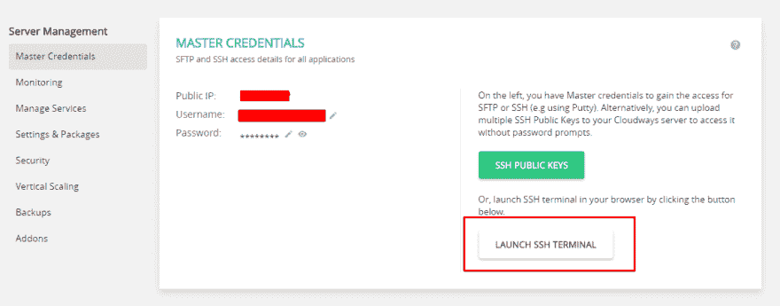
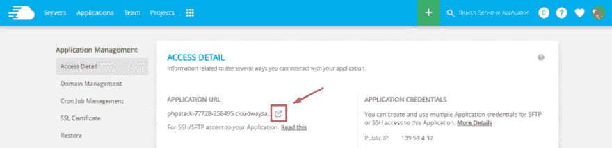

# 带电子邮件的 Laravel 联系表

> 原文：<https://dev.to/rizwan_saquib/laravel-contact-form-with-email>

Laravel 是一个流行的 PHP 框架，用于创建动态网站和 web 应用程序。Laravel 提供了广泛的功能来满足日常项目需求，如路由、认证、会话和缓存。联系我们表单是目前所有网站的另一个常规功能。

在这篇文章中，我将向你展示如何用电子邮件在 Laravel 中轻松地创建一个联系表单。

## 安装 Laravel 应用程序

为了演示 Laravel 联系表单，我将在 Cloudways 上创建并托管 Laravel 应用程序。免费注册 Cloudways 并登录您的帐户。接下来:

*   创建新的服务器。
*   填写服务器和应用程序详细信息，并选择 Laravel 作为应用程序。

就这样，只需点击几下，您就已经安装并设置了一个功能齐全的 Laravel 应用程序。

[T2】](https://res.cloudinary.com/practicaldev/image/fetch/s--PPS9Zx2F--/c_limit%2Cf_auto%2Cfl_progressive%2Cq_66%2Cw_880/http://www.cloudways.com/blog/wp-content/uploads/image4-1.gif)

## 安装 Laravel 集体 HTML 包

要在 Laravel 中创建表单，请为表单外观安装 **laravelcollective/html** 包。转到 Cloudways 平台，打开 Server 选项卡。启动 SSH 终端，并使用主凭证登录到您的服务器。

[T2】](https://res.cloudinary.com/practicaldev/image/fetch/s--xBpyen43--/c_limit%2Cf_auto%2Cfl_progressive%2Cq_auto%2Cw_880/https://www.cloudways.com/blog/wp-content/uploads/image2-22.png)

现在转到应用程序的根目录:

```
cd applications
cd applicationname/public_html
composer require laravelcollective/html 
```

Enter fullscreen mode Exit fullscreen mode

现在已经安装了这个包，转到 **config/app.php** 文件并添加服务提供者和别名:

**config/app.php**

```
 'providers' => [
....
'Collective\Html\HtmlServiceProvider',
],
'aliases' => [
....
'Form' => 'Collective\Html\FormFacade',
], 
```

Enter fullscreen mode Exit fullscreen mode

## 数据库配置

下一步是配置数据库。在 Cloudways 平台中打开“应用程序”选项卡，然后转到“应用程序访问详细信息”。使用这些数据库凭据。

去吧。env 文件(位于应用程序公共根文件夹中)并在那里添加凭证:

```
DB_CONNECTION=mysql
DB_HOST=127.0.0.1
DB_PORT=3306
DB_DATABASE= your.database.name                                                                                                                            
DB_USERNAME= your.database.username                                                                                                                             
DB_PASSWORD= your.database.password 
```

Enter fullscreen mode Exit fullscreen mode

## 为联系我们表创建迁移

转到应用程序的公共根文件夹，运行以下命令来创建数据库迁移，以便创建联系我们模型。

```
php artisan make:migration create_contact_us_table 
```

Enter fullscreen mode Exit fullscreen mode

这将产生迁移。

之后，进入**数据库/migration/date _ create _ contact _ us _ table . PHP**，在其中添加以下代码。

```
 <?php

use Illuminate\Support\Facades\Schema;
use Illuminate\Database\Schema\Blueprint;
use Illuminate\Database\Migrations\Migration;

class CreateContactUsTable extends Migration
{
    /**
     * Run the migrations.
     *
     * @return void
     */
    public function up()
    {
        Schema::create('contactus', function (Blueprint $table) { $table->increments('id'); $table->string('name'); $table->string('email'); $table->text('message'); $table->timestamps(); });
    }

    /**
     * Reverse the migrations.
     *
     * @return void
     */
    public function down()
    {
       Schema::drop("contactus");
    }
} 
```

Enter fullscreen mode Exit fullscreen mode

现在运行下面的命令:

```
php artisan migrate 
```

Enter fullscreen mode Exit fullscreen mode

## 创建模型

转到应用程序的公共根文件夹，键入以下命令:

```
php artisan make:model ContactUS 
```

Enter fullscreen mode Exit fullscreen mode

成功创建 ContactUS 模型后，转到 app/ContactUS.php 并在文件中添加以下代码:

```
<?php

namespace App;

use Illuminate\Database\Eloquent\Model;

class ContactUS extends Model
{

public $table = 'contactus';

public $fillable = ['name','email','message'];

} 
```

Enter fullscreen mode Exit fullscreen mode

## 创建路线

转到 **routes/web.php** 并将以下代码添加到路线中:

```
Route::get('contact-us', 'ContactUSController@contactUS');
Route::post('contact-us', ['as'=>'contactus.store','uses'=>'ContactUSController@contactUSPost']); 
```

Enter fullscreen mode Exit fullscreen mode

## 创建控制器

现在创建一个控制器来处理来自路由的请求。现在转到**app/Http/Controllers/contactus controller . PHP**并向其中添加以下代码:

```
<?php

namespace App\Http\Controllers;

use Illuminate\Http\Request;
use App\Http\Requests;
use App\ContactUS;

class ContactUSController extends Controller
{
   /**
    * Show the application dashboard.
    *
    * @return \Illuminate\Http\Response
    */
   public function contactUS()
   {
       return view('contactUS');
   }

   /**
    * Show the application dashboard.
    *
    * @return \Illuminate\Http\Response
    */
   public function contactUSPost(Request $request)
   {
       $this->validate($request, [
        'name' => 'required',
        'email' => 'required|email',
        'message' => 'required'
        ]);

       ContactUS::create($request->all());

       return back()->with('success', 'Thanks for contacting us!');
   }
} 
```

Enter fullscreen mode Exit fullscreen mode

## 创建视图

现在一切都准备好了，我将创建表单的布局。转到**资源/视图/** 并创建一个文件 contactUS.blade.php。将以下代码放入其中:

```
<!DOCTYPE html>
<html>
<head>
Laravel 5.4 Cloudways Contact US Form Example
<link rel="stylesheet" href="https://maxcdn.bootstrapcdn.com/bootstrap/3.3.7/css/bootstrap.min.css">
</head>
<body>

<div class="container">
<h1>Contact US Form</h1>

@if(Session::has('success'))
   <div class="alert alert-success">
     {{ Session::get('success') }}
   </div>
@endif

{!! Form::open(['route'=>'contactus.store']) !!}

<div class="form-group {{ $errors->has('name') ? 'has-error' : '' }}">
{!! Form::label('Name:') !!}
{!! Form::text('name', old('name'), ['class'=>'form-control', 'placeholder'=>'Enter Name']) !!}
<span class="text-danger">{{ $errors->first('name') }}</span>
</div>

<div class="form-group {{ $errors->has('email') ? 'has-error' : '' }}">
{!! Form::label('Email:') !!}
{!! Form::text('email', old('email'), ['class'=>'form-control', 'placeholder'=>'Enter Email']) !!}
<span class="text-danger">{{ $errors->first('email') }}</span>
</div>

<div class="form-group {{ $errors->has('message') ? 'has-error' : '' }}">
{!! Form::label('Message:') !!}
{!! Form::textarea('message', old('message'), ['class'=>'form-control', 'placeholder'=>'Enter Message']) !!}
<span class="text-danger">{{ $errors->first('message') }}</span>
</div>

<div class="form-group">
<button class="btn btn-success">Contact US!</button>
</div>

{!! Form::close() !!}

</div>

</body>
</html> 
```

Enter fullscreen mode Exit fullscreen mode

联系人表单现在可以使用了。

在提交表单时，数据将被存储在数据库中。下一步是让表单通过电子邮件发送信息。

现在创建另一个视图，**email.blade.php**，并在其中添加以下代码。

```
You received a message from : {{ $name }}

<p>
Name: {{ $name }}
</p>

<p>
Email: {{ $email }}
</p>

<p>
Message: {{ $user_message }}
</p> 
```

Enter fullscreen mode Exit fullscreen mode

## 发送邮件

要了解此步骤中涉及的步骤，请阅读 Laravel 中的[发送电子邮件。既然您已经阅读了这些步骤，那么是时候实现这个过程了。首先，通过 PHP Artisan 设置基本的 Laravel 邮件功能。在终端中使用以下命令:](https://www.cloudways.com/blog/send-email-in-laravel/) 

```
php artisan make:mail <name of mailable> 
```

Enter fullscreen mode Exit fullscreen mode

之后，登录您的 Gmail 帐户。在我的账户>登录和安全>登录谷歌下，启用两步验证，然后生成 app 密码。接下来，在。env 文件，配置如下。

```
MAIL_DRIVER=smtp

MAIL_HOST=smtp.gmail.com

MAIL_PORT=587

MAIL_USERNAME= your.email@gmail.com

MAIL_PASSWORD= your.generated.app.password

MAIL_ENCRYPTION=tls 
```

Enter fullscreen mode Exit fullscreen mode

现在配置已经完成，用下面的代码更新**ContactUsController.php**:

```
<?php

namespace App\Http\Controllers;

use Illuminate\Http\Request;
use App\Http\Requests;
use App\ContactUS;
use Mail;

class ContactUSController extends Controller
{
   public function contactUS()
{
return view('contactUS');
} 
   /** * Show the application dashboard. * * @return \Illuminate\Http\Response */
   public function contactUSPost(Request $request) 
   {
    $this->validate($request, [ 'name' => 'required', 'email' => 'required|email', 'message' => 'required' ]);
    ContactUS::create($request->all()); 

    Mail::send('email',
       array(
           'name' => $request->get('name'),
           'email' => $request->get('email'),
           'user_message' => $request->get('message')
       ), function($message)
   {
       $message->from('saquib.gt@gmail.com');
       $message->to('saquib.rizwan@cloudways.com', 'Admin')->subject('Cloudways Feedback');
   });

    return back()->with('success', 'Thanks for contacting us!'); 
   }
} 
```

Enter fullscreen mode Exit fullscreen mode

联系表单现在可以部署了。它会将数据保存在数据库中，并通过电子邮件发送到给定的电子邮件地址。要测试联系我们表单，请转到应用程序并单击启动应用程序(记得在 URL 中添加/contact-us)。

[T2】](https://res.cloudinary.com/practicaldev/image/fetch/s--_it_h6eI--/c_limit%2Cf_auto%2Cfl_progressive%2Cq_auto%2Cw_880/https://www.cloudways.com/blog/wp-content/uploads/image1-21.png)

检查[演示](http://phplaravel-77728-284364.cloudwaysapps.com/contact-us)以查看应用程序的运行情况。

## 最后一句话

在本教程中，我向您展示了如何在 Laravel 中创建一个联系人表单，该表单具有将信息通过电子邮件发送到预先指定的电子邮件地址的功能。