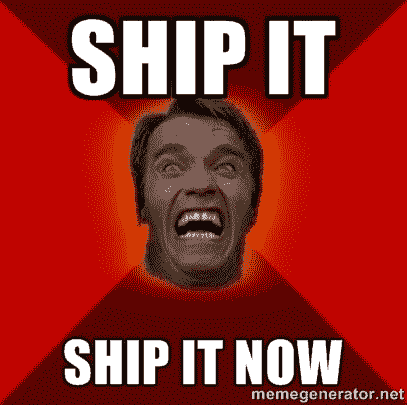

# 在 React 本地应用程序中显示 YouTube 视频的惰性方法

> 原文：<https://dev.to/mutatedbread/lazy-approach-to-display-youtube-videos-in-a-react-native-app-bfc>

前一段时间，我为了一份实习工作，做了一个半生不熟的 RN app。我需要从他们的 YouTube 帐户显示公司的视频。我去 npm 上找插件。因为当时我没有碰到一个可用的插件，所以我决定用我想到的最懒的方法。

# WEBVIEW FTW！！！

Yass，我懒得写原生插件所以有 WebView :)

```
<WebView 
    ref={(ref) => { this.videoPlayer = ref;}}
    scalesPageToFit={true} 
    source={{ html: '<html><meta content="width=device-width, initial-scale=1.0, maximum-scale=1.0, user-scalable=0" name="viewport" /><iframe src="https://www.youtube.com/embed/' + this.props.navigation.state.params.videoId + '?modestbranding=1&playsinline=1&showinfo=0&rel=0" frameborder="0" style="overflow:hidden;overflow-x:hidden;overflow-y:hidden;height:100%;width:100%;position:absolute;top:0px;left:0px;right:0px;bottom:0px" height="100%" width="100%"></iframe></html>'}} 
    onShouldStartLoadWithRequest={this.onShouldStartLoadWithRequest} //for iOS
    onNavigationStateChange ={this.onShouldStartLoadWithRequest} //for Android
/> 
```

Enter fullscreen mode Exit fullscreen mode

1.  它有一个`this.videoPlayer`组件引用。
2.  `this.props.navigation.state.params.videoId`是 Redux 使用 React 导航`NavigationActions.navigate`传入的参数。
3.  它有一个 100% css 高度和宽度的嵌入式 YouTube 播放器的源。

然后，底部有一个 YouTube 标志，用户可以点击它来打开原生 YouTube 应用程序或在默认浏览器中打开 Youtube 的新标签。

我不希望用户也离开应用程序。我包括了一个小“黑客”不允许这一行动。

```
onShouldStartLoadWithRequest = (navigator) => {
    if (navigator.url.indexOf('embed') !== -1
    ) {
        return true;
    } else {
        this.videoPlayer.stopLoading(); //Some reference to your WebView to make it stop loading that URL
        return false;
    }    
} 
```

Enter fullscreen mode Exit fullscreen mode

对于每个 url 的改变，WebView 将调用传递给它的`onShouldStartLoadWithRequest`和`onNavigationStateChange`道具的函数。它只是简单地检查来自 YouTube web embed url 的`embed`是否还在。

否则，WebView 将停止加载。

* * *

又快又脏。丑陋却有效

[T2】](https://res.cloudinary.com/practicaldev/image/fetch/s--tqW1ujXe--/c_limit%2Cf_auto%2Cfl_progressive%2Cq_auto%2Cw_880/http://static1.squarespace.com/static/5539b16ae4b09e35ffe0d93c/55c27624e4b0db8468d6a825/57c73fd0d2b8574ea2f13334/1472679095663/59631492.jpg%3Fformat%3D1000w)