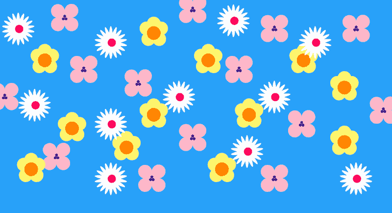

# 通过艺术创作学习 CSS

> 原文：<https://dev.to/aspittel/learning-css-through-creating-art-9i7>

本周早些时候，我的一位同事在 CodePen 上发现了一张 Trish Katz 拍摄的格蕾丝·赫柏上将的图片。这看起来很神奇——我已经为我参与的项目写了成千上万行 CSS，但是这是在不同的层面上！我立刻想了解更多。

#### 单分区格蕾丝·赫柏

[https://codepen.io/techxastrish/embed/eEyYNP?editors=1100%20?height=500&default-tab=result&embed-version=2](https://codepen.io/techxastrish/embed/eEyYNP?editors=1100%20?height=500&default-tab=result&embed-version=2)

我不是任何形式的艺术家。我设法让我的网站看起来不错，尽可能保持简单，并严重依赖材料设计规则。用 CSS 画图似乎是一个我无法拒绝的挑战！

## 该过程

我开始研究 CSS 艺术，发现了一些很棒的资源，比如:[萨沙·特兰](https://medium.com/@sashatran)、[编码艺术家](https://medium.com/coding-artist/a-beginners-guide-to-pure-css-images-ef9a5d069dd2)，以及 Twitter 上的 [#PureCSS](https://twitter.com/hashtag/purecss?lang=en) 标签。通过这些资源，我最终找到了一个名为“[如何制作纯粹的 CSS 图像来推进以设计为中心的前端开发”的教程，作者是编码艺术家。他讲述了如何只用 CSS 创建一个可爱的考拉卡通。](http://coding-artist.teachable.com/)

我发现他分解考拉不同组成部分的方式非常有趣。原来，CSS 艺术是通过填充、调整大小和重塑 div 来创建的。div 是一个 HTML 元素，默认情况下不做任何事情，它主要用于分组元素和应用样式。因为它们没有任何默认行为，我们可以很容易地给它们添加样式！考拉上每个不同的形状都是一个 div，上面有一个 CSS 选择器。我发现这比我以前看到的单个 div 艺术要简单得多！

从那时起，我决定用考拉代码笔进行修改。经过多次试错，我最终有了这张[我的狗](https://codepen.io/aspittel/pen/aLxrBq)的卡通肖像。再说一次，我是*，所以*不是艺术家。

#### 卡通狗狗肖像

[https://codepen.io/aspittel/embed/aLxrBq%20?height=500&default-tab=result&embed-version=2](https://codepen.io/aspittel/embed/aLxrBq%20?height=500&default-tab=result&embed-version=2)

下面，我包括了一些代码的片段，看起来像什么和它做什么。下面的所有代码也适用于普通的 CSS——CSS art 是练习普通 CSS 技能的好地方！例如，狗头的代码如下:

```
.head {
    background-color: black; /* the color of the div black */
    position: absolute; /* hard places the div instead of allowing responsiveness or relating it to other divs */
    top: 16.5%; /* where the top of the div will be placed */
    left: 25%; /* where the div will start horizontally */
    width: 50%; /* what percentage of the parent div the div will take up horizontally */
    height: 67%; /* what percentage of the parent div the div will take up vertically*/
    border-radius: 50%; /* makes the div round! */
} 
```

这只是正常的 CSS 被用于艺术而不是网站布局！

我发现的最有用的工具之一是 [Clippy](https://bennettfeely.com/clippy/) ，它允许你绘制 CSS 剪辑路径并为你想要绘制的形状生成代码！CSS 默认允许圆形和方形，但是当你想要使用三角形或者其他非标准的形状时就有点棘手了。我们必须计算我们想要绘制的路径的坐标。由于这种路径数学会很快变得非常危险，我真的很喜欢使用 Clippy 来简化这个过程。

## 最终项目

一旦我有了工作犬，我就决定要写一些我可以在代码笔之外使用的东西，所以我建立了一个带有花卉图案的网页。

我开始使用 CodePen 绘制出我想要包含的不同的花朵形状。我最后用了三个:一个是长椭圆形的花瓣(白色的花)，一个是泪珠形的花瓣(粉色的)，还有一个是圆形的(黄色的)。到目前为止，我已经可以很轻松地使用 CSS 创建和编辑形状了。

在这个过程中，我意识到手动绘制所有的花真的很麻烦，于是我决定使用 React 来动态创建它们——我完全作弊了！我仍然用 CSS 完成了 90%的工作，但是我对有这么多 div 感到恼火，而是用 React 迭代地编写了一些 div。举例来说，每朵白花都由 21 片花瓣组成——20 片花瓣，一片位于中心。我写了代码生成那些花瓣和它们的坐标！

#### 最终项目的图像

[T2】](https://res.cloudinary.com/practicaldev/image/fetch/s--VuKsOfJ5--/c_limit%2Cf_auto%2Cfl_progressive%2Cq_auto%2Cw_880/https://cdn-images-1.medium.com/max/800/1%2AIFmwCagEmlU68El8ea40Rw.png)

最终代码是[这里是](https://github.com/aspittel/css-flower-art)，它生成的页面被部署[这里是](https://aspittel.github.io/css-flower-art/)。最后我也把它当成了我的桌面背景！

## 后续步骤

学习 CSS 艺术真的很有趣，我认为从中得到的概念肯定会让日常 CSS 变得更强大！我离艺术家还很远，但 CSS 艺术可以成为我前进的一个很好的艺术出口。总的来说，我从这个项目中获得了很多乐趣，我真的很喜欢它的成果！

**我的[关于学习新事物的一部分](https://medium.com/on-learning-new-things/learning-new-things-f4db7f16724)系列！**