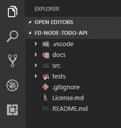

# 学习 Node.js 构建一个简单的 Express API——第一部分

> 原文：<https://dev.to/filipedomingues/learning-nodejs-building-a-simple-express-api-part-i---project-setup>

你好戴夫.托。我一直在空闲时间学习 Node.js，我想这将是一个分享我的经验的好地方，也许可以帮助你们中的一些人。

我们将构建一个简单的 Todo **REST API** ，在这个过程中，我将尝试涵盖一些额外的软件开发主题，如**单元测试**、**认证**、**连续交付/连续集成**等。

我会试着一步一步来做每件事，这样你们就不会有太大的困难。对于那些已经有一些`node.js`或`javascript`经验的人来说，这一部分可能会有点无聊。

在我们开始黑客之前，让我们设置我们的开发环境。

* * *

# **环境**

让我们从尽可能少的东西开始，然后根据需要添加一些东西。

### **节点。Js**

我将使用最新的节点。Js 版本(8.2.1)如果你还没有的话可以在这里 得到 **[。](https://nodejs.org)**

### **IDE - Visual Studio 代码**

我将使用带有一些基本扩展的 Visual Studio 代码(VSCode ),但请随意使用您最熟悉的 IDE。
这里 可以得到 VSCode **[。](https://code.visualstudio.com/)**

### **项目结构**

我会随着我们的进展调整项目结构，但现在让我们从最基本的开始。
[](https://res.cloudinary.com/practicaldev/image/fetch/s--kgWqNdXA--/c_limit%2Cf_auto%2Cfl_progressive%2Cq_auto%2Cw_880/https://thepracticaldev.s3.amazonaws.com/i/mltjaj5hqtfi4874fjz2.JPG) 
在这里可以看出没有什么特别之处。
一个 **docs** 目录，这样我们就可以添加任何种类的文档，一个 **src** 目录，我们将把所有的源代码和最后的**测试**目录放在那里。

* * *

# **让我们进入正题吧！**

好了，现在我们有了一个不错的设置，让我们开始表演吧。

### [T1**NPM**](#npm)

Npm 是一个 javascript 包管理器。它随 Node.js 安装一起提供，我们将使用它来管理我们的项目依赖项。你可以在这里找到关于 npm [的更多信息](https://www.npmjs.com/)

让我们从打开项目根目录的命令行开始，输入:

```
 npm init 
```

Enter fullscreen mode Exit fullscreen mode

它会问你一些问题，如果你不知道该怎么回答，现在就按回车键。最后，您将得到一个类似于以下内容的 package.json 文件:

```
{  "name":  "fd-node-todo-api",  "version":  "1.0.0",  "description":  "expressjs todo API for dev.to",  "main":  "index.js",  "directories":  {  "doc":  "docs",  "test":  "tests"  },  "scripts":  {  "test":  "echo \"Error: no test specified\" && exit 1"  },  "author":  "",  "license":  "ISC"  } 
```

Enter fullscreen mode Exit fullscreen mode

* * *

### **Eslint**

我们将使用 [Eslint](http://eslint.org/) 作为我们的林挺工具。让我们将第一个开发依赖项添加到项目中！在命令行上键入:

```
npm install eslint --save-dev 
```

Enter fullscreen mode Exit fullscreen mode

就这么简单。当它完成时，你的 package.json 文件将有我们的第一个依赖项。它会是这样的:

```
//...  "devDependencies":  {  "eslint":  "^4.4.1"  }  //... 
```

Enter fullscreen mode Exit fullscreen mode

现在我们可以设置我们的林挺规则。在命令行上键入:

```
eslint --init 
```

Enter fullscreen mode Exit fullscreen mode

你可以选择一些流行的风格指南或者按照你的喜好进行配置。它将使用您的规则创建一个. eslintrc.js 文件。如果你想看的话，我会把我的贴上来:

```
module.exports = {
    "env": {
        "es6": true,
        "node": true
    },
    "extends": "eslint:recommended",
    "rules": {
        "no-console":0,
        "indent": [
            "error",
            2
        ],
        "linebreak-style": [
            "error",
            "unix"
        ],
        "quotes": [
            "error",
            "single"
        ],
        "semi": [
            "error",
            "always"
        ]
    }
}; 
```

Enter fullscreen mode Exit fullscreen mode

(是的，我是#2spaces 和# allwaysUseSemiCollons 程序员，不要恨我。)

如果你使用 VSCode，我强烈推荐 Eslint 扩展。它将 eslint 完美地集成到 vscode 中，并通过其**自动修复保存选项**提供了很大帮助。如果你需要更多的帮助，请告诉我。

* * *

### **快递**

Express 是 Node.js 的一个 web 应用框架，我们将用它来服务我们的 API。

让我们从添加依赖项开始:

```
npm install express --save 
```

Enter fullscreen mode Exit fullscreen mode

这将增加我们对 package.json 文件的依赖。

```
 "dependencies":  {  "express":  "^4.15.4"  } 
```

Enter fullscreen mode Exit fullscreen mode

注意，我们使用了`--save`而不是`--save-dev`。这将把依赖项添加为我们的应用程序运行所需的依赖项，另一方面，使用`--save-dev`将只把它保存为开发依赖项。

让我们创建入口点。在我们的`src`目录下创建一个`app.js`文件，并开始导入我们的第一个依赖项。

```
const express = require('express'); 
```

Enter fullscreen mode Exit fullscreen mode

简单对吗？现在让我们创建我们的服务器并启动它:

```
const app = express();

app.listen(port,  function() {
  console.log(`Express server listening on port 3001`);
}); 
```

Enter fullscreen mode Exit fullscreen mode

您可以添加一个变量来设置连接端口，这样您就可以轻松地更改和配置它。

最后，你应该有类似这样的东西:

```
// Dependencies
const express = require('express');

// configs
const port = process.env.PORT ||  3001;

// ExpressJs Setup
const app = express();

// Starting up the server
app.listen(port,  function() {
  console.log(`Express server listening on port ${port}`);
});

module.exports = app; 
```

Enter fullscreen mode Exit fullscreen mode

现在，在我们的`package.json`文件中，让我们添加启动脚本来启动并运行我们的服务器。将此添加到脚本:

```
"scripts":  {  "start":  "node src/app.js"  } 
```

Enter fullscreen mode Exit fullscreen mode

让我们试着运行这个脚本。在命令行上键入:

```
npm start 
```

Enter fullscreen mode Exit fullscreen mode

如果你看到这样的东西

```
Express server listening on port 3001 
```

Enter fullscreen mode Exit fullscreen mode

干得好！！你成功了！您已经完成了我们旅程的第一部分！

* * *

如果你想查看我对这部分的解决方案，你可以在我的 github[@ filipodominguesgit](https://github.com/FilipeDominguesGit/fd-node-todo-api)上查看。

在下一部分中，我们将添加我们的第一个路由，并可能从总体上谈一谈 REST APIs。

同时，你可以帮我决定你想在这个项目上看到什么数据库， [MongoDb](https://www.mongodb.com/) 还是 [PostgreSQL](https://www.postgresql.org/) ？

希望你喜欢第一部分！如果你有任何问题或建议，请给我留言，我会尽快回复你。