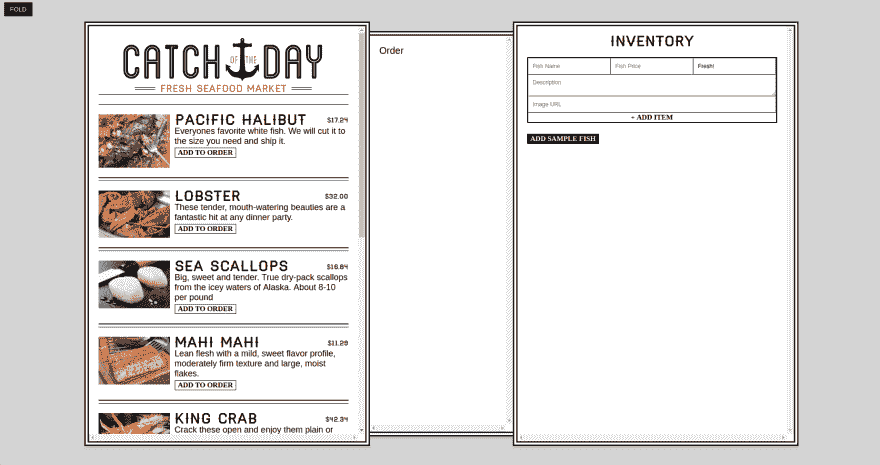
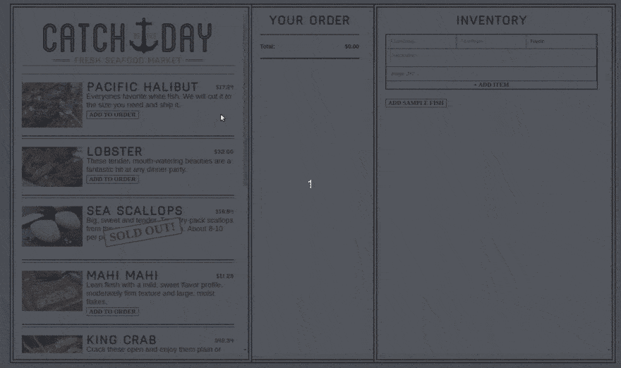
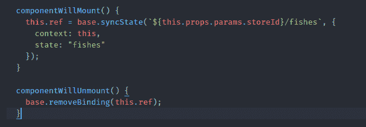
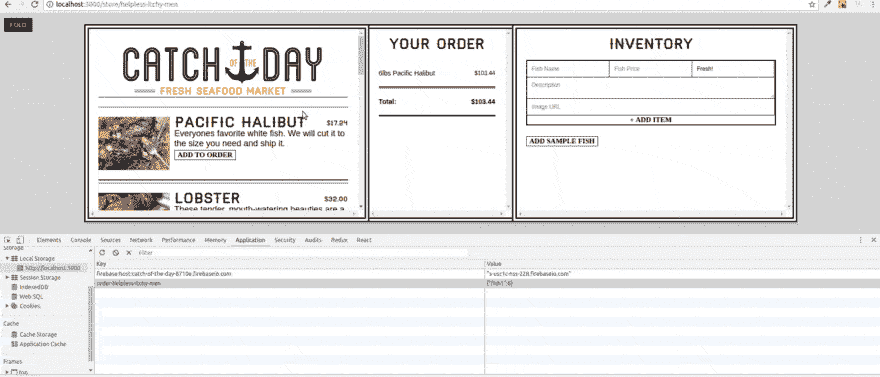
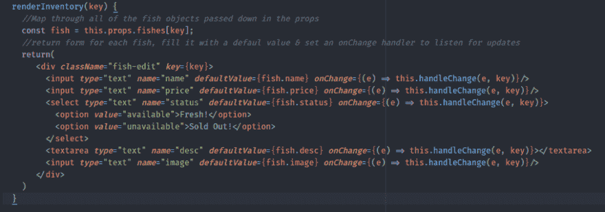
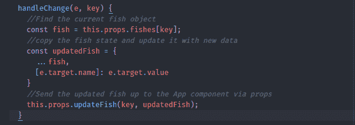
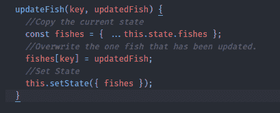
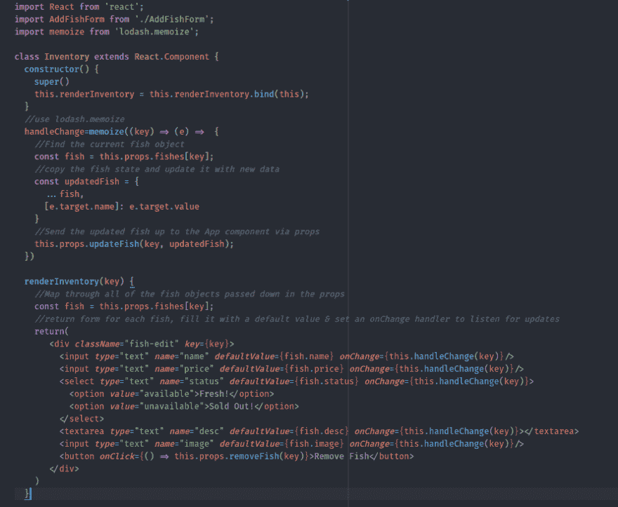
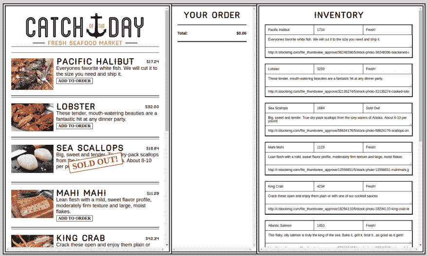
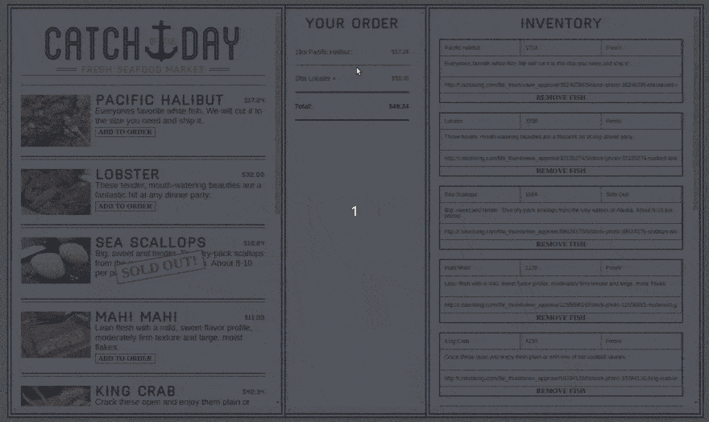

# 学习反应-第 3 周

> 原文：<https://dev.to/stefdotninja/learning-react---week-3>

本文原载于 [stef.ninja](https://stef.ninja/learning-react-week-3/) 。

这是我正在阅读的来自[韦斯·博斯](https://twitter.com/wesbos)的 [React 初学者](https://reactforbeginners.com/)课程系列笔记的第三篇。这是一门**很棒的**课程，我强烈推荐给任何想学习 React 的人。

你可以在该系列的第[周第 1](https://dev.to/learning-react-week-1/) 和第[周第 2](https://dev.to/learning-react-week-2/) 中找到更多笔记。

### 第 15 天:显示来自状态的数据

我们有保存在我们州的样本鱼数据。让我们将这些鱼显示在 UI 中。

JSX 没有内置任何循环或逻辑，所以为了解决这个问题，我们可以使用普通的 javascript(通过封装在{}。为了显示样本鱼的列表，我们将映射到`fish`对象中的整个键列表，如下所示:

```
<ul class="list-of-fishes">
  {
    Object
      .keys(this.state.fishes)
      .map(key => <Fish key={key} />)
  }
</ul> 
```

Enter fullscreen mode Exit fullscreen mode

韦斯在 [ES6 解构](https://developer.mozilla.org/en/docs/Web/JavaScript/Reference/Operators/Destructuring_assignment)时给出了一个很好的提示，这意味着当我们引用发给孩子的道具时，我们不必一直重复`this.props`。

```
const {details} = this.props; 
```

Enter fullscreen mode Exit fullscreen mode

延伸阅读:Wes Bos 有一篇非常简单的介绍如何解构 JavaScript 对象的文章

###### 做:

*   通过`details`道具将每条鱼的详细信息传递给鱼组件。提示:`details={this.state.fishes[key]}`
*   使用 helper 文件中的 formatPrice 函数来格式化价格细节。
*   创建一个组件(Fish.js)来显示每条鱼的数据。在`<li>`中返回这一切。
*   遍历 fish 对象中的样本鱼列表，并显示 fish 组件。

###### 今天的应用程序看起来像:

[T2】](https://res.cloudinary.com/practicaldev/image/fetch/s--TZIlYQeG--/c_limit%2Cf_auto%2Cfl_progressive%2Cq_auto%2Cw_880/https://s3-ap-southeast-2.amazonaws.com/ghost-blog-stef-ninja/2017/07/day15-1500008561302.png)

*【视频 15:显示 JSX 状态】*

### 第 16 天:更新状态

今天我们将`Add To Order`按钮连接起来，这样它实际上将相应的鱼添加到状态中。

这个按钮有一个很棒的功能，它会根据有没有鱼而动态变化。为了做到这一点，我们将使用一个三进制运算符围绕`details.status`实现一些逻辑。

```
const isAvailable = details.status === 'available';
const buttonText = isAvailable ? 'Add To Order' : 'Sold Out!'; 
```

Enter fullscreen mode Exit fullscreen mode

###### 做:

*   根据`details.status`将`Add To Order`按钮的内容改为动态。
*   如果鱼不可用，将按钮更改为禁用。
*   在 app 组件上添加`addToOrder`方法。//复制状态//更新订购的鱼的新数量，例如`order[key] = order[key] + 1 || 1;`//更新状态。
*   将方法绑定到应用程序组件。
*   通过道具将`addToOrder`传给我们的孩子。
*   向更新订单状态的按钮添加一个`onClick`处理程序。注意:要做到这一点，我们需要一个键的引用。将此作为鱼组件上的道具传递下去。

***快速笔记:我把这些笔记发给我最好的开发朋友[马克](https://twitter.com/markacola)通读，然后发表&他总是给我很棒的笔记，关于我不能 100%理解的事情。下面是他对我们用来更新点的鱼的数量的函数的注释:***

> 如果`order`中没有设置`key`，那么`order[key]`将返回`undefined`，这意味着`order[key] + 1` = > `undefined + 1` = > `NaN`，因为`NaN`为 falsey，所以返回`NaN || 1`表达式中的`1`。理解数据经过的转换顺序很小但很重要，这样您就不会在以后出错。

###### 今天的应用程序看起来像:

[T2】](https://res.cloudinary.com/practicaldev/image/fetch/s--TZIlYQeG--/c_limit%2Cf_auto%2Cfl_progressive%2Cq_auto%2Cw_880/https://s3-ap-southeast-2.amazonaws.com/ghost-blog-stef-ninja/2017/07/day15-1500008561302.png)

它看起来和昨天一模一样，因为我们没有做任何 UI 更改。

*【视频 16:更新订单状态】*

### 第 17 天:通过 JSX 显示状态

在今天的课程中，我们将采用我们一直在使用的`order`状态，并通过 JSX 将其注入到 UI 中。

这是我们第一次在 render 方法中调用另一个方法来处理我们的 JSX 输出。Wes 提到这可以使用另一个组件来完成，但是他选择了 Order.js 组件中的一个额外的方法来简化它(一旦我们绑定了它，就不需要传递道具了)。

###### 做:

今天的目标:通过`Order.js`显示鱼的订单。这个组成部分需要包括磅数，鱼的名字，每个行项目的总成本，以及总成本。我们将通过以下方式做到这一点:

*   通过 props 将`fishes` & `order`状态传递给订单组件。
*   创建订单中包含的所有鱼的运行总价。
*   从 helpers 文件导入并使用`formatPrice()`函数。
*   在订单组件中创建一个`renderOrder()`函数来处理订单中每条鱼返回的 JSX。这可以从`render()`函数中调用，就像这样:`{orderIds.map(this.renderOrder)}`
*   通过构造函数将我们的自定义方法绑定到这个。
*   记住将键添加到所有列表项中，以确保 React 可以引用它们。

###### 今天的应用程序看起来像:

[T2】](https://res.cloudinary.com/practicaldev/image/fetch/s--EiD88Gsq--/c_limit%2Cf_auto%2Cfl_progressive%2Cq_66%2Cw_880/https://s3-ap-southeast-2.amazonaws.com/ghost-blog-stef-ninja/2017/07/day_17_catch_of_the_day-1500604761179.gif)

*【视频 17:用 JSX 显示订单状态】*

### 第 18 天:

发布数据需要后端服务。在这一课中，我们使用谷歌的  作为我们的后端服务。

它使用了 Wes 非常感兴趣的 HTML5 Websockets，但是我不得不做一些研究。这个视频用一个例子很好地解释了这个问题:[web sockets 和 Firebase 简介——如何构建实时应用](https://www.youtube.com/watch?v=ZSRNNqh5Xo8)

因此，有了 Firebase，我们就有了一个实时后端数据库。Firebase 实时数据库的一个很大的特点是它基本上是一个巨型对象。这与作为对象的反应状态完美地同步。

在本课中，我们还探讨了 [React 生命周期挂钩](https://facebook.github.io/react/docs/state-and-lifecycle.html)。这些生命周期方法为我们提供了组件的不同入口点。

我们重点关注在呈现初始组件之前调用的 componentWillMount 方法。这是将数据库对象与我们的状态对象同步的好时机。它还有一个耦合的 componentWillUnmount 方法，允许我们断开连接。

[T2】](https://res.cloudinary.com/practicaldev/image/fetch/s--xp8md3VT--/c_limit%2Cf_auto%2Cfl_progressive%2Cq_auto%2Cw_880/https://s3-ap-southeast-2.amazonaws.com/ghost-blog-stef-ninja/2017/07/day_18_componentWillMount-1500611498129.png)

##### 做:

*   注册一个 Firebase 帐户。
*   在 Firebase 中创建新项目。
*   编辑实时数据库规则以降低安全性(不要担心，我们将在第 24 天的身份验证课程集中解决这个问题)。将实时数据库规则设置为:

```
{
  "rules": {
    ".read": true,
    ".write": true
  }
} 
```

Enter fullscreen mode Exit fullscreen mode

*   使用 [re-base](https://www.npmjs.com/package/re-base) 包在 React 应用程序中实现 Firebase，并在`base.js`中输入以下内容:

```
import Rebase from 're-base';

//Get some information from your Firebase project
const base = Rebase.createClass({
    apiKey: YOUR API KEY,
    authDomain: YOUR AUTH DOMAIN,
    databaseURL: YOUR DATABASE URL,
  });

export default base; 
```

Enter fullscreen mode Exit fullscreen mode

*   将`base`导入应用程序
*   挂钩到`componentWillMount()`生命周期方法，将应用程序状态与 Firebase 实时数据库同步。

###### 今天的应用程序看起来像:

[T2】](https://res.cloudinary.com/practicaldev/image/fetch/s--ncTCtJ-D--/c_limit%2Cf_auto%2Cfl_progressive%2Cq_66%2Cw_880/https://s3-ap-southeast-2.amazonaws.com/ghost-blog-stef-ninja/2017/07/day18_firebase-1500611512648.gif)

*【视频 18:用 Firebase 坚持我们的状态】*

### 第 19 天:本地存储持久化状态

在今天的课程中，我们探索了如何通过 [HTML5 本地存储](https://www.w3schools.com/html/html5_webstorage.asp)来保持订单的状态。

本地存储允许我们在浏览器中存储与订单相关的数据。存储订单是一个很好的选择，因为它是安全的、本地的，并且不会影响网站性能。

本地存储使用键值对。该值只接受数字、字符串或布尔值。这意味着我们需要将订单对象转换成一个字符串。我们可以通过`JSON.stringify()`方法做到这一点(你可以随时用`JSON.parse()`把它调回来)。

在本课中，我们还使用了 [React 生命周期方法](https://facebook.github.io/react/docs/react-component.html)。特别是当接收到新的道具或状态时，在渲染之前立即调用的`componentWillUpdate`方法。对于非常适合这个数据对象(顺序)的初始渲染，也不会调用这个方法。

`<App>`上的生命周期方法目前看起来像:
[](https://res.cloudinary.com/practicaldev/image/fetch/s--fltu4cDO--/c_limit%2Cf_auto%2Cfl_progressive%2Cq_auto%2Cw_880/https://s3-ap-southeast-2.amazonaws.com/ghost-blog-stef-ninja/2017/07/day19_lifecycle-1500620253486.png)

##### 做:

*   将所有参数传递给`<Order>`组件。
*   挂钩到`componentWillUpdate`方法，并将 localStorage 设置为我们的`order`状态。
*   挂钩到`componentWillMount`方法(已经被调用),检查 localStorage 中是否有订单。
*   如果本地存储中保存有订单，则更新订单状态。

###### 今天的应用程序看起来像:

[T2】](https://res.cloudinary.com/practicaldev/image/fetch/s--huK2dBCQ--/c_limit%2Cf_auto%2Cfl_progressive%2Cq_66%2Cw_880/https://s3-ap-southeast-2.amazonaws.com/ghost-blog-stef-ninja/2017/07/day_19_localstorage-1500620458400.gif)

*【视频 19:用本地存储保存订单状态】*

### 第 20 天:双向状态实时状态编辑

今天是相当复杂的一课。我们设法通过应用程序 UI 中的库存管理来设置状态编辑。

首先，我们需要为州内的每个鱼对象创建一个表单。这是通过我们创建的新的`renderInventory()`方法在`Inventory`组件中完成的:

[T2】](https://res.cloudinary.com/practicaldev/image/fetch/s--1fdVwJg---/c_limit%2Cf_auto%2Cfl_progressive%2Cq_auto%2Cw_880/https://s3-ap-southeast-2.amazonaws.com/ghost-blog-stef-ninja/2017/07/day20_renderInventorymethod-1500872408641.png)

一旦表单被创建，我们需要一个新的方法来处理更新。这是通过我们创建的`handleChange`方法完成的:

[T2】](https://res.cloudinary.com/practicaldev/image/fetch/s--9Ma0ARHL--/c_limit%2Cf_auto%2Cfl_progressive%2Cq_auto%2Cw_880/https://s3-ap-southeast-2.amazonaws.com/ghost-blog-stef-ninja/2017/07/day20_handlechange-1500872560726.png)

我们添加的最后一个方法是在 App 组件上，它让奇迹发生了。状态只能通过应用程序组件更新，所以这就是为什么一切都必须传递到那里。

这种复制当前状态，覆盖已经更改的部分，然后更新状态的模式正在成为编写 React 代码时的一种方式。

[T2】](https://res.cloudinary.com/practicaldev/image/fetch/s--itNfFipi--/c_limit%2Cf_auto%2Cfl_progressive%2Cq_auto%2Cw_880/https://s3-ap-southeast-2.amazonaws.com/ghost-blog-stef-ninja/2017/07/day20_updatefish-1500872669590.png)

* * *

###### 注自记号:

内联传递这些函数是使用[记忆](https://en.wikipedia.org/wiki/Memoization)的好机会。目前，通过这些输入中的任何一个进行的每一个改变，所有的孩子都被重新呈现。在这个级别上，这并不是一个巨大的性能损失，因为它们只是输入(不是大的组件)，但是尽早养成记忆的习惯是有好处的。

我们使用了 [lodash.memoize](https://lodash.com/docs/#memoize) 。这是我们改进的功能:

[T2】](https://res.cloudinary.com/practicaldev/image/fetch/s--_ybYh3fX--/c_limit%2Cf_auto%2Cfl_progressive%2Cq_auto%2Cw_880/https://s3-ap-southeast-2.amazonaws.com/ghost-blog-stef-ninja/2017/07/day20_lodashmemoize_improvement-1500879417158.png)

关于这个的进一步阅读:
[Lodash memoize](https://lodash.com/docs/#memoize)
[The Big O 批注](https://rob-bell.net/2009/06/a-beginners-guide-to-big-o-notation/)

##### 做:

*   循环遍历州内的所有鱼，并输出一个库存管理表单(很像新的鱼表单)
*   通过道具将`fishes`向下传递到`<Inventory />`。
*   创建将处理所有表单呈现的`renderInventory()`方法。
*   将鱼的当前值(来自状态)添加到每个部分。
*   数据绑定了值，所以每次进行编辑时，这都会反映在状态中(以及 Firebase 数据库中)(记住使用`defaultValue`而不是`value`，这样字段是可变的)。使用`onChange{(e) => this.handleChange(e, key)}`。
*   创建一个自定义的`handleChange()`方法，并使用构造函数绑定它。在该方法中，获取鱼状态副本。然后使用计算出的目标仅更新已更改的元素:

```
handleChange(e, key) {
  const fish = this.props.fishes[key];
  //Copy the fish and update it with new data
  const updatedFish = {
    ...fish,
    [e.target.name]: e.target.value
  }
  this.props.updateFish(key, updateFish);
} 
```

Enter fullscreen mode Exit fullscreen mode

*   将更新后的 fish 传递给`<App />`组件。
*   创建一个自定义方法，将鱼的状态设置为更新后的鱼(使用`updateFish()`)。
*   使`updateFish()`对`<Inventory />`可用

###### 今天的应用程序看起来像:

[T2】](https://res.cloudinary.com/practicaldev/image/fetch/s--ALrNDGgO--/c_limit%2Cf_auto%2Cfl_progressive%2Cq_auto%2Cw_880/https://s3-ap-southeast-2.amazonaws.com/ghost-blog-stef-ninja/2017/07/day20-1500872206503.png)

*【视频 20:双向数据流和实时状态编辑】*

### 第 21 天:从状态中删除项目

[CRUD](https://en.wikipedia.org/wiki/Create,_read,_update_and_delete) (或创建、读取、更新、删除)是持久化存储所需的基本功能。我们已经创建了保存在状态中的对象，读取状态和更新状态。在今天的课程中，我们重点关注从状态中删除对象。

为了做到这一点，我们运行一个类似的模式，我昨天强调:

```
removeFish(key) {
  //Copy the current state
  const fishes = { ... this.state.fishes };
  //Delete the specific fish
  //Note: 'null' needs to be used because of Firebase
  fishes[key] = null;
  //Set the State
  this.setState({ fishes });
} 
```

Enter fullscreen mode Exit fullscreen mode

就是这样。该鱼现已删除。从存在中消失。

##### 做:

*   创建一个从状态中删除特定鱼的`removeFish`方法。
*   在`renderInventory` JSX 中创建一个`Delete Fish`按钮
*   将`onClick`处理程序链接到`removeFish`方法。

###### 今天的应用程序看起来像:

[T2】](https://res.cloudinary.com/practicaldev/image/fetch/s--yVJHIL4M--/c_limit%2Cf_auto%2Cfl_progressive%2Cq_66%2Cw_880/https://s3-ap-southeast-2.amazonaws.com/ghost-blog-stef-ninja/2017/07/day21_remove-1500875398012.gif)

*【视频 21:从状态中移除项目】*

* * *

更多阅读本系列:[第一周](https://stef.ninja/learning-react-week-1/)、[第二周](https://stef.ninja/learning-react-week-2/)、[第四周](https://stef.ninja/learning-react-week-4/)、**或**为自己获取 [React for 初学者课程](https://reactforbeginners.com/)。