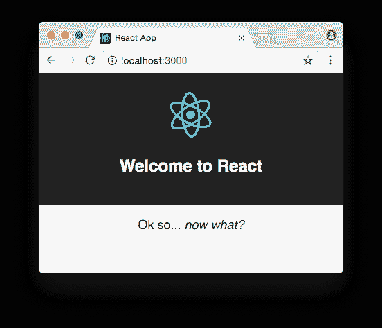

# 作为一名有经验的开发人员学习反应

> 原文：<https://dev.to/dceddia/learning-react-as-an-experienced-developer-b2c>

你以前来过这个地方吗？

你有一个新项目要处理——可能是一个新的 UI，或者一个全新的应用——所以你决定使用一项新技术(反应！)并在构建项目时选择它。边建设边学习！超高效的时间利用。还有比这更好的吗？

这应该不会太糟糕。毕竟，你不是新来发展的人。你知道你可以用你在*目前的*技术栈很容易地建立这个项目。rails/PHP/jQuery/Angular/随便什么都很棒，但是学习新的东西很有趣。

你已经可以看到这个项目是如何组合在一起的。UI 的各个部分在你的脑海中组合在一起:按钮、标题、登录页面，一切都如此简单。

但是现实来了…

你正盯着“欢迎使用 React”，刚刚用 Create React App 启动了一个项目(或者是 React Create App……随便什么)

[T2】](https://res.cloudinary.com/practicaldev/image/fetch/s--yt3l__WX--/c_limit%2Cf_auto%2Cfl_progressive%2Cq_auto%2Cw_880/https://daveceddia.cimg/welcome-to-react-now-what.png)

还有…你迷路了。你从这里去哪里？

## 补习时间

在这一点上，很容易开始做*教程驱动的开发*。事情是这样的:

1.  选择任务(创建登录页面、显示产品列表等)
2.  谷歌一下你想做的教程。
3.  读一点。免费复制粘贴来自上述教程的代码。
4.  万岁！【任务】完成！回到步骤 1。

在这种模式下，你无法以最快的速度学习，也无法像你已经知道如何编写 React 应用程序时那样高效地工作。这是两个世界中最糟糕的。

## 学习模式 vs 做事模式

### 1。学问

从长远来看，更有效的方法是在 React 的初始阶段完全专注于**学习**。在这种模式下，你阅读文档，跟随教程，并建立小的[实践项目](https://daveceddia.com/react-practice-projects)。

你仍然在构建东西，但它们就像是小的练习和实验，而不是你可能已经倾向于开始的完整的应用程序。

在学习模式下，一次专注于*一项技术*。先学 React，再学 Redux(然后两者结合)等等。尝试一下子学习整个“栈”(React+React Router+Redux+AJAX+web pack+…)比孤立地学习每个部分效率更低。

我知道，当你可以拼凑一个完整的应用程序时，做练习可能不会更有效率。跳过这个很诱人。但是你将获得的清晰和理解的程度是值得花时间的。最终构建完整的应用程序将会比其他方式要快得多。

#### 满栈？

如果你计划同时学习一个新的后端栈，我建议把它分成一个独立的“学习”阶段。

例如，如果您来自 Ruby on Rails，并且想要学习 Node 和 React，这里有一个学习计划示例:

1.  学习 React 的[基础知识(自行)](https://daveceddia.com/pure-react)
2.  学习 Node 的基础知识，然后构建一个小的 API 服务器(例如用 Express 构建
3.  通过学习使用 AJAX 获取数据来连接前端和后端
4.  [将整个应用程序部署到 Heroku 上的生产平台](https://daveceddia.com/create-react-app-express-production/)

### 2。做

掌握新东西的基础知识了吗？厉害！现在，努力构建一个更大的应用程序，并应用这些技能。甚至可能是你一开始想开发的应用程序。

即使在花时间专注于学习之后，你肯定会再次陷入“迷失”的感觉。盯着一个大问题，不确定如何迈出第一步。

最好的方法是把问题分成易于处理的部分。你已经*知道*该怎么做的哪个(些)部分？先处理那些部分。

## 这不是真正的线性

> 好的，谢谢戴夫，我要去做所有的学习，然后建立所有的东西！

等一下。事情不是这样的。

我不建议在做一个项目之前把所有的学习都分批进行，就像我不建议边学习边拼凑一个项目一样。主要是因为你去的时候会忘记一些东西。

新学到的信息是脆弱的。有点分心(推特！Reddit！)或者更多一点的新信息(构建了一个组件，是时候添加 Redux 了！)都可以抹去。或者至少让它变得非常模糊。

理想情况下，当你学习一项新技能(例如，如何制作一个 React 组件)时，你将单独练习该技能几次，以确保它能坚持下来。然后，在你掌握了相当多的技能之后(例如，如何制作一个有状态的 React 应用程序)，你将一起练习这些技能，比如通过[复制一些现有的应用程序](https://daveceddia.com/learn-react-with-copywork)。

之后，又回到学习模式。如果 React 已经在你的脑海中牢牢扎根，那么就去阅读 Redux，并尝试将它融入到你的实践项目中。

这个循环继续下去——学习，做，学习，做——直到你知道+保留足够的知识来构建你想要构建的项目。即使*仍然*，你也可能需要不时地查阅文档和教程。

永不停止学习:)

[作为一个有经验的开发者学习 React](https://daveceddia.com/learn-react-as-experienced-developer/)最初由戴夫·塞德迪亚于 2017 年 10 月 17 日在[戴夫·塞德迪亚](https://daveceddia.com)发表。