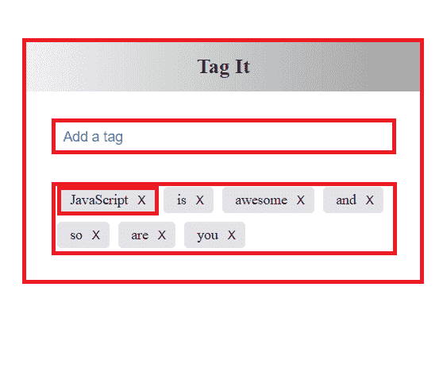

# 让我们创建一个简单的 React 应用程序

> 原文：<https://dev.to/sarah_chima/lets-create-a-simple-react-app-94e>

我们将创建的应用程序是一个超级简单的应用程序。与其说它是一个应用程序，不如说它是一个组件，因为它是基本的。这是一个可以用来添加标签的应用程序。如果您曾经写过关于 Medium 的文章，您可能对这个特性很熟悉。它非常类似于一个待办事项应用程序，有几乎相同的要求。在你认为这篇文章无关紧要之前，这里有一些你在构建这个应用时将会学到的东西。

1.  了解构建 React 应用程序的步骤。
2.  了解组件如何相互交互以及如何相互传递数据。

这些基础知识可以帮助您在 React 中构建更复杂的应用程序。
在这里，我假设你对 JSX、React 组件、属性和状态有基本的了解。如果你不知道，你可以通过上面的链接来阅读。如果你知道，我们还在等什么？让我们马上开始吧。

创建任何 React 应用程序的第一步是将 UI 分成组件。理想情况下，一个组件应该做一件事。所以，如果你意识到一个组件不止做一件事，那么是时候把它分解成更小的组件了。我们的应用程序的用户界面已经被分解成小组件，如图所示。

[T2】](https://res.cloudinary.com/practicaldev/image/fetch/s--qdClIabh--/c_limit%2Cf_auto%2Cfl_progressive%2Cq_auto%2Cw_880/http://res.cloudinary.com/dvj2hbywq/image/upload/v1508764606/Screenshot_173_obizyi.png)

因此，你可以看到我们的应用程序由四个组件组成。这些是；

1.  容纳所有其他组件的外部容器，我们将其命名为`TagApp`
2.  将被命名为`TagInput`的输入组件
3.  我们将命名为`Tag`的标签组件
4.  包含将被命名为`TagList`的所有标签的组件

下一步是创建应用程序的静态版本。这将使用 JSX 和 CSS 来完成。这个版本不包含任何交互性。没有状态，只有基本的用户界面，如图所示。除了 render 方法之外，这个版本不包含任何其他方法。这是它的代码。

```
```javascript
import React from "react";
import ReactDOM from "react-dom";

class TagInput extends React.Component {
  render () {
    return (
      <form>
        <input  placeholder = "Add a tag"/>
      </form>
    );
  }
}

class Tag extends React.Component {
  render () {
    return (
      const name = this.props.name;
      <li>{name}
        <button>X</button>
      </li>
    )
  }
}

class TagList extends React.Component {
  render() {
     return (
        <ul>

        </ul>
     );
  }
}

class TagApp extends React.Component {

  render() {
    return (
      <div className = "tagComponent">
        <h2>Tag It</h2>
        <div className = "tagBox">
          <TagInput  />
          <TagList />
        </div>
      </div>
      )
   }
}

ReactDOM.render(<TagApp />, document.getElementById("app")); 
```

Enter fullscreen mode Exit fullscreen mode

```
 The code above will create the simple user interface with no interactivity at all. 

The next step is to identify the kind of interactions that will take place between these components. The relationships between these components will determine the way the interactions will take place. So let's state what each component will do.

1\. The `Tag` component receives its name via `props` from the parent component which is the `TagList` component. The `Tag` component should be able to delete itself thereby updating the state of `TagList`. The relationship between `Tag` and `TagList` is that of a child and parent where `Tag` is the child and `TagList` is the parent.

2\. The `TagInput` should be able to update the `TagList` component whenever a new input is submitted. Since they both have the same parent, i.e. they are both subcomponents of a component, the `TagApp` component, they are siblings. The way they interact is different from that of a parent and child.

So how can a child component update/change a parent component? The answer is through the use of `state` and `props`.Remember though, that a state is internal to a component and can only be changed by the component itself. So how does can a child update its parent's state? I'll use an analogy to explain this.

Imagine that a parent makes a room inaccessible to the children because he keeps important items in that room. The children know what kind of items are kept in the room but are not allowed to go in there to keep or take anything. Since the parent knows that the child might need to take or keep items in that room sometimes, he provides a box in the children's room where the children can keep stuff they want to be kept in the room or write a note requesting for a particular item they need from the room. This box will be used to take these items to the room or from the room. 

This is similar to what happens to the `child` and `parent` component. The `child` has no direct access to the state(room in our analogy) of the `parent`. But since there is a need for the child to change the state of the `parent`, the parent has to provide a method (the box in our analogy) that is accessible to the `child`. This method is passed to child as a property and the child can access it by using that property. 

Now that we have explained the way parent and child interact, let's understand how siblings interact. Another illustration will be appropriate. 

Let's say a parent makes a rule, a quite abnormal rule in the house. The rule is that no child should  give his/her sibling any book without his consent. So if a child wants to give her sibling a book, she has to first give it to her parent, who then gives this book to her sibling. Very abnormal rule indeed but it will help us to understand how components that are siblings pass data to themselves.

Siblings cannot directly pass data to themselves. If a `child` component wants to update the state of a `sibling` component, it will first have to send this change to its parent and the parent will then pass this update via props to the sibling that is to be updated. Having this relationships in mind, let's continue with our app. 

The `Tag` uses `this.props.name` for its innertext and changes the state of the its parent (`TagList`) when the delete button is clicked. Let's add these features to the `Tag`.

```javascript
    class Tag extends React.Component {
      constructor(props) {
        super(props);
        this.handleClick = this.handleClick.bind(this);
      }

      //uses this.props.onClick to update the state of its parent when clicked.
      handleClick () {
        const tagName = this.props.name;
        this.props.onClick(tagName);
      }

      render () {
        return (
          <li>{this.props.name}
            <button onClick = {this.handleClick}>X</button>
          </li>
        )
      }
    } 
```

Enter fullscreen mode Exit fullscreen mode

点击按钮是如何工作的？当点击按钮时，`handleClick`简单地获取标签的`name`并将值传递给`onCl ick`属性，该属性是在其父组件`TagList`组件中定义的方法。

在`TagList`组件中，我们创建了一个方法，由`Tag`组件用来删除一个被删除的标签。这个方法然后通过`onClick`属性传递给每个`Tag`组件。

```
 class TagList extends React.Component {
      constructor(props) {
        super(props);
        this.state = {list : this.props.value};
        this.handleClick = this.handleClick.bind(this);
      }

      //This is the method that is used by the Tag component
      handleClick(tag) {
        let list = this.state.list;
        for (let i = 0; i < list.length; i++) {
          if (list[i] == tag) {
            list.splice(i, 1);
          }
        }
         const newList = list; 
         this.setState({list : newList});
      }

      render() {
         const displayList = this.state.list;
         let tagList = displayList.map((tags, i) => 
            <Tag key={'item' + i} name = {tags} onClick = {this.handleClick} />
         );
         return (
            <ul>
                {tagList}
            </ul>
         );
      }
    } 
```

Enter fullscreen mode Exit fullscreen mode

`TagList`也依赖于它的父组件，也就是`TagApp`组件的状态。`list`的状态被初始化为`this.props.value`。`this.props.value`是一个`props`，它将由`TagApp`在这个`TagList`上传递。在我们进一步讨论这个问题之前，让我们先讨论一下`TagInput`的互动。

```
 class TagInput extends React.Component {
      constructor(props) {
        super(props);
        this.state = {value : ""};
        this.handleInput = this.handleInput.bind(this);
        this.handleChange = this.handleChange.bind(this);
      }

      handleChange(event) {
        this.setState({value: event.target.value});
      }

      handleSubmit() {
        event.preventDefault();
        const input = this.state.value;
        if (input == "") {
           return;
        }
        this.setState({value : ""});
        this.props.onChange(input);
      }

      render () {
        return (
          <form onSubmit = {this.handleSubmit}  >
            <input value = {this.state.value} onChange = {this.handleChange} placeholder = "Add a tag"/>
          </form>
        );
      }
    } 
```

Enter fullscreen mode Exit fullscreen mode

首先，`TagInput`设置初始化值的状态。当输入字段中的值改变时，这将由`handleChange`方法更新。当提交表单时，`handleSubmit()`方法获取`this.state.value`的值，检查它是否是一个有效的输入，然后将这个输入传递给方法`this.props.onChange`，这个方法是由父组件`TagApp`传递给它的，它将用于更新`TagApp`的状态。

我们将处理的最后一个组件是`TagApp`组件，它包含子组件`TagList`和`TagInput`并与之交互。就是这个`TagApp``TagInput`用来更新`TagList`。

```
 class TagApp extends React.Component {
       constructor (props) {
          super(props);
          this.state = {display : [], error : ""};
          this.handleChange = this.handleChange.bind(this);
       }

       //checks if newInput is already on the list, if not, adds newInput to list.
       handleChange(newInput) {
          const isTag =(array, tag) => {
              for (let a = 0; a < array.length; a++) {
                  if (array[a] == tag) {
                  return true;
                  }
              }
            }
          const tagsArray = this.state.display;
            if (!isTag(tagsArray, newInput)) { 
              tagsArray.push(newInput);
              this.setState({display : tagsArray, error : ""});
            }
            else {
              this.setState({error :"You've already added that tag"})
            }
           }

          render() {
              return (
                  <div className = "tagComponent">
                     <h2>Tag It</h2>
                     <div className = "tagBox">
                        <TagInput onChange = {this.handleChange} />
                        <p>{this.state.error}</p>
                        <TagList value = {this.state.display}/>
                    </div>
                  </div>
              )
            }
        } 
```

Enter fullscreen mode Exit fullscreen mode

`TagApp`设置`display`的初始化状态。这个状态被传递给`TagList`的 value 属性，并决定了`TagList`将显示什么。这个`handleChange`方法被传递给`TagInput`组件，并被该组件用来更新`TagApp`的`this.state.display`。

这里有一个[代码笔](https://codepen.io/sayrah901/full/eGXvzz/)，你可以在这里看到结果。

这就是我们如何创建一个简单的应用程序，可用于添加标签。如果你读到这里，你就是冠军。

有任何问题或补充，请留下评论。

感谢您的阅读:)