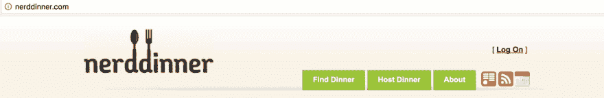
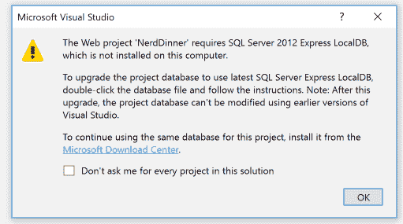
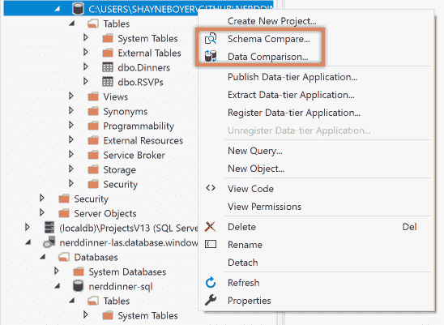
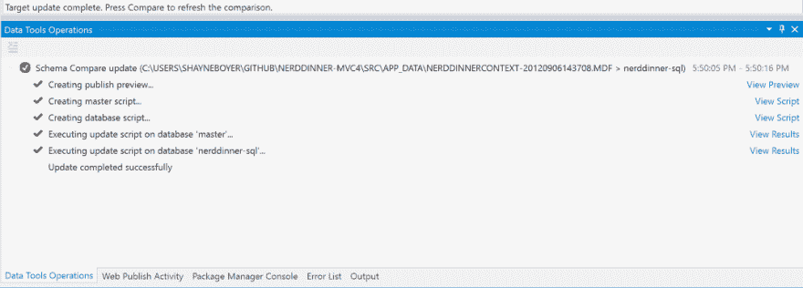
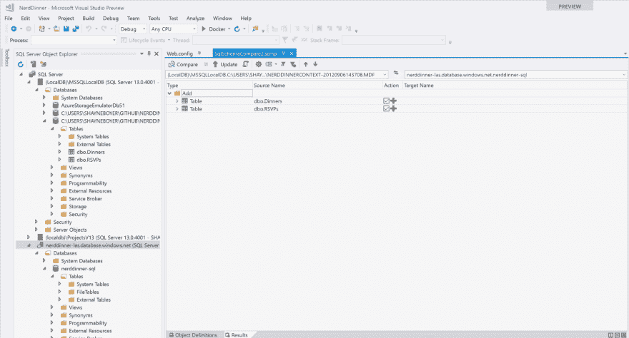
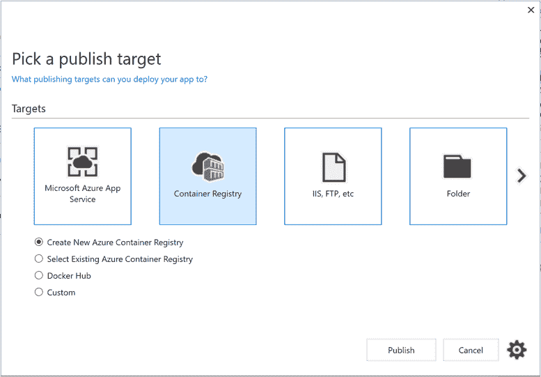
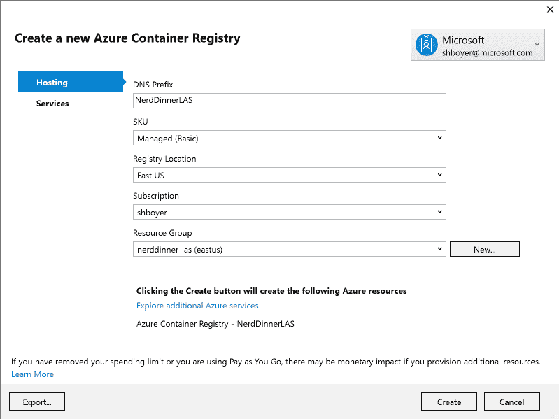

# 升降机和转移-增加码头工人到书呆子晚餐

> 原文：<https://dev.to/azure/lift-and-shift---adding-docker-to-nerd-dinner-6p3>

[T2】](https://res.cloudinary.com/practicaldev/image/fetch/s--sIh05qkE--/c_limit%2Cf_auto%2Cfl_progressive%2Cq_auto%2Cw_880/http://tattoocoder.com/conteimg/2017/11/nerddinner.png)

传统应用的现代化已经成为今年年底的主题，也称为“提升和转变”。这意味着把用鲜血、汗水和泪水构建的整体应用程序转移到云中。

书呆子晚餐([https://nerddinner.codeplex.com/](https://nerddinner.codeplex.com/))是一个写于 2010 年的 MVC 应用程序，最后一次编辑是 2013 年 9 月 6 日到**MVC C4**分支。

我抓取了 mvc 分支，并将其复制到[https://github.com/spboyer/nerddinner-mvc4](https://github.com/spboyer/nerddinner-mvc4)并在 Visual Studio 2017 中启动。

计划是:

*   将 LocalDB 迁移到 Azure 中的 SQL Server
*   使用 Visual Studio 2017 中的 Docker 工具，添加 Docker 文件
*   将 Docker 图像发布到 Azure 容器注册表(ACR)
*   将新的 Docker 映像从 ACR 推送到 Azure 容器实例(ACI)

最重要的是，在真实的场景中，我们希望不做任何实际的代码更改来适应提升和移位场景。

但是怎么做呢？

## 决策

当您决定更新您的 web 应用程序并将它们迁移到云中时，您不必完全重新设计您的应用程序。建立一个模拟您的内部架构的环境，并让您的应用程序“到达”那里，但仅此而已。这就像把你的车停在别人的车库里，他们负责维护电源等。

由于成本和时间的限制，通过使用像微服务这样的高级方法来重新设计应用程序并不总是一种选择。拆开应用程序并重新编写有时可能需要数年的工作以及人员和业务决策的迭代，这可能不是建议的第一步。

根据应用程序的类型，可能没有必要重新设计您的应用程序。但是添加 Dockerfile，或者将数据库迁移到像 Azure 的 SQL 数据库这样的服务产品上，除了连接字符串之外，不需要修改任何代码。

让我们看看如何实现这一点。

### 迁移数据库

我遇到的第一个问题是最初的 LocalDB 是在 2012 年，必须从下载中心找到并安装它；幸运的是，提示有正确的链接。

[T2】](https://res.cloudinary.com/practicaldev/image/fetch/s--DMpjaJE2--/c_limit%2Cf_auto%2Cfl_progressive%2Cq_auto%2Cw_880/http://tattoocoder.com/conteimg/2017/11/localdb2012.png)

接下来，我在门户中的[getting started docs](https://docs.microsoft.com/azure/sql-database/sql-database-get-started-portal)之后创建了一个新的 SQL Azure 实例。

既然已经建立了，请在 Visual Studio 中打开 SQL Server 对象资源管理器，并为 SQL Azure 数据库添加连接。

要将模式和数据从 LocalDB 移动到新的 SQL Azure 实例，请右键单击 LocalDB 实例，首先选择模式比较工具，并完成简单的向导。重复进行数据比较。

[T2】](https://res.cloudinary.com/practicaldev/image/fetch/s--DcFYe8kn--/c_limit%2Cf_auto%2Cfl_progressive%2Cq_auto%2Cw_880/http://tattoocoder.com/conteimg/2017/11/data-compare.png)

[T2】](https://res.cloudinary.com/practicaldev/image/fetch/s--6vKSapYr--/c_limit%2Cf_auto%2Cfl_progressive%2Cq_auto%2Cw_880/http://tattoocoder.com/conteimg/2017/11/schema-compare2.png)

[T2】](https://res.cloudinary.com/practicaldev/image/fetch/s--kZRKoJ5n--/c_limit%2Cf_auto%2Cfl_progressive%2Cq_auto%2Cw_880/http://tattoocoder.com/conteimg/2017/11/schema-compare3.png)

#### 连接字符串

为了实现“零代码更改咒语”，使用 web.config 转换是目前实现这一目标的最佳方式。

注意——我们应该使用刚刚发布的 4.7.1 [配置构建器](https://blogs.msdn.microsoft.com/dotnet/2017/10/17/announcing-the-net-framework-4-7-1/)，但是需要一个 NuGet 包和一些额外的改动。但是，允许与相同的功能。NET 核心，因为我们可以从环境变量加载配置并使用 Docker 秘密。

在这里，我们将添加一个新的 web.release.config，其中包含一个新条目

```
<connectionStrings>  
      <add name="DefaultConnection" 
        connectionString="Data Source=my.sql.azure.database;Initial Catalog=nerddinner-auth-sql;Persist Security Info=True;User ID=MyUsername;Password=MyPassword;" providerName="System.Data.SqlClient" 
        xdt:Transform="SetAttributes" xdt:Locator="Match(name)"/>
</connectionStrings> 
```

Enter fullscreen mode Exit fullscreen mode

这使我们能够对生产、开发等进行配置。并且不签入秘密连接字符串信息。

### 添加 Docker

Visual Studio 对 Docker 有很大的支持。我们所要做的就是右击项目，选择 **Add- > Docker Support** 。

VS 然后将 Docker 文件、组合文件和一个特定的 Docker 项目添加到解决方案中。它还检查项目以确定用于您的项目的正确基础图像。

在书呆子聚餐的情况下，它选择了使用`microsoft/aspnet:4.7`。这是完整的文件。

```
FROM microsoft/aspnet:4.7  
ARG source  
WORKDIR /inetpub/wwwroot  
COPY ${source:-obj/Docker/publish} . 
```

Enter fullscreen mode Exit fullscreen mode

在这种情况下，我选择将基础图像更改为`microsoft/aspnet:4.7.1-windowsservercore-1709`。它刚刚发布，只有整体大小的一半。鉴于我们需要在上使用 Windows 映像。NET 完整框架，Linux 图像不是一个选项，在这种情况下，大小将关系到发布。

添加 docker 文件后，Visual Studio 下载基本映像，然后构建您的开发映像。

```
REPOSITORY TAG IMAGE ID SIZE  
nerddinner latest dab11d87b9b9 5.94GB  
nerddinner dev a373bd4fc9fd 5.93GB  
microsoft/aspnet 4.7.1-windowsservercore-1709 e480e1342d04 5.93GB 
```

Enter fullscreen mode Exit fullscreen mode

我可以在本地运行应用程序，并使用 VS 在 Docker 容器中进行调试，以测试与 SQL Azure 实例的连接性。一旦我验证了这一点，我们就可以使用我们在 Visual Studio 的早期版本中熟悉的发布向导将图像发布到新的或现有的 Azure 容器注册表。

[T2】](https://res.cloudinary.com/practicaldev/image/fetch/s---kn7vUvn--/c_limit%2Cf_auto%2Cfl_progressive%2Cq_auto%2Cw_880/http://tattoocoder.com/conteimg/2017/11/acr1.png)

[T2】](https://res.cloudinary.com/practicaldev/image/fetch/s--mZl_rHgP--/c_limit%2Cf_auto%2Cfl_progressive%2Cq_auto%2Cw_880/http://tattoocoder.com/conteimg/2017/11/acr2.png)

发布时，会创建生产 Docker 映像并将其推送到 Azure 容器注册中心。一旦建立了 ACR 和 Docker 映像，我们就可以选择在哪里部署应用程序。

*   Azure 容器实例
*   Azure 集装箱服务
*   服务结构

在这种情况下，我们将使用 ACI 上的一个自实例 Windows 容器来启动 Nerd 晚餐。这可以使用 Azure CLI 来完成。

```
az group create --name nerddinnerapp --location westus

az container create --name nerddinnerapp --resource-group nerddinnerapp --os-type windows --image nerddinner.azurecr.io/nerddinner:latest --ip-address public 
```

Enter fullscreen mode Exit fullscreen mode

看着我的容器`az container list -o table`，书呆子晚餐在[http://13.90.214.200/](http://13.90.214.200/)有售。*地图需要一把新的必应钥匙*

## 搭车的好处&换班

该模型是关于进行一些云优化，以从云获得一些显著的好处，而不改变应用程序的核心架构。

既然应用程序在容器中，那么利用添加 CI/CD 管道(在 Visual Studio 中也可用)来构建/发布/部署这些容器就是所谓的“DevOps 就绪”应用程序。

除此之外，添加额外的 Azure 功能，如用于监控的应用洞察、SQL Advisor，以自动调整数据库和/或提出建议，通过减少损失的停机时间或糟糕的性能来降低成本。

请继续关注更多关于“书呆子晚餐”的演变和“电梯和换班”的故事。

参见代码:[https://github.com/spboyer/nerddinner-mvc4/tree/docker](https://github.com/spboyer/nerddinner-mvc4/tree/docker)

[T2】](https://res.cloudinary.com/practicaldev/image/fetch/s--ASB9jVVz--/c_limit%2Cf_auto%2Cfl_progressive%2Cq_auto%2Cw_880/http://feeds.feedburner.com/%257Er/Tattoocoder/%257E4/nGCH7BACvDc)