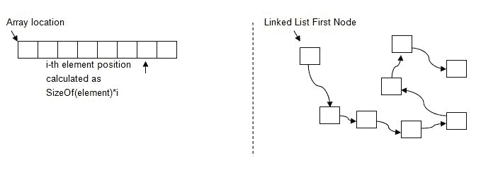

# Python 中的链表

> 原文：<https://dev.to/georgeoffley/linked-lists-in-python>

在开发软件时，我们都在寻找组织数据的最佳方式。今天我想探索一种我们可以更好地组织数据的方法。以我自己的经验来看，当我知道该把哪些碎片拼在一起时，我会使用任何可用的方法来完成这个拼图。这通常会导致代码混乱和任务执行不佳。当你知道所有的技术时，像计算机科学家一样思考就变得容易了，利用链表来组织我们的数据就是其中之一。

让我们首先探索什么是链表。编写代码时，使用数组创建数据列表通常是一个好习惯。然而，根据你发现自己所处的情况，也有其他更好的方法。使用链表来组织数据实际上可以帮助节省内存，更好地利用堆栈。数据数组和链表的最大区别在于，当你创建数组时，你在一行中使用的是固定数量的内存位。而对于链表，每一段数据或节点都包含对序列中下一个节点的引用，从而允许数据分散在可用的内存中执行。

[T2】](https://res.cloudinary.com/practicaldev/image/fetch/s--jTuSzwRZ--/c_limit%2Cf_auto%2Cfl_progressive%2Cq_auto%2Cw_880/http://i.imgur.com/DFRJUPb.jpg)

**红色 VS 黑色衬衫**

区别在于数据的物理和逻辑位置。你可以这样稍微思考一下；有两组，每组八个人，他们都进入一个满是其他人的大餐厅。第一组都穿着红衬衫，由组长带领。他们都在和下一个排队的人牵着手。所以他们都知道他们应该在哪里，因为他们握着前面一个人的手，他们在一个连续的盒子里。另一组穿着全黑衬衫，他们由第一个节点领导。他们背上贴着标记，标明他们的数据块的顺序。

黑衬衫不需要牵手，可以在房间里自由漫步。一个节点所要做的就是抬起头，寻找下一个节点贴在黑衬衫背后的标志。红衫军必须手拉手站在一个相邻的街区，试图穿过挤满人的房间。

**链表的类型**

**奇异链表:**
奇异链表是这样一种链表，其中每个节点只引用链表中的下一个链接。结束节点不引用任何表示列表结束的信号。为了扩展我们的衬衫隐喻，每个穿黑衬衫的人(节点)都有一个符号，指向他们前面的下一个人。

**双向链表:**
双向链表是一种链表，其中每个节点引用一行中的下一个节点和一行中的上一个节点。因此，我们的黑衬衫朋友会有一个标志，指示他们前面的下一个人(节点)，以及应该在他们后面的人。头人(节点)没有任何东西作为先前的引用，而最后一个人(节点)在他们前面没有任何东西要引用。

**Python 中的链表**

链表可能很难记住，但是一旦你弄明白了，你就会发现它是组织数据的一种很好的方式，并且是你在技术或编码面试中会遇到的东西。事实上，了解堆和其他数据结构在编码面试中会有很大帮助。我也发现了一点数学。对我自己来说，知道这些东西是很好的，但是我也需要能够从编码的角度考虑这些技术。我可以看着所有的图片，思考所有我想要的隐喻；然而，直到我可以编码出来，并向某人解释，我发现我仍然有问题。

让我们创建一个名为 *list.py* 的新文件，并键入一个名为 Node 的新类，并为节点创建添加我们的属性。

```
class Node:
    def __init__(self, data=None, next=None):
        self. data = data
        self.next = next
    def __str__(self):
        return str(self.data) 
```

现在每个节点由两部分组成。我们称之为数据的那段数据和我们要做的下一个引用。每个节点都有各自的数据和对列表中下一个节点的引用。我们还放入了一个 str 方法，这样我们就可以实际看到我们的数据。为了在运行时没有问题，我们将方法设置为等于 None，这样我们就可以填充我们的数据。

现在，如果我们继续运行 Python 解释器并输入导入语句，我们就可以导入列表文件了。

```
>>> from list import Node 
```

然后我们可以开始创建我们的节点。

```
>>> node1 = Node(23)
>>> node2 = Node(25)
>>> node3 = Node(45)
>>> node4 = Node(77) 
```

现在我们有一些节点在一个列表中，但不一定链接。如果我们想打印我们的数据，我们只需要调用节点。

```
>>> print(node2)
25 
```

现在我们可以遍历并设置节点的 next 方法来引用列表中的下一个节点。

```
>>> node1.next = node2
>>> node2.next = node3
>>> node3.next = node4 
```

所以现在我们的每个节点都有一个对下一个节点的引用，我们有了一个单链表。我们还可以在这里添加另一种方法来完整地打印出我们的列表。

```
def print_list(node):
    while node:
        print(node),
        node = node.next
    print 
```

然后我们导入 print_list 方法，这样我们就可以打印出我们的列表。

```
>>> from test import print_list
>>> print_list(node1)
23
25
45
77 
```

然后我们从我们的列表中得到一个打印件，这也可以称为一个集合。

要做与上面相同的事情，但是使用双向链表，我们可以很容易地将另一个属性添加到我们之前调用的节点类中。

```
class Node:
    def __init__(self, data=None, before=None, next=None):
        self. data = data
        self.next = next
        self.before = before
    def __str__(self):
        return str(self.data) 
```

创建对前面节点的引用和创建后面的引用一样简单。

```
>>> node2.before = node1
>>> node3.before = node2
>>> node4.before = node3 
```

那就是通过 Python 探索链表。我希望这对理解链表有所帮助。网上和学校里都有关于这方面的教科书。获得更多的堆和不同的数据结构也有助于理解这些东西是如何帮助开发软件的。在 Python 中创建这些列表的一个注意事项是，Python 是一种高级语言，在运行之前要经过几个不同的抽象层。然而，它为这些列表的结构提供了一个很好的例子。

下面是一些有助于理解更多关于链表和其他计算机科学课程的链接。

[http://www . openbook project . net/thinkcs/python/English 2e/ch18 . html](http://www.openbookproject.net/thinkcs/python/english2e/ch18.html)

[http://www . necessarandsufficult . net/2008/05/differences-between-arrays-and-linked-lists/](http://www.necessaryandsufficient.net/2008/05/differences-between-arrays-and-linked-lists/)

[https://medium . com/basecs/whats-a-linked-list-anyway-part-1-d8b7e 6508 b9d](https://medium.com/basecs/whats-a-linked-list-anyway-part-1-d8b7e6508b9d)

[https://medium . com/basecs/whats-a-linked-list-anyway-part-2-131d 96 f 71996](https://medium.com/basecs/whats-a-linked-list-anyway-part-2-131d96f71996)