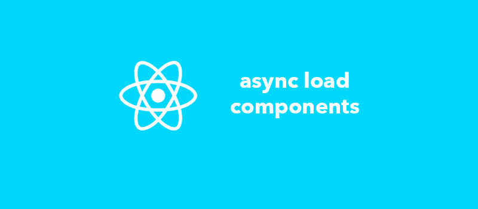

# 使用 HOC 在 React 应用程序中异步加载组件

> 原文：<https://dev.to/_arpy/loading-components-asynchronously-in-react-app-with-an-hoc-6nh>

[T2】](https://res.cloudinary.com/practicaldev/image/fetch/s--L_L-eYFt--/c_limit%2Cf_auto%2Cfl_progressive%2Cq_auto%2Cw_880/https://thepracticaldev.s3.amazonaws.com/i/mrmodbtgw57x3ar8t2nq.jpg)

在单页应用的时代，你可以用你最喜欢的 **React** 来编写(几乎)任何 web app。事实上，有些应用程序可能非常庞大！想象一下你正在开发一个脸书的克隆体……很大，是吧？

现在，您可能已经知道，当您的 Webpack 配置对代码施展其魔力时，它会生成一个单独的 **bundle.js** 文件，其中包含前端所需的所有代码。它包括所有的组件，此外还有许多附加的构建块。因此，应用程序越大，文件就越大。当然，大文件的下载时间也更长。因此，第一页的加载速度减慢。而且，事实上，用户可能永远不会访问很多加载的页面，也永远不会看到很多组件。

将最初的 **bundle.js** 文件分解成块并根据请求加载组件被认为是一个好的实践。因此，用户无意访问的页面和永远不会呈现的组件将永远不会被加载。

有很多不同的方法可以做到这一点。我将分享一个涉及 **HOCs** :)

# 什么是特设？

> 高阶组件(HOC)是 React 中重用组件逻辑的高级技术。本质上，hoc 不是 React API 的一部分。它们是从 React 的组合性质中出现的一种模式。

可以把一个 HOC 看作是你的组件的包装器，当组件被创建时，它会对它们应用一些公共的状态和行为改变。一个特设基本上是一个函数，接受一个组件，并返回另一个组件。您可以在您的 *jsx* 中将它们作为普通组件使用。[这里是高阶组件的详细文档](https://reactjs.org/docs/higher-order-components.html)。

[T2】](https://res.cloudinary.com/practicaldev/image/fetch/s--VL857Pwe--/c_limit%2Cf_auto%2Cfl_progressive%2Cq_auto%2Cw_880/https://thepracticaldev.s3.amazonaws.com/i/a7a0ctfk3rc40uydpfcy.jpg)

因此，我们要做的是，我们将定义一个 HOC，并将其应用于那些我们希望异步加载的组件。

# 异步组件 HOC

让我们创建一个包含我们的 HOC 的文件。我们就把它叫做 **asyncComponent.js** 。我喜欢在我的项目中有一个名为“hoc”的独立文件夹来存放所有高阶组件。

以下是文件内容:

```
//hoc/asyncComponent.js

import React, {Component} from 'react';

const asyncComponent = (importComponent) => {
    return class extends Component {
        state = {
            component: null
        }

        componentDidMount() {
            importComponent()
                .then(cmp => {
                    this.setState({component: cmp.default});
                });
        }

        render() {
            const C = this.state.component;
            return C ? <C {...this.props}/> : null;
        }
    }
};

export default asyncComponent; 
```

Enter fullscreen mode Exit fullscreen mode

如你所见，它只是返回一个接收另一个函数的函数，并返回一个从 **React 组件**扩展而来的*匿名类*。所以，基本上，我们的 *asyncComponent* 是一个返回*组件*的函数。

现在， **importComponent** 是一个函数，它只是返回一个组件导入。它可能看起来像这样:

```
const impFn = () => {
    return import('./components/Card');
} 
```

Enter fullscreen mode Exit fullscreen mode

每次调用 **importComponent** 时，React 都会尝试导入组件。它将下载一个包含导入组件的 **chunk.js** 文件。

# 使用 asyncComponent

让我们看看如何使用这个组件，以及如果我们这样做将会发生什么。作为示例，我们将尝试在另一个功能组件中使用它。

```
//components/Container.js

import React from 'react';
import asyncComponent from '../../hoc/asyncComponent';

const AsyncButton = asyncComponent(() => {
    return import('../Button');
});

const container = () => {
    return (
        <div>
            <h1>Here goes an async loaded button component</h1>
            <AsyncButton/>
        </div>
    );
};

export default container; 
```

Enter fullscreen mode Exit fullscreen mode

这里，我们没有使用 DOM 中的< Button />组件，而是定义了一个名为 **AsyncButton** 的新组件。知道了我们如何定义了**异步组件**，我们可以猜测**异步按钮**将被分配一个新类型的组件。但是当它被添加到 DOM 时会发生什么呢？答案在 **asyncComponent** 里。

显然，当**异步按钮**被安装时(见*组件卸载*，它调用我们的**导入组件**函数。在我们的例子中，它将导入并返回**按钮**组件。在导入完成之前，呈现的 DOM 将是空的。当丢失的组件通过块文件下载加载时，它将被添加到 **AsyncButton** 组件的状态，后者将重新呈现。现在，我们的异步组件将简单地使用传递的属性呈现下载的**按钮**组件。

仅此而已。我们已经使我们的**按钮**组件只有在实际安装时才被获取；)

# 带异步组件的路由

当你的应用程序中有很多容器组件(即页面)时，最初只加载最有可能被访问的页面并异步获取其余的页面是合理的。我们的 **asyncComponent** 非常适合这种情况。你需要像我们之前使用按钮一样使用它。

这里有一个简单的例子。假设我们将所有路由放在一个单独的文件中，为了简单起见，只定义了 2 条路由。初始加载的主页，以及不保证会被访问的用户配置文件页面。

```
//Routes.js

import React, {Component} from 'react';
import {Route, Switch} from 'react-router-dom';

import HomePage from './containers/HomePage';

const AsyncProfilePage    = asyncComponent(() => {
    return import('./containers/ProfilePage');
});

class Routes extends Component {
    render() {
        return (
            <Switch>
                <Route exact path='/' component={HomePage}/>
                <Route exact path='/profile' component={AsyncProfilePage}/>
            </Switch>
        );
    }
}

export default Routes; 
```

Enter fullscreen mode Exit fullscreen mode

因此，只有当用户单击主页中显示所需页面的链接时，才会下载用户配置文件页面的代码。

希望你在这里学到了新的东西，并愉快的反应编码！🤘