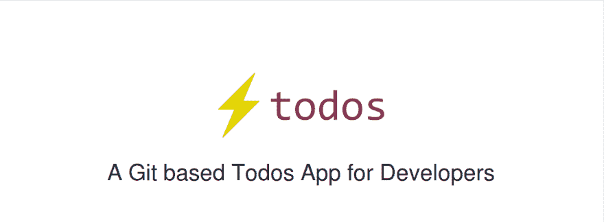
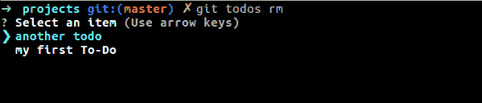
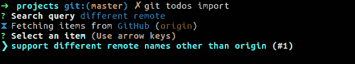
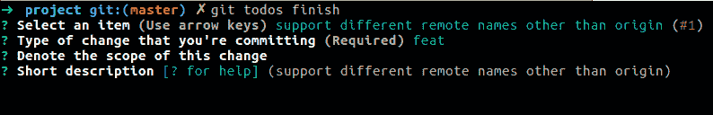
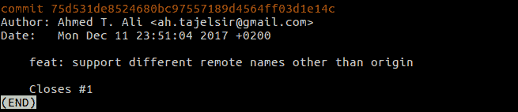

# 开发人员的本地待办事项

> 原文：<https://dev.to/z0al/local-to-dos-for-developers-5l2>

<figure>

<figcaption>[【https://git . io/all】](https://git.io/todos)</figcaption>

</figure>

### 简介

几天前，我开始了一个小项目，目标是让我管理待办事项的方式自动化。它基本上是一个命令行界面(CLI ),帮助创建/删除/标记/完成待办事项。

在这篇文章中，我将尝试概述我在构建这个工具之前和之后是如何管理本地待办事项的。虽然我的方法不是独一无二的，也不适合所有的项目/开发人员，但它可能对其他人有所帮助或启发；)

### 本地待办事项？没错。

“待办事项”一词在不同上下文中可能指不同的含义。在这种情况下，我指的是你需要在几个小时内完成的小任务。

然而，即使对于那些“小”任务，你也可以用不同的方式来管理它们。有些人更喜欢使用[问题跟踪系统(ITS)](https://en.wikipedia.org/wiki/Issue_tracking_system)，而有些人更喜欢编写 To-Dos 代码注释，即使有些[人认为](http://wiki.c2.com/?TodoCommentsConsideredHarmful)是一个[反模式](https://en.wikipedia.org/wiki/Anti-pattern)。当然，有一群人只是把他们的待办事项写在一个简单的纯文本文件中。

我不认为有“万能”的解决方案，所以目前，我正在使用它们，以下是方法:

*   我使用它的解决方案(即 [GitHub Issues](https://guides.github.com/features/issues/) )来处理需要整个团队成员关注的事情，或者那些需要与其他人讨论的事情(即 bug、特性请求)。存储在 ITS 中的待办事项通常比其他地方指定的待办事项具有更高的优先级。
*   如果我认为这个问题需要所有团队成员的关注，我会写待办事项代码注释，但不是现在。它们并不紧急，现在也不会损坏任何东西。我有时会为我的编辑器使用一个扩展来突出显示这些评论，但也会使用 GitHub 的 [Jason Etcovitch](https://medium.com/u/b086ceef8d48) 的 [awesome bot](https://github.com/apps/todo) 这样的机器人来自动创建与代码评论相对应的 GitHub 问题。
*   此外，我通常在本地为每个存储库维护一个 TODO.md 文件，以跟踪我的进度(例如待办事项)😝)由于我通常会同时处理多件事情，有时可能会有几个星期无法完成一个项目，所以我需要一种方法来跟踪我未完成的工作。当然，我没有提交那个文件，它总是被 Git 忽略。

我所构建的工具专注于自动化最后一部分——“本地”待办事项！

### 功能设置

我把我的工具叫做“Git Todos ”,因为它依赖于 Git 的安装工作。然而，它不是一个类似于 CLI 的 Git-Flow，也没有假设任何工作流。

一般来说，该工具的工作方式是在每个存储库上简单地维护一个本地的. todos.yml 文件，它实际上是我以前手写的 TODO.md 的替代文件。除了 [YAML](https://en.wikipedia.org/wiki/YAML) 的可爱语法之外，它也更容易解析工具(比如这个)。如果你愿意，你可以自由地直接把东西写到. todos.yml 中，但这正是我构建这个工具的目的；)

对于防止意外推送. todos.yml 文件，该工具本身(还)没有多大帮助。但是，现在添加一个. gitignore 条目很方便！

#### 管理待办事项:

添加待办事项就像你想象的那样简单。例如，下面是如何添加待办事项:

<figure> 

<figcaption>添加到待办事项</figcaption>

</figure>

> **注意:**对于大多数命令，如果可能的话，您可以传递-s 或- simple 来简化过程，对于 add 命令，该工具根本不会提示“描述”字段。

现在，如果你列出你的待办事项，它可能看起来像这样:

<figure> 

<figcaption>列出可用待办事项</figcaption>

</figure>

琐碎，哈？

此外，该工具还提供了其他预期的命令，如 show，它显示所有待办事项的详细信息，如下所示。但是，该工具不支持“编辑”命令，因为我认为在任何编辑器中打开. todos.yml 并编辑内容更容易。

同样值得一提的是，这个工具不支持(也可能不会)任何优先级排序/着色/标签等，它不会帮助你组织待办事项，而是完成它们！

#### 标记待办事项

标记待办事项使该工具更易于使用，例如，如果您想要删除待办事项，该命令将显示如下选择列表，让您选择要删除的事项:

<figure> 

<figcaption>选择列表删除一项</figcaption>

</figure>

如果您想删除一个标记的项目，您可以向命令传递-m 来跳过选择步骤。您只能标记一个待办事项:)

#### 导入问题

这其实是一件很酷的事情！

该工具使你能够从[https://github.com](https://github.com)(至少理论上也是企业版)导入问题(通常是标题、描述和编号)，并将它们用作本地待办事项。该工具足够智能，可以过滤结果，只找出存储库中的问题。为了确定您的存储库 URL，我们读取 git 配置(具体来说是 remotes ),并从原始 URL 中提取存储库信息。这里有一个演示:

[T2】](https://res.cloudinary.com/practicaldev/image/fetch/s--I9P3Goe7--/c_limit%2Cf_auto%2Cfl_progressive%2Cq_auto%2Cw_880/https://cdn-images-1.medium.com/max/600/1%2AutfhmtllHJXbXy-H03a3DA.png)

太好了！你也可以使用[高级搜索语法](https://help.github.com/articles/searching-issues-and-pull-requests/)，比如标签:“进行中”🙌

当您从 GitHub 导入问题时，该工具还会存储相应的问题编号，以便在您完成该待办事项时使用。

我们刚刚说“结束”了吗？

#### 整理待办事项

谜题的最后一部分是实际完成/关闭一个项目。为此，该工具提供了一个完成命令。

就像任何待办事项应用程序一样，我们需要一种方法来查看你的工作历史，但与其他解决方案不同，显示你的工作历史的唯一方法是使用 git log(这就是它的用途)！！！

正如您可能已经猜到的，finish 命令实际上提交暂存文件并删除待办事项。不仅如此，它还有助于您遵循[常规提交](https://conventionalcommits.org/lang/en)指南，请看:

<figure> 

<figcaption>整理一个待办事项(第一部分)</figcaption>

</figure>

<figure> 

<figcaption>整理一个待办事项(第二部分)</figcaption>

</figure>

该工具会自动为您设置一些默认值，并允许您根据需要修改它们。例如，它自动将提交的“简短描述”设置为 Todo 的标题，并将问题编号(如果有)添加到此操作要关闭的问题列表中(提交！)

好了，让我们来看看我们的历史:

<figure> 

<figcaption>工作历史；)</figcaption>

</figure>

#### 工作时的一点鼓励

最后，如果你没有注意到，在一些命令输出的最后一行有一些单行的鼓励信息，例如“干得好”，“我看到你做了什么”..等等。该特性的灵感来自流行的 Atom 编辑器包“[鼓励](https://github.com/Haacked/encourage-atom)”。

### 总结起来

如果你喜欢这个工具，你可以从官方的 [GitHub 库](https://github.com/ahmed-taj/git-todos)下载二进制文件(你也可以使用这个可爱的短网址【https://git.io/todos】T2

反馈真的很感谢❤

* * *

最初发布在[我的博客](https://medium.com/ahmed-t-ali/local-to-dos-for-developers-d871682a069)