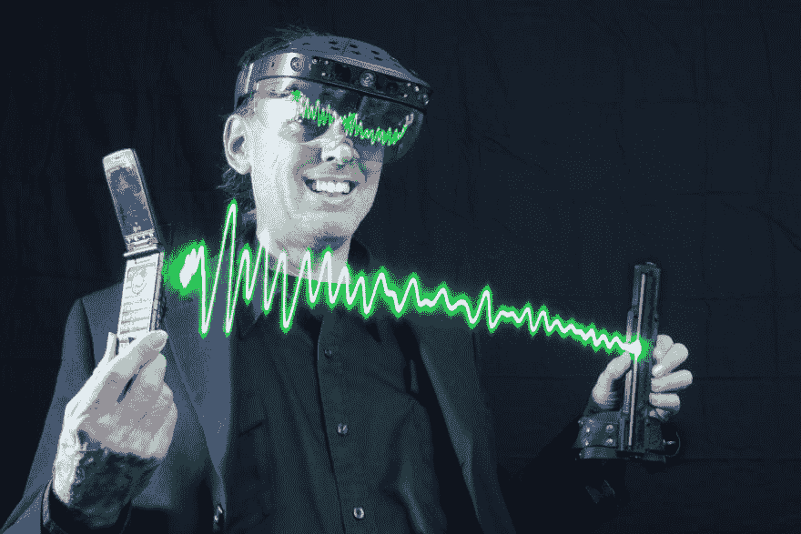
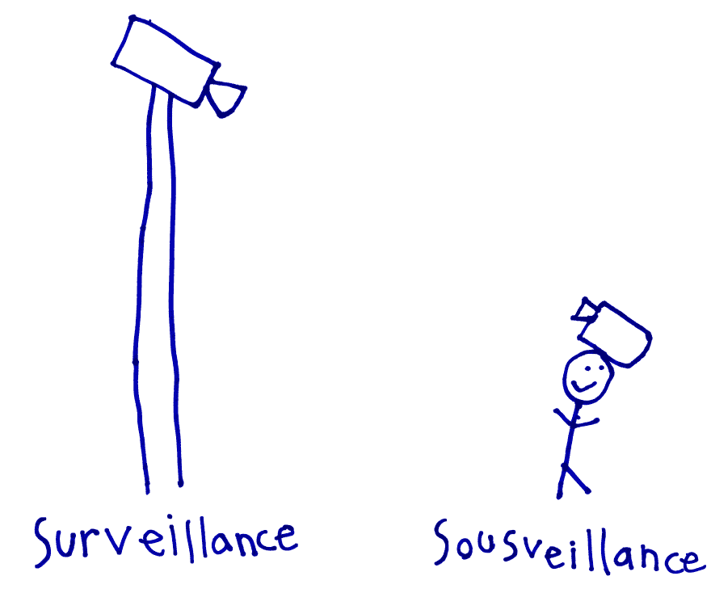
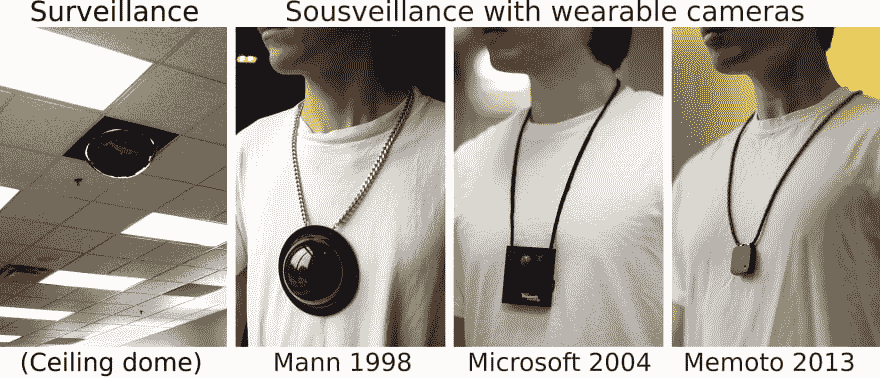
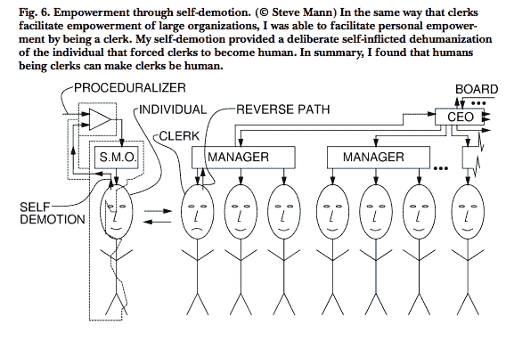
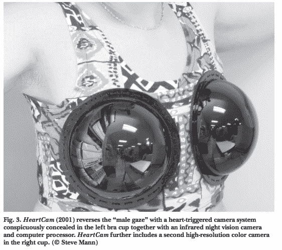
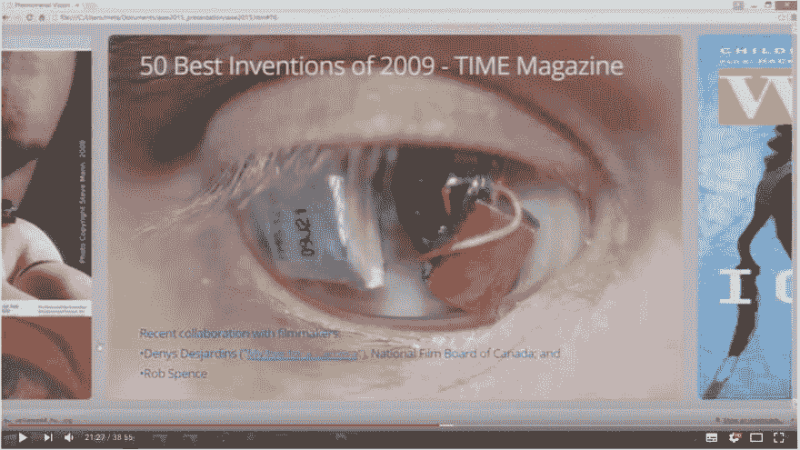

# 重新审视可穿戴设备

> 原文：<https://dev.to/guergana/looking-at-wearables-under-a-renewed-light-5476>

多年来，我在任何地方都读到和听到可穿戴计算这个术语。“哇，看看这个超级酷的东西，你可以穿着它改变形状”，“看看这个时装周的新闪亮服装”...在几个例子之后，似乎你在这个领域唯一能做的事情就是在一块布料上附加非常基本的(大部分也很难看)交互可视化界面。但是，哦，我上周意识到我已经在这个问题上无知了很长时间。

我很好奇是否存在任何增强现实解决方案，让人们看到电波和无线信号。所以，我去问了谷歌勋爵，我在这里试着理解[这篇指导文章](http://www.instructables.com/id/Imprint-Invisible-Sound-and-Radio-Waves-Onto-Your-/)教你如何建造一台序列波印记机器 S.W.I.M ,,一台让你看到无线电波或声波在你周围发射的机器，使用一个自建电路和一个照相机的帮助。据此，他发明了元监控(Metaveillance)这一术语，使用元监控(从下面看，用户)来监控监视我们的设备(监视)，从而赋予不知道自己何时被周围的摄像头捕捉到的个人权力。

[T2】](https://res.cloudinary.com/practicaldev/image/fetch/s--Hg53RslU--/c_limit%2Cf_auto%2Cfl_progressive%2Cq_auto%2Cw_880/http://wearcam.org/metabaq/meta2/steve/stevecrop.jpg)

我很好奇，想知道是谁负责这个 70 年代开发的疯狂项目！！！我发现他被认为是可穿戴计算之父。真正的先锋。他被认为是一个疯子，最终他发明了一个学术领域。怎么样！！

他参与了许多项目，这些项目在一个日益互联的世界里，在企业和政府面前质疑个人的能动性。他的所有作品都非常出色，但最打动我的是他的一系列表演《我们的生活》。它们是同一主题的变体，通过技术将监视行为还原给观察者，或者换句话说，赋予用户超能力，从而赋予原本被动的观察主体权力。

[T2】](https://res.cloudinary.com/practicaldev/image/fetch/s--BaFSTMY---/c_limit%2Cf_auto%2Cfl_progressive%2Cq_auto%2Cw_880/https://upload.wikimedia.org/wikipedia/commons/7/7f/SurSousVeillanceByStephanieMannAge6.png)

他女儿画的一幅可爱的说明图。

 
监视 vs 监视

这个实验中一个特别有趣的部分是这样一个想法，即监督让店员再次成为人:比如说，如果你去一家商店，你问在那里工作的一个人为什么你被监控摄像头拍下，他“会通过提到经理来免除自己对这种情况的责任。（...)类似地，经理被首席执行官(CEO)的条件所约束，或者可以假装被约束”等等。因此很难针对某个特定的人来解决问题，因为他们总是推卸责任。

[T2】](https://res.cloudinary.com/practicaldev/image/fetch/s--VdpMbsmw--/c_limit%2Cf_auto%2Cfl_progressive%2Cq_auto%2Cw_880/https://thepracticaldev.s3.amazonaws.com/i/zvwfqc8txn1u2civvlsr.png)

现在有趣的部分来了，在这样的情况下，向经理，然后是首席执行官投诉，可能需要写一封信，等待，可能永远得不到回应，但如果你拍下店员的照片或视频，他会立即打电话给他的主管，如果这种情况升级，会打电话给层级上一级的人。因此，这些实验在监视对象和负责监视的人之间建立了一座桥梁。(如果你不理解我对这个问题的解释，[请阅读文章](http://wearcam.org/leonardo/awardpaper.pdf)。

HeartCam 也是 Wearcam 系列的一部分:

[T2】](https://res.cloudinary.com/practicaldev/image/fetch/s--ZS1E8t-a--/c_limit%2Cf_auto%2Cfl_progressive%2Cq_auto%2Cw_880/https://thepracticaldev.s3.amazonaws.com/i/gk8q9zm5q6jpjamd3878.png)

如果心跳加快，该设备将拍摄照片，使用心率作为帧速率的自然指标(...)此外，如果攻击者通过口头或其他方式攻击佩戴者来反对相机或相机的可能性，则帧速率会增加。[...]由于这种反馈循环超出了她的控制，可以说攻击者是通过刺激她来给自己拍照的。”

你可以在 Wearcam.org 看到这个系列的更多内容。

所有这些都让我回想起我最初的想法，那就是如果你愿意，把一件数字技术缝在布上可以被称为可穿戴的，但最终是它创造的意义使它变得有价值。所以，感谢史蒂夫·曼，我现在对可穿戴设备很着迷。追溯起源对于理解一项技术总是必要的。

如果你对监控和可穿戴技术感兴趣，我强烈建议你阅读更多关于他的作品。你可以从看这个视频开始:

[T2】](https://www.youtube.com/watch?v=QKRTiOG4J5E)

和阅读这篇文章。[存在技术:可穿戴的
计算不是真正的问题！](http://wearcam.org/leonardo/awardpaper.pdf)