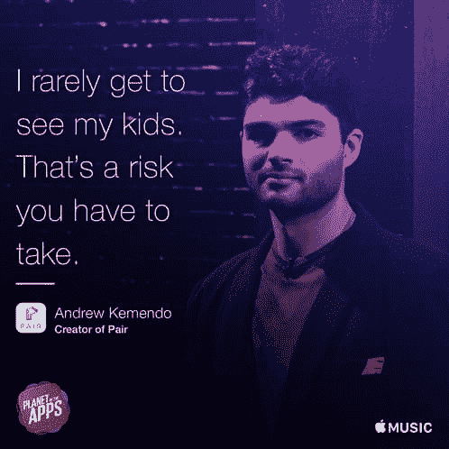

# 作为软件开发人员进行(工作)转换

> 原文：<https://dev.to/rionmonster/making-a-job-switch-as-a-software-developer>

*这篇文章最初发表在[我的博客](http://rion.io)上。*

在过去的几周里，这里似乎有点平静，但在表面之下肯定有很多活动。

在我之前的职位上呆了将近七年后，我决定最终做出改变。当这篇文章发布后，我将正式为旧金山风险管理和网络安全公司 [Bay Dynamics](https://baydynamics.com/) 的工程团队工作。我非常兴奋能够加入这个了不起的团队，成为比我过去做过的任何事情都要大得多的事情的一部分。

这个决定不是我一时兴起做出的，所以我想我应该写一篇简短的帖子，谈谈我在做出改变时考虑的一些因素。希望，如果你在同一条船上，当机会出现时，它会帮助你做出决定。

## 什么对我很重要？

我记得最近看到了下面这个广告，它基本上是我对工作的所有信念的对立面:

[T2】](https://res.cloudinary.com/practicaldev/image/fetch/s--gbVV2VR1--/c_limit%2Cf_auto%2Cfl_progressive%2Cq_auto%2Cw_880/https://thepracticaldev.s3.amazonaws.com/i/j0mhlmvepp4wymo0gvc2.jpg)

没有。

我知道有些人活着就是为了工作，这完全没问题。但是如果你有孩子，并且明确地把你的工作看得比你自己孩子的生命更重要，那么你和我可能不会相处得很好。

> 工作与生活的平衡可以说是任何职业变动中最重要的因素(重点是生活方面)。

尽管我喜欢构建应用程序和编写代码，但如果它们中的任何一个损害了我成为一个好父亲或好丈夫的能力，我会很乐意在我的余生中挖沟渠。

因此，我们已经确立了工作与生活平衡的重要性(至少对我来说是这样)，但是当决定做出改变时，软件开发人员角色中还有许多其他因素可以改变天平:

*   实验(和失败)的自由
*   正在进行的工作的影响
*   你所在的团队
*   企业文化
*   位置(或远程工作的灵活性)
*   本杰明一家

还有无数的其他人，每个人都是不同的。但是如果你正在考虑做出改变，考虑所有对你来说重要的因素，想想如果你做出改变，这些事情会有什么变化。

## 如果它没断...

在我的职业生涯中，我非常幸运有机会为一些真正伟大的地方工作，特别是我以前的职位。公司领导总是支持我的决定，并提供了以下超出大多数开发人员要求的东西:

*   探索、成长和实验的灵活性。
*   自主做出直接影响产品和实施的决策。
*   需要解决的问题直接影响人们的生活和福祉。

作为一名软件工程师，这些类型的自由价值连城。因此，在这一点上，你可能会问“你为什么要离开这一切？”这是一个很好的问题。

以下是我的三个理由，我会逐一详细阐述:

*   增长
*   变化
*   机会

## 成长为更好的人

我总是不断努力成为一个更好的人，无论是个人还是职业。作为一名开发人员，这通常需要你打破自己的舒适区，挑战自己。

> 一些人学会了一门新的不熟悉的编程语言或者编写了他们自己的编译器——我决定我需要让自己周围有一群全新的(并且更大的)人。

这些人中的许多人会有与我截然不同的背景、经历和个性，这正是你在团队中想要的。这些人会挑战你对“正确方法”的先入为主的观念，并迫使你在专业上成为更好的开发人员，同时分享会影响你个人的经验。

这些力量中的每一种，无论是个人的还是专业的，都将帮助你成长，不仅是作为一个开发者，而是作为一个人。

## 换换风景

虽然风景本身对我来说不会有太大的变化(因为新位置是 100%偏远的)，但它会带来很多我以前没有经历过的变化。

我从来没有 100%远程工作过。我从未参加过 SCRUM 会议。我从未在大型开发团队中工作过。这些以及无数其他的问题最终形成了一个巨大的冒名顶替综合症泡沫，让我觉得自己不像一个开发人员(或者说我错过了软件开发世界的一大部分)。

> 虽然所有这些变化都很可怕，但它们正是我这样做的原因。我不想在我的职业生涯中有任何错过或“安全行事”的遗憾。

我把其中的一些缺点内化为弱点，所以我认为改变一下环境是直面这些恐惧的好方法。

我知道我不可能因为没有至少试一试而变得更糟。

## 跃进

需要说明的是，当这个机会出现时，我并没有在找工作。我在那里总是很开心，以至于我很少考虑总是吹捧“真的需要一些特别的东西”来让我离开的想法。

这个很特别。这也与我过去七年所做的事情非常不同，正是与 T2 不同的部分让轮子转动得更多一点。有如此多的*差异*，事实上这开始成为这个机会最吸引人的部分之一。

> 这种改变与其说是与相关公司有关，不如说是我大胆尝试一些完全不同的新事物。

所以，我闭上眼睛，半惊半喜地加入了一个新的团队。我将加入一个新的团队，在一个新的环境中工作，与我已经习惯的环境相比，有太多的未知和差异。

我唯一的希望是，所有这些*差异*会产生*差异*。

## 我给你的消息

我将用一些要点来总结这一点，以供那些可能对做出改变持观望态度的人参考，并回顾一下是什么帮助我做出了我的改变:

*   找到对你来说重要的东西 -优先考虑你职业生涯或职业生涯中对你来说重要的东西。如果是无限的假期、灵活的时间表、远程工作、丰厚的薪水、使用 Perl 等等。

*   现在找一家公司，这些东西对你来说很重要——让任何潜在雇主明白什么对你来说很重要，这一点至关重要。记住，面试是双向的，你需要这样想。谈判和做出一些让步是很难的，但是一定要记住你的优先事项。

*   只有你(能防止工作不愉快)如果你对目前的工作不满意，那就做点什么。确定你喜欢/不喜欢什么，看看你是否能找到一些新的东西，让你保留好的(去掉坏的)。只有你自己知道什么对你和你的家人最好。

因此，如果你发现自己在工作岗位上一直不开心、烦躁或疲惫不堪，也许是时候做出改变了。同样，如果你太舒适、无聊，或者你只是想做一些新的事情，你可能也想四处看看。

你是唯一能决定你是否幸福的人，也是唯一能为此做些什么的人。