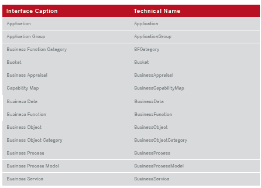

# 打造属于自己的 Alfabet 第 2 部分

> 原文：<https://dev.to/techcommunity/making-alfabet-your-own-part-2-gn6>

## 配置 Alfabet 元模型

在本系列中，我们将了解如何配置 Alfabet 产品，以实现业务和 it 转型的最佳实践。这一集聚焦于 Alfabet 元模型。

| 2017 年第三期 | [下载 PDF](http://techcommunity.softwareag.com/ecosystem/download/techniques/2017-Issue3/SAG_Making_Alfabet_Your_Own_TECHniques_Jul_WEB.pdf) |
| --- | --- |

## 简介

业务和 IT 转型(BITT)基于一种方法论——一种解决特定问题的系统方法。因此，BITT 活动需要一个描述——一个模型——来描述所有涉及的元素，以及它们在这个上下文中是如何相互关联的。这个元模型本质上需要遵循一套严格的规则来实现和维护这个方法。它的组成元素是“对象类”和描述它们之间关系的模式。Alfabet 拥有极其丰富的开箱即用的元模型，为所有 Alfabet 实现奠定了基础。构成元模型的类是产品的一部分。但是配置的可能性使得另一层描述能够根据特定组织的用例的需要被添加到类中。分类配置允许您定义每个分类要包含的信息，以便企业可以使用相关的评估和报告。

## 让元模型对您的组织有意义

Alfabet 的元模型中的类吸引了横向广泛的用户组织。它们通常是 Alfabet 涵盖的一系列 BITT 活动所需的公认类。然而，该产品提供了选择不使用元模型的某些元素和方面的可能性，或者扩展元模型以能够反映任何组织的特性。

修改元模型的一个具体方法是使用类构造型。原型是一个类中的子分类。通过配置原型，一个类可能有几个子类型。例如，类“组织”可能具有原型“控股”、“企业”、“业务单位”和“部门”，以便能够区分组织结构中的功能细节。类别“Location”可以具有原型“District”、“Country”和“Region ”,以迎合这些不同结构级别所需的不同粒度级别的信息。

刻板印象允许:

*   在更精细的细节层次上进行规划和管理，包括针对利益相关方贡献的特定目标流程和 RACI 计划

*   将用户可用的信息量保持在可管理的水平(即，仅将特定的原型分配给特定的用户简档)

*   捕获仅与原型相关的特定数据

*   改进的访问控制(用户只能访问某些原型)

通过使用类属性也可以扩展产品的类模型。属性用于描述特定类中对象的属性。它们是您的组织认为了解一个类中的对象很重要的东西。例如，对于“应用程序”，标准模型提供了诸如应用程序生命周期的“名称”、“版本”、“开始日期”和“结束日期”之类的内容，并支持“业务流程”。组织可能希望修改这组标准属性，例如“恢复时间目标”或“应用程序类型”，前者是整数，后者基于字符串值的选择列表。

Alfabet 为所有类提供了许多现成的属性，但它也允许创建自定义属性，以防额外的信息与类相关。许多数据类型，如字符串、整数、文本、布尔、日期、引用或引用数组，可用于定义属性。

## 在元模型中使用组织的术语

类及其标准属性由技术名称在 Alfabet 中进行内部标识。技术名称不能更改。但每个类和属性都有一个 Interface Caption，它是如何对外表达的。Alfabet 提供了标准的界面说明，但这些说明可以配置为适合企业的命名法和分类法

[T2】](https://res.cloudinary.com/practicaldev/image/fetch/s--4Grlt6Ey--/c_limit%2Cf_auto%2Cfl_progressive%2Cq_auto%2Cw_880/http://techcommunity.softwareag.com/documents/10157/8763256/alfabet-your-own-img1.png)

**图 1:**alfa bet 提供了类的标准接口标题。还可以对它们进行配置，以适应组织自己的特定术语。

## alfa bet 元模型内的其他配置可能性

元模型还有其他几个配置选项，可以根据您组织的需要对 Alfabet 进行微调:

*   对象状态，用于描述企业中对象的操作状态(例如，“计划”、“活动”、“停用”)

*   对象生命周期阶段，用于描述一个架构元素所经历的一系列阶段(例如，“试点”、“生产”、“日落”)

*   描述企业中对象的批准或质量状态的发布状态(例如，项目的“草稿”、“已描述”、“已审阅”、“已批准”和“已拒绝”，分配[任务]的“已创建”、“已接受”、“正在进行”、“工作已完成”、“已返回”、“已重新分配”和“已关闭”)。

Alfabet 为上述所有内容提供了标准的现成定义，但客户可以根据需要定义自己的术语。

请继续关注我们的下一集，在 Alfabet 中配置信息显示。