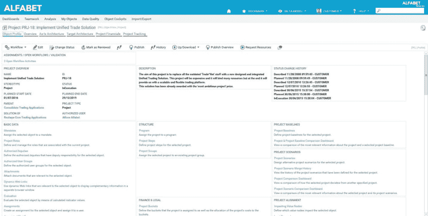
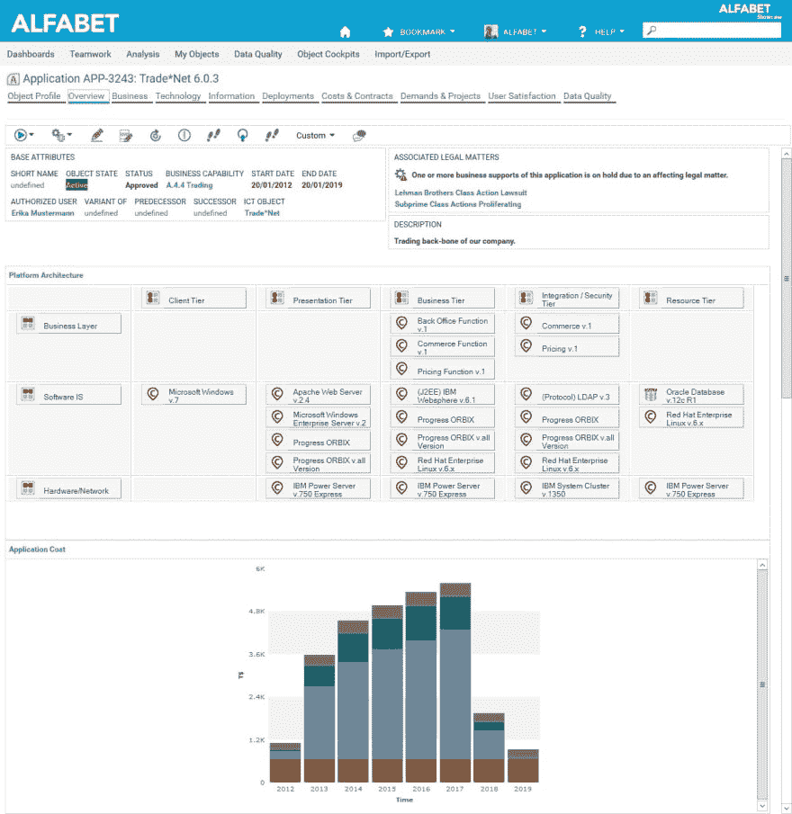
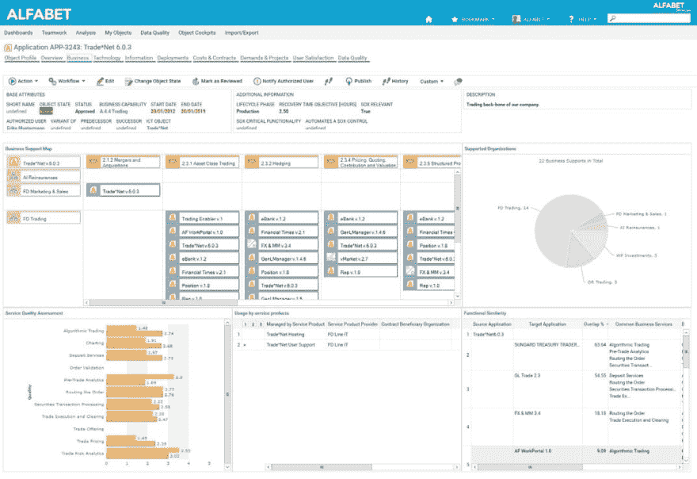

# 打造属于自己的 Alfabet 第 3 部分

> 原文：<https://dev.to/techcommunity/making-alfabet-your-own-part-3-i3>

# 配置信息显示在 Alfabet 中

**在本** **系列** **中，我们将了解如何配置** **Alfabet** **产品，以实现业务和 it 转型的最佳契合和最佳实践。本文重点介绍在** **Alfabet** **中显示信息。**

| 2017 年第 4 期 | [下载 PDF](http://techcommunity.softwareag.com/ecosystem/download/techniques/2017-Issue4/SAG_Alfabet_Your_Own_Configuring_Information_Displays_TECHniques_Oct17_Web.pdf) |
| --- | --- |

**简介**

支持业务和 IT 转型过程需要关于所涉及的单个元素及其在各种分析中相对于彼此的定位的大量信息。对于后者，Alfabet 提供了许多标准和可配置的报告可能性。这些将在后面的文章中讨论。对于前者，可以配置对象视图来定义查看特定类(或者类构造型)的哪些信息，以及如何查看。为不同的利益相关者定义各种视图的可能性确保了用户仅拥有与其特定职责相关的信息，增加了解决方案的吸引力、任务的效率和信息的安全性。

## 配置和使用对象视图

配置选项包括定义显示什么信息、信息如何分组以及信息集的相关标题。可以配置对象视图中使用的用户界面术语和工具提示，以匹配已建立的企业术语，并解释术语的含义，从而有助于企业中通用术语的开发和接受。

除了在对象视图中提供的标准信息集之外，对象视图还可以由通过查询找到的信息填充，以便在对象视图中可以包括更多的信息源。报告可以显示在对象视图中，使用户可以轻松访问它们。

对象视图包括对象配置文件以及为对象视图配置的任何对象驾驶舱。对象简档被认为是基本信息和到更详细的页面视图的链接的包含性集合，而对象驾驶舱被认为是包括属性信息以及特定页面视图的内容的主题和集中的数据集。

Alfabet 提供了显示标准属性和页面视图的标准对象配置文件。可以对这些进行调整，以满足组织对各种用户配置文件的需求。

[T2】](https://res.cloudinary.com/practicaldev/image/fetch/s--0ZM7tjEF--/c_limit%2Cf_auto%2Cfl_progressive%2Cq_auto%2Cw_880/http://techcommunity.softwareag.com/documents/10157/9121788/alfabet_img1.jpg/f83dd595-9791-43fd-959d-b76709d9ebf1%3Ft%3D1507718816628)

**图 1:** 标准界面产品附带的预配置标准对象配置文件可用作创建和配置定制对象配置文件的模板，以适应组织的需求。

## 利用对象驾驶舱的数据

对象驾驶舱是关于转换计划和管理元素的信息的另一种表示。对象驾驶舱为用户提供了所选对象的数据的即时和透明的概览，因为报告是在窗口显示中即时呈现给用户的。它是对对象数据的一种简短而集中的表示，通常是从一个特定的角度，如体系结构角度或策略角度，它是对更全面的对象概要文件的补充。您可以为一个对象视图定义多个对象驾驶舱。每个对象驾驶舱可以被配置为与特定的视角(例如，业务视角、技术视角、财务视角等)相关。).这允许你用用户可以快速容易理解的可管理的数据量创建对象驾驶舱。

对象控制台在深入细节之前向用户提供相关数据的概述，是异常处理的优秀设备。基于规则的突出显示、图标和条件字段格式都使用户更容易获得重要信息。驾驶舱还可以显示通过查询获取的 URL、文档链接或属性。此外，视图和配置的报告可以嵌入到驾驶舱中，以便用户可以立即看到数据，而不必导航到另一个页面。

[T2】](https://res.cloudinary.com/practicaldev/image/fetch/s--3-3v_zoO--/c_limit%2Cf_auto%2Cfl_progressive%2Cq_auto%2Cw_880/http://techcommunity.softwareag.com/documents/10157/9121788/alfabet_img2.jpg/84fef099-ff0c-42e1-b6bc-3d01135101e1%3Ft%3D1507718837073)

**图 2:** 这个应用程序“Trade*net”的对象驾驶舱显示与解决方案架构师相关的信息。

单个用户配置文件和类可以配置几个对象控制台，允许用户根据不同的视角查看对象的信息。例如，对象类“应用程序”的一个对象驾驶舱可能显示与理解现有体系结构中的应用程序相关的数据，而另一个对象驾驶舱可能显示与业务分析问题相关的数据，如图 2 和 3 所示。

[T2】](https://res.cloudinary.com/practicaldev/image/fetch/s--KOr-GZlM--/c_limit%2Cf_auto%2Cfl_progressive%2Cq_auto%2Cw_880/http://techcommunity.softwareag.com/documents/10157/9121788/alfabet_img3.jpg/15e40614-8046-488f-a976-e5a2a932025e%3Ft%3D1507718847141)

**图 3:** 这个应用程序“Trade*net”的对象驾驶舱显示与业务分析师相关的信息。

对象驾驶舱设计者可以通过将具有特定属性的信息、图表和表格分组到驾驶舱中面向主题的部分来配置用户配置文件特定的驾驶舱。基于规则的突出显示和图标可以被配置为向用户提供关于重要信息的视觉提示。导航可以被配置为定义在点击驾驶舱中的元素时将用户带到哪里。

请继续关注我们下一篇关于在 Alfabet 中配置用户配置文件的文章。