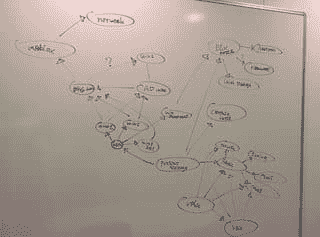
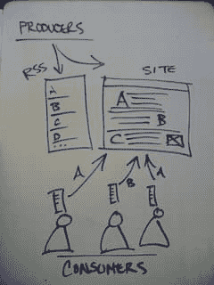

# 通过白板管理

> 原文：<https://dev.to/monknomo/managing-by-whiteboard>

团队领导和开发人员是不同的工作，需要稍微不同的技能。

虽然开发人员需要与他人相处并协调他们的工作，但团队领导需要协调许多人的工作——开发人员、利益相关者、用户以及他们自己的工作。团队领导还需要鼓励并使其他人能够相互协调。

一个简单的技巧是使用白板作为引发讨论的工具，确保每个人都在同一页上，并且在教学时不要表现出在教学。

简短的解释是，当团队成员解释复杂的事情、提出问题或作为团队的一部分做出决定时，站起来开始画出他们说的话。任何错误都会很快被指出，每个人都在处理相同的信息。

## 白板学习

[T2】](https://www.flickr.com/photos/jemimus/)

[Credit jemimus @ Flickr](https://www.flickr.com/photos/jemimus/)

往往我的一个队友会有一个我不理解的想法。或者我们想做一些我们都不理解的事情。

**到白板前！**

我通常遵循的流程是，团队成员在会议中开始解释一些复杂的事情。他们一总结出我不明白的概念，或者怀疑别人不明白，我就礼貌的问我能不能画出我认为他们的意思。我明确表示，我要检查我的理解。然后，我尽最大努力画出他们刚刚描述的东西。

通常在绘画过程中，团队会对事物的命名或线条的位置提出建议。我倾听他们所有人的声音，并画出集体意志想要的东西。

## 白板教

[T2】](https://www.flickr.com/photos/juhansonin/)

[朱汉生的信用@ Flickr](https://www.flickr.com/photos/juhansonin/)

每个人都必须向他们的团队或团队成员解释一个概念。你可以试着发邮件或聊天，但要想获得快速、高质量的结果:

**到白板前！**

这种技巧在预先准备或至少对主题有深刻理解的情况下最有效。从整体框图和箭头图开始讨论，随着绘图概念变得越来越清楚，需要更多的解释是做什么的基本轮廓。

使用白板教学时，一个关键的技巧是不要独占绘图。老师应该画出最初的概念，但在此之后，他们应该把马克笔递给学生，并鼓励他们画出他们理解的东西。

这有一个额外的好处，老师可以看到他们没有解释好的内容。

## 白板交流

[T2】](https://www.flickr.com/photos/jm3/)

[Credit jm3 @ Flickr](https://www.flickr.com/photos/jm3/)

会议是团队领导角色的重要组成部分。与利益相关者的会议，与主管的会议，与同事的会议，与团队成员的会议，与主管的会议，甚至与公众的会议。

开会！

在许多情况下，Powerpoint 是矫枉过正的或者是有害的。

**到白板前！**

白板很轻，适应性强，可以为您的演示做好准备。他们还鼓励观众参与，这提高了信息的保留。

## 到处都是白板

使用白板作为学习、教学和交流的工具。不要只画在他们身上。积极使用白板并在参与者之间传递，可以划分出两种不同的学习风格——听觉型和动觉型。你使用的学习方式越多，信息被保留的可能性就越大。

记住——白板可能是暂时的，但是如果你需要保留你画的东西，拍张照片。

每天白板！

[每月收到一封电子邮件，其中包含来自网络的优秀技术和技术领导文章](http://www.gunnargissel.com/pages/email-signup-1.html)

*感谢[理查德·阿拉维](https://flic.kr/p/5w1K5m)可爱的头球图像(英国北威尔士克里奇思的博尔德·克雷夫斯)*