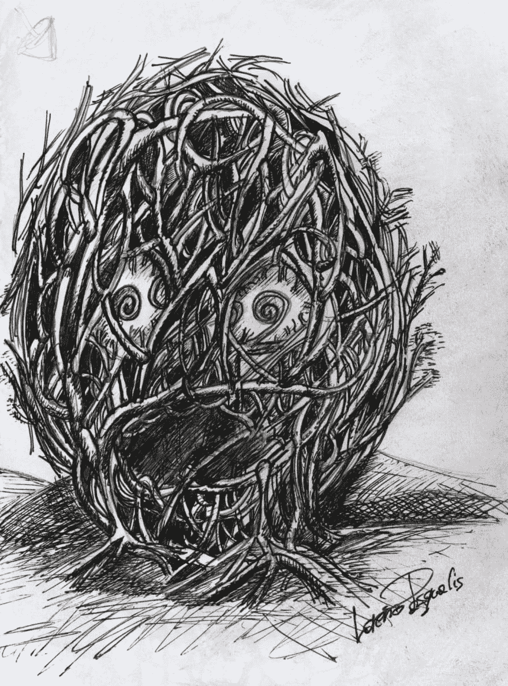
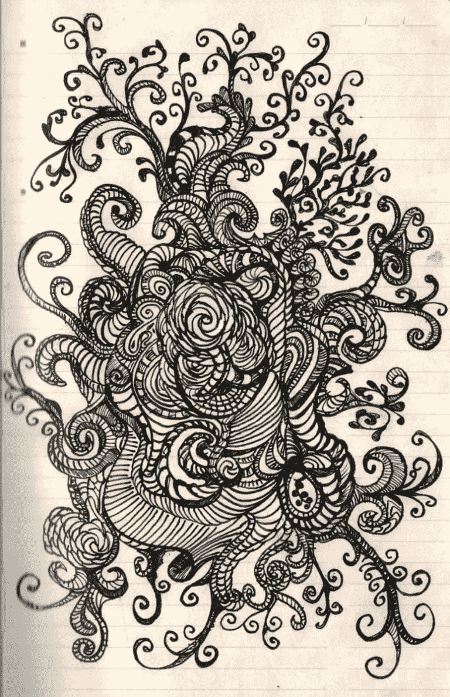
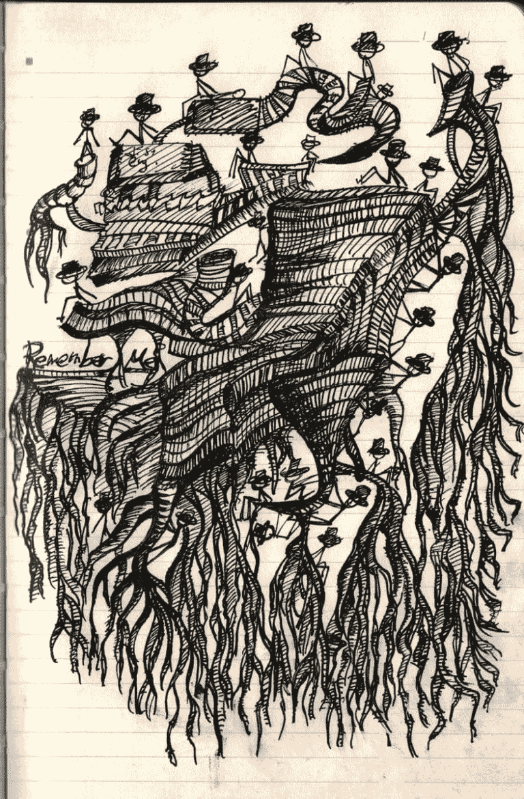
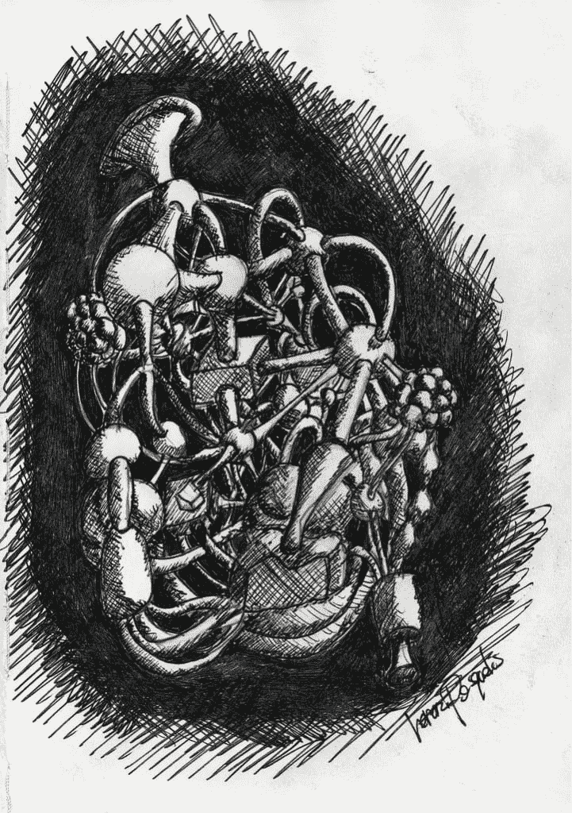
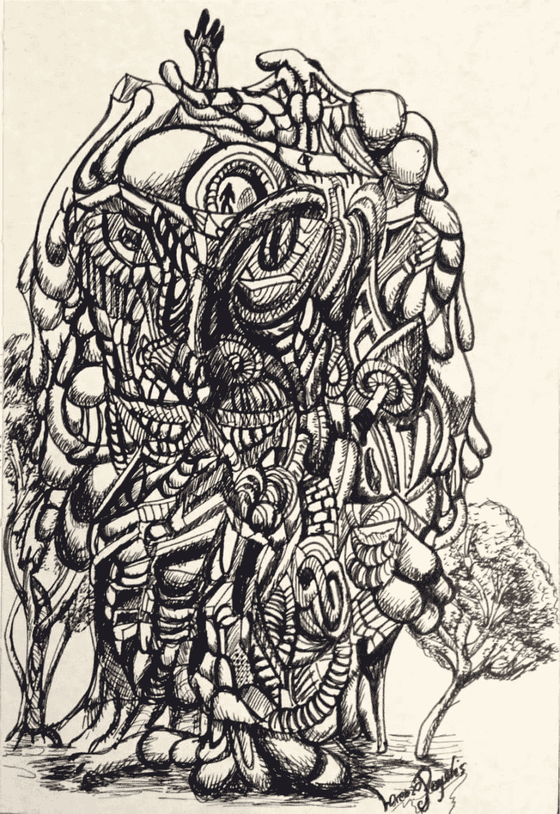
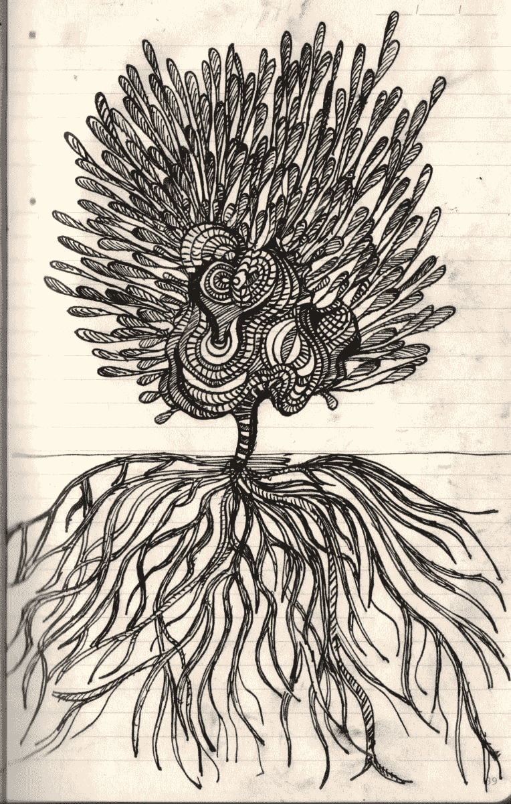

# 会议涂鸦

> 原文：<https://dev.to/lpasqualis/meeting-doodles-b53>

这篇文章最初发表在 [CoderHood](https://coderhood.com) 上，名为[涂鸦星期二:开始](https://www.coderhood.com/doodle-tuesday-the-beginning/)。CoderHood 是一个致力于软件工程人类层面的博客。

[T2】](https://www.coderhood.com/doodle-tuesday-branches/)

## 在理工大开会都是左脑工作；除非你涂鸦。

感恩节晚餐后，我的日程通常被安排得像洗碗机一样满满的，而且我的大部分时间都花在了会议上。重要会议。我不接受没有议程的会议、我不能带来价值的会议或价值不明的会议。

当我在会议室时，我用纸笔做老式的笔记。笔记对我来说很重要，我不使用任何廉价的旧纸。也许我有点纸上谈兵。因此，我喜欢使用 Moleskines，这是一个在北美拥有狂热追随者的意大利优质笔记本品牌。我喜欢它的手感、纸张的质量和耐用的装订。我喜欢我的笔记持续下去，因为我经常回头看它们；有时几年后。我还会定期扫描我的笔记本并将其存档到 Evernote 中，以便从任何设备上轻松访问。尽管有电子版，我还是喜欢收集和使用坚固耐用的原件。

我要提一下:我的笔记 10%是文字，90%是涂鸦。有时候 100%涂鸦，看题目和我的心情。对我来说，涂鸦是记笔记的一个重要部分。

## 涂鸦可以防止狗追逐随机的棍子。

我直接从潜意识里涂鸦；我的意识与此无关。涂鸦帮助我停留在当下，专注于房间里讨论的话题。它平息了充斥我视觉皮层的令人分心的信息。就像一只顽皮而又不会说话的狗，我的潜意识倾向于追逐扔在周围的视觉棒。谢天谢地，纸和笔是最棒的棍子。比松鼠好，比骨头更令人满足，比剩饭更多汁。

在会议期间，我涂鸦将想法转换成图片——呈现内容的视觉记忆，并捕捉情绪。我用涂鸦来修饰我的文字，并用地标来填满页面，这样我以后可以用它来找到我的条目。一旦我在难以辨认的字迹旁边印上涂鸦，我就可以快速翻阅笔记本，轻松地找到条目。几天、几周、几个月甚至几年后。

## 涂鸦是渲染概念。

会议期间的涂鸦对讨论的知识内容进行了编码。这些图画是将概念转化为抽象形象的结果。将内部视觉聊天转移到纸上的标记使我集中；它让我的右脑忙碌，让我保持平衡和稳定。

每周二我都会在博客上发布一个新涂鸦。我称之为“涂鸦星期二”。检查一下，让我知道你的想法。

我博客中的几个例子:

[【后果】](https://www.coderhood.com/doodle-tuesday-consequences/)

[《寻根者》](https://www.coderhood.com/doodle-tuesday-roots-climbers/)

[【面向服务的架构】](https://www.coderhood.com/doodle-tuesday-service-oriented-architecture/)

[【存在感】](https://www.coderhood.com/doodle-tuesday-presence/)

[【成长】](https://www.coderhood.com/doodle-tuesday-growth/)

* * *

### 如果你喜欢这篇文章，请保持联系！

*   在 CoderHood 上找到我所有的帖子。
*   在 LinkedIn 上加入我的职业网络。
*   在推特上关注我。
*   加入我的脸书主页。
*   最后，请在 dev.to 上关注我！