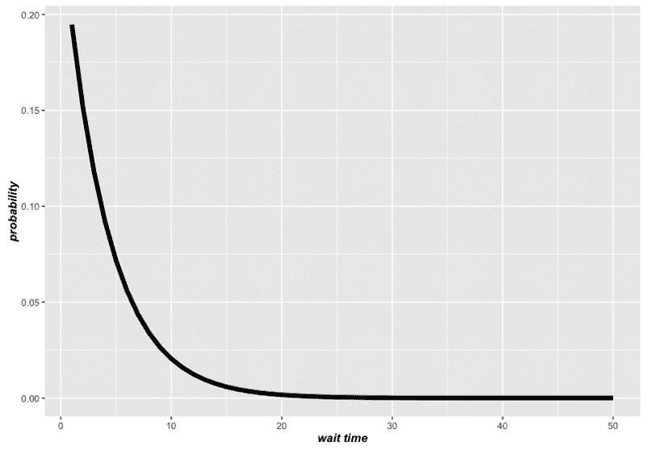
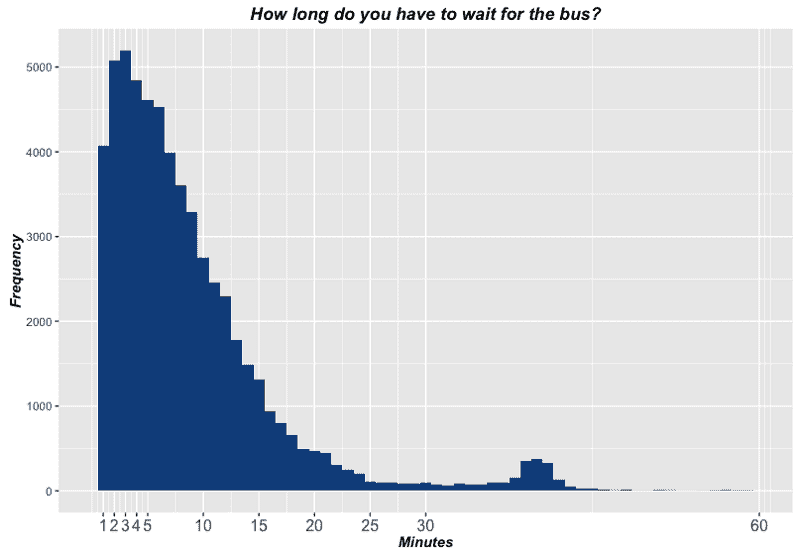

# 公交车站的无记忆性:使用公交数据中的 R 检验假设

> 原文：<https://dev.to/walker/memorylessness-at-the-bus-stop>

我是一名数据博主，也是一名统计学学生，喜欢在自己的家乡纽约市进行实验。这篇文章介绍了无记忆的数学概念，然后对纽约 MTA 发表的交通数据运行一些 R 代码，试图在野外找到这个概念。

在概率论领域，有一个怪异的概念叫做*无记忆性，它描述了某些场景的特征。随着时间或考验的流逝，任何时候与结果相关的机会都不会改变，你的情况可以被描述为无记忆。换句话说，无论发生了什么，都不会影响到将要“遗忘”的事情。â€*

 *这个想法通过一个例子更容易理解，为此我们将调用概率的海报孩子:抛硬币。如果你掷一枚硬币 1000 次，不管已经发生了什么，任何一次都有 50%的概率正面朝上。因此，即使你奇迹般地翻转了 1000 个直头，你再次翻转其中一个的几率仍然是 50%，因此这个场景是无记忆的。

[T2】](https://res.cloudinary.com/practicaldev/image/fetch/s--9w-y_iYO--/c_limit%2Cf_auto%2Cfl_progressive%2Cq_auto%2Cw_880/https://cdn-images-1.medium.com/max/800/1%2ALFXB8nbc7yA0fC0cM_M3Lg.jpeg)

这似乎是显而易见的，但是[一个完整的现象](https://en.wikipedia.org/wiki/Gambler%27s_fallacy)被命名为人类在某些环境中无法理解这一事实。事实上，赌徒谬误描述了一种错误的信念，即过去的事件必须在随后的发展中以某种方式得到平衡(就像一个赌徒认为他应该得到一笔横财)，这是每个人的常见陷阱，从青少年到在一次测试中因一系列连续字母答案而不安的投资者。

无记忆的连续版本，即事件不是像掷硬币那样的离散事件，而是可以在任何时间发生，有点让人神游。连续的、无记忆的过程描述了以时间流逝为条件的概率和时间没有流逝一样的情况。这些通常描述“等待”在某个时间段内无法保证会发生的事情。

统计学家最喜欢的一个例子是等公交车。无记忆等车意味着不管你是刚到车站还是已经在车站坐了 20 分钟，下一分钟到达的概率都是一样的。

[T2】](https://res.cloudinary.com/practicaldev/image/fetch/s--ERGqAjoE--/c_limit%2Cf_auto%2Cfl_progressive%2Cq_66%2Cw_880/https://cdn-images-1.medium.com/max/800/1%2AQeWhVlcbXaDV5Q77WTsbHw.gif)

另一种思考方式是，等待公共汽车到来的任何时间的概率相当于在预先设定的持续时间之外等待该时间:如果已经过了 5 分钟，公共汽车在 2 分钟内到达那里的机会与它在 7 分钟内到达那里的机会相同，或者如果已经过了 100 分钟，它在 102 分钟内到达那里的机会相同。从这个意义上来说，你不能仅仅坐在那里就赢得更好的机会。

事实证明，只有指数分布才能描述连续情况下的这种设置。从图形上看，无记忆属性可以通过只关注某一点右侧的密度曲线部分来演示，即您已经等待了多长时间。

你可能会承认那里的曲线更低，所以如果你已经等了一段时间，那么等得更久的可能性就更小。但是我们的新样本空间也更小，因为几分钟已经过去了，这要求我们向上扩展曲线，或者将其归一化，使基础面积为 1。当我们这样做的时候，我们意识到它已经呈现了原来的形状，只是被移动了一下:

[T2】](https://res.cloudinary.com/practicaldev/image/fetch/s--jIKk92tS--/c_limit%2Cf_auto%2Cfl_progressive%2Cq_66%2Cw_880/https://cdn-images-1.medium.com/max/800/1%2A-qjYHLOjvZkL6Tk5oc6AHw.gif)

公共汽车的例子令人难忘(没有双关语的意思)，因为它如此有效地抓住了等待的徒劳。当你无所事事地坐着，不知道下一班车什么时候会来时，你开始怀疑自从你到达那里后，它来的机会是否真的增加了。指数分布为这个问题提供了可悲的答案:不！

但是真正的公共汽车的到达是否遵循同样的无记忆分布呢？

我们可以使用纽约市交通管理局发布的[数据来测试这一提议，该数据跟踪公交车全天完成的路线。我将选择](http://data.mytransit.nyc/bus_time/2016/)[第 96 街和第五大道](https://bustime.mta.info/m/index;jsessionid=2E60C90AE5D223D7532F8858A024A400?q=404087&l=&t=)的交叉城 M96 巴士站，因为这是我个人的最爱。

首先，我们必须将所有的日常文件合并到一个巨大的 2016 年数据帧 R:

```
# upload first day (Jan 1 2016). Station ID number is 404087  bus.all  <-  read.csv("bus_time_20160101.csv")  bus.all<-  bus.all[bus.all$next_stop_id==404087,]  bus.all$timestamp  <-  as.POSIXct(strptime(bus.all$timestamp,  "%Y-%m-%dT%H:%M:%SZ")  # create vector of all other dates (Dec 29 missing for some reason)  dates  <-  c(20160102:20160131,  20160201:20160229,  20160301:20160331,  20160401:20160430,  20160501:20160531,  20160601:20160630,  20160701:20160731,  20160801:20160831,  20160901:20160930,  20161001:20161031,  20161101:20161130,  20161201:20161228,  20161230:20161231)  # cycle through all of them, reading the csv and binding it to bus.all  for  (i  in  dates){  file  <-  paste  ("bus_time_",  as.character(i),  ".csv",  sep="")  bus_trans  <-  read.csv(file)  bus_trans  <-  bus_trans[bus_trans$next_stop_id==404087,]  bus_trans$timestamp  <-  as.POSIXct(strptime(bus_trans$timestamp,  "%Y-%m-%dT%H:%M:%SZ"))  bus.all  <-  rbind(bus.all,  bus_trans)  } 
```

Enter fullscreen mode Exit fullscreen mode

现在，我们有了前往第 96 街上被检查车站的每辆公交车的日志，因为我们只选择了具有所需`next_stop_id`的行。

不过有一个问题:MTA 并不记录公交车到达车站的准确时间，而是根据定期的 pings 记录每辆公交车的下一站。这意味着，对于接近我们站点的同一辆公交车，将存在多个时间戳不同的行。因此，代替确切的到达时间，我们将不得不满足于公交车在下一站更新到下一站之前发送的最后一个 ping:

```
# order buses by vehicle id (already ordered by time)  bus.all  <-  bus.all[order(bus.all$vehicle_id),]  # add column showing time difference btwn pings  bus.all$diff  <-  c(601,  diff(bus.all$timestamp))  # find index for last ping before arrival  # by subtracting 1 from index of first ping in string of pings going to stop  index  <-  which(bus.all$diff<0  |  bus.all$diff>600)  index  <-  index  -  1  bus.all.real  <-  bus.all[index,]  # make a new column for the wait between buses in minutes  bus.all.real  <-  bus.all.real[order(bus.all.real$timestamp),]  bus.all.real$wait  <-  c(0,  diff(bus.all.real$timestamp)/60) 
```

Enter fullscreen mode Exit fullscreen mode

现在我们已经创建了一个值，它可以精确地估计公交车之间的等待时间，我们可以绘制它的分布图。2016 年，共有超过 60，000 辆公共汽车从车站进出，大约每九分钟一辆:

[T2】](https://res.cloudinary.com/practicaldev/image/fetch/s--tC36CBDH--/c_limit%2Cf_auto%2Cfl_progressive%2Cq_auto%2Cw_880/https://cdn-images-1.medium.com/max/800/1%2AYUASmLvUFhE23gsOPyxs7Q.png)

非常接近我们的模型！该图与之前的理想图有两个主要差异，但都有合理的解释。首先，在一个真正的无记忆分布中，最短的时间(我们的“不到一分钟”时段)将具有最高的概率。但在上面的分布中，这样的等待实际上比其他短时间桶(如两三分钟)更少。

这背后的原因可能是公交车司机在意识到前面的公交车太近时，试图给它们更多的时间和空间。因此，如果司机故意减速以避免跟在他们的前车后面，一些本来不到一分钟的等待可能会稍微长一点。

与指数模型的另一个背离发生在图表的更下方，接近 40 分钟标记处，在那里发生了适度但明显的颠簸。这可能表明，在某个时间点(可能是在深夜)，MTA 会退回到更可靠的时间表，尽管频率要低得多。从这个意义上说，整体形状实际上可能是两者的结合:醒着的时候是指数分布，大夜班的时候是适度的正态分布。

考虑到你可能不会赶上凌晨 3 点穿过城镇的 M96，指数或无记忆分布仍然非常准确地描述了等待过程。所以下次你要去坐公交车的时候，记住这篇博客作为指南。或者，紧扣主题，忘掉一切*