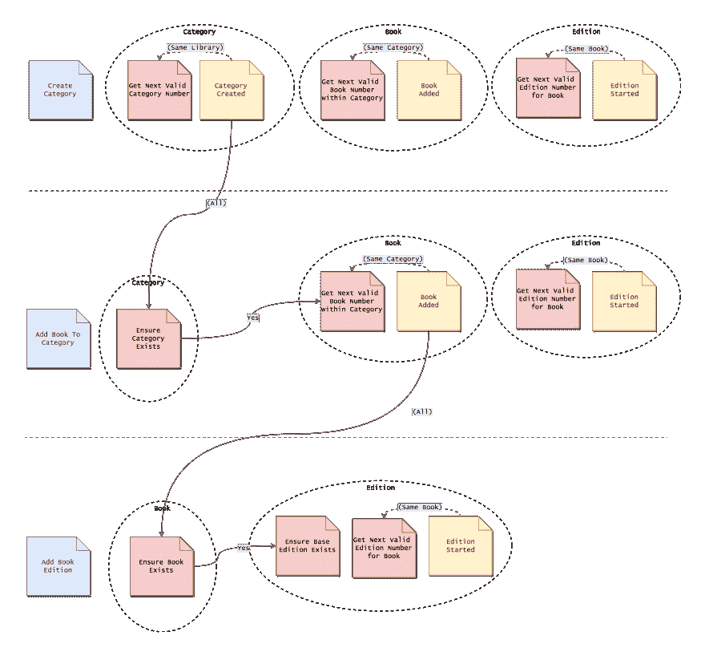

# 混乱的事件流:第 2 部分——它应该是什么样子

> 原文：<https://dev.to/barryosull/messy-event-flows-part-2---what-it-should-be>

所以，[上次](https://dev.to/barryosull/messy-event-flows-part-1)我们查看了我们的事件流，我详细介绍了我们遇到的问题。下一步是重塑我们的事件流，不是现在这样，而是应该怎样。

作为探索的一部分，我还注释了事件流，更精确地说明了流的每次迭代需要什么来确保满足约束。即。我们需要监听所有事件，还是只是一个子集，如果是子集，我们能定义它吗？

# 更新型号

 
点击缩放

# 我们发现了什么？

上述重新建模给了我们一些有趣的见解。

## 双重事件是不可行的

首先，我们对双重事件(“图书版本开始”和“版本开始”)的厌恶是有道理的。领域专家从未提到过两个事件，他们只用过一个。事实证明，我们添加了一个额外的事件来适应我们的实现，事后看来这是一个坏主意(违反了依赖倒置原则)。如果没有这次会议，我不会发现这一点，所以这是一个很好的教训。

## 新约束

这还不是全部。我们还发现了上一个模型中没有的约束。当你添加一本新书版本时，你必须引用你要替换的版本，这个版本可以是以前的任何版本，而不仅仅是最后一个版本(我们有一个奇怪的库)。这就是为什么在最后一个流程中有一个新的约束，“确保基础版本存在”。

## 新名词

另一个简单的见解，一个新词出现了，“图书馆”。类别的集合属于一个概念，但我们从未给它命名，所以引入这个词是为了增加清晰度。

最大的发现在下面，因为它打开了一个蠕虫的罐子。

# 较小的稠度界限

最后的发现是在我们的约束的一致性边界附近。之前，我们假设它们需要是全局事务性的。在另一个进程可以使用它之前，每个约束必须与所有事件保持同步。事实并非如此，约束条件实际上要简单得多。如果您查看上面的模型，您会在约束所需的事件之上看到新的注释。例如，假设我们将一本书添加到一个类别中，为了生成一个有效的书号，我们不需要更新每一个“图书添加”事件，只需要更新由该类别产生的事件。这是一个小得多的一致性边界，这使得事情变得有趣。

## 有意思？

是的，因为它解决了我们试图解决的一个主要问题。上次，我们没有解释为什么我们增加了额外的事件“图书版本开始”，不是真的。这样做的原因是为了避免全球交易问题。

## 全局事务问题

为了让我们的全球约束发挥作用，他们需要及时了解他们监听的每个事件。只有这样，他们才能生成有效的数字。这迫使我们的流程在需要使用该资源时按顺序运行。如果太多的进程同时遇到约束并生成数字，其中一些将会失败。这是有保证的。谈谈我们应用程序的一个主要瓶颈。(像这样的瓶颈是一个非常有趣的话题，稍后会写更多)

这就是为什么我们探索双重事件的想法，额外的事件允许“图书”集合生成版本号。我们的聚合保证是事务性的，因此它大大降低了事务边界的大小。事后看来，这是一个糟糕的解决方案，它增加了太多额外的复杂性，但它朝着正确的方向前进，减少了事务边界。

## 解

我们上面的探索给了我们答案。我们只需要确保约束对于事件的子集(引用父概念的事件)是最新的。例如，如果您不想生成图书编号，那么约束只需要针对特定类别的“已预订的已添加”事件保持最新，而不是所有类别。

我认为我们可以用数据库锁来实现这一点。在上面的例子中，当我们访问约束时，我们会为它启动一个跨类别的锁。然后，当我们存储事件并更新约束时，我们将释放锁。这将迫使应用程序保持一致，同时限制失败的同时请求的数量。我们不知道将它添加到我们的系统中会有多困难，所以需要做一些调查。

# 我们的下一步是什么？

希望你都熬过来了。有了以上这些想法，我们下一步该怎么做呢？这完全取决于我们正在解决的问题。所以让我们回头看看我们定义的问题。

1.  不喜欢全局约束存在于聚合中
2.  事件间数据分布不一致
3.  对象创建训练是笨拙的
4.  保证约束的竞争技术
5.  有多余的事件
6.  全局约束并不好

让我们逐一解决这些问题，看看我们上面的探索产生了什么潜在的解决方案。

## 1。不喜欢全局约束存在于聚合中

看起来我们没有进入这个，但是我们确实进入了。我们希望删除聚合控制约束，并用它的一个兄弟来替换它。对我来说，这听起来好像我们认为逻辑不属于 aggegrate(它不属于),所以让我们加倍努力，从 agge grate 中提取这些约束，并将它们移动到用例层。

## 2。事件间数据分布不一致

我们也调查了这件事。很明显，我们想要删除不需要的事件，这将迫使我们在一个事件中分发数据，而不是两个。没有听起来那么难，我们只需要编写一个事件升级程序，将两个事件合并成一个事件，并更新侦听器。(我们已经有了这样的工具，继续思考吧！).

## 3。对象创建训练是笨拙的

我想我们现在只能忍气吞声了。我们的探索没有发现任何与此相关的东西，我们也没有新的见解，所以进一步的研究是不明智的。我们会接受这种复杂性，当我们有更多的信息或者它变成一个严重的问题时(目前它只是一个小问题)，我们会重新处理它。

## 4。保证约束的竞争技术

我们肯定已经解决了这个问题。很明显，非聚集控制的约束技术是最好的，所以我们建议移除旧的聚集控制的约束，并切换到获胜的技术。

## 5。有多余的事件

上面已经提到了。

## 6。全局约束并不好

我们也在深入研究这个问题。事实证明，全局约束太严格了，通过缩小它，我们可以将失败流程的可能性降低一个数量级。这方面还有一些工作要做，所以我建议我们在当前的应用程序中加入监控功能，以衡量这些故障的可能性，这将告诉我们需要多快解决这个问题。

# 结论

我认为从上面可以清楚地看到，对领域模型的重新审视带来了巨大的收益。我们对我们所面临的问题有了一些深刻的见解，并且我们已经开始着手解决这些问题。由此，我们可以进入下一步，将上述内容转化为可操作的计划，并将其纳入我们的工作负荷中。

这就是我接下来要写的，希望你喜欢。