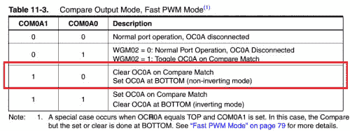
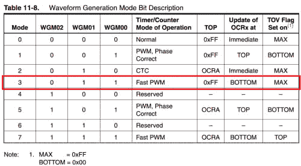

# 冶金 101 - AVR PWM

> 原文：<https://dev.to/ladvien/metallurgy-101-avr-pwm-19ei>

这是我的[机器人冶金 101 课日志](http://letsmakerobots.com/node/39996)的延续。

在我能够使用 SN754410 让我的电机运转起来后，我开始有点沉迷于理解 AVR PWM 架构。有几个教程对我帮助很大:

1.  新手黑客的[“PWM 简介”](http://www.newbiehack.com/MicrocontrollerIntroToPWM.aspx)
2.  新手黑客的[“用 PWM 控制伺服系统。”](http://www.newbiehack.com/MicrocontrollerControlAHobbyServo.aspx)
3.  humanHardDrive 的" [PWM](http://www.youtube.com/watch?v=ZhIRRyhfhLM)
4.  maxEmbedded 的" [AVR 定时器- PWM 模式](http://maxembedded.com/2012/01/07/avr-timers-pwm-mode-part-ii/)

最后，我破解了 maxEmbedded 代码，并在大约 10 分钟内让我的 PB3 LED 正常工作。然后，我花了接下来的三个晚上阅读，试图弄清楚 maxEmbedded 的代码在做什么。

真的，是寄存器和位名让我犯了错误。每个都有类似于“TCCROA1”和“OCR0A”等名称。每个都是一个[首字母](http://en.wikipedia.org/wiki/Acronym)。这对我来说是个问题，我很快就迷失在代表抽象概念的 inti alism 丛林中，比如其他 inti alism。我觉得自己好像在磕磕绊绊地读着[乔治·麦克唐纳](http://en.wikipedia.org/wiki/George_Macdonald)关于兽人语言的论文:

[https://www.youtube.com/embed/voWenZRJcD0](https://www.youtube.com/embed/voWenZRJcD0)

注:亲爱的读者，如果那个视频让你更加困惑，我道歉。再说一遍，这是一本日记，帮助我记住我所学的东西。我发现对我来说，增加一个故事来嘲笑抽象概念是必要的。

好了，现在我脑子里有了一个小故事来处理 AVR 上学习 PWM 的初始过程，变得稍微容易了一些。

以下是我的参考列表:

**1。TCCR =定时器/计数器控制寄存器。**

ATtiny1634 有 4 个控制寄存器。一个是 8 位，一个是 16 位。不过，这个日志将坚持 Arduino 标准，这意味着，我将使用我的 16 位作为 8 位。下面是四个定时器/计数器控制寄存器名称:

1.  t croa(8 位)
2.  TCCROB (8 位)
3.  TCCR1A (16 位)
4.  TCCR1B (16 位)

t croa(8 位定时器)和 t crob(16 位定时器)控制引脚的 PWM 功能。

*   t croa/B 控制引脚 PA5 和 PA6。
*   TCCR1A/B 控制引脚 PC0 和 PB3。

**2。COM =比较输出模式**

每个 TCCR 寄存器有四位控制每个引脚的比较输出。这就是奇迹发生的地方。如果引脚设置为比较输出模式，只有当计数器等于或大于您提供的数字时，它才会变为高电平。举个例子，

*   **计时器是否大于 100？然后往高处走。**

这就是 PWM 的精髓。你提供一个数字，在我们的例子中是一个 0-255 之间的数字，因为它是一个 8 位计数器，如果定时器等于或大于你的数字，pin 将为高。然后，计时器将继续向上计数，并在达到 255 后重置为 0。请注意，比较是在计数器的每个滴答进行的，所以当它重置为 0 时，将进行比较，并且引脚将在之前变为低电平。瞧吧！

每个 TCCR 寄存器中有四个 COM 位，其中两个控制一个引脚的输出。

**在 TCCR0A 中找到:**

1.  COM0A0 和 COM0A0 控制引脚 PC0。
2.  COM0B0 和 COM0B0 控制引脚 PA5。

**发现于 TCCR1A:**

1.  COM1A0 和 COM1A1 控制引脚 PB3。
2.  COM1B0 和 COM1B1 控制引脚 PA6。

现在，切换这些位可以产生许多不同类型的输出。但是我坚持使用 Arduino 标准。

[T2】](https://res.cloudinary.com/practicaldev/image/fetch/s--6EAPXpEM--/c_limit%2Cf_auto%2Cfl_progressive%2Cq_auto%2Cw_880/https://ladvien.cimg/FAST_PWM_8BIT_COM0A1.png)

**3。WGM =波形生成(用于 8 位)**

有 3 位控制我们最终使用的 PWM 类型。有各种各样的波形，但主要有三种:

1.  相位校正
2.  同ＣIＴＹ ＴＥＣＨＮＯＬＯＧＹ ＣＯＬＬＥＧＥ
3.  快速 PWM

([这里](http://arduino.cc/en/Tutorial/SecretsOfArduinoPWM#.Uwjeo_ldV8E)是一篇 Arduino 的文章，稍微解释了一下它们。)

我要调用的是快速 PWM，

[T2】](https://res.cloudinary.com/practicaldev/image/fetch/s--zpk2ncfH--/c_limit%2Cf_auto%2Cfl_progressive%2Cq_auto%2Cw_880/https://ladvien.cimg/8_Bit_PWM_WGM.png)

我们通过设置 WGM00 和 WGM01 位来选择。

**4。如何设置 TCCR 寄存器？**

因此，设置好之后，代码看起来会像这样，

```
// Demonstration of PWM on an ATtiny1634.
// C. Thomas Brittain

#define F_CPU 8000000    // AVR clock frequency in Hz, used by util/delay.h
#include <avr/io.h> #include <util/delay.h>  
//Initialize PWM
void pwm_init()
{
    //This is the first PWM register, TCNT0\. It is 8 bit.  Both PIN PA5 and PA6 are set to clear on compare,
    //then set at bottom; this makes them non-inverting.  The WGM bits are set to for "Fast PWM MODE"
    //and this clears at the top, "0x00FF."
    TCCR0A = 0b10100011; // WORKS FOR OC0A, OC0B
    TCCR0B = 0b00000001; // WORKS FOR OC0A, OC0B

    //This is the second PWM register;TCNT1\. It is 8 bit.  Both PIN PB3 and PC0 are set to clear on compare,
    //then set at bottom; this makes them non-inverting.  The WGM bits are set to for "Fast PWM MODE"
    //and this clears at the top, "0x00FF."
    TCCR1A = 0b10100001;  //WORKS FOR OC1A, OC1B
    TCCR1B = 0b00001001;  //WORKS FOR OC1A, OC1B

    //This sets the PWM pins as outputs.
    DDRB |= (1<<PINB3);
    DDRA |= (1<<PINA5);
    DDRA |= (1<<PINA6);
    DDRC |= (1<<PINC0);

} 
```

Enter fullscreen mode Exit fullscreen mode

我将 TCCR 寄存器的赋值保留为二进制格式。这对我来说很简单，但是你也可以很容易地使用位运算，例如

```
TCCR1A |= (1<<COM1A1)|(1<<WGM01) 
```

Enter fullscreen mode Exit fullscreen mode

您会注意到我们设置了 COM0A1 或 COM1A1 位，但稍后我会进行更改，使它们不会在初始化时设置。我发现，如果你一开始就把管脚连接到定时器上，那么它们会一直有一个标称电压。如果引脚上有一个 LED，这一点会更清楚。因此，除非将 COM0A1 和 COM1A1 位设为低电平，否则 LED 永远不会完全关闭。

此外，我们必须将 PWM 引脚的数据方向寄存器设置为输出。

现在，初始化已经完成，让我们来看看我用来演示 ATtiny1634 上的 PWM 的代码。

```
int main()
{
    uint8_t brightness;

    // initialize timer0 in PWM mode
    pwm_init();

    //Setup several duty-cycle counters to show differential PWM channels.
    uint8_t brightness2 = 0;
    uint8_t brightness3 = 0;
    uint8_t brightness4 = 0;

    //Let's only do this 3 times before turning PWM off.
    for (int counterB = 0; counterB < 2; ++counterB){

        //The main duty PWM cycle counter will also be our loop counter. (0-255)
        for (brightness = 255; brightness > 0; --brightness)
            {
                // set the brightness as duty cycle
                brightness2 = brightness2 + 1;
                brightness3 = brightness3 + 2;
                brightness4 = brightness4 + 10;

                OCR0A = brightness;   // PCO0
                OCR0B = brightness2;  // PA5
                OCR1A = brightness3;  // PB3
                OCR1B = brightness4;  // PA6

                //Delay to make changes visible.
                _delay_ms(40);
            }

            //After 3 loops clear the PWM channels by setting COM0A1 and COM0B1 bits low.
            //If this is not done then there will be a nominal voltage on these pins due to
            //the internal pull-ups setting them as outputs.
            TCCR0A = 0b00000011; // WORKS FOR OC0A, OC0B
            TCCR1A = 0b00000011; // WORKS FOR OC0A, OC0B
        }
} 
```

Enter fullscreen mode Exit fullscreen mode

你会注意到这是来自 Arduino 世界的修改过的“褪色”草图。

上面的代码提供了这个输出，

[https://www.youtube.com/embed/6dTCbc8Pd1Q](https://www.youtube.com/embed/6dTCbc8Pd1Q)

AVR 的神奇之处在于输出比较寄存器，

1.  OCR0A -控制 PC0
2.  OCR0B -控制 PA5
3.  OCR1A -控制 PB3
4.  OCR1B -控制 PA6

基本上，OCR 寄存器根据您分配给它的数字将引脚翻转为高电平或低电平(由 TCCR 设置)。如果给 OCR0A 赋值 144，它将在 144 个时钟周期(TCNT)为低电平(0v ),在 111 个时钟周期为高电平(5v)。这就是我们的 PWM。Booyah！

*   OCROA = 127

这将 PC0 设置为大约 2.5v。(127/255 位* 5v = ~2.5v)

*   OCR1A = 255

这将 PB3 设置为 5v。(255/255 位* 5v = 5v)

好吧，这是个棘手的问题，

*   OCR0A = 0；

这应该会将 PC0 设置为 0v，但事实并非如此。当我们设置 COM 寄存器(COM0A1 等)时。)有内部上拉电阻连接到相应的引脚。这导致标称电压恒定，除非 COM 寄存器再次设为低电平。

这可以通过对 TCCR 寄存器使用 XOR 运算符来完成，

*   TCCRO ^= (1<<com0a0></com0a0>

这应该会将 PC0 引脚设为 0v。

真的就这么简单...嗯，除非你想搞乱你正在创造的 PWM 类型。呃。

**5。ATtiny1634 analogWrite.h**

在我弄清楚如何在 ATtiny1634 上使用 PWM 后，我开始想为它重新创建 Arduino 库该有多好。

能够写作，

*   analogWrite(pin，强度)

对我有很大的吸引力。

我玩了一会儿，最后得到了下面的内容，

```
#ifndef analogWrite1634
#define analogWrite1634 
#include <avr/io.h> #include <util/delay.h>  
void analogWrite(int PWM_PinSelect, int duty);

// initialize PWM
void pwm_init()
{
    //Define PWM pins.
    #define PWM_PC0 1
    #define PWM_PA5 2
    #define PWM_PA6 3
    #define PWM_PB3 4 
    //This is the first PWM register, TCNT0\. It is 8 bit.  Both PIN PA5 and PA6 are set to clear on compare,
    //then set at bottom; this makes them non-inverting.  The WGM bits are set to for "Fast PWM MODE"
    //and this clears at the top, "0x00FF."
    TCCR0A = 0b00000011; // WORKS FOR OC0A, OC0B
    TCCR0B = 0b00000001; // WORKS FOR OC0A, OC0B

    //This is the second PWM register;TCNT1\. It is 8 bit.  Both PIN PB3 and PC0 are set to clear on compare,
    //then set at bottom; this makes them non-inverting.  The WGM bits are set to for "Fast PWM MODE"
    //and this clears at the top, "0x00FF."
    TCCR1A = 0b00000001;  //WORKS FOR OC1A, OC1B
    TCCR1B = 0b00001001;  //WORKS FOR OC1A, OC1B

    //This sets the PWM pins as outputs.
    DDRB |= (1<<PINB3);
    DDRA |= (1<<PINA5);
    DDRA |= (1<<PINA6);
    DDRC |= (1<<PINC0);

}

void analogWrite(int PWM_PinSelect, int duty){

    //Make sure we were passed a number in-range.
    if (duty > 255) duty = 255;
    if (duty < 1) duty = 0;

    //Sets PWM for PC0
    if (PWM_PinSelect == 1){
        if (duty > 0){
            TCCR0A |= (1<<COM0A1);
            OCR0A = duty;
        }
        else {
            TCCR0A ^= (1<<COM0A1);
        }
    }

    //Sets PWM for PA5
    if (PWM_PinSelect == 2){
        if (duty > 0){
            TCCR0A |= (1<<COM0B1);
            OCR0B = duty;
        }
        else {
            TCCR0A ^= (1<<COM0B1);
        }
    }

    //Sets PWM for PA6
    if (PWM_PinSelect == 3){
        if (duty > 0){
            TCCR1A |= (1<<COM1B1);
            OCR1B = duty;
        }
        else {
            TCCR1A ^= (1<<COM1B1);
        }
    }

    //Sets PWM for PB3
    if (PWM_PinSelect == 4){
        if (duty > 0){
            TCCR1A |= (1<<COM1A1);
            OCR1A = duty;
        }
        else {
            TCCR1A   ^= (1<<COM1A1);
        }
    }

}

#endif 
```

Enter fullscreen mode Exit fullscreen mode

图书馆的简介，

*   第 1-2 行和第 90 行确保该库只被包含一次。
*   第 13-16 行定义了 ATtiny1634 引脚。
*   18-28 设置 TCCR 寄存器(注意，引脚开始断开以防止标称电压)。
*   41-42 确保我们的 PWM 值在范围内。
*   46-85 控制每个引脚上的 PWM，如果将 PWM 值 0 传递给该函数，else 语句将为我们提供一个真正的零电压。

我把它保存为 **1634analogWrite.h** ，然后写了一个草图来使用

```
// program to change brightness of an LED
// demonstration of PWM
//void Tiny1634_PWM(int PWM_PinSelect, int duty);

#define F_CPU 8000000    // AVR clock frequency in Hz, used by util/delay.h
#include <avr/io.h> #include <util/delay.h> #include "1634analogWrite.h"  
int main()
{
    uint8_t brightness;

    // initialize timer0 in PWM mode
    pwm_init();
    int brightness2 = 255;
    int brightness3 = 255;
    int brightness4 = 255;
    // run forever
    while(1)
    {
        for (brightness = 255; brightness > -1; --brightness)
        {
            analogWrite(PWM_PC0, brightness);
            analogWrite(PWM_PB3, brightness2);
            analogWrite(PWM_PA5, brightness3);
            analogWrite(PWM_PA6, brightness4);

            _delay_ms(10);
            brightness2 = brightness2 - 5;
            brightness3 = brightness3 - 10;
            brightness4 = brightness4 - 15;

            if (brightness == 0)
            {
                _delay_ms(1000);
            }
            if(brightness2 < 0) brightness2 =255;
            if(brightness3 < 0) brightness3 =255;
            if(brightness4 < 0) brightness4 =255;
        }

    }
} 
```

Enter fullscreen mode Exit fullscreen mode

好的。我可能会用一个完整的 H 桥控制库再次讨论这个问题。

一如既往，请随时纠正我的错误。 **:)**