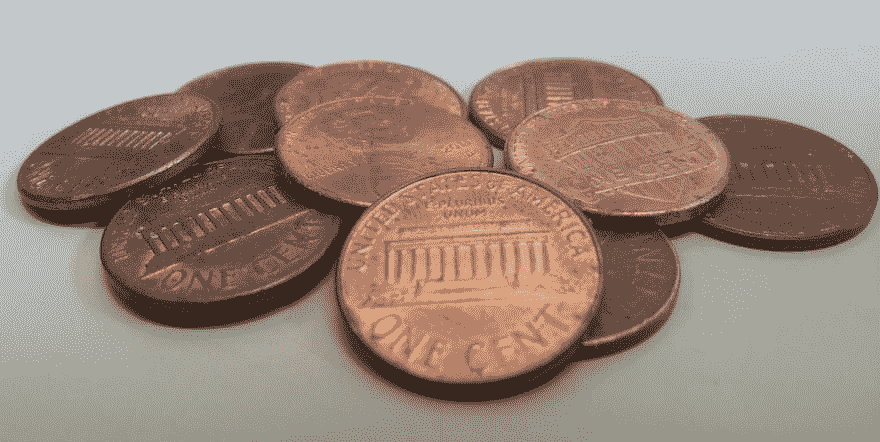

# 在浏览器中挖掘加密并不邪恶。

> 原文：<https://dev.to/scampiuk/mining-for-crypto-in-the-browser-is-not-evil-330j>

[T2】](https://res.cloudinary.com/practicaldev/image/fetch/s--ObrShQ3Q--/c_limit%2Cf_auto%2Cfl_progressive%2Cq_auto%2Cw_880/https://cdn-images-1.medium.com/max/960/1%2AC1qnCfK-xsnL6-lqgwkRHw.jpeg)

老观点是互联网上的内容需要付费。一切都是由爱好者和人们在业余时间创造的日子已经一去不复返了。今天的内容和平台质量高，制作成本高，目前我们只有三种模式可以支付费用:

1.  订阅或按内容付费。你想要吗？打开你的钱包——视频和音乐等高端内容的订阅模式越来越受欢迎，这很好。但它并没有真正渗透到那些你认为不应该花钱买的东西，那些没有真正的、切实的价值感的东西。我当然会订阅 [Google Play Music](https://play.google.com/intl/en_uk/about/music/index.html) 、 [Amazon Prime](http://www.amazon.co.uk/tryprimefree?tag=imnotplayinga-21) 和 [Strava](https://www.strava.com/premium) ，但是我会每月付费使用 Twitter 吗？号码
2.  广告和营销你就是这里销售的产品，不要抱有幻想。希望你喜欢广告。你在你所在位置 10 英尺内成为目标，每个人都知道你现在的心情，以及你是否打算在接下来的 10 分钟内买一个烤面包机或一杯咖啡。感觉有点脏？
3.  捐款。那件事你下次会有时间去做的。

所以，现在有了第四种选择的想法。一点代码运行在你正在充分利用的网站、扩展或应用程序中，悄悄地、不引人注目地使用你的一些 CPU 周期，为它的创造者赚一点钱。你免费获得内容，他们付费——这就是在浏览器中挖掘硬币可能导致的结果。

现在，有一个选择，有一个没有广告的商业模式。这种模式不会试图从你身上榨取最后一点点收入，因为钱是你在网站上赚来的。矿工不关心你是谁，也不关心你的购物心情，它只是开始挖掘给定加密货币的一小部分。

有那么糟糕吗？显然人们是这样认为的。

这是我们一周以来对一个扩展的两个真实评论。当它被发布在 Reddit 上时，这些就被贴了出来，它包含了 miner——这是我们从一开始就放在扩展描述中的。

> 没有哪个插件值得给作者 CPU 时间和电。那是一个硬币矿工从你身上拿走的。

没有插件？我使用一些能让我的工作日变得更轻松的工具，因为它们的作者创造了一些东西，我会尽可能地捐款或付费。如果我不必这样做，因为我在浏览器中打开他们的工具的每一个小时，都为他们赚了钱，那会怎么样？网站呢，如果他们能给我提供无广告、免费追踪的体验，这同样适用吗？

这是另一个

> 他拿走你的电费和账单来支付他的。

有人占用你的屏幕空间给你看广告，这有什么区别吗？这几乎定义了所有的品牌意识广告活动。

我不会在这里说这项技术不会有它的问题。人们会滥用它，因此其他人会不信任它。我个人是在一个周末前阅读了海盗湾所做的事情后了解到这一点的。当新闻文章中包含“隐藏”和“秘密”这两个词时，给世界的第一印象并不好。

但是，我不会说这是一个糟糕的技术以太。一个无广告的网络，以及因此而更加匿名的网络，是我们应该感到兴奋的事情。

让我们不要拘泥于内容创作者能够赚到足够的钱来支付账单的方式。