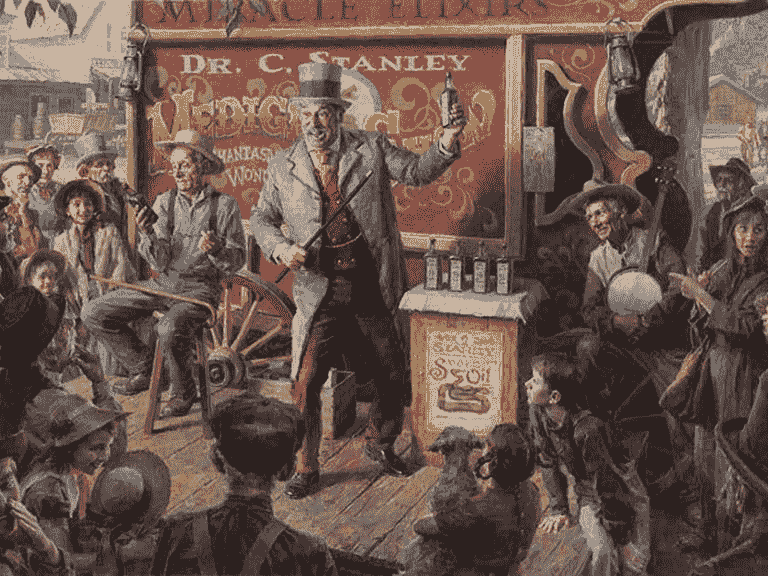

# 现代搜索引擎优化:蛇油与物质

> 原文：<https://dev.to/gaijinity/modern-seo-snake-oil-vs-substance-lk5>

# 现代 SEO:蛇油 vs .物质

### SEO 得到了十个不好的说唱；但是大部分都是理所应当。这里有一个现代搜索引擎优化应该如何做的指南

安德鲁·韦尔奇

[T2】](https://res.cloudinary.com/practicaldev/image/fetch/s--XY1YlI0W--/c_limit%2Cf_auto%2Cfl_progressive%2Cq_auto%2Cw_880/https://nystudio107-ems2qegf7x6qiqq.netdna-ssl.com/img/blog/_768x576_crop_center-center_82_line/snakeoil.jpg)

每当和我一起工作阿尔客户谈到他们正在聘请的 SEO 公司时，我都会深吸一口气。虽然确实有一些非常有价值的搜索引擎优化公司，但它们少之又少。

我见过客户收取大量的钱来购买从 [WooRank](https://www.woorank.com) 、 [Google Page Speed Insights](https://developers.google.com/speed/pagespeed/insights/) 或其他自动排版工具复制和粘贴的有效建议。这些都是很棒的工具，我都使用它们(参见[一个公正的网站是不够的](https://dev.to/gaijinity/a-pretty-website-isn-8217-t-enough-1nbj-temp-slug-3932740)文章)，但是复制&对任何人来说都没有多大用处。

我见过各种各样的荒谬的主张和被禁止的可疑的实践。这很有效。有很多公司除了 SEO 什么都不做。

<aside>The rea­son it works is like cures for bald­ness or fad diets, SEO promis­es some­thing that every­one wants. It plays on our base desires.</aside>

每个人都想出现在谷歌搜索结果的第一页。每个人都梦想着建立一个网站，让全世界的人都来到他们的门前。但事实并非如此，伙计们。想想看:每个人都想出现在谷歌搜索结果的第一页。

引用我最喜欢的电影之一:

<aside>You’re not spe­cial. You’re not a beau­ti­ful and unique snowflake. You’re the same decay­ing organ­ic mat­ter as every­thing else.</aside>

好吧，这有点苛刻。但事实是，让每个人都出现在谷歌搜索结果页面(SERP)的第一页是完全不可能的。每页最多有*10 个搜索结果，而外面有*百万个网站。如果每个人都是特别的，那么没有人是特别的。**

谷歌的整个商业模式都在做一件事:当人们搜索某样东西时，给他们想要的东西。你的网站可能不是人们想要的，不管你认为它有多棒。除了改变事物的自然顺序之外，你的网站甚至会完全按照它在 SERP 上的排名。

过去，不道德的 SEO 公司试图通过游戏系统来改变事物的自然秩序。有些人仍然这样做，但是随着谷歌积极地兜售 SEO 垃圾信息，这种前景就不那么吸引人了。事实上，谷歌已经[改变了他们的核心算法](http://searchengineland.com/google-panda-is-now-part-of-googles-core-ranking-signals-240069)，这种方式将使许多商业模式过时。

今天，人们谈论入境营销、出境营销、SEO、SEM、增长黑客等等。搜索引擎优化产业很大程度上是一个 B2B 产业——但我不是指商业对商业——我是指商业术语。但也不全是坏事，对吧？不是。

<aside>There are legit SEO firms that do A/B test­ing, quan­ti­fy results, and approach SEO/SEM as a real science.</aside>

但是我在这里说的太多了，因为它们不是标准。

在我们深入了解什么是现代 SEO 之前，先讨论一下什么是*不是*是有帮助的。搜索引擎优化不是一门艺术。没有水晶球。没有黑色 mag ic。没有小鸡需要被神圣的原谅。它是决定性的，可测量的。

这里有一个真实的搜索引擎优化测试的例子。

## 现代 SEO

这不全是厄运和黑暗；我们确实可以做些事情来使我们的网站在 SERP 上更好。但这不是杂志，这是工作。

[T2】](https://res.cloudinary.com/practicaldev/image/fetch/s--e_vNbUPU--/c_limit%2Cf_auto%2Cfl_progressive%2Cq_auto%2Cw_880/https://nystudio107-ems2qegf7x6qiqq.netdna-ssl.com/img/blog/_1200x675_crop_center-center_82_line/chaplin_modern_times.jpg)

<aside>Mod­ern SEO is real­ly about best practices.</aside>

从现代 SEO 的角度来看，以下是你可以做的最重要的事情:

1.  创造好的内容
2.  实施良好的技术调用 SEO
3.  确保你的网站是高性能的
4.  监控、测试和修改你的网站
5.  提升你的网站

天哪，这似乎是显而易见的，不是吗？我将深入探讨每一个的细微差别。

## 创造良好的内容

设计者、开发者和营销者都非常习惯于创建对人们有益的网站。它们看起来不错，而且内容丰富。

通过这样做，他们也意外地制作了适合搜索引擎的网站。记住，谷歌的目标是当人们搜索某些东西时，返回他们想要的结果。所以如果你创造了人们想要的东西，你已经成功了一半。

如果你创造了好的内容，人们会分享它。他们会链接到它。你甚至可能成为某个类似话题的作者 ty 的答案。

<aside>This is how flow­ers mar­ket them­selves. They don’t bom­bard the local bees with ​“email blasts”, they just look & smell pretty.</aside>

内容还必须是人们关心的产品、服务或兴趣。我可以写出世界上最精彩的关于地鼠的交配习惯的内容，但是吸引力并没有那么大。

创造好的内容意味着你的内容应该很好地反映你认为人们可能会搜索到的关键词。记住，不是你认为内容是关于什么的，而是人们在搜索时会用什么词。

有很多工具会给你你的内容所反映的关键词；如果你正在使用 Craft CMS，SEO mat ic 插件的 SEO met rics 特性会为你做这件事。

内容也应该是易读的；有许多自动匹配的读能力测试，Flesch–Kin 所谓的读能力测试是一个很流行的测试。同样，SEO mat ic 会为你做这件事，也有[网站](https://www.online-utility.org/english/readability_test_and_improve.jsp)会为你做这件事。

在你为一个页面写内容之前，你应该想一想你认为人们可能会用什么搜索词来找到你的页面。然后把它们记在心里写下你的内容，并在你的工作流程中加入对内容的测试，以确保它反映了你的目标关键词并易于阅读。

就像你在写学期论文前要列出一系列关键概念一样，在这里也要这样做。不要疯狂地输入关键词，因为那只会惹恼那些真正阅读你内容的人，搜索引擎也很聪明能嗅出你的内容。

<aside>Do, how­ev­er, ensure that you have key­word con­sis­ten­cy in your Head­ing tags, in your image’s ALT prop­er­ties, in your page  tag, in your URLs, and in your content.</aside>

最后，使用你的[谷歌分析](https://accounts.google.com)和[谷歌搜索控制台](https://www.google.com/webmasters/tools)来查看人们在找到你的页面时实际使用的搜索词，并根据需要进行调整。

## 实现好的技术调用 SEO

一旦我们有了好的文案，我们就需要做好技术上的准备。一个好的技术实现是关于你的内容被接受的*潜力*。

如果你展示自己，刮胡子，做头发，穿上漂亮衣服，也许喷点古龙水或香水，脸上带着微笑，你就有更好的机会遇到那个特别的人，而不是衬衫上沾着污渍从床上爬起来。

[T2】](https://res.cloudinary.com/practicaldev/image/fetch/s--xoM6lASj--/c_limit%2Cf_auto%2Cfl_progressive%2Cq_auto%2Cw_880/https://nystudio107-ems2qegf7x6qiqq.netdna-ssl.com/img/blog/_1200x675_crop_center-center_82_line/on-a-date.jpg)

这并不意味着这是去 hap pen，但它肯定使它更像 ly。所以让我们释放我们的潜力:

*   **有效的 HTML** —你的网站应该通过 [W3C Val ida tor](https://validator.w3.org/) 以确保人和机器人都能够使用它
*   **元标签**—[标题](https://moz.com/blog/title-tag-length-guidelines-2016-edition)、[元描述](https://moz.com/learn/seo/meta-description)以及其他标签的长度应该合适，并且在每页上都应该是唯一的
*   **https** —你的网站应该用`https`加密；现在有了 [LetsEn crypt](https://letsencrypt.org/) 证书就免费了，所以没有借口了！
*   **XML 网站地图**——你应该有一个 [XML 网站地图](https://support.google.com/webmasters/answer/156184?hl=en)，你把它提交给谷歌，这样它就知道如何抓取你的页面
*   **结构化数据**——您应该实现 [JSON-LD 结构化数据](https://developers.google.com/search/docs/guides/intro-structured-data)，这样 Google 就可以将其添加到他们的[知识边缘图](https://www.google.com/intl/es419/insidesearch/features/search/knowledge.html)中，或者通过[富卡](https://developers.google.com/search/docs/guides/search-gallery)在 SERP 上发布(这只是 JSON-LD 结构化数据子集的名称)。有关 JSON-LD 结构数据的更多信息，请查看 [JSON-LD 结构数据和 Erot i ca](https://nystudio107.com/blog/json-ld-structured-data-and-erotica) 文章。
*   **手机好友 ly**——你的网站应该在[谷歌手机好友 ly](https://testmysite.thinkwithgoogle.com/) 测试中表现出色
*   推特卡 —实现[推特卡](https://dev.twitter.com/cards/overview)这样当有人在推特上分享一个链接时，你可以把你的品牌信息&附在上面
*   **脸书打开图**——在[脸书](https://developers.facebook.com/docs/sharing/webmasters)、[脸书](https://developers.pinterest.com/docs/rich-pins/overview/?)和[脸书](https://api.slack.com/docs/message-attachments)上实现社交分享的脸书打开图
*   **关键词一致性**——让关键词一致性出现在你的标题标签、图片属性、页面标签、网址和内容中
*   **robots . txt**—[robots . txt](http://www.robotstxt.org/robotstxt.html)是一个文本文件，指导机器人(典型的搜索引擎机器人)如何抓取和索引网站上的页面
*   **URL 优化** —你的网站 URL 应该是描述性的，但要精确，易读，如果可能的话，不要有热地矩形。像这样:`nystudio107.com/blog/a-pretty-website-isnt-enough`不像这样:`nystudio107.com/satr/?pid=12?aid=142`
*   **rel=publisher** —实现`<link rel="publisher">`标签(是的，Google+在某些方面是好的)，因为它会影响你的[品牌在 SERP 上的表现](https://www.woorank.com/en/blog/how-to-implement-rel-publisher-tag)
*   **heading Tag Hier chy**—heading Tag 应用于[页面上有效的结构内容](https://www.woorank.com/en/edu/seo-guides/html-header)
*   **不要重复内容**——如果你在多个网址上展示同一个页面，使用`<link rel="canonical">`来确保你的[内容不会被冲淡](https://moz.com/blog/canonical-url-tag-the-most-important-advancement-in-seo-practices-since-sitemaps)

这可能看起来是一个很大的列表，而一天中只有这么多时间。这就是为什么你应该利用像 [SEO mat ic](https://github.com/nystudio107/seomatic) 这样的工具(或者任何你选择的 CMS 工具)来帮你完成繁重的工作，而不是控制方向盘。

您会注意到，虽然这些亮点中有许多是针对搜索引擎的，但也有一些是针对人类的。这是因为现在你真的希望你的内容可以被分享和访问，这也意味着让它对人类有益。

如果你是一个正在使用 [JAM stack](https://jamstack.org/) 的酷小孩，请确保你正在 ed con tent 上做你的 JavaScript 生成器的服务器端呈现。虽然谷歌在过去发布了 JavaScript，但实际上，这是另外一个故事。

虽然还有更多的事情可以做，但这确实是优秀技术搜索引擎优化的坚实基础。

## 确保你的网站性能良好

这篇文章清楚地表明，仅仅有一个好的网站是不够的。它因人而异，能极大地影响你的跳出率、品牌声誉等等。但是在 SEO 方面也很重要。

许多人都知道谷歌把页面速度作为搜索引擎结果页面的排名指标。但是如果这还不足以让你的网站适合 mant 的话(这是应该的！)，请继续阅读。

[T2】](https://res.cloudinary.com/practicaldev/image/fetch/s--j9EkUqar--/c_limit%2Cf_auto%2Cfl_progressive%2Cq_auto%2Cw_880/https://nystudio107-ems2qegf7x6qiqq.netdna-ssl.com/img/blog/_1200x675_crop_center-center_82_line/usain-bolt-celebrating.jpg)

谷歌有一个机器人，名字叫“谷歌机器人”。它抓取你的网页并索引它们；但是它有一个[抓取器，用于获取每个网站的](http://www.dirigodev.com/blog/seo-web-best-practices/page-speed-increasing-googlebot-crawl-budget-part-5/)，甚至是该网站上的每个网页。一旦谷歌搞砸了它的爬虫，它就想索引一些更有趣的东西。

因此，你的网站的 mant 访问量越大，Google Bot 在其爬虫程序中可以索引的页面就越多。这意味着更好地覆盖你的网站整体，更好地覆盖你的谷歌认为不太重要的长尾搜索内容。

所以，让你的网站更快。如果对你来说有意义的话，你甚至可以在你的网页上设置谷歌版本。

## 监控、测试和修改你的网站

所以你已经做了所有这些，你已经写了 10 个很棒的文案，你的技术已经搞定，你的网站已经很快了。我们完了，对吧？

没有。

SEO 不是一个静态的东西；这是一些需要监控和治疗的事情。如果你的客户没有这种勇气，没关系。但如果他们让你或其他人继续做持续的监控和治疗，情况就会不同了。

<aside>Let your clients know that a web­site with­out active SEO cura­tion is like a car that’s nev­er tak­en in for reg­u­lar main­te­nance. It’ll decline over time.</aside>

这意味着创造新的内容，通过社交媒体渠道分享，也意味着定期分析你的[谷歌分析](https://accounts.google.com/)和[谷歌搜索结果](https://www.google.com/webmasters/tools)，看看哪些有用，哪些没用。

对于大型组织来说，这意味着 A/B 测试，看看人们对什么有反应，对什么没有反应。这也意味着监控你打给行动频道的电话，看看人们在哪里下车。

对所有这些的全面讨论超出了本文的范围，如果超出了您通常所做的范围，很可能需要雇佣一家 SEO 公司。对你雇佣的人挑挑拣拣。

如果他们谈论“链接建设”或“上谷歌首页”，运行。很快。

在与我合作的搜索引擎优化公司见面之前，我总是通过一系列搜索引擎优化和性能测试来运行它们的网站。如果他们不能在自己的网站上做好，就不会对他们在我的网站上的表现产生信心。

如果你的搜索引擎优化技术很好，你有很好的内容，你的产品/服务也很好…你可能根本不需要搜索引擎优化公司。

那里。我说了。

## 提升你的网站

我意识到在一个社交媒体和增长黑客的时代，这将会令人震惊。但是，是的，你确实需要推广你的网站！

无论是通过社交媒体广告、传统印刷广告、 [Google AdWords](https://adwords.google.com/home/) 还是其他方式，都需要去做。

[T2】](https://res.cloudinary.com/practicaldev/image/fetch/s--DY3wkOKp--/c_limit%2Cf_auto%2Cfl_progressive%2Cq_auto%2Cw_880/https://nystudio107-ems2qegf7x6qiqq.netdna-ssl.com/img/blog/_1200x675_crop_center-center_82_line/megaphone.jpg)

在电影中,*“如果你建造了它，他们就会来”*可能行得通，但在现实生活中却行不通，因为在现实生活中*数百万的竞争对手和你一样渴望得到关注。*

你可以建造世界上最好的 wid get，但是如果没人知道，你就卖不出去。这意味着人们不能适应它，你最终只能在蒙古做一个牧羊人。

我把这个列在最后，因为它很明显，很有希望，但也因为你真的想先做其他事情。

<aside>Before you spend buck­ets of mon­ey on an adver­tis­ing cam­paign, have your good con­tent, tech­ni­cal SEO, and per­for­mance nailed. That’s how you’ll get the most bang for your buck</aside>

只有在你开始了一个昂贵的广告计划后，写好的内容，进行优化是没有任何意义的。用你的广告来点燃 SEO glo ry 的火焰。如果你建造得恰到好处，它会走的。

如果你想学习更多关于 SEO 的知识，Begin ner 的 SEO 指南是一个很好的起点。

祝大家好运！

## 进一步阅读

如果你想获得新文章的通知，请在 Twitter 上关注[纽约时报 107](https://twitter.com/nystudio107) 。

版权所有 2020 nystudio107。由 nystudio107 设计