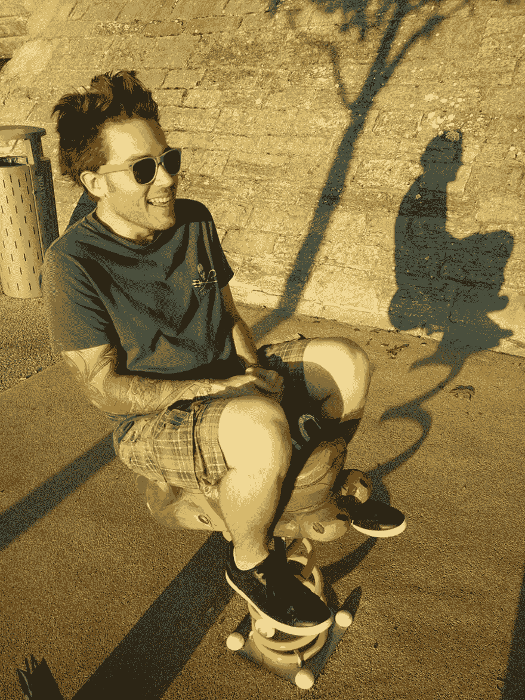

# 我在 NWX 食堂的面试

> 原文：<https://dev.to/adriantombu/mon-interview-a-la-cantine-nwx-84h>

# 我在#NWX 食堂的采访

在 10 月份，我有幸接受了鲁昂 NWX 数字食堂休息站克莱尔的采访。你可以在下面找到——下面是完整的采访！

## 你是谁？你能简单介绍一下自己吗？

> 我叫 Adrian 我穿 42 号鞋我更喜欢穿短裤的拳击手。在生活中，我就是所谓的书呆子，一个人在电脑屏幕前花了很多时间鼻子我太喜欢这个了，所以我做了我的工作:我是一个自由的网络和移动开发者，一个比利时人，一个诺曼人，一个布列塔尼人。

## 小时候你梦想成为

> 宇航员！但在我看来，这无疑是妥协的，尽管我仍然抱有一种疯狂的希望，希望有一天能去太空漫步。
> 
> 否则，我会利用互联网的魔力跟踪火星上机器人的朝圣之旅、现场火箭发射(我对 SpaceX 有一点好感)以及欣赏哈勃望远镜的美丽照片。

## 你工作之外有激情吗？

> 老实说，不是真的。我对很多事情都很感兴趣，所以无法表达热情。最近，我通过玩 Arduino 进入了电子领域，这将使我以后能够进入一个我非常感兴趣的领域:家庭影院或互联家庭。没有什么比能够在不动沙发的情况下关闭智能手机上的商店更好的了，不是吗？

## 我们经常在食堂见到你，你为什么来-你呢？

> 去见很多好人！我在他的诺诺波利斯租了一个办公室但我觉得定期去见世界很重要这样我就不会一个人呆在这里了。这也是向全世界证明开发人员也可以是一个随意社交的物种的一种方式！

[T2】](https://res.cloudinary.com/practicaldev/image/fetch/s--sWrd9wPL--/c_limit%2Cf_auto%2Cfl_progressive%2Cq_auto%2Cw_880/https://blog.otso.img/2016-10-17-mon-interview-a-la-cantine-nwx/stupid-man-having-fun.jpg)

## 你今天能给我们介绍一下你的项目和以后的抱负吗？

> 如上所述，我是一名自由职业开发人员我非常赞赏可以随意安排我的工作，而不必向上级报告。从这个角度来看，我认为我的未来有点像是成功企业家的对立面:少工作，活得更好！

## 你的日常任务是什么？

> 通常，无论是直接与客户联系还是外包，我都可以处理定制的 web 或移动应用程序。事实上，在过去几个月里，我开发了一个移动人力资源应用程序，一个全国性协会的基于网络的无障碍热线，参与了一个大型的网上餐饮销售网站的重新设计，并为新成立的公司开发了一个众包测试工具。

## 食堂给你带来了什么项目/工作？

> 主要是约会！我可以与项目参与者讨论，向他们提供一些建议，或将他们推荐给能够帮助他们发展业务的人。食堂还允许我做牛仔工作，这有时导致我和一些熟悉的地方一起工作

最后一点:咖啡是免费的，比咖啡经销商的好得多！

## 一个推特，facebook pro，博客向我们传达？

*   [https://otso.fr](https://otso.fr)
*   [https://twitter.com/adriantombu](https://twitter.com/adriantombu)
*   [https://www.facebook.com/adriantombu](https://www.facebook.com/adriantombu)
*   [https://blog.otso.fr](https://blog.otso.fr)