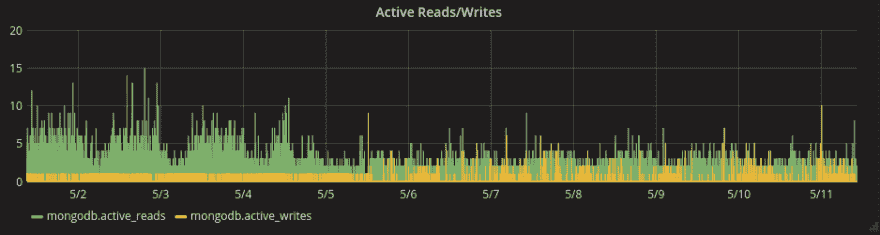
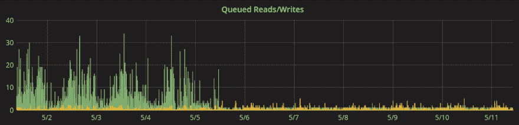
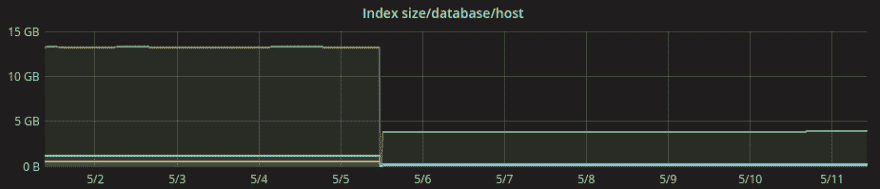
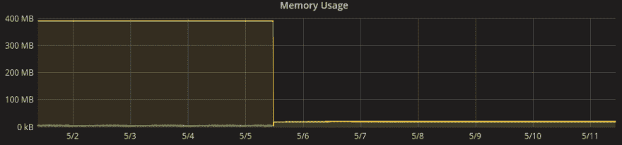
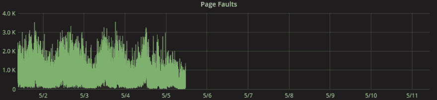
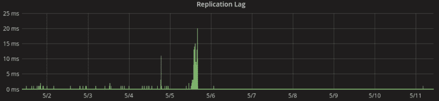

# MongoDB 性能问题——事实还是虚构

> 原文：<https://dev.to/kenwalger/mongodb-performance-issues---fact-or-fiction>

我经常看到关于 [MongoDB](https://www.mongodb.com) 性能问题的帖子和对话。它们是 Quora、Hacker News 和 Reddit 等网站上的热门话题。许多针对 MongoDB 的“点击”都是基于过时的数据和 MongoDB 的旧版本。

20 世纪 80 年代末有一部电影叫做《鳄鱼邓迪 II》。电影中有一个场景，来自澳大利亚内陆的家伙“鳄鱼”米克·邓迪第一次来到纽约市的一家酒店。有人告诉他房间里有一台电视。他打开电视，看到了《我爱露西》的老一集。邓迪关闭了它，声称他已经体验过电视。

同样，来自 MongoDB 旧版本的许多抱怨仍然挥之不去。某个对旧版本有过糟糕体验的人会在某个地方回答一个帖子，声称“我用过一次，不喜欢它，它是垃圾。”就像米克·邓迪一样，他们的全部观点都是基于过时的知识。

让我们来看看一些经常被提出的性能问题，以及 MongoDB 最新版本 [3.4.6](https://docs.mongodb.com/manual/release-notes/3.4/) 的现状。我在[的上一篇文章](https://www.kenwalger.com/blog/nosql/new-version-new-features/)中提到了这些方面，但是让我们更深入地探讨一下。

### Jepsen 测试&过去的性能问题

从“记录问题”的角度来看，在社会评论中困扰 MongoDB 的许多性能问题都包含在 2015 年 4 月 20 日[发布的](https://aphyr.com/posts/322-jepsen-mongodb-stale-reads) [Jepsen](https://aphyr.com/tags/Jepsen) 测试结果中。这是基于版本 2.4.3。或者是 2013 年 5 月 18 日[的一篇更老的文章。显然，在这些早期版本中，数据可伸缩性和数据并发性存在一些问题。](https://aphyr.com/posts/284-call-me-maybe-mongodb)

事实上，Jepsen 已经在 MongoDB 上对丢失的更新以及脏的和陈旧的读取进行了广泛的测试。如果不深入了解数据发生变化的方式和原因，就会发现主数据库关闭时的写入问题，以及读写一致性问题。这些问题在 3.4.1 版中已经解决。

### 产品增强

有了新的数据增强，MongoDB 3 . 4 . 1 版通过了所有的 Jepsen 测试。Jepsen 的创造者 Kyle Kingsbury 给出了以下结论:

> 在过去的两年中，MongoDB 投入了大量的资源来提高安全性，并且这些基础工作在 3.2 和 3.4 中得到了回报。

> MongoDB 3.4.1(以及当前的开发版本 3.5.1)目前通过了所有的 MongoDB Jepsen 测试。这些结果适用于一般的网络分区，以及隔离和时钟偏移的主要场景。

你可以在他的[发表的结果](https://jepsen.io/analyses/mongodb-3-4-0-rc3)中读到更多关于他的结论。

除了数据安全性之外，客户还发现 MongoDB 最新版本在性能方面有巨大的优势。对复制压缩、 [WiredTiger](https://docs.mongodb.com/manual/core/wiredtiger/) 存储引擎、内存缓存等技术的改进或引入，以及对分片和副本集的性能增强，对用户来说都是一个胜利。

### WiredTiger 案例研究

一个在 Wanderu.com 工作的朋友，一个 MongoDB 用户，非常慷慨和乐于提供一些关于他们的 MongoDB 体验的信息。在选择数据库选项时，他们觉得 NoSQL，尤其是 MongoDB，比关系模型更适合他们的业务和数据模型。他们为公共汽车和火车旅行应用程序处理一组非常多样化的数据。

他们从各种各样的公共汽车和火车供应商那里获取 XML、JSON、PDF、CSV 和其他格式的信息。然后，数据被接收和转换，以便一切都以特定于供应商的格式处理价格检查和预订电话。对于在关系数据库中实现来说，数据模型被认为是极其复杂和脆弱的。

2017 年 5 月，Wanderu 迁移到 MongoDB 3.4 中的 WiredTiger 存储引擎。他们在 5 月 5 日迁移之前和之后的 10 天内拍摄了一些性能图表的屏幕截图。他们好心地与我分享这些图片，并同意在本文中使用它们。

[caption id = " attachment _ 492 " align = " align center " width = " 938 "]在 WiredTiger 之前，写入负载的最大值非常有限。迁移后，写操作会根据需要激增。[/标题]

[caption id = " attachment _ 495 " align = " align center " width = " 925 "]写入保持相当稳定，而排队读取大幅下降。[/标题]

[caption id = " attachment _ 493 " align = " align center " width = " 925 "]指数大小也大幅减少。[/标题]

[caption id = " attachment _ 497 " align = " align center " width = " 921 "]毫不奇怪，内存使用率也下降了。[/标题]

[caption id = " attachment _ 494 " align = " align center " width = " 924 "]页面错误改进[/caption]

[caption id = " attachment _ 496 " align = " align center " width = " 922 "]毫无疑问，复制延迟也得到了改善。[/标题]

在 Wanderu 推出以来的四年里，它严重依赖 MongoDB 来存储每个地方、地区和国家承运商的车站和行程信息。随着 MongoDB 版中新的 [$graphLookup](https://docs.mongodb.com/manual/reference/operator/aggregation/graphLookup/) 功能的出现，他们也在考虑利用该技术来满足他们的图形需求的可能性。

### 进一步的行业思考

MongoDB 是一个广泛使用的 NoSQL 数据库。出于各种原因，大大小小的公司都在使用它。我联系了一些其他已知的 MongoDB 用户，以获得一些真实世界的反馈和产品体验。

[比如 CARFAX](https://www.carfax.com) ，从 1.8 版本开始就在生产中使用 MongoDB。他们每年加载超过 10 亿份[文档](https://www.kenwalger.com/blog/nosql/document-model/)，每秒生成超过 20，000 份报告。 [Jai Hirsch](https://twitter.com/JaiHirsch) ，CARFAX 的高级系统架构师，写了一篇很好的[关于他们为什么决定使用 MongoDB 的文章。他们从压缩复制中获得了巨大的性能优势。](https://jaihirsch.github.io/straw-in-a-haystack//mongodb/2014/01/06/mongodb-legacy-migration/)

随着 MongoDB 3.2 版本的发布，GHX 从 MMAPv1 切换到 WiredTiger。他们的数据库工程经理 Jeff Sherard 有另一个非常积极的经历。

> 毫无疑问，在 3.2 中切换到 WiredTiger 是一个巨大的进步。特别是在压缩方面，我们经历了大约 50%的压缩。文档级锁定与集合级锁定相比，也显著提高了我们的性能。

他还体验了[分片](https://www.kenwalger.com/blog/nosql/mongodb-horizontal-scaling-sharding/)和[副本集](https://docs.mongodb.com/manual/replication/)以及升级到 3.4.4 的好处。

> 我们最近升级到了 3.4.4，对碎片平衡的改进特别满意(并行性使得平衡非常快)。副本集中最初的同步改进也非常有用。

Tinkoff Bank 选择使用 MongoDB 而不是 Oracle，因为他们发现 [Oracle 的 clob](http://docs.oracle.com/javadb/10.6.2.1/ref/rrefclob.html)的性能没有那么快，并且不可搜索。使用三节点副本集，他们每秒能够处理大约 1，500 个请求。这些查询给[主节点](https://docs.mongodb.com/manual/core/replica-set-primary/)的 CPU 带来了 5-10%的负载。

### 包裹

我确信 SQL 与 NoSQL 的争论将会继续下去。就像 Windows 对 Mac，或者猫对狗一样。然而，我希望，基于这里提供的信息和证据，我们可以放下 MongoDB 还没有“企业就绪”的想法。如果我们要讨论 MongoDB 的优点，我们至少应该讨论最新的版本。就像 Mick Dundee 的场景一样，他看起来很愚蠢，因为他对一个产品的整个观点都是基于他多年前的经历。

这篇文章中有几个 MongoDB 特定的术语。我为[亚马逊 Echo](https://www.amazon.com/gp/product/B01DFKC2SO/ref=as_li_tl?ie=UTF8&camp=1789&creative=9325&creativeASIN=B01DFKC2SO&linkCode=as2&tag=kenwalgersite-20&linkId=f9e513223de2525a72b95cf9561db55b) 系列产品创建了一个 [MongoDB 字典](https://www.echoskillstore.com/MongoDB-Dictionary/45103)技能。检查一下，你可以说“Alexa，问 MongoDB 什么是文档？”并得到有益的回应。

* * *

*在 Twitter [@kenwalger](https://www.twitter.com/kenwalger) 上关注我，获取我发布的最新消息。*