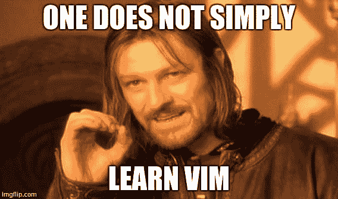

# “我使用 VIM 的前两周”

> 原文：<https://dev.to/vincecampanale/my-first-two-weeks-using-vim>

[T2】](https://res.cloudinary.com/practicaldev/image/fetch/s--NIE-92PW--/c_limit%2Cf_auto%2Cfl_progressive%2Cq_auto%2Cw_880/https://i.imgflip.com/1teh21.jpg)

我已经推迟了一段时间。我一直很钦佩使用 Vim 的人。我把他们视为某种“超级开发者”。如果他们使用德沃夏克，我不得不摘下墨镜，以免被他们的天才所蒙蔽。在这篇文章中，我将记录我开始变得像太阳一样明亮，比闪电更快的旅程。开始了。

### 第 1 天&第 2 天

我的第一天实际上是昨天，但我今天开始写日记，所以让我们赶上。我开始做任何优秀的开发人员都会做的事情，在谷歌上搜索“学习 VIM”。你瞧，我在瞬间收到了数百万条结果。向全能的谷歌致敬。

我发现一家名为 Upcase 的公司开设了一门课程，基本内容是:去做`vimtutor`。这意味着到终端(安装了 Vim)并键入`vimtutor`。就是这样。我从它开始，花了很多时间做实验。不得不说，有点不自然。我在使用 Vim 时会有点出汗，因为我在抗拒我的自然倾向。别评价我，我出了很多汗。也就是说，我已经可以看到数百万个命令组合的好处了。这是我第一天学到的一些东西:

#### 提示 1

不要使用箭头键。永远不会。这是 VIM 中的一个反模式。移动光标的`hjkl`方法可以让你的手保持在键盘的 home 行上，这对效率至关重要。
这里有一个来自`vimtutor`的漂亮的小图表。

```
 ** To move the cursor, press the h,j,k,l keys as indicated. **
             ^
             k              Hint:  The h key is at the left and moves left.
       < h       l >               The l key is at the right and moves right.
             j                     The j key looks like a down arrow.
             v 
```

Enter fullscreen mode Exit fullscreen mode

#### 提示 2

同理，尽量避免使用`DEL`删除字符。只需导航到您想要删除的字符，然后按下`x`。使用 delete 键类似于使用箭头键。这违背了 Vim 的全部目的。

#### 提示 3

在您喜欢的编辑器中启用 Vim 快捷方式。这将允许你保持熟悉的环境，比如颜色、图标等等。我发现这比只看我的裸体终端有趣多了。有一些插件和其他东西可以给你的终端添加色彩和方便的工具，但是我目前看到的资源警告不要马上安装一大堆插件，我相信他们的话。

#### 提示 4

不要对自己太苛刻。我刚刚按下删除键删除了一些东西，就在我使用`CTRL + Z`撤销之前。这是令人沮丧和困难的时期，Vim 的前两周。我只进行了第二天，就已经感觉到了灼烧感。但是我们会赢的。如果我能做到，你也能。

### 第三天

好吧-新的一天，新的提示。非常感谢那些评论了您从自己的 Vim 经验中学到的技巧和诀窍的人。我真的很喜欢这篇文章的发展，如果你有任何建议，我很乐意在评论中看到更多的建议，不管它们看起来有多小或多么不可思议。我保证它会帮助某人(我)。

最后，我在一些便利贴上写下了 Vim 的一些关键导航快捷方式，并将它们粘贴到我的显示器上——这里是我发现必不可少的快捷方式的简要概述(对于一个完全的新手)。我发现把按键想象成动作是很有用的，动作可以分为不同的类别。到目前为止，我确定的两个类别是“编辑”和“移动”。可能有更正式的方式来引用这些类别——如果你知道更好的方式来引用它们，请发表评论。

```
Move commands: 

hjkl - move around (see Days 1 & 2)

w - beginning of next word
e - end of next word

b - beginning of previous word

$ - end of current line
0 - beginning of current line

Edit commands:

i (insert) - insert before the character the cursor is on
a (append) - insert after the character the cursor is on
SHIFT + A (super append) - insert after the current line

x (delete) - delete the character that the cursor is on
d (delete*) - delete ... 
```

Enter fullscreen mode Exit fullscreen mode

#### 提示 5

我在 delete 命令上加了一个*号，因为它有点特殊。它本身什么也不做。结合移动命令，你可以删除所有的东西。

假设我想删除两个相邻的单词。

```
1) Navigate to the beginning of the first word using your move commands.
2) Type d2w.
3) Press enter. 
```

Enter fullscreen mode Exit fullscreen mode

这里发生了什么？告诉 Vim 我想删除一些东西。然后它耐心的等我告诉它该删什么(好礼貌)。我对 Vim 说，`2w`(读作:两个词)然后噗，它们就不见了。这一举动显示了 Vim 的力量。这些键中的每一个都有自己的功能，并允许您使用 Vim 运行。把它们结合起来，你就能飞了。

#### 提示 6

昨天，我把它叫做 VIM。我在标题里也这么叫它。我不会为了保存我作为 Vimmer 的成长而改变它。蒂尔，应该是“维姆”，像“吉姆”。
来自 [`:help pronounce`](http://vimhelp.appspot.com/intro.txt.html#pronounce) :

```
Vim is pronounced as one word, like Jim, not vi-ai-em.  It's written with a
capital, since it's a name, again like Jim. 
```

Enter fullscreen mode Exit fullscreen mode

现在我知道了。

#### 提示 7

这条建议来自吉恩·伯纳德，谢谢你，吉恩！
这里引用他的话:

```
Pro-tip: I use "jj" as a shortcut to the ESC key. That way when you want to switch back to normal mode you don't have to go all the way to the ESC key. 
```

Enter fullscreen mode Exit fullscreen mode

爱死了。

我想在这篇文章中添加一个“舒适指数”。我得说我已经从 1 升到 2 了。当我使用 Vim 时，我不再流汗，所以这是进步。仍然倾向于使用舒适的快捷方式来选择文本、移动行、复制粘贴等。然而，这种势头越来越大，我玩得很开心。

舒适性指数:2

### 第 1 周后

从我开始努力学习 Vim 到现在已经一周了。我已经很久没有在工作中使用它了，因为我发现在考虑编写干净的代码和构建可维护的应用程序时，它太让人分心了，无法真正学习和实践这些快捷方式。也就是说，我认为我正在接近这样一个点，即足够多的基本动作和命令是自动的，足以保证全职进行切换。我不着急。

#### 提示 8

基本的捷径会带你走得更远。到目前为止，我在文章前面列出的基本上是我唯一用过的。在删除/剪切文本时，您可以使用`d (motion)`命令完成大多数事情。类似地`y (motion)`用于复制行或字。我发现用这些术语开始考虑文本的各个部分比考虑它们周围的空间更有价值。

#### 提示 9

与`:help`搞好关系。如果你知道你在做什么，Vim 的帮助系统是非常可搜索和有用的。

#### 提示 10

这个来自 Alan Campora:
“编辑和移动是模式，不是动作。行动是不同的。比如你要替换一个单词，把光标放在上面，按 c(change) i(inner) w(word)。这是一个伟大的水平了:D”

这对我来说是一个至关重要的提示。这种微妙的范式转变让我明白，`d`与其说是一个删除某些东西的动词，不如说只是一个让我进入`delete mode`的按钮。回想起来，这是显而易见的，但艾伦的提示是我需要完全理解的——希望它也能帮助其他人。

将舒适度计视为类似于里氏震级的地震，这是一个相当大的进步。几个基本的组合让用 Vim 编辑变得相当轻松。我越来越喜欢它，我很高兴我熬过了不舒服的第一天。这才是最糟糕的部分。

* * *

发布进行中...在 [twitter](https://twitter.com/_vincecampanale) 、 [github](https://github.com/vincecampanale) 或 [dev.to](https://dev.to/vincecampanale) 上关注我的更新:)