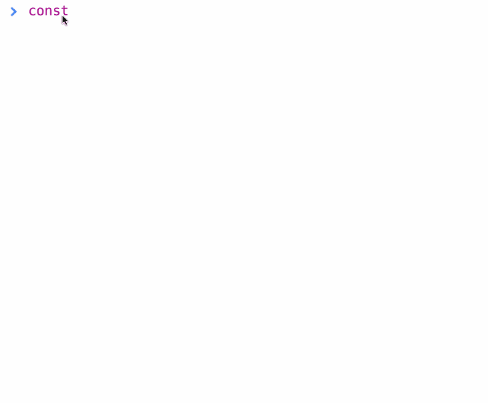

# 导航器.存储

> 原文：<https://dev.to/hemanth/navigatorstorage>

`navigator.storage`是一个只读属性，它返回一个单例`StorageManager`,这将有助于使用获取当前上下文的浏览器的整体存储能力。

`StorageManager`帮助我们估计本地存储还有多少空间可用，也有助于配置数据存储的持久性。

**IDL:**T2】

```
[SecureContext,
 Exposed=(Window,Worker)]
interface StorageManager {
  Promise<boolean> persisted();
  [Exposed=Window] Promise<boolean> persist();

  Promise<StorageEstimate> estimate();
};

dictionary StorageEstimate {
  unsigned long long usage;
  unsigned long long quota;
}; 
```

Enter fullscreen mode Exit fullscreen mode

**用法:**

检查`storage` API 是否存在。

```
const hasStorage = navigator.storage;
const hasPersist = hasStorage && navigator.storage.persist; 
```

Enter fullscreen mode Exit fullscreen mode

创建一个 stroageManager 实例。

```
const storageManager = hasStorage && navigator.storage; 
```

Enter fullscreen mode Exit fullscreen mode

估计可用的存储空间。

```
 const estimate = await storageManager.estimate();

/*
Would give us something like:

{
  quota: 32571287142, 
  usage: 3351594
}
*/ 
```

Enter fullscreen mode Exit fullscreen mode

能坚持吗？

```
const canPersist = hasPersist && await navigator.storage.persist();

// ^ Will be true of false.

/*

true -> Storage will not be cleared until explicitly cleared. 

false -> Storage might be cleared based on UA need.
*/ 
```

Enter fullscreen mode Exit fullscreen mode

```
const persisted = hasPersisted && await navigator.storage.persisted();

/*

true -> box mode is persistent for the site's storage.

A box, the primitive these APIs store their data in.
A way of making that box persistent.
A way of getting usage and quota estimates for an origin.

*/ 
```

Enter fullscreen mode Exit fullscreen mode

**GIF FTW！**

[T2】](https://res.cloudinary.com/practicaldev/image/fetch/s--TfPOjWFE--/c_limit%2Cf_auto%2Cfl_progressive%2Cq_66%2Cw_880/https://thepracticaldev.s3.amazonaws.com/i/99bmexjyrri731ffispr.gif)