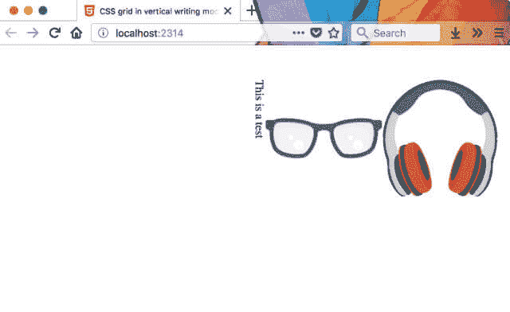
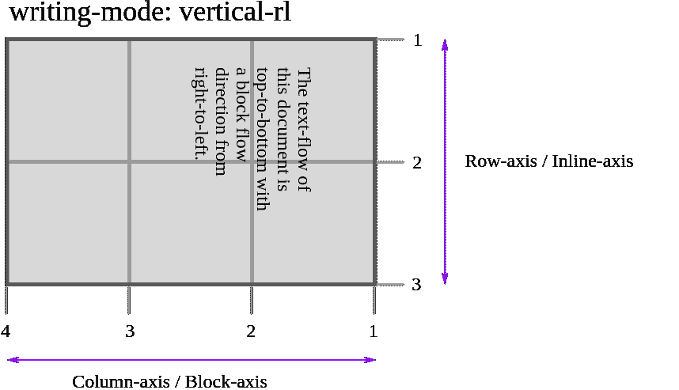
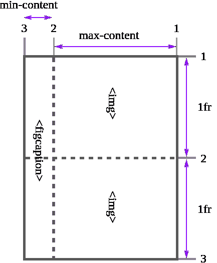
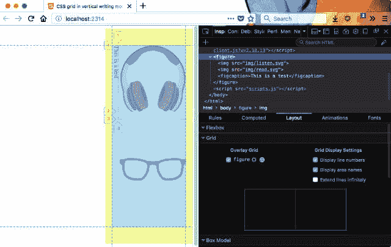
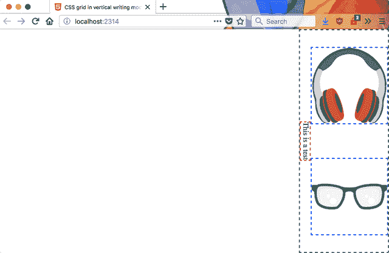

# 关于垂直书写和 CSS 网格的注释

> 原文：<https://dev.to/huijing/notes-on-vertical-writing-and-css-grid-3bih>

当我在一年前的垂直排版演示中解决问题时，我试图使用 CSS 网格作为处理布局的选项之一，但没有取得很大进展，因为那时我的大脑已经完全崩溃了😕。但是我现在在飞机上，周围都是盯着代码的人，所以我也有动力去做一些有用的事情。

我想弄清楚的是当书写模式是垂直的时候 CSS 网格是如何工作的，以及它如何影响 Firefox 的网格检查器。由于我写了一篇关于 Firefox Grid Inspector 的相当深入的文章，我想我最好尽可能彻底地理解它。

演示和观察时间！

## 基本设置

我从最基本的标记结构开始。因为减少了测试用例。我的初衷是使用 grid 来展示一个包含多个图片和一个标题的图形。

```
<!doctype html>
<html>
  <head>
    <!-- Stuff that goes in <head> -->
  </head>

  <body>
    <figure>
      
      
      <figcaption>This is a test</figcaption>
    </figure>
  </body>

</html> 
```

Enter fullscreen mode Exit fullscreen mode

<figure>

[T2】](https://res.cloudinary.com/practicaldev/image/fetch/s--81W0nQ_C--/c_limit%2Cf_auto%2Cfl_progressive%2Cq_auto%2Cw_880/https://www.chenhuijing.com/asseimg/posts/grid-vertical/markup-640.jpg)

<figcaption>Basic markup structure (vertical-rl on html element)</figcaption>

</figure>

我不知道网格行和网格列在垂直模式下如何工作，所以让我们来看看规范。

> 有两组网格线:一组定义沿块轴(列轴)延伸的列，另一组定义沿内嵌轴(行轴)延伸的行。

我将此解释为，当文档被设置为`vertical-rl`时，网格列从上到下排列，而网格行从右到左排列，如下所示:

[T2】](https://res.cloudinary.com/practicaldev/image/fetch/s--gTWcEQAP--/c_limit%2Cf_auto%2Cfl_progressive%2Cq_auto%2Cw_880/https://www.chenhuijing.com/asseimg/posts/grid-vertical/grid-lines.svg)

让我们通过创建一个使用`figure`元素作为网格容器的布局来看看情况是否如此。我希望这两个图像堆叠在对方的顶部，标题拉伸长度低于(即向左)两个图像。

```
html {
  writing-mode: vertical-rl;
}

figure {
  display: grid;
  grid-template-columns: 1fr 1fr;
  grid-template-rows: max-content min-content;
} 
```

Enter fullscreen mode Exit fullscreen mode

让我们想象我的目标最终结果和它们相应的行号。

[T2】](https://res.cloudinary.com/practicaldev/image/fetch/s--PqIQMCSt--/c_limit%2Cf_auto%2Cfl_progressive%2Cq_auto%2Cw_880/https://www.chenhuijing.com/asseimg/posts/grid-vertical/simple.svg)

这里的网格检查器工具似乎有一些问题。我想从现在开始我们会盲目飞行。

<figure>

[T2】](https://res.cloudinary.com/practicaldev/image/fetch/s--J6bWw6-2--/c_limit%2Cf_auto%2Cfl_progressive%2Cq_auto%2Cw_880/https://www.chenhuijing.com/asseimg/posts/grid-vertical/problem-640.jpg)

<figcaption>Something doesn't seem quite right here...</figcaption>

</figure>

在我开始使用网格检查器工具之前，我会对网格项目应用边框。这不是最好的解决方案，因为我实际上看不到网格轨迹，但目前只能这样了。

<figure>

[T2】](https://res.cloudinary.com/practicaldev/image/fetch/s--3FxHCGiH--/c_limit%2Cf_auto%2Cfl_progressive%2Cq_auto%2Cw_880/https://www.chenhuijing.com/asseimg/posts/grid-vertical/borders-640.jpg)

<figcaption>Borders, borders everywhere!</figcaption>

</figure>

好了，这个简化的测试用例看起来 Grid 在垂直书写模式下工作得很好。这就是我在之前的文章中想要的布局代码(忽略`border`代码)。

```
figure {
  display: grid;
  grid-template-columns: 1fr 1fr;
  grid-template-rows: max-content min-content;
  justify-items: center;
  border: 2px dashed green;
}

img {
  border: 2px dashed blue;
}

figcaption {
  border: 2px dashed red;
  grid-column: span 2;
} 
```

Enter fullscreen mode Exit fullscreen mode

<figure>

[T2】](https://res.cloudinary.com/practicaldev/image/fetch/s--N7afGiSp--/c_limit%2Cf_auto%2Cfl_progressive%2Cq_auto%2Cw_880/https://www.chenhuijing.com/asseimg/posts/grid-vertical/aligned-640.png)

<figcaption>Here we go</figcaption>

</figure>

## 扩展测试用例

现在，看看这是否适合嵌套的`writing-mode`。正如我在之前的帖子中提到的，我似乎是一个坚持惩罚的人🤷。*剧透:一点都不疼。*

我复制了那个演示的内容，并重写了标记以使图形变平。所以每个图形的标记都被修改成这样:

```
<!-- Non-grid version -->
<figure>
  <figcaption>最早的視覺傳達方式基本都是利用圖形進行的。這是北美印地安在史前的岩洞壁畫</figcaption>
  <div class="img-wrapper img-double">
    
    
  </div>
</figure>

<!-- Grid version -->
<figure class="img-double">
  <figcaption>最早的視覺傳達方式基本都是利用圖形進行的。這是北美印地安在史前的岩洞壁畫</figcaption>
  
  
</figure> 
```

Enter fullscreen mode Exit fullscreen mode

网格行和网格列尊重文档的书写模式，即使书写模式是嵌套的。这意味着我可以将布局代码应用于相关的元素，并在这些状态切换时调整方向(左/右、宽度与顶部/底部、高度)。

事实上，我在想，一旦我们有了 [CSS 逻辑属性](https://www.w3.org/TR/css-logical-1/)，我甚至不需要有两组方向属性。那太棒了！

每个图形上的类要处理图形是有 1 个图像还是 2 个图像。因此，对于单个图像图形，图像只跨越 2 列。每个图形的布局代码如下:

```
figure {
  display: grid;
  grid-template-columns: 1fr 1fr;
  grid-template-rows: min-content max-content;
  justify-items: center;
  align-items: center;
}

figcaption {
  grid-column: span 2;
}

.img-single img {
  grid-column: span 2;
} 
```

Enter fullscreen mode Exit fullscreen mode

切换和非切换状态看起来像这样:

```
.c-switcher__checkbox:checked ~ main {
  figure {
    margin-left: 1em;
    max-height: 30em;
    margin-top: auto;
    margin-bottom: auto;
  }

  .img-single img {
    max-height: 20em;
  }
}

.c-switcher__checkbox:not(:checked) ~ main {
  figure {
    margin-bottom: 1em;
    max-width: 30em;
    margin-left: auto;
    margin-right: auto;
  }

  .img-single img {
    max-width: 20em;
  }
} 
```

Enter fullscreen mode Exit fullscreen mode

我有点喜欢它。所以到目前为止，问题不在于书写模式，而在于 Grid Inspector 工具，但是了解 Mozilla，团队已经在解决这个问题了。GitHub 上演示[的网格版本源代码，以及](https://github.com/huijing/demos/tree/master/grids-vertical)[现场版本可在此处查看](https://www.chenhuijing.com/demos/grids-vertical/)。

> 詹西蒙斯[@詹西蒙斯](https://dev.to/jensimmons)[@ HJ _ Chen](https://twitter.com/hj_chen)对！我希望我能和你在一起。明天。:D:这个星期我们不得不坐在一起破解演示。:D
> 
> 此外，我们的网格检查员还不能在非水平 LTR 写入模式下正常工作，但团队正在努力。我们应该在本周找到从事这项工作的工程师。2017 年 12 月 12 日上午 05:38[](https://twitter.com/intent/tweet?in_reply_to=940455924111630336)[](https://twitter.com/intent/retweet?tweet_id=940455924111630336)[](https://twitter.com/intent/like?tweet_id=940455924111630336)

如果你想知道(可能没有，但仍然)，我目前在德克萨斯州奥斯汀的 Mozilla All Hands，我非常兴奋，但也非常时差，这就是为什么这篇文章在凌晨 4 点完成。有人关心这种垂直书写模式的东西吗？我不知道，但我肯定知道。

早餐时间！直到下一个。

*最初发布于[www.chenhuijing.com](https://www.chenhuijing.com/blog/making-sense-of-digital-fonts/)2017 年 12 月 11 日。*