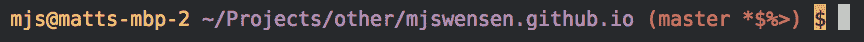

# Shell 提示符中 Git 状态的选项

> 原文：<https://dev.to/mjswensen/options-for-git-status-in-shell-prompt-12a0>

当需要定制 Bash 提示符来提供更多关于 Git 存储库状态的信息时，有很多选择。这篇文章介绍了如何使用 Git 自带的内置选项，而不是像 [this](https://github.com/magicmonty/bash-git-prompt) 或 [this](https://github.com/lvv/git-prompt) 这样的第三方选项。

一旦安装了 Git，您需要做的就是:

1.  在你的`~/.bashrc`或`~/.profile`文件中加载`git-prompt.sh`文件(Git 自带)
2.  将`$(__git_ps1)`添加到 bash 提示符变量中(在同一个文件中查找`PS1`)

将始终显示当前分支名称。但是，除了当前分支名称之外，您还可以使用其他一些选项来添加到提示中。可用的配置不容易用谷歌搜索到，所以我筛选了[源](https://raw.githubusercontent.com/git/git/master/contrib/completion/git-prompt.sh)并把它们列在这里。可用选项包括:

| [计]选项 | 价值 | 描述 |
| --- | --- | --- |
| `GIT_PS1_SHOWDIRTYSTATE` | 任何非空值 | 分别显示未分级和分级变更的`*`或`+` |
| `GIT_PS1_SHOWSTASHSTATE` | 任何非空值 | 显示`$`是否有任何存货 |
| `GIT_PS1_SHOWUNTRACKEDFILES` | 任何非空值 | 如果有任何未跟踪的文件，显示`%` |
| `GIT_PS1_SHOWUPSTREAM` | `auto` | 当您的分支落后、领先、偏离或与上游分支同步时，分别显示`<`、`>`、`<>`或`=` |
| (替代`auto`，以下选项的空格分隔列表) |  |  |
| `verbose` | 显示上游之前/之后(+/-)的提交数 |  |
| `name` | 如果详细，则还显示上游缩写名称 |  |
| `legacy` | 不要使用 git-rev-list 最新版本中可用的'- count '选项 |  |
| `git` | 始终将 HEAD 与@{upstream}进行比较 |  |
| `svn` | 总是把头比作你的 SVN 上游 |  |
| `GIT_PS1_DESCRIBE_STYLE` | (当设置为下列值之一时，确定处于分离头状态时当前提交的样式) |  |
| `contains` | 相对于较新的注释标签(如`v1.6.3.2~35`) |  |
| `branch` | 相对于较新的标签或分支(如`master~4`) |  |
| `describe` | 相对于旧的带注释的标签(例如，`v1.6.3.1-13-gdd42c2f`) |  |
| `default` | 精确匹配标签 |  |

以下是你如何把它们放在你的`~/.bashrc`或`~/.profile`文件中:

```
# First, load up the git-prompt.sh file that ships with Git. You
# might consider copying it to your home folder first. On my Mac
# OS X (Mavericks) setup, the file resides in
# /Applications/Xcode.app/Contents/Developer/usr/share/git-core/.
test -f ~/git-prompt.sh && . ~/git-prompt.sh

# Then, set the options as desired. Remember that the current
# branch name is displayed no matter what.
export GIT_PS1_SHOWSTASHSTATE=true
export GIT_PS1_SHOWDIRTYSTATE=true
export GIT_PS1_SHOWUNTRACKEDFILES=true
export GIT_PS1_SHOWUPSTREAM="auto"

# Finally, add $(__git_ps1) to the prompt variable. That's it!
PS1="\u@\h  \w\$(__git_ps1) \$ " 
```

Enter fullscreen mode Exit fullscreen mode

下面是提示可能的样子:

[T2】](https://res.cloudinary.com/practicaldev/image/fetch/s--pja3RJ1g--/c_limit%2Cf_auto%2Cfl_progressive%2Cq_auto%2Cw_880/https://mjswensen.com/blimg/git-prompt.png)