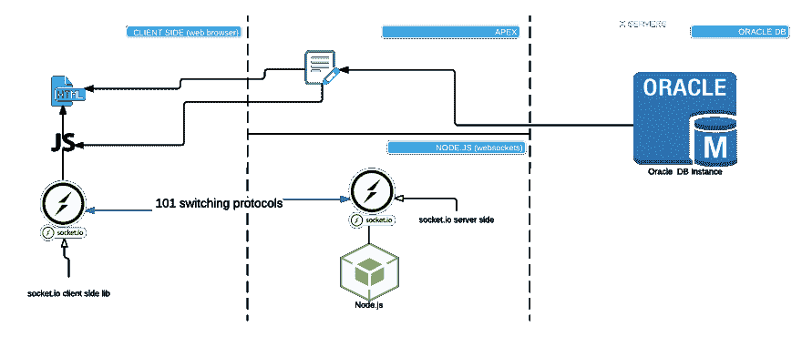
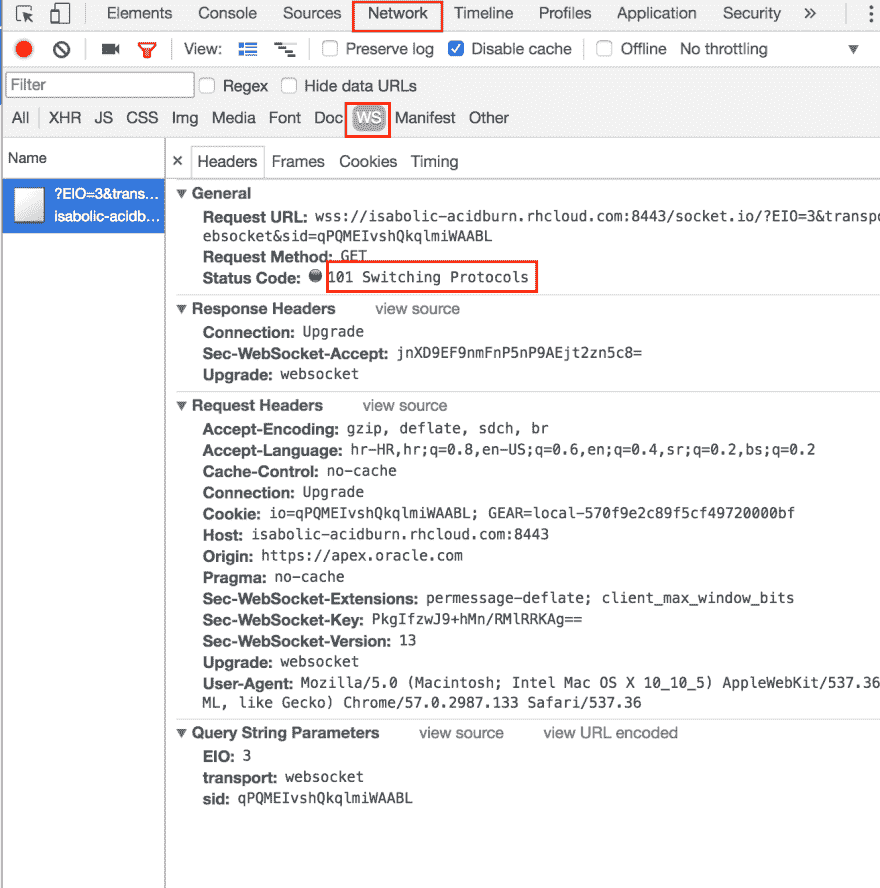
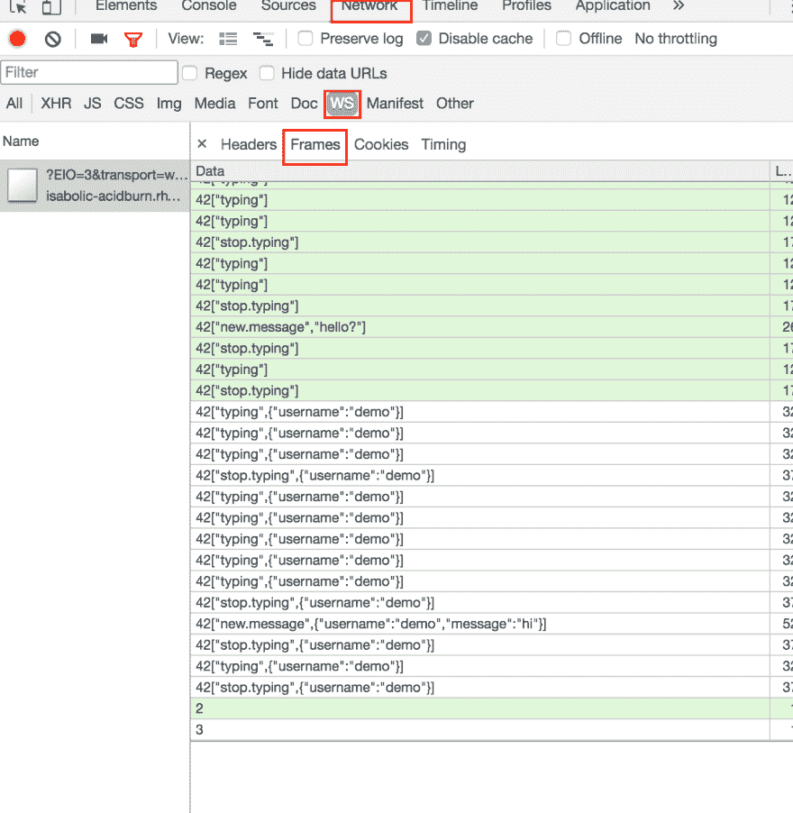

# Oracle apex 聊天演示

> 原文：<https://dev.to/isabolic99/oracle-apex-chat-demo>

一两周前，我在 apex.oracle.com 发布了简单的 apex 聊天演示。这是关于如何集成 oracle apex 和 socket.io (node.js)的演示。

## 基础知识，第一部分:Oracle apex

Oracle apex 是用于 Oracle 数据库的快速 web 应用程序开发工具。仅使用 web 浏览器和有限的编程经验，您就可以开发和部署既快速又安全的专业应用程序。

## 基础知识第二部分:Socket.io

Socket.io 是一个用于实时 web 应用程序的 JavaScript 库(使用 websockets，更多信息请访问 [wiki](https://en.wikipedia.org/wiki/WebSocket) )。它支持 web 客户端和服务器之间的实时双向通信。它有两个部分:在浏览器中运行的客户端库和 Node.js 的服务器端库。和 Node.js 一样，它是事件驱动的。

## 概念证明

[](https://res.cloudinary.com/practicaldev/image/fetch/s--5q8DcuRg--/c_limit%2Cf_auto%2Cfl_progressive%2Cq_auto%2Cw_880/https://thepracticaldev.s3.amazonaws.com/i/8vta2nx01xmx41sf334y.png) 
概念是开发 apex 区域插件，使用 socket.io javascript 库与 node.js 进行实时交互，socket.io 由两部分组成，一部分包含在客户端，另一部分安装在服务器端。它们通过使用 101 交换协议发送和接收数据的 websocket 进行通信。因此，当消息被发送到服务器端时，服务器端将相同的消息传播到所有活动的 socket.io 会话。从这个概念中还可以看出，消息并不存储在数据库中。

## 客户端

在客户端，apex 聊天被设计为 apex 区域插件。Witch 使用这些 js 库:

*   [handlebars.js](http://handlebarsjs.com/) - >用数据编译 html 表单
*   [socket.io 客户端](https://github.com/socketio/socket.io-client) - >客户端库。用于 web 客户端和服务器之间的实时通信。
*   [包含在 apex 中的 jquery witch](https://docs.oracle.com/database/121/HTMDB/app_comp001.htm#HTMDB29024)

除了控制 html 表单之外，它还监听来自 websocket 的传播事件，并触发这些事件以发送数据。

## 服务器端，node.js

服务器端在 node.js 中开发，有多个包。下面有一个使用过的软件包和链接的简短描述列表。与客户端的通信是通过 websocket 进行的。

1.  [express . js](https://expressjs.com/)&[http](https://nodejs.org/api/http.html)-用于创建 http 服务器
2.  [socket . io](https://github.com/socketio/socket.io)-web sockets 的服务器端库
3.  温斯顿 -记录者
4.  [mkdirp](https://github.com/substack/node-mkdirp)-‘mkdir-p’，创建日志文件夹
5.  [ip](https://github.com/indutny/node-ip) - IP 地址实用程序

```
...
    const express = require('express');
    const http = require('http');
    const socketio = require('socket.io');
    const winston = require('winston');
    const mkdirp = require('mkdirp');
    const ip = require("ip");
... 
```

## 套接字事件

Socket.io 是事件驱动库，也就是说通信是通过**触发**事件和**注册**来进行的。在服务器端，触发在**发射函数**中完成。如果未设置套接字对象上的**房间**属性 chat，则向所有打开的套接字会话广播事件。

```
...
var emit = function(emitCmd, data){
...
    if (socket.room !== undefined){
        socket.in(socket.room).broadcast.emit(emitCmd, data);
    } else {
        socket.broadcast.emit(emitCmd, data);
    }
 }
...
emit("new.message", {
    username: socket.username,
    message : data
});
... 
```

这就是事件在服务器端注册的方式:

```
...
socket.on("add.user", function (data) {
...
    socket.username = data.username;
    emit("user.joined", {
        username: socket.username
     });
});
... 
```

因此，当客户端触发事件 **"add.user"** (在演示中，当用户设置自己的用户名时)，服务器端 socket.io 捕获该事件，并触发所有其他 socket.io 会话 **"user.joined"** 事件。

在客户端，这要简单得多，触发示例:

```
...
this.socket.emit("new.message", msg);
... 
```

那里登记:

```
...
this.socket.on("user.joined", function(data) {
      ...
}.bind(this));
... 
```

客户端触发的事件列表，注意该事件在服务器端注册:

1.  **公开** -向所有人发送该聊天公开的标志
2.  **set.room** -发送本次聊天为私人聊天的标志
3.  **输入** -发送用户已经开始在消息区输入的标志
4.  **停止打字** -发送停止打字标志
5.  **new.message** -向服务器端发送新消息，以便传播到其他会话

在客户端注册、在服务器端触发的事件列表:

1.  **user.joined** -从服务器收到用户加入您聊天室的数据，在聊天区创建通知
2.  **打字** -从服务器收到用户已经开始打字的数据，在聊天区创建打字信息
3.  **停止打字** -从服务器收到用户停止打字的数据，删除聊天区的打字信息
4.  **新消息** -从服务器收到新消息，在聊天区显示消息
5.  **user.left** -从服务器收到用户已经离开聊天室的数据(socket.io 会话被终止)，在聊天区域创建通知

## 监控客户端和服务器之间的网络

为此，我使用谷歌开发者工具进行截图。在**网络**标签下的**开发者工具**和 **WS** 中，你可以看到所有当前来往的流量(在**框架**标签下，你可以看到发送/接收的文本消息)。
[](https://res.cloudinary.com/practicaldev/image/fetch/s--XBwopADw--/c_limit%2Cf_auto%2Cfl_progressive%2Cq_auto%2Cw_880/https://thepracticaldev.s3.amazonaws.com/i/7arovjjr9oaijod6telu.png)

[T2】](https://res.cloudinary.com/practicaldev/image/fetch/s--fukASTu2--/c_limit%2Cf_auto%2Cfl_progressive%2Cq_auto%2Cw_880/https://thepracticaldev.s3.amazonaws.com/i/pp5c98d5nufvg5qie8zd.png)

## 在 apex.oracle.com[部署](https://goo.gl/eiE0TZ) / [OpenShift Online](https://www.openshift.com/)

由于 websocket 可以跨域(但是你需要有一个握手来实现这个功能)，我在[apex.oracle.com](https://goo.gl/eiE0TZ)上安装了插件，node.js 模块(服务器端 socket.io)安装在 [OpenShift Online](https://www.openshift.com/) 上。OpenShift Online 是 Red Hat 的公共云应用程序开发和托管平台，可自动化应用程序的供应、管理和扩展，以便您可以专注于为您的业务、创业或大创意编写代码。OpenShift Online 通过使用插件支持多种技术，包括 Java、PHP、Node.js、Python、Perl、MySQL、PostgreSQL、MongoDB、Jenkins、Cron 等等。

## apex 聊天的未来演示

现在所有的代码/项目都可以在 [github](https://goo.gl/i8sXNq) 获得。
注意，它仍在进行中。在过去的几周里，我收到了大量的反馈，对此我非常感谢。

[T2】](https://i.giphy.com/media/JltOMwYmi0VrO/giphy.gif)

我也鼓励你将想法提交到 github 发布页面上，并贴上标签**新功能**。