# 霸王

> 原文：<https://dev.to/ladvien/overlord-n35>

注意，尽管我尽了最大努力，伙计们，我还是不能在我的代码的 HTML 版本中把数字排成一行。相反，你可以把它加载到 Geany 或者 Notepad+中，因为我用行号来表示。对不起，我对此已经没有耐心了。

这些是乡下人关于如何用不到 50 美元的静态摄像头控制机器人的指导。

我是一个机器人制造商，我厌倦了看到大学用计算机视觉指导他们的球员玩机器人足球或其他东西，无论我怎么恳求，该死的常春藤联盟都不会分享。

所以，我自己写了。当我这么做的时候，我发誓我会帮助任何尝试类似事情的人。

[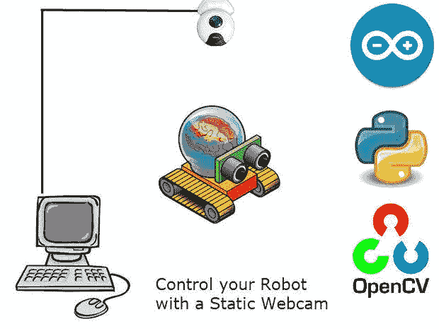T2】](https://res.cloudinary.com/practicaldev/image/fetch/s--fDaOa7H7--/c_limit%2Cf_auto%2Cfl_progressive%2Cq_auto%2Cw_880/https://ladvien.cimg/FQNP4DNHMVJHBJQ.MEDIUM.jpg)

[霸王和点食者](http://www.youtube.com/watch?v=uqnNYnS66do)

因此，下面是代码工作原理的概述:

[红帽子机器人](http://www.youtube.com/watch?feature=player_embedded&v=WyMZ6iGWpj4)

1.  网络摄像头发送其视野图像。
2.  OpenCV 寻找最大的红色斑点。
3.  它开始跟踪红色斑点的 X，y。
4.  PC 对大约 150 个相机帧的这些 X，Y 位置进行平均。
5.  如果斑点没有移动太多，电脑会认为红色斑点是机器人。
6.  电脑变得活跃起来，在摄像头的视野范围内给我们的机器人一个随机的目标。
7.  电脑计算机器人和目标之间的角度。
8.  与此同时，机器人的微控制器正在从机器人上的[磁力计](https://www.loveelectronics.co.uk/Tutorials/8/hmc5883l-tutorial-and-arduino-library)读取数据。
9.  这个机器人，通过一次人类校准，将真北翻译成“电子游戏北”，也就是电脑屏幕的顶端。
10.  微控制器将该代码传输到 PC。
11.  PC 将机器人与目标的角度与机器人的角度进行比较。
12.  电脑向机器人发送一个代码，告诉它左转、右转或向前移动(靠近目标)。
13.  当机器人到达目标可接受的距离内时，它就“咀嚼这个点”
14.  出现一个新的随机点。重复冲洗。(不过说真的，不要冲洗机器人。考虑一下[阿西莫夫的](http://en.wikipedia.org/wiki/Isaac_Asimov)第三定律。)

## 关于我:(跳过，没意思)

我是一名无家可归者救助工作者。这份工作太棒了。但我要说，感情上很累。跳过政治和关于减少伤害的说教，我从一开始就决定我需要一些远离工作的东西来让我的心灵得到休息，防止同情疲劳。一些消耗我脑力的事情，这样我就不会在怀孕 6 个月的 17 岁少女身上产生压力，在 I-35 的一座桥下注射毒品。一些保护我休息时间的东西，这样我第二天就不会冷了。

我看了 TED 关于沙蚤的演讲，我告诉 Bek，“太棒了，我能做一个吗？”
“哦，废话，”她说，“新的困扰？”

现在，机器人是我的解脱。当我在污泥中搜寻想要出来的人时，我的方法是防止白质变成暗物质。

我开始大量阅读。我发现，Arduino，Sparkfun，易贝，树莓派，，Python， [hackaday](http://hackaday.com/) ， [HC-SR04](http://www.instructables.com/id/Easy-ultrasonic-4-pin-sensor-monitoring-hc-sr04/) ， [Eagle](http://www.cadsoftusa.com/) ， [OSHPark](http://www.oshpark.com/) ，不胜枚举。但是每次我谷歌一些关于机器人的东西，我都会出现在同一个地方。

LetsMakeRobots

这些家伙很聪明。我发誓，他们是从合作中学来的。

> 后记。几年后，LetsMakeRobots 被卖给了机器人商店。这是灾难性的。所有的顾客都去了其他网站。我自己，我开了自己的博客:[https://ladvien.com](https://ladvien.com)

很快，我拥有了我的第一个机器人。一片 sh...短路。尽管如此，我确实学到了很多如何将机器人与[树莓派](http://www.instructables.com/id/How-to-Make-a-ArduinoRaspberry-Pi-Robot-Platform/)进行交互。此外，当我在使用树莓 Pi 时，我玩了 [OpenCV](http://opencv.org/) ，并考虑在我分心之前给我的机器人添加一个面部追踪器。但是在我退出之前，我创建了一个[概念验证](http://letsmakerobots.com/node/36947)。

于是，所有这些经历开始达到高潮。

与此同时，我正在 UTA 大学上研究生研究方法课，我的教授失踪了。这所大学令人惊叹；优秀的教授填补了空缺，确保我们的教育不受影响。但是我们想了好几个月。可悲的是，人们发现他已经自杀了。

它震撼了我。我每隔一天处理一次自杀事件，但通常是在街上。为什么是成功的研究型教授？我的思想变得阴暗了一点，这意味着我更加沉迷于机器人。然而，现在，一个问题摆在我的面前:机器人有一天会杀死自己吗？

[T2】](https://res.cloudinary.com/practicaldev/image/fetch/s--rBUly6UV--/c_limit%2Cf_auto%2Cfl_progressive%2Cq_66%2Cw_880/https://ladvien.cimg/F2SB0VPHMMFC1O5.MEDIUM.gif)

这听起来可能很傻。但我相信自我终结的公式可以用布尔逻辑来表达，因此可以编码。

伪代码应该是:

```
if painOfExistence > senseOfPurpose:
  self_terminate() 
```

Enter fullscreen mode Exit fullscreen mode

根据工作和生活经验，我真诚地相信自杀的根本动机是[存在焦虑](http://en.wikipedia.org/wiki/Anxiety#Existential_anxiety)，在我看来，这两个概念纠缠在一起。

好的。跳过 _Time_bit。

有一天，我想深入研究群体机器人。或者至少尝试在机器人群体中复制有机群体行为。我认为有可能用类似于那些大学或研究小组不断炫耀的设置来控制一群机器人。(滑稽的常春藤联盟:P)

我发现这些欲望、信息和工具协同成了一种激情。两天后，我能够编写一个基本的 OpenCV Python 脚本，它可以使用静态网络摄像头俯视机器人。让我澄清一下，我智力一般，只是有点强迫症，所以当我提到“两天”时，我试图传达这个项目的完全可行性，对于* **任何人** *。Python、Arduino 和 OpenCV 使得*变得非常容易；像我这样的任何人都能应付过去。*

当然，我做这个平台的目的是控制机器人群体。群体是第二个社会群体(一到八岁)，社会互动似乎是开发正电子大脑的关键。白色物质大脑是我测试上述自我终止公式所必需的。所以，也许，我会了解机器人是否会自杀，或者，也许，更好地理解人类为什么会自杀。

阴暗压抑！我知道，对吧？谁写的这些垃圾！？

[T2】](https://res.cloudinary.com/practicaldev/image/fetch/s--3L2oPMht--/c_limit%2Cf_auto%2Cfl_progressive%2Cq_auto%2Cw_880/https://ladvien.cimg/FGK6EXCHMMFAICI.SQUARE.jpg)

## 一个机器人

你使用什么样的机器人并不重要，它只需要:

1.  微控制器(如 [Arduino](http://www.arduino.cc/) 、 [PicAxe](http://www.picaxe.com/) 等。)
2.  由醒目的纯色材料制成。
3.  改变方向和移动的能力。
4.  磁力计。我用的是 [HMC5883L](http://www.ebay.com/itm/HMC5883L-Triple-Axis-Compass-Magnetometer-Sensor-Module-For-Arduino-3V-5V-/400362466832?pt=LH_DefaultDomain_0&hash=item5d37766e10) 。它们在易贝只卖 2 美元。
5.  无线串行连接。[蓝牙](http://www.instructables.com/id/how-to-Control-arduino-by-bluetooth-from-PC-pock/)、 [Xbee](http://www.ladyada.net/make/xbee/) 和 [nRF24L01](http://arduino-info.wikispaces.com/Nrf24L01-2.4GHz-HowTo) 将是我的推荐，因为所有这些都是在 PC 和微控制器之间建立桥梁的良好记录。

我自己用从 Bek 偷来的红色砧板建造了自己的(嘘)。对于我的串行连接，我使用了两个 10 美元的蓝牙 4.0 模块，我写了一个关于设置蓝牙 4.0 模块与 Arduino 和 PC 一起工作的说明:[蓝牙 4.0 和 Arduino](http://www.instructables.com/id/How-to-Create-an-Arduino-Compatible-Bluetooth-40-M/) 。

[T2】](https://res.cloudinary.com/practicaldev/image/fetch/s--r2Nskn6n--/c_limit%2Cf_auto%2Cfl_progressive%2Cq_auto%2Cw_880/https://ladvien.cimg/F0J3P8EHMMFC1RK.SQUARE.jpg)

## 一台电脑

可能是不到 10 年的东西。它可以运行 Linux 或 Windows 不过，我将使用 Windows Vista(嘿，我是第一世界的穷人，买不起 Windows 7 :P)。

1.  电脑需要运行 [Python 2.7](http://www.python.org/download/releases/2.7/)
2.  这需要 OpenCV 2.4.4
3.  它需要一个与你的机器人配对的无线串行连接。再次，我用了我的 [BT 4.0 模块](http://www.instructables.com/id/How-to-Create-an-Arduino-Compatible-Bluetooth-40-M/)。

[T2】](https://res.cloudinary.com/practicaldev/image/fetch/s--aoqFC9IQ--/c_limit%2Cf_auto%2Cfl_progressive%2Cq_auto%2Cw_880/https://ladvien.cimg/FU8RLE6HMMFC1TF.SQUARE.jpg)

## 网络摄像头

这真的取决于你。我不打算撒谎，我选择了我看到的最便宜的网络摄像头，它的价格是 6.87 美元。但是我不会推荐这个摄像头。它不喜欢我的电脑，所以每次我的 Python 脚本停止时，我都必须拔掉网络摄像头，然后重新插上。调试的真正烦恼。

1.  我建议使用高分辨率网络摄像头。如果你有钱的话，甚至可以用 IP 摄像头？如果你是，你能也给我买一个吗？
2.  长* *公母* * USB 线。同样，我花了大约 4.50 美元在[易贝](http://www.ebay.com/itm/15ft-15feet-USB2-0-A-Male-to-A-Female-Extension-Cable-White-U2A1-A2-15WHT-/400580131707?pt=US_USB_Cables_Hubs_Adapters&hash=item5d446fbb7b)买了两根 15 英尺的 USB 线。如果您设置好了一切，并注意到电缆末端的网络摄像头有问题，您可以在电缆末端放置一个带延长线的电源集线器，它会解决问题。不过，我 15 英尺的时候没有这个问题。
3.  一个能让你把摄像头固定在天花板上的妻子。或者...不问为好...

所以，我用一个 [Arduino Uno](http://arduino.cc/en/Main/arduinoBoardUno) 、[电机护罩](http://www.ebay.com/itm/L298P-Shield-DC-Motor-Driver-Module-2A-H-Bridge-Arduino-Compatible-/321178232095?pt=LH_DefaultDomain_0&hash=item4ac7b6e51f)和一个[蓝牙 4.0 模块](http://letsmakerobots.com/node/38009)制作了我的机器人 [Dot Muncher](http://letsmakerobots.com/node/38203) 。底盘由高密度聚乙烯制成，这是我从妻子那里偷来的砧板。[电机](http://www.ebay.com/itm/3-6V-DC-Small-Micro-Geared-Box-Electric-Motor-High-Quality-/190576860674?pt=LH_DefaultDomain_0&hash=item2c5f441e02)和[轮胎](http://www.ebay.com/itm/2pcs-43-19-3mm-D-hole-Small-Smart-car-model-tire-wheel-Robot-Part-for-DIY-/390668300421?pt=Model_Kit_US&hash=item5af5a53085)来自易贝。

现在，任何机器人都可以工作，就像我说的，所以谷歌一下，选择一个你喜欢的机器人。

当然，你想知道的一切都可以在这里找到:)

我只是说说而已。

但是代码，这是我们想要关注的部分。真的，我们的机器人只有神经和肌肉，大脑实际上在电脑里，机器人所做的就是，

1.  计算指南针信息。
2.  将指南针信息发送到电脑。
3.  从 PC 读取运动代码。
4.  将接收到的运动代码转换成电机激活。

就是这样。很简单。

```
//I've been using Zombie_3_6_RC in Processing to interact.

// Reference the I2C Library
#include <Wire.h>  // Reference the HMC5883L Compass Library
#include <HMC5883L.h>  
// Store our compass as a variable.
HMC5883L compass;

// Record any errors that may occur in the compass.
int error = 0;

//int pwm_a = 10; //PWM control for motor outputs 1 and 2 is on digital pin 10
int pwm_a = 3;  //PWM control for motor outputs 1 and 2 is on digital pin 3
int pwm_b = 11;  //PWM control for motor outputs 3 and 4 is on digital pin 11
int dir_a = 12;  //dir control for motor outputs 1 and 2 is on digital pin 12
int dir_b = 13;  //dir control for motor outputs 3 and 4 is on digital pin 13

int lowspeed = 120;
int highspeed = 140;

//Distance away
int distance;

//Sets the duration each keystroke captures the motors.
int keyDuration = 10;

int iComp;

void setup()
{
  Serial.begin(9600);

  Wire.begin(); // Start the I2C interface.

  Serial.println("Constructing new HMC5883L");
  compass = HMC5883L(); // Construct a new HMC5883 compass.

  Serial.println("Setting scale to +/- 1.3 Ga");
  error = compass.SetScale(1.3); // Set the scale of the compass
  error = compass.SetMeasurementMode(Measurement_Continuous); // Set the measurement mode to Continuous

  pinMode(pwm_a, OUTPUT);  //Set control pins to be outputs
  pinMode(pwm_b, OUTPUT);
  pinMode(dir_a, OUTPUT);
  pinMode(dir_b, OUTPUT);

  analogWrite(pwm_a, 0);
  //set both motors to run at (100/255 = 39)% duty cycle (slow) 
  analogWrite(pwm_b, 0);

  pinMode (2,OUTPUT);//attach pin 2 to vcc
  pinMode (5,OUTPUT);//attach pin 5 to GND
  // initialize serial communication:
  Serial.begin(9600);

}

void loop()
{

  // Retrive the raw values from the compass (not scaled).
  MagnetometerRaw raw = compass.ReadRawAxis();

  // Retrived the scaled values from the compass (scaled to the configured scale).
  MagnetometerScaled scaled = compass.ReadScaledAxis();

  // Values are accessed like so:
  int MilliGauss_OnThe_XAxis = scaled.XAxis;// (or YAxis, or ZAxis)

  // Calculate heading when the magnetometer is level, then correct for signs of axis.
  float heading = atan2(scaled.YAxis, scaled.XAxis);

  // Once you have your heading, you must then add your 'Declination Angle', which is the 'Error' of the magnetic field in your location.
  // Find yours here: http://www.magnetic-declination.com/
  // Mine is: 237' W, which is 2.617 Degrees, or (which we need) 0.0456752665 radians, I will use 0.0457
  // If you cannot find your Declination, comment out these two lines, your compass will be slightly off.
  float declinationAngle = 0.0457;
  heading += declinationAngle;

  // Correct for when signs are reversed.
  if(heading < 0)
    heading += 2*PI;

  // Check for wrap due to addition of declination.
  if(heading > 2*PI)
    heading -= 2*PI;

  // Convert radians to degrees for readability.
  float headingDegrees = heading * 180/M_PI;

  // Normally we would delay the application by 66ms to allow the loop
  // to run at 15Hz (default bandwidth for the HMC5883L).
  // However since we have a long serial out (104ms at 9600) we will let
  // it run at its natural speed.
  // delay(66);

  //This throttles how much data is sent to Python code. 
  //Basically, it updates every second (10 microsecond delay X 100 iComps)
  if (iComp >= 30){

    int adjHeading = 0;
    //The "floor" part makes the float into an integer, rounds it up.
    headingDegrees = floor(headingDegrees);
    if (headingDegrees >= 280){
        adjHeading = map(headingDegrees, 280, 360, 0, 79);
    }
    else if (headingDegrees <= 279) {
        adjHeading = map(headingDegrees, 0, 279, 80, 360);
    }

    Serial.println(adjHeading);
    iComp=0;
  }
  iComp++;

  delay(10); //For serial stability.

  int val = Serial.read() - '0';

  if (val == 1)
  {
    Back();
  }

  else if (val == 2)
  {
    Right();
  }

  else if (val == 3)
  {
    Forward();
  }

  else if (val == 4)
  {
    Left();
  }

  else if (val == 5)
  {
    Stop();
  }
}

void Back(){
//Straight back
      analogWrite(pwm_a, highspeed);
      analogWrite(pwm_b, highspeed);

      digitalWrite(dir_a, HIGH);  //Reverse motor direction, 1 high, 2 low
      digitalWrite(dir_b, LOW);  //Reverse motor direction, 3 low, 4 high

delay(keyDuration);
}

void Left(){
      //Left
      analogWrite(pwm_a, lowspeed);
      analogWrite(pwm_b, lowspeed);

      digitalWrite(dir_a, HIGH);  //Reverse motor direction, 1 high, 2 low
      digitalWrite(dir_b, HIGH);  //Reverse motor direction, 3 low, 4 high

delay(keyDuration);
}

void Right(){
      //Right
      analogWrite(pwm_a, lowspeed);
      analogWrite(pwm_b, lowspeed);

      digitalWrite(dir_a, LOW);  //Reverse motor direction, 1 high, 2 low
      digitalWrite(dir_b, LOW);  //Reverse motor direction, 3 low, 4 high

delay(keyDuration);
}

void Forward(){
  //set both motors to run at 100% duty cycle (fast)
  analogWrite(pwm_a, highspeed);
  analogWrite(pwm_b, highspeed);

  //Straight forward
  digitalWrite(dir_a, LOW);  //Set motor direction, 1 low, 2 high
  digitalWrite(dir_b, HIGH);  //Set motor direction, 3 high, 4 low

  delay(keyDuration);
}

void Stop(){
  //set both motors to run at 100% duty cycle (fast)
  analogWrite(pwm_a, 0);
  analogWrite(pwm_b, 0);

  //Straight forward
  digitalWrite(dir_a, LOW);  //Set motor direction, 1 low, 2 high
  digitalWrite(dir_b, HIGH);  //Set motor direction, 3 high, 4 low

  delay(keyDuration);
} 
```

Enter fullscreen mode Exit fullscreen mode

我想关注的第一点机器人代码是指南针。现在，我没有详细说明如何使用 [HMC5883L](https://www.sparkfun.com/tutorials/301) ，因为 SparkFun 已经为我做了这些。我也不会进入[倾斜补偿](http://www.loveelectronics.co.uk/Tutorials/13/tilt-compensated-compass-arduino-tutorial)，因为我更担心在这里证明这个概念，而不是完全准确。但是如果你是一个聪明的人，愿意接受这个挑战，请自便。请务必在完成后与我们分享代码:P

不。相反，我想把重点放在调整指南针方向上，从一个相对于真北的值，调整到我们希望它认为是北的值，在我们的例子中，就是屏幕顶部的值。这个过程需要一点参与，因为这些数字必须手动设置，并带有一点猜测。

**参见上面的代码。**

所以，我把我的罗盘模块尽可能放平，然后用螺栓把它固定在我的机器人上。这有助于确保您获得完整的 360 度，并让您不必每次指南针模块被撞出位置时都重新校准我们想要称为北方的位置。

106-114:这些模块和 Arduino 库都被设计成 0 是北，但是我们想设置我们自己的北，视频游戏北。这正是第 106-114 行的内容。我发现，当我的机器人走向屏幕顶部时，它读取的数值是 80。我必须想办法调整它，使读数为 0。我用这个简单的代码来结束我的演讲。

为了保持简单，我不得不把调整分成两部分。第 109-111 行处理[映射](http://arduino.cc/en/Reference/map) 0-79 到 280-0，使机器人认为 0-79 是 280-0。第 112-114 行对 80-360 做同样的处理，将其转换为 0-279。

老实说，我有一些空间迟钝，所以我很难思考这个问题，**我只知道它有效**。所以，如果你有问题，我会回复邮件和 Skypes，我们可以一起解决。并且，如果你想提交一个更好的解释，我会贴出来，一定会给你加分。

[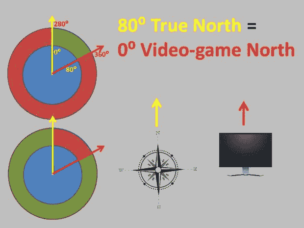T2】](https://res.cloudinary.com/practicaldev/image/fetch/s--3Wtz4ubL--/c_limit%2Cf_auto%2Cfl_progressive%2Cq_auto%2Cw_880/https://ladvien.cimg/F2AFT0SHMVJ9ADF.MEDIUM.jpg)

我知道，我的乡下人的解决办法是改变摄像机的方向。 **Pfft。太容易了**。

继续前进，

116:将机器人的方向发送到 PC。

117: iComp 是一个变量，允许我们决定何时开始向 PC 发送数据。我们不希望在数据准备好之前或者机器人预热之前就将数据发送到 PC，我们将处理糟糕的读数。

118:这是一个延迟，以确保我们不会陷入串行线，因为每次我们调用**serial . println(" whatever ")** PC 和机器人都需要一些处理能力来处理它。简而言之，这是为了确保机器人不会让电脑喋喋不休。

**参见上面的代码。**

这一点很简单。它读取从 PC 机发送的代码，并把它们翻译成函数调用。我用这种方式编写我所有的机器人-PC 交互，因为如果我想让代码表达完全不同的意思，例如我想交换机器人的左右移动，我只需交换第 134 和 144 行。

简单。

125:如果我没记错的话，这一行读取从 PC 发送的串行数据，并确保* *val* *变量没有得到一串零。

简单一点。

这是被调用来使电机移动的函数之一，或者在这个函数的情况下，停止。

188-189:这实际上告诉 Arduino 上的哪个管脚，由变量* *pwm_a* *和**PWM _ b**指定减少到 0。这有效地阻止了我们的机器人。

192-193:该位实际上告诉电机转向哪个方向。引脚( **dir_a** 和**dir _ b)**被设置为高或低，这改变了电机运动的方向。

告诉你，我的好朋友 [ChickenParmi](http://www.duino-robotics.com/) 解释得更好[在这里](http://www.youtube.com/watch?feature=player_embedded&v=XZLVpfydUdw)

**参见上面的代码。**

现在我们有了我们的小机器人设置，让我们设置我们的 Python 环境。

我准备用 Python 2.7(刚发现后面的版本气死我了)。

[Python 2.7 下载](http://www.python.org/download/releases/2.7/)

对于 windows，使用与您的体系结构(x86 或 x64)相对应的 MSI 安装。当然，Linux 和 Mac 版本也在那里。继续安装 Python 2.7，但我不是他们的 IDE 的粉丝。相反，我使用:

[Geany](http://www.geany.org/Support/RunningOnWindows)

[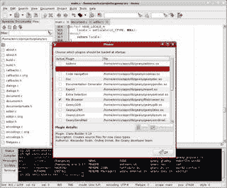T2】](https://res.cloudinary.com/practicaldev/image/fetch/s--QQ3VbL2N--/c_limit%2Cf_auto%2Cfl_progressive%2Cq_auto%2Cw_880/https://ladvien.cimg/FK4HWSSHMVJGC35.SMALL.jpg)

不过，这个 IDE 在 Windows 上运行有点棘手，因为它是为 Linux 设计的。堆栈溢出的这些帖子通过一些流行的 Windows Python IDEs。挑你觉得舒服的。我建议在每一个网站上运行“Hello World ”,直到你决定喜欢一个为止。

我们到了，这是整个项目中最困难的部分。如果不小心，我们会陷入依赖地狱。

我将尝试帮助您设置运行 Python 代码所需的所有模块。对我来说做好这件事很难，所以我会尽量描述一下。

我们将使用七个模块。

1.  OpenCV (我们称之为 cv2)。
2.  [Numpy](http://www.numpy.org/)
3.  [连载](http://pyserial.sourceforge.net/pyserial.html)
4.  [时间](http://docs.python.org/2/library/time.html)
5.  [数学](http://docs.python.org/2/library/math.html)
6.  [随机](http://docs.python.org/2/library/random.html)
7.  [穿线](http://docs.python.org/2/library/threading.html)

其中* *我们需要安装 OpenCV、Numpy 和 Serial，* *，因为其余的都内置在 Python 2.7 中。

在 Python 中安装任何 **模块的主要技巧是确保将安装它的确切路径添加到环境变量中(对于 Windows 和 Linux 都是如此)。**

为了解释这一点，我将把它交给可爱的 Ada，她会告诉我们如何安装串行模块:

[pySerial](http://learn.adafruit.com/arduino-lesson-17-email-sending-movement-detector/installing-python-and-pyserial) 安装

请注意关于添加环境变量的一点，因为没有其他模块会解释这一点，但每个模块都需要有。

现在，我们来试试 OpenCV 和 Numpy。我最喜欢的安装指南(意味着它对我有效)是由 Abid Rahman 写的:

[OpenCV 2.4.4 安装](http://opencvpython.blogspot.com/2012/05/install-opencv-in-windows-for-python.html)

此时，您可能会启动 Python 并尝试一些简单的网络摄像头捕捉测试代码(如果您在复制和粘贴时遇到问题，我也添加了网络捕捉代码作为附件):

**参见上面的代码。**

如果你从你的网络摄像头看到一个直播，你几乎可以走了。

[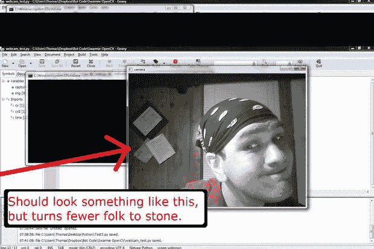T2】](https://res.cloudinary.com/practicaldev/image/fetch/s--4Uw8gYFb--/c_limit%2Cf_auto%2Cfl_progressive%2Cq_auto%2Cw_880/https://ladvien.cimg/FFMAZIFHMVJGCAS.MEDIUM.jpg)

如果有任何问题，就像我说的，你和我的兄弟。欢迎在此提问或 Skype me: **thomas_ladvien**

好吧。这里是所有的 Python 代码。_ 如果这看起来令人困惑，不要害怕。我也有同感。事实上，有些我仍然不明白。(嘿，诚实似乎是我少有的缺点。)还是那句话，别担心，我们会一段一段地走过去，你和我，伙计。直到最后。

另一方面，如果你是一个 Python 大师，或者 yanno，只是一个时髦的人:请随意在这个页面上添加更正和评论。我很乐意通过批评让这段代码成长。我保证以下几点:打字错误、语法问题、不合逻辑的编码、调试产生的工件等等。但别担心，我脸皮厚，通常穿我的大男孩内裤。

我应该声明，颜色跟踪的基本代码是由[阿比德·拉赫曼](https://plus.google.com/118298613334549762938/posts)在回复[堆栈溢出](http://stackoverflow.com/questions/12943410/opencv-python-single-rather-than-multiple-blob-tracking)时写的。

另外，我把代码作为附件放在了底部。电玩南方。

**参见上面的代码。**

好的。开始。

所以第 3-10 行引入了我们需要的[模块](http://docs.python.org/2/tutorial/modules.html)。我对一个模块的看法如下，“某个聪明人写的代码，他不想要了，所以他给了我使用。”

具体地说

*   [cv2](http://opencv.org/downloads.html) 是 OpenCV 模块。
*   [Numpy](http://www.numpy.org/) ，我们将在整个代码中称之为“ **np** ，用于 OpenCV 施展魔法所需的更大数目的函数。
*   [Serial](http://pyserial.sourceforge.net/pyserial.html) 是一个模块，它允许我们通过您选择的任何无线设备在 PC 和机器人之间建立串行连接。
*   [时间](http://docs.python.org/2/library/time.html)允许我们基本上闲置代码。这在控制许多事情时很重要，例如，机器人移动多远。我们告诉电机打开，等待 10 秒钟，然后关闭。因为睡眠功能实际上将代码置于空闲状态，所以我们必须有线程模块，因为我们的代码要求 PC 同时做几件事。
*   [数学](http://docs.python.org/2/library/math.html)。从数学模块中，我们得到代码来帮助我们简化三角计算，比如机器人和目标之间的角度。
*   [随机](http://docs.python.org/2/library/random.html)模块仅用于给我们一个随机目标。
*   [穿线](http://docs.python.org/2/library/threading.html)。重要模块。基本上，线程允许计算机同时执行两项任务。当我们都试图跟踪机器人并接收他的位置时，这变得很重要。在这段代码中，我们将有三个线程
    1.  运行 OpenCV 的线程。这个跟踪机器人，也是最大的。
    2.  控制机器人和 PC 之间串行连接的线程。
    3.  还有一根线，负责告诉马达开多长时间，从而控制机器人移动多远。

**参见上面的代码。**

13:这是我们实际打开与您正在使用的无线设备的串行连接的地方。注意，我们已经将我们打开的串行连接命名为" **ser** "，因此当我们发送信息时，它将类似于， **ser.write("你想在这里发送什么")**

15-38:这里我们声明了一堆[变量。](http://www.tutorialspoint.com/python/python_variable_types.htm)[全局变量](http://stackoverflow.com/questions/423379/using-global-variables-in-a-function-other-than-the-one-that-created-them)让代码知道这个变量将在所有线程之间跳转。接下来，* *变量= 0* *实际上声明了这个变量。要知道，你必须通过声明“全局变量”来提醒每个线程一个变量是全局的

我应该声明的一件事是， **iFrame = 0** 是一个实际的变量声明，并将其设置为 0。当然，这就是如何声明一个初始值为 0 的整型变量。另一方面， **rx = " "** isalso 是一个变量声明，但这次是一个字符串。如果你看到这样的内容，你就会知道我把信息从整数转换成了字符串:

```
headingDeg = str(intHeadingDeg) 
```

Enter fullscreen mode Exit fullscreen mode

这告诉代码，“我想将 intHeadingDeg 中的值(一个整数)转换成一个字符串，并将其命名为‘heading deg’”

注释指出了每个变量的含义。不打算说谎，不确定我没有一些声明的变量，我打算使用，没有，忘记删除。

一个重要的变量是* *iFrame* *变量，因为它跟踪我们在哪个框架上。这在跟踪我们的机器人的所有方面都变得很关键。

[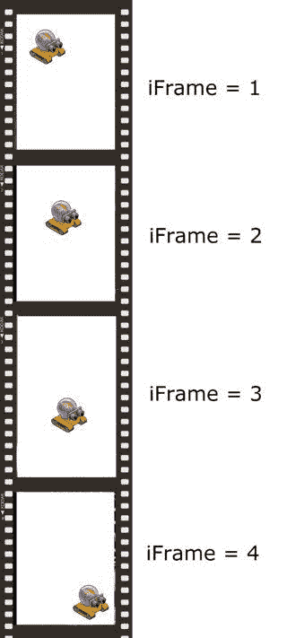T2】](https://res.cloudinary.com/practicaldev/image/fetch/s--2gOe3DUi--/c_limit%2Cf_auto%2Cfl_progressive%2Cq_auto%2Cw_880/https://ladvien.cimg/FB16OS8HMMF9408.SMALL.jpg)

**参见上面的代码。**

**42** :这里我们启动这个[函数](http://docs.python.org/2/library/threading.html)，它完成大部分工作， **OpenCV():** 。* *将在第 345-347 行* *被线程化，这是函数之一。

**44** :我们打开网络摄像头，给它起了个昵称* *cap* *。如果我没记错的话，括号中的“0”指的是 USB 总线上最先出现的摄像机，所以如果你有一个以上的摄像机，你可以通过更改这个数字来指定，例如* *cap = cv2。视频捕捉(3)* *。注意，我们调用了 OpenCV 模块 cv2，所以我们使用 OpenCV 模块来访问网络摄像头。

只是让我们声明的变量在这个函数中工作。这可能是不需要的，但是，嘿，我不读整个*的* Python 手册。

55:这只是一个字符串标志，它被翻转以告诉 PC 为机器人生成一个新的目标。注意，我们最初将它设置为“Yes ”,这意味着我们第一次运行这个函数时，需要生成一个目标。

58:这是一个整数变量，用来计算机器人“吃”了多少个点

好的，在我开始下一部分之前，我需要花一点时间来解释我们如何获得机器人的坐标。如你所知，OpenCV 为我们做了艰苦的工作，给我们屏幕上最大的红色斑点的 X 和 Y 坐标。不过，它给我们的坐标是质心。现在，这只是一个逻辑猜测，因为我没有阅读整个 OpenCV 手册，但我相信 X 或 Y 坐标指的是这个质量的中心，称为[质心](http://en.wikipedia.org/wiki/Centroid)。

[T2】](https://res.cloudinary.com/practicaldev/image/fetch/s--YTvmBLVO--/c_limit%2Cf_auto%2Cfl_progressive%2Cq_auto%2Cw_880/https://ladvien.cimg/F3DYKW5HMNNG8MH.SMALL.jpg)

这似乎很简单。那是因为它是，我不确定为什么我们不叫它该死的中心或别的什么。呃，好吧。然而，当我们在机器人和它的目标之间做碰撞检测时，它将变得很重要。

**61-62** :综上所述，* *cyAvg* *和**cxAvg**中的“c”代表质心。因此，这些变量将保存红色斑点质心的 X 和 Y 坐标的移动平均值。

65-66:这些是* *cxAvg* *和* *cyAvg* *的备份变量，当我们试图确定我们跟踪的颜色实际上是机器人还是其他一些有足够红色来欺骗 OpenCV 的垃圾时，这些变量在第**122-127**行周围很重要。

69:这只是在另一个 iFrame 开始之前，用来自机器人的数据清除字符串变量，比如机器人的方向。

**参见上面的代码。**

在 OpenCV()函数中创建一个循环。

73-81:好吧，我需要谦虚地说，我不知道我在克苏鲁的厨房里做什么。我知道* *printRx = str(intRx)* *正在把从机器人那里收到的信息转换成字符串。**intRx* *是一个全局变量，在第 326 行载入机器人数据。**heading deg = printRx**正在将标题数据从一个变量移动到另一个变量；这里的想法是，如果我想从机器人那里得到更多的信息，除了指南针的方向之外，它还会通过* *printRx* *进入，然后我可以将它切碎并加载到与它们的用途相应的变量中。

例如，printRx.split("，")应该根据 printRx 中当前包含的逗号数量给出一个字符串列表。

**printRx = "2，23，88"
罗盘，声纳，电池寿命= printRx.split("，")**

现在，

```
compass = 2
sonar = 23
battery_life = 88 
```

Enter fullscreen mode Exit fullscreen mode

但是让我困惑的是，我把字符串转换回整数。我不确定，伙计们。我可能在编码的时候会有 Southpark。

在糟糕的编码结束时，我们最终使用了两个变量:`intHeadingDeg`和`headingDeg`。我们用整数`intHeadingDeg`来做任何涉及机器人航向的计算。另一个`headingDeg`，是将机器人的航向打印到屏幕上，这是在第 263 行完成的。

84-85:这些是字符串变量，如果我们正在跟踪机器人，它们将保存“目标锁定 X”或“目标锁定 Y”。这些字符串是必需的，所以我们可以将它打印到屏幕的第 259-260 行。

**参见上面的代码。**

我们现在在肉里了。

88:这增加了我们的帧计数器。

91:我们从我们在第 44 行声明的网络摄像头中读取了一个单独的帧。

**OPENCV！**不好意思，我就是太喜欢了。

所以，现在你知道我没有读过 OpenCV 手册。请不要告诉我，“什么！Go [RTFM](http://en.wikipedia.org/wiki/RTFM) ！”你去 RTFM！我有妻子、孩子和我热爱的工作。我只是在修补垃圾，让它工作。但是这种态度将在我们浏览 OpenCV 调用时开始显现，因为我不知道它们的内部工作方式。相反，我将提供我最好的猜测，和往常一样，如果有人想纠正我或提供更好的解释，我会发帖并给予肯定。

94:这个[模糊了](http://docs.opencv.org/modules/imgproc/doc/filtering.html?highlight=blur#blur)我们得到的图像。你可能会说，“但我认为分辨率越高越好？”确实是。但是锯齿边缘和色噪声不是。对于 OpenCV 的数学运算来说，简单的形状比复杂的形状更容易包装。因此，我们模糊了一点图像，给我们更软的边缘来处理。

此外，模糊融合了颜色，所以如果一个组中有 2 个蓝色像素和 1 个红色像素，那么它就变成 3 个蓝紫色像素。这样做的好处是大大加快了图像处理的速度。多少钱？不知道没 RTFM。

97-100:我们的图像在这里被转换成一个[直方图](http://en.wikipedia.org/wiki/Histogram)。直方图格式的图像允许我们使用[比较语句](http://en.wikipedia.org/wiki/Histogram)。我们用它来去除所有的颜色，除了我们要找的颜色。这将给我们一个黑白图像，白色只是我们要寻找的颜色。* *第 98 行是定义颜色的地方(是两个“np.array”)。

下一步，我将介绍如何选择你的机器人的确切颜色。**

[T2】](https://res.cloudinary.com/practicaldev/image/fetch/s--F22ruEJ6--/c_limit%2Cf_auto%2Cfl_progressive%2Cq_auto%2Cw_880/https://ladvien.cimg/FYRK54LHMVJCR5D.MEDIUM.jpg)

103:在结果图像中查找白色区域的轮廓。

[T2】](https://res.cloudinary.com/practicaldev/image/fetch/s--IZsrD5p8--/c_limit%2Cf_auto%2Cfl_progressive%2Cq_auto%2Cw_880/https://ladvien.cimg/F39IAO6HMVJCR94.SMALL.jpg)

107-112: OpenCV 然后计算它在网络摄像头图像中找到的每个轮廓中有多少像素。它假设拥有最多白色区域(也就是“质量”)的物体就是我们的目标。

[T2】](https://res.cloudinary.com/practicaldev/image/fetch/s--SGKuQYw0--/c_limit%2Cf_auto%2Cfl_progressive%2Cq_auto%2Cw_880/https://ladvien.cimg/F9DUH63HMVJCRAS.MEDIUM.jpg)

114-117:在我们决定了要跟踪哪个对象之后，现在我们需要得出质心坐标。这就是第 115-116 行所做的。我没有研究过那里的数学，但我相信它对多边形的[矩](http://docs.opencv.org/modules/imgproc/doc/structural_analysis_and_shape_descriptors.html?highlight=moments#moments)进行平均，并根据计算结果将平均值称为质心 X 或 Y。但是，请随意纠正或更好地解释。

[T2】](https://res.cloudinary.com/practicaldev/image/fetch/s--n7CIKnVX--/c_limit%2Cf_auto%2Cfl_progressive%2Cq_auto%2Cw_880/https://ladvien.cimg/FMFJV82HMVJCRB8.MEDIUM.jpg)

121-127:这里我们锁定了我们认为是机器人的质量。它从收集 150 个样本开始，然后它将声明正在跟踪最大的质量。但是在它开始追踪最大的质量之后，我们试图锁定它。这是 122-127 线。本质上，我们允许质量移动足够多，以被机器人认为是一个移动，但不要太多，以至于噪声(像网络摄像头图像中的一只迷路的手)会导致跟踪关闭机器人。
[T3】](https://res.cloudinary.com/practicaldev/image/fetch/s--ELppQ-RD--/c_limit%2Cf_auto%2Cfl_progressive%2Cq_auto%2Cw_880/https://ladvien.cimg/FD4XTKAHMVJCRKM.MEDIUM.jpg)

**参见上面的代码。**

这一行定义了您要寻找的颜色，具体来说，就是两组值: **130，170，110 和 190，190，200。**这两个值设置了您要查找的颜色的下限和上限。我们使用上限和下限的原因，我们称之为颜色阈值，是因为我们的机器人将通过不同的光线。不同的光源往往会改变网络摄像头读取颜色的方式。

我们使用的颜色格式是 HSV，它代表* *色调、饱和度、值* *。稍后，我可能会在我们的实际程序中编写代码来选择机器人，但现在我使用**[Gimp](http://www.gimp.org/downloads/)**和以下方法:

1.  在你将要使用的地方安装你的网络摄像头，就像你已经准备好控制他一样。
2.  运行步骤 10 中附带的网络摄像头程序。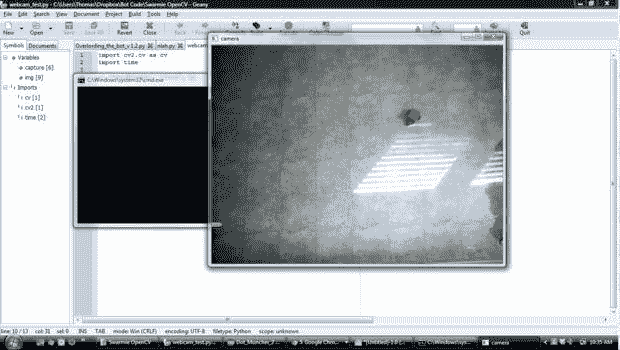
3.  当网络摄像头程序正在监视你的机器人时，点击* *Ctrl +打印屏幕* *
4.  打开 Gimp。
5.  按 Ctrl + V 将屏幕截图粘贴到 gimp 中。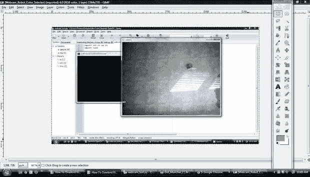
6.  现在，找到颜色选择器工具。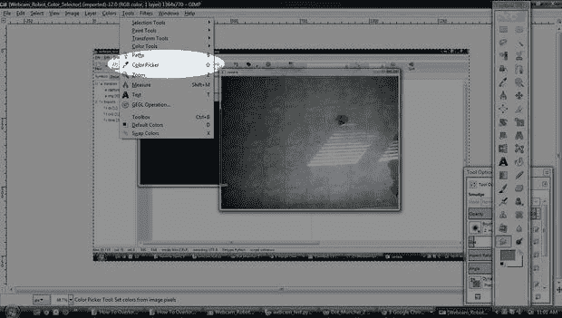
7.  选择你的机器人的主要颜色。
8.  现在双击工具栏上的颜色方块。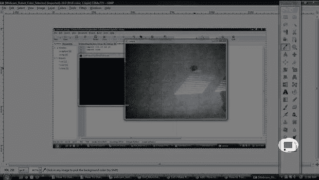
9.  应该弹出一个窗口，显示你选择的颜色，你的机器人的颜色信息。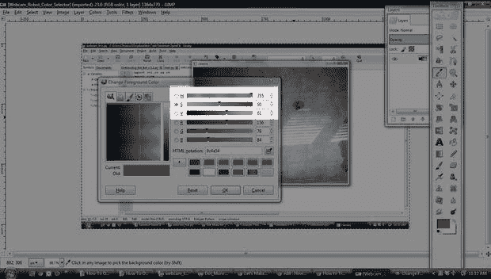
10.  现在，列出的三个数字应该接近我们所需要的。可悲的是，我们必须从 Gimp 的 HSV 编号范围转换到 OpenCV 的 HSV 编号范围。你看，Gimp 中的 HSV 取值范围是 H = 0- 360，S = 0-100，V = 0-100。在 OpenCV 中，H = 0-180，S = 0-255，V = 0-255。因此，需要进行一些转换。
11.  从我的选择中，我得到了 Gimp 编号，H: 355，S:50 和 V:61。我可以想象并计算出正确的数字，但是我认为 180 (OpenCV)是 360 的一半，所以我的 H 除以 2:177。 *另外两个我还真有点猜到一点。我翻了一倍，加了 25，* *S: 125，V: 147。* *
12.  最后，这给了我中间的数字。但是我想要一个上限和下限，所以我把每个数字减去 20 得到一个下限，再加上 20 得到一个上限。
13.  我的机器人的结果是:

**参见上面的代码。**

我会试着在程序里编一个颜色选择器来让这一切变得简单。

如果你想阅读更多，栈溢出上的两个好职位。

1.  [选择 HSV](http://stackoverflow.com/questions/10948589/choosing-correct-hsv-values-for-opencv-thresholding-with-inranges)
2.  在图像中寻找单纯疱疹病毒。

**参见上面的代码。**

132-136:这里我们实际上取了质心 X 和 y 的移动平均值。我们把它载入变量* *cxAvg* *和* *cyAvg* *，同样，这是为了确保我们在跟踪机器人。

**142-145** :这里，机器人运行的目标或“点”是随机生成的。你可能注意到了，我把圆点的生成区域限制在摄像头视野的中心。那是因为我很脏，小点点去了小机器人去不了的地方。

147-153:这是一个粗略的碰撞检测函数。基本上，如果机器人如此接近目标(45px ),那么它就认为已经“吃掉”了这个点。如果是，那么* *点* *变量增加，显示他吃的总量，并且* *新目标* *字符串变量翻转，以便它可以在下一次运行时生成一个新目标。

**参见上面的代码。**

156-177:这里我们试图找到机器人和他的目标之间的角度。我们基本上将整个屏幕分成四个象限，但总是使用机器人的质心作为原点。然后我们计算目标的 X 和 Y `(tY, tX)`与机器人的`X`和`Y` ( `cxAvg`和`cyAvg`)之间的斜率。

**大概是这样:** [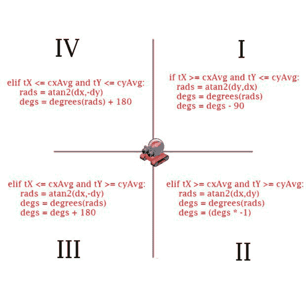](https://res.cloudinary.com/practicaldev/image/fetch/s--ZiSHvhIU--/c_limit%2Cf_auto%2Cfl_progressive%2Cq_auto%2Cw_880/https://ladvien.cimg/FAILHZVHMVJCRN2.MEDIUM.jpg)

如果目标位于象限 III，它会像这样。

[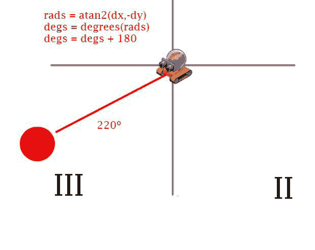](https://res.cloudinary.com/practicaldev/image/fetch/s--uGWA06ZL--/c_limit%2Cf_auto%2Cfl_progressive%2Cq_auto%2Cw_880/https://ladvien.cimg/FNOYR6FHMVJCSCO.MEDIUM.jpg) 
如果你想深入钻研 Python 中的[三角函数](http://docs.python.org/2/library/math.html#trigonometric-functions)，玩得开心。发现更好的数学就分享:)

**参见上面的代码。**

181:当我们找到机器人和目标之间的角度，然后将其转换为度数，它最终会给我们一个数字，这是一个[浮点数](http://en.wikipedia.org/wiki/Floating_point)。这比我们需要的要多，所以这里我们将 float **(***【degs】)转换成 and integer **(target degs)**这样我们就可以和机器人的指南针航向进行比较了。*

 *184: **我们声明了一个名为`strTargetDegs`的空字符串。187:** 然后我们将 float `degs`转换成一个字符串，这样我们就可以将目标角度打印到屏幕的第 264 行。

**参见上面的代码。**

这就是我需要帮助的地方。我的转向代码有一个错误，所以如果你找到它，并提出纠正，我会送你一份奖品。我不知道？一个棉球？它可能是我剩下的电路板之一，或者是我拼凑的某个硬件。

但是现在，让我们来看看。

这个想法就像是:

[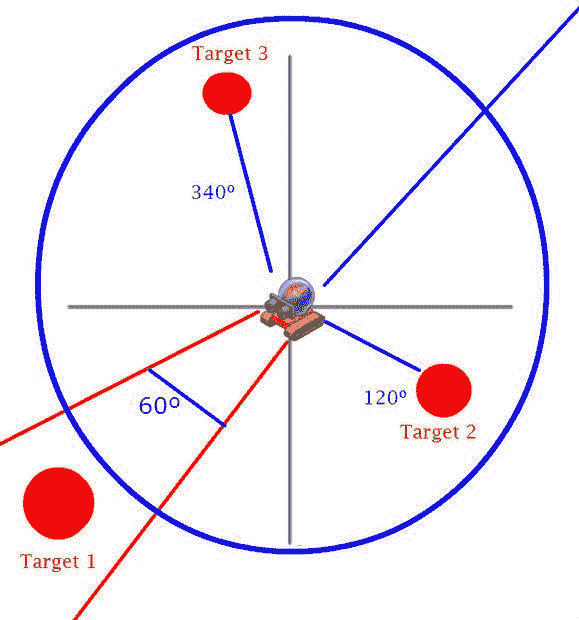T2】](https://res.cloudinary.com/practicaldev/image/fetch/s--KbEzwv9g--/c_limit%2Cf_auto%2Cfl_progressive%2Cq_auto%2Cw_880/https://ladvien.cimg/F2JHJ9JHMVJHBLN.MEDIUM.jpg)

代码应该是这样的:

```
if target1 == True:
  MoveForward()
elif target2 == True:
  TurnRight()
elif target3 = True:
  TurnLeft() 
```

Enter fullscreen mode Exit fullscreen mode

大多数情况下会发生这种情况，但偶尔它会变笨，在应该右转的时候左转。不知道我做错了什么。嘿，那个“你和我哥们，直到最后”是双向的。:P

让我们一步一步来

195:在我们开始移动机器人到目标之前，我们想确保我们深入跟踪机器人。

198:我们比较`intHeadingDeg`，也就是机器人的航向角，和`targetDegs`，也就是机器人和目标之间的角度。但是我们做这个+或者- 30。这意味着机器人不必让它的航向角*与目标的角度*完全相同。它只需要大致指向正确的方向。

199:机器人前进的运动代码是`3`，所以在这里，假设机器人大致朝着正确的方向，我们告诉机器人前进。这是通过将`3`加载到变量`tranx`中实现的，该变量通过线 307 传输到机器人。当这个代码传输到我的机器人时，第 137 行的 Arduino 代码告诉`Forward();`函数启动。

202:如果我们的机器人没有朝着正确的方向前进，那么他应该转向哪个方向？

203-232:这里还在调试。抱歉伙计们。我可以告诉你，这个代码工作正常。但是，一旦我完成了这个教程，我会回去，专注于使它变得完美。抱歉，这段代码花了我两天才写好，但是本教程花了太多的时间。

但是，在每个 if 语句中，我们有两个变量赋值:`tranx = X`和`motorDuration = 10`。tranx 告诉机器人朝哪个方向移动，motorDuration 告诉它朝那个方向移动多长时间(我的代码中还没有用到)。

**参见上面的代码。**

在这里，我们在显示框架之前将所有东西都绘制到屏幕上。

242:红色圆圈代表目标。

247:显示黑色文本的白盒。注意，我们是从下往上画的。所以，如果你想让某样东西有一个特定的 Z 值，你需要把它放在这一部分的顶端。

250:这是目标和我们机器人之间的绿线。

253-267:我们在这里展示我们所有的信息。罗盘航向、目标锁定等。

270:这实际上显示了颜色窗口(我们在上面写了所有东西的窗口)。

271:这显示了捕获帧的 HSV 副本。请注意，要评估的白色区域是我们的目标。

**参见上面的代码。**

276:等待按下 ESC 键的 if 语句。如果有压力，我们就关门大吉。

278:这释放了我们的网络摄像头。

这关闭了我们显示彩色和 HSV 帧的窗口。

我们发送代码来停止我们的机器人。如果我们不这样做，并且在机器人移动过程中按下 ESC 键，那么这个移动将永远继续下去。

282:这里我们关闭了串行连接。

283:我们不干了。

在这篇文章的开头，我说我的网络摄像头有蹩脚的驱动程序；当我写这篇文章的时候，我注意到我放了 cv2。`destroyAllWindows`在`cap.release()`之前。这就是导致问题的原因。我对此的解释是，我们的相机被吸进了被毁坏的窗户所在的空间。反正我把顺序换了一下，好像就解决问题了。

**参见上面的代码。**

最后，我们将打开第二个线程函数。这个函数比 OpenCV 函数小很多。所有串行通信都在这里进行。

289:这有助于翻译 ASCII。

292-296:用于将机器人信息传递给其他线程的全局变量。

**参见上面的代码。**

303:我们将信息读入变量`rx`。信息来自我们在代码开头打开的串行线路。

307:这是一个标志门，如果机器人还没有在运动中，我们的 Python 代码只能向机器人发送电机命令。

308:我们写下`tranx`中的任何值，它应该加载了第 192-232 行的某种移动。

313:我想我把这个放在那里，这样串行线会使我的代码停滞不前。

316:我们把数字减少到只有三位数；记住，这是罗盘指向的度数，例如 000-360 度。

319:通过串行发送时，它会得到一个行尾字符。我们不想那样。

323:机器人从指南针上收集了这个数字，它给出了一个包含小数的数字。这去掉了小数，所以我们只处理整数。

326-329:我不确定我在这里做什么，我想这和零的古怪有关。呃。我会试着记起来。

**参见上面的代码。**

这是一个短线程函数。它实际上只有一个任务，就是控制机器人上的马达工作多长时间。它是这样工作的，如果我们给机器人发送一个向前移动的信息，它会继续这样做，直到第 341 行。在那里，停止命令被发送到机器人，并且`motorBusy`标志被设置回“否”,意味着电机准备好再次使用。

340:这设定了电机将保持运行的时间。例如，如果它被改为`sleep(1)`，机器人的马达将继续在他们被告知的方向上运行 1 秒钟。

342:这使得机器人在运动之间等待。理论上，这意味着确保 OpenCV 能够跟上这个小家伙。所以，如果你有一个速度快的机器人，你可以把它设置得更高。

**参见上面的代码。**

好的。**代码结束。**

该位启动所有三个线程:`OpenCV`、`rxtx`和`motorTimer`。

这是我解释 Python 线程的一个拙劣的尝试。大多数 Python 代码是顺序运行的；它来的顺序就是它被执行的顺序。一个问题是时机。如果我们必须在代码中造成延迟，那么整个程序必须暂停。线程允许我们绕过这个问题。我认为这就像一个变戏法的人在表演一个戏法，他一只手拿着所有的球，而另一只手拿着一个球不动。我不知道，只是我怎么看。

[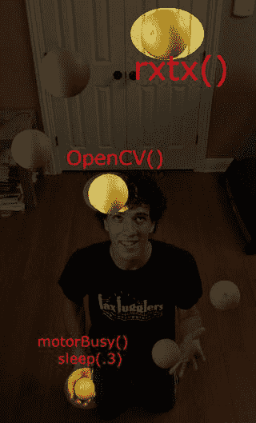](https://res.cloudinary.com/practicaldev/image/fetch/s--Ftw0G39r--/c_limit%2Cf_auto%2Cfl_progressive%2Cq_auto%2Cw_880/https://ladvien.cimg/FGSGBQ0HMVJHBGS.SMALL.jpg) 
嗯，就像我说的，“你和我，哥们，直到最后。”我们在这里。结束了。

希望这段代码有所帮助。但要知道，你并不孤单。

[cthomasbrittain@hotmail.com](mailto:cthomasbrittain@hotmail.com)

如果你有任何问题，给我发电子邮件。同样，所有那些我做得不好的垃圾解释、编码、写作，只要给我发一封电子邮件，我就能搞定。

我还是想把这个发展成 Swarmie 平台；所以你可能会留意 www.letsmakerobots.com，因为我会在那里张贴我未完成的作品。好了，我要去做我的 Swarmie 的第八次迭代了...呃。*