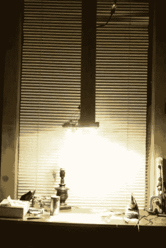
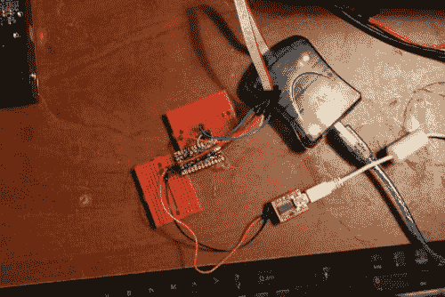
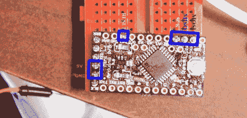
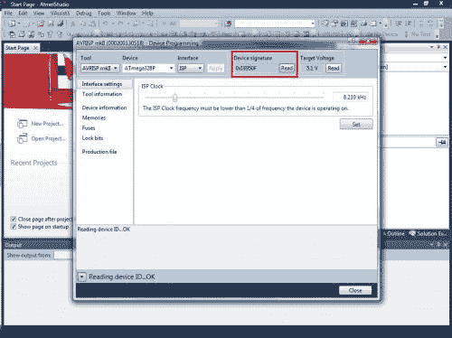
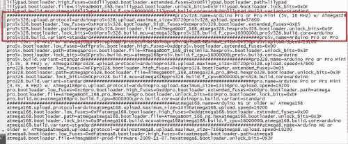

# 填充和编程以及 APM

> 原文：<https://dev.to/ladvien/populating-and-programming-and-apm-oek>

[https://www.youtube.com/embed/leWv0mJ9VVE](https://www.youtube.com/embed/leWv0mJ9VVE)

我决定尝试在家里制作一个 Arduino Pro Mini。被人做了，不值得。你可以多花一美元买一个，而且需要一段时间来繁殖。虽然，很“好玩”

[T2】](https://res.cloudinary.com/practicaldev/image/fetch/s--z-_pp0II--/c_limit%2Cf_auto%2Cfl_progressive%2Cq_auto%2Cw_880/https://ladvien.cimg/IMG_8868_513x768.jpg)

这个项目对我来说也是一个测试我建造的间谍钟乳石的机会。

我喜欢它。这让我能够在填充董事会时反思我的策略。它只是一个下拉与一些高功率发光二极管(~2500 流明)，散热器和冷却风扇。它有一个洞，可以让我的 iphone 进行录音。便宜又简单。尽管如此，我需要漫射光线，正如你在视频中看到的，它洗去了项目的细节。此外，我会增加几个灯，去掉钨丝灯，因为当我在混合光源前移动时，iphone 一直处于白平衡状态。

[T2】](https://res.cloudinary.com/practicaldev/image/fetch/s--giQTK5eH--/c_limit%2Cf_auto%2Cfl_progressive%2Cq_auto%2Cw_880/https://ladvien.cimg/IMG_8862_1150x768.jpg)

我填充了这个板；一切都很好(尽管，试图不让我的头挡住镜头要困难得多)。我把它放入 Atmel studio，它读出了设备电压和信号。当然，我砌砖，因为我似乎做了很多。

我的下一个项目是保险丝医生。:)

我从 OSHPark 订购了电路板，并计划生产三块。所以，我填充了另一个并花了一些时间编程。我在下面概述了我的步骤:

## 步骤#1:连接 AVRISP MKII

[T2】](https://res.cloudinary.com/practicaldev/image/fetch/s--cHjy6L9u--/c_limit%2Cf_auto%2Cfl_progressive%2Cq_auto%2Cw_880/https://ladvien.cimg/avrispmkii-pin-out.png)

[T2】](https://res.cloudinary.com/practicaldev/image/fetch/s--H7ArzVOX--/c_limit%2Cf_auto%2Cfl_progressive%2Cq_auto%2Cw_880/https://ladvien.cimg/Pinout_of_Aduino_Pro_Mini.jpg)

## 第二步:设备编程

打开 Atmel Studio。转到工具-设备编程。

## 第三步:设置

*   工具:AVRISP mkII
*   设备:ATmega328
*   接口:ISP

单击应用

## 第四步:检查设备

读取目标电压(应该是~5V)。读取设备签名。

[T2】](https://res.cloudinary.com/practicaldev/image/fetch/s--o6d1kgp_--/c_limit%2Cf_auto%2Cfl_progressive%2Cq_auto%2Cw_880/https://ladvien.cimg/Atmel_Studio_1.jpg)

打开 Arduino 自带的**boards . txt**(\ Desktop \ Arduino-1 . 0 . 3 \ hardware \ Arduino \ boards . txt)。

向下滚动到标记的区域:

[T2】](https://res.cloudinary.com/practicaldev/image/fetch/s--Vs-gIQ1g--/c_limit%2Cf_auto%2Cfl_progressive%2Cq_auto%2Cw_880/https://ladvien.cimg/Boards_File.jpg)

从该区域提取电路板的编程信息。现在，我用砖砌了几块木板，但我想我找到了这一块。使用 MKII 和 Atmel Studio 对该板进行编程时，应遵循以下顺序。

## 第五步:设置保险丝:

*   扩展:`0xFD`
*   高:`0xDA`
*   低:`0xFF`

仔细检查电路板文件以确保我没有打错字
点击“程序”

## 第六步:上传引导程序

5v，16mhz Arduino Pro Mini 的引导加载程序(这是我构建的)是`ATmegaBOOT_168_atmega328.hex`(桌面\ Arduino-1 . 0 . 3 \硬件\ Arduino \ boot loaders \ atmega \ atmega boot _ 168 _ atmega 328 . hex。

需要注意的是，3.3v 和 5v 版本使用不同的引导加载器。

*   转到内存选项卡。
*   点击浏览省略按钮。
*   选择`ATmegaBOOT_168_atmega328.hex`

仔细检查电路板文件以确保我没有打错字
点击“程序”

## 步骤#7:设置锁定位

转到“锁定位”选项卡。检查 boards.txt 文件中的 Lockbit 号。

我的是:

*   锁定位:`0xCF`

上传眨眼素描；复位按钮旁边的 LED 应该闪烁。

让我知道进展如何。如果你用这些指令砌砖了芯片，让我知道，这样我可以快速修改它们。

现在我已经习惯了相机和钟乳石，我计划在我的下一个板上注释关于使用 0402 的提示。