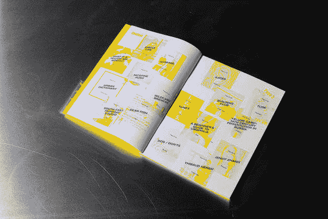
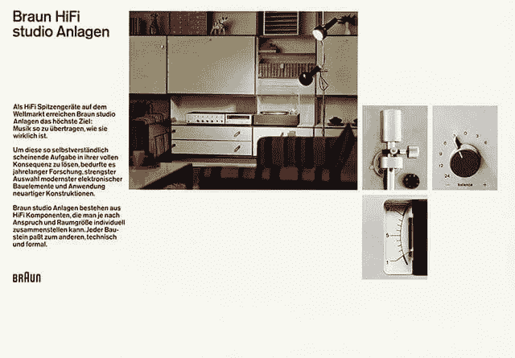
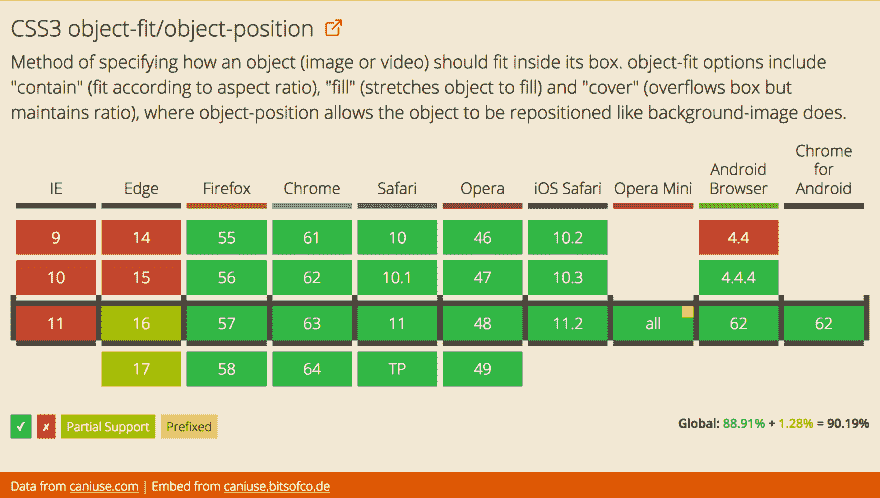
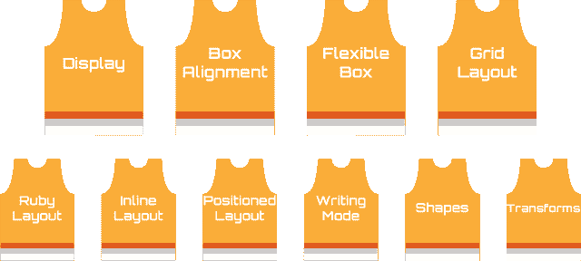

# 纵横比媒体查询的实际用途

> 原文：<https://dev.to/huijing/practical-uses-for-the-aspect-ratio-media-query-2440>

早在 2016 年，我在 [CSSConf 的第一次会议演讲中(尽管有点像闪电演讲)。亚洲 2016](https://2016.cssconf.asia/) ，我说“我就是喜欢 CSS。”我没有说谎，CSS 真的是我的爱好。在 2017 年的大部分时间里，我一直在“收集”我遇到的有趣布局，并试图在网络上构建它们。

我形成了一个观点(方法论？系统？概念？英语太难了…)这些年来在网页上的建筑布局。与我心目中的大多数 web 开发英雄不同，当我深入 web 开发的时候，响应式 web 设计已经成为规范。事实上，在我的职业生涯中，我只做过一次固定宽度的布局。也正因为如此，我不认为静态。

当我看到一个有趣的布局(通常是印刷品)时，我的脑海里立即开始想象如果画布的大小改变，它会如何变化。这是一个非常有趣的练习，然后我会坐下来试着建立它，这仍然很有趣，但是有一点痛苦和挫折(这在我们的工作中很正常🤷)

## 网页设计应该变形

设计网页布局需要多层次的插入式思维。Web 布局可以并且很可能应该随着视口大小的变化而变化。我们的工作是确保布局在它必须表现的空间中是最有效的。

在为我的[东南亚 CSS 之旅](https://dev.to/huijing/talking-about-talking-css-139e-temp-slug-782132)准备演讲时，我制作了一些布局演示。我最喜欢的一个是基于以下来自[黄皮书](http://kiyoshi.de/the-yellow-issue)的设计，作者是[伊藤·施特尔茨纳](http://kiyoshi.de/):

[T2】](https://res.cloudinary.com/practicaldev/image/fetch/s--OfPIM_Jx--/c_limit%2Cf_auto%2Cfl_progressive%2Cq_auto%2Cw_880/https://www.chenhuijing.cimg/posts/aspect-ratio/yellow-640.jpg)

这种布局在网页上的横向布局中工作得很好，但是随着视窗变窄，事情开始变得糟糕。但这就是媒体询问的目的，对吗？但是我没有使用传统的基于宽度的媒体查询，而是尝试了长宽比的媒体查询。因为我用灵活的单位来调整网格的大小，所以相对比例很重要。

这种特殊的布局包括重叠、垂直空白和变换，只能在横向模式下工作良好，所以我任意将基线纵横比设置为 1/1，结果非常好。注意一定要用比值(数/数)值，否则不行。

[https://codepen.io/huijing/embed/PKOeQV?height=600&default-tab=result&embed-version=2](https://codepen.io/huijing/embed/PKOeQV?height=600&default-tab=result&embed-version=2)

演示在独立窗口中更有趣，所以这是自托管版本。

使用视口单位可能会有挑战性，因为一切都是相对于视口的，而不是布局中的特定容器，所以缩放有时会很棘手。这是一个灵活的单元，在我们希望保持比例的情况下，可以很好地处理纵横比媒体查询。

## 德国吉特

吸引我眼球的是德国出版物的版式，这可能只是一个巧合，但瑞士风格的网格设计确实在 20 世纪 20 年代出现于德国、荷兰和俄罗斯。约瑟夫·穆勒-布罗克曼和卡尔·郭士纳几乎都是用德语发表文章的(我想)。

但是迪特·拉姆斯是正统的德国人，他在博朗的工作非常有代表性。所以当我看到两张由沃尔夫冈·施米特尔设计的博朗 HiFi 海报时，我不得不把它们重新制作成网络版。

<figcaption>博朗 HiFi 工作室 Anlagen regie 501 海报</figcaption>

[https://codepen.io/huijing/embed/xPEjWb?height=600&default-tab=result&embed-version=2](https://codepen.io/huijing/embed/xPEjWb?height=600&default-tab=result&embed-version=2)

<figcaption>博朗 HiFi steuergert audio 300 海报</figcaption>

[https://codepen.io/huijing/embed/zPoGXw?height=600&default-tab=result&embed-version=2](https://codepen.io/huijing/embed/zPoGXw?height=600&default-tab=result&embed-version=2)

我强烈建议在 CodePen 上以整页方式查看它们。诚然，我需要解决一些突出的问题，但前提是当设计达到一个特定的纵横比时，网格会通过修改`grid-template-areas`属性来重新排列自己。

网格项目本身被分配了各自的`grid-area`,不管应用的布局如何，都可以应用。我发现这种方法非常方便，比每次媒体查询通过它们的`grid-row`和`grid-column`属性手动放置条目要少得多。

## OMG，`object-fit`

我能不能说一下这个“补充”CSS 属性与 CSS 网格布局配合得有多好？这是背景图像，但内容图像。支持真的挺体面的。听着，我们都知道 IE 永远不会有任何新功能，所以对于 IE 家族来说，只是退回到整个布局，这是一个我认为可以接受的权衡。

但是看这里，Opera Mini 支持`object-fit`！

[T2】](https://res.cloudinary.com/practicaldev/image/fetch/s--IPKMPFwA--/c_limit%2Cf_auto%2Cfl_progressive%2Cq_auto%2Cw_880/https://cdn.rawgit.com/huijing/filerepo/gh-pages/devto/devto-caniuseobjectfit.png)

我不知道你什么时候会读到这篇文章，所以检查一下[我能使用](https://caniuse.com/#feat=object-fit)来获得最新的统计数据吗？

有了`object-fit`，我可以让图像填满它们被分配到的整个网格区域，这样无论我如何变形视口，布局都是正确的并对齐的。没有图像没有完全填满的尴尬空白。

## CSS 是一项团队运动

这是我最近引用的 CSS 语录。我得出的结论是，CSS 最终是一种整体技术，因为，即使你可以孤立地使用属性，但当结合使用时，CSS 的全部威力就会显现出来。

[T2】](https://res.cloudinary.com/practicaldev/image/fetch/s--RKrHv-pE--/c_limit%2Cf_auto%2Cfl_progressive%2Cq_auto%2Cw_880/https://www.chenhuijing.cimg/posts/aspect-ratio/team-layout-640.png)

当然，在 web 上做布局通常是从使用`display`属性开始的。但是我们确实使用了一整套属性，其数量超过了一个篮球队的球员数量。我将以上称为团队布局，它甚至不是布局相关属性的详尽列表。

## 包装完毕

无论如何，这是一个小小的转移我对更紧迫的责任和生活的注意力的方法。这应该成为一个系列吗？比如，欢迎来到“让我们网络化”的另一部分？谁知道…🙃用你的想法来打动我。

或者不是。

随便啦。

你做你的，我的可爱🍸。

*最初发布于[www.chenhuijing.com](https://www.chenhuijing.com/blog/aspect-ratio-media-queries/)2017 年 11 月 09 日。*